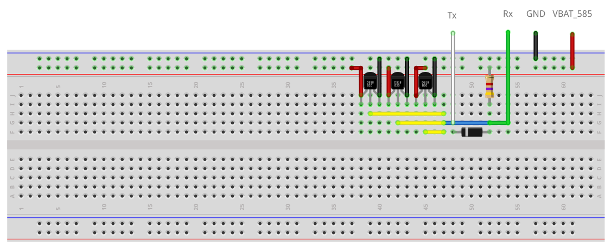

# DA14585 OneWire example using DS18B20 temperature sensors

---

## Example description

This SDK6 DA14585 example provides a implementation of a 1-Wire driver with three DS18B20
sensors (editing the MAX_NO_SENSORS value in the one_wire.h file will allow more sensors to be connected). 
The 1-Wire commands and sensordata are added in BLE characteristics to be controlled
or read from a smartphone application (i.e. lightblue for iOS). 

## HW and SW configuration

* **Hardware configuration**

	- This example runs on The DA14585 Bluetooth Smart SoC devices.
	- A breadboard is used for connecting the buscomponents to the develepment kit as shown in the lay-out schematic underneath where the appropriate pins are highlighted.
	- The Basic or pro Development kit is needed for this example.
	- Connect the USB Development kit to the host computer.
	- Button is configured to P1_1 corresponding to SW3 on the Pro Development kit.
	- For the Basic development kit, an active-low switch should be connected to P1_1 as displayed in the schematic underneath
	- The Rx pin of the bus is connected to P1_3 on both the Pro and Basic dev kit.
	- The Tx pin of the bus is connected to P0_6 on both the Pro and Basic dev kit. 
	- A pull-up resistor of 4k7 Ohms should be connected to the bus. Connect the pull-up resistor to VBAT_580 on the dev kit. 
	- For powering the sensors Connect the sensor Vcc to VBAT_580 on the dev kit. The sensor gnd can be connected to gnd on the dev kit. 
	- A diode (i.e. 1N4148) should be connected to prevent the Tx pin from trying to drive the bus high whenever a slave pulls it low. The
	schematic underneath displays the connection from the 1-Wire bus to the dev kit. 
	
	**Button on Basic kit**	

	 
 
 
	**Breadboard lay-out**

	 

* **Software configuration**

	- This example requires:
    * Smartsnippets Studio 1.6.3.
    * SDK6.0.10
	- **SEGGER’s J-Link** tools should be downloaded and installed.

## How to run the example

For initial setup of the example please refer to [this section of the dialog support portal](https://support.dialog-semiconductor.com/resource/da1458x-example-setup).

### Initial Setup

 - Start Keil
 - Compile and launch the example
 - Open the serial terminal of your choice (i.e. Tera Term) with the following parameters.

	- baudrate: 115200
	- data: 8 bits
	- stop: 1 bit
	- parity: None
	- flow  control: none

 - Pressing the button (P1_1) will initiate the following sequence:
	
	- SearchROMalgorithm to detect all slave (DS18B20) addresses on the bus
	- Issue a Convert Temperature command to all the slaves (DS18B20).
	- Read scratchpad of all the slaves (DS18B20).
	- Send data to serial terminal via UART. An example of the data is displayed underneath.
	  
	  **Data displayed using three sensors**
	  
	  

 - In order to issue commands over BLE and receive sensordata on the smartphone the followings steps are required.
	- Use a BLE application like LightBlue (iOS) to connect to the dev kit. The device name will be "OneWire-Example" with 0x036670CAEA80 as it's BD address.
	- In order to receive any data enable "Listen for notifications" in the "OneWire Sensor Data" characteristic as shown in the screenshot below.
	- In the "OneWire Control Point" writing the following values will:
		- 0xF0 => Start the SearchROMalgorithm. When complete it will send the sensoraddress over BLE. It will also send send the addresses to serial terminal via UART.
		- 0x44 => Issue a convert temperature command.
		- 0xBE => Read scratchpad contents (72 bits) and send the last 56 bits of the scratchpad (exluding temperatures) over BLE. It will also send send the scratchpad data to serial terminal via UART.
		- 0x01 => Send the raw temperature data (16 bits) over BLE. It will also send the temperatures to serial terminal in degrees celcius. 

	  **Enabling listen for notifications**
	  
	  
	  
 - To provide the correct timings of the Write slots according to the 1-Wire specification, the SPI controller is used. 
 - Below, two screenshots of a logic analyzer will display 3 bits of a transmission sequence and the corresponding timings achieved with the SPI controller of a Write 0 and Write 1 operation respectively.
 
 	**Write 0 timings**	

	 
 
 
	**Write 1 timings**

	 

## Known Limitations

- There are No known limitations for this example. But you can check and refer to the following application note for
[known hardware limitations](https://support.dialog-semiconductor.com/system/files/resources/DA1458x-KnownLimitations_2018_02_06.pdf "known hardware limitations").
- Dialog Software [Forum link](https://support.dialog-semiconductor.com/forums).
- you can Refer also for the Troubleshooting section in the DA1585x Getting Started with the Development Kit UM-B-049.

## License

**************************************************************************************

 Copyright (c) 2018 Dialog Semiconductor. All rights reserved.

 This software ("Software") is owned by Dialog Semiconductor. By using this Software
 you agree that Dialog Semiconductor retains all intellectual property and proprietary
 rights in and to this Software and any use, reproduction, disclosure or distribution
 of the Software without express written permission or a license agreement from Dialog
 Semiconductor is strictly prohibited. This Software is solely for use on or in
 conjunction with Dialog Semiconductor products.

 EXCEPT AS OTHERWISE PROVIDED IN A LICENSE AGREEMENT BETWEEN THE PARTIES OR AS
 REQUIRED BY LAW, THE SOFTWARE IS PROVIDED "AS IS", WITHOUT WARRANTY OF ANY KIND,
 EXPRESS OR IMPLIED, INCLUDING BUT NOT LIMITED TO THE WARRANTIES OF MERCHANTABILITY,
 FITNESS FOR A PARTICULAR PURPOSE AND NON-INFRINGEMENT. EXCEPT AS OTHERWISE PROVIDED
 IN A LICENSE AGREEMENT BETWEEN THE PARTIES OR BY LAW, IN NO EVENT SHALL DIALOG
 SEMICONDUCTOR BE LIABLE FOR ANY DIRECT, SPECIAL, INDIRECT, INCIDENTAL, OR
 CONSEQUENTIAL DAMAGES, OR ANY DAMAGES WHATSOEVER RESULTING FROM LOSS OF USE, DATA OR
 PROFITS, WHETHER IN AN ACTION OF CONTRACT, NEGLIGENCE OR OTHER TORTIOUS ACTION,
 ARISING OUT OF OR IN CONNECTION WITH THE USE OR PERFORMANCE OF THE SOFTWARE.

**************************************************************************************
