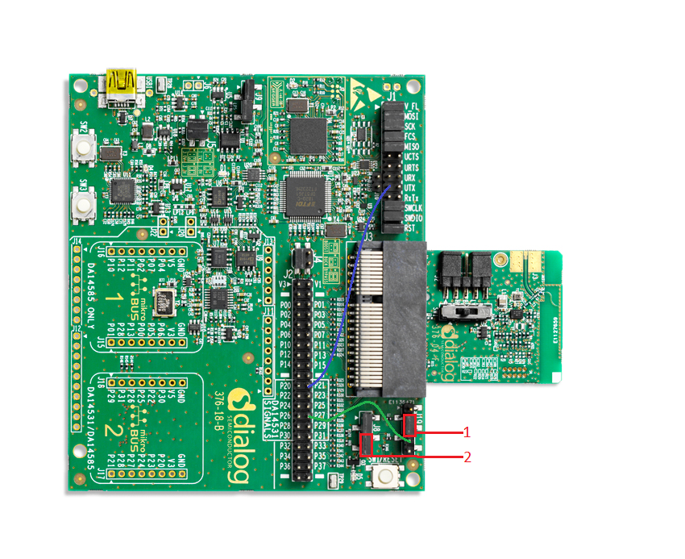
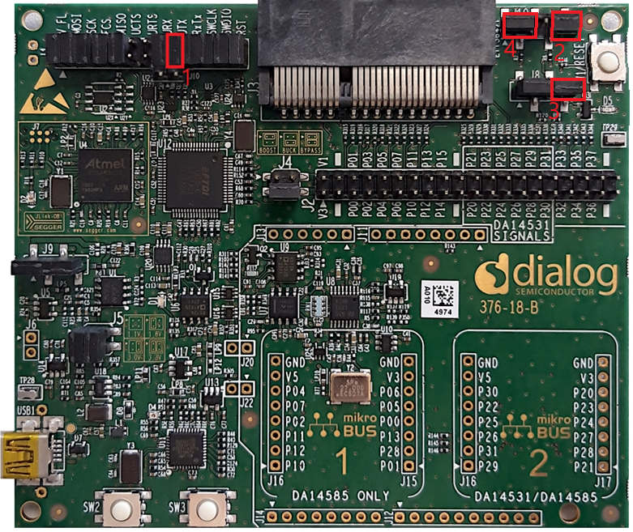
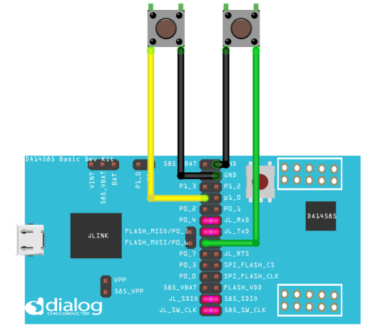


# DA14585/DA14586 and DA14531 Multiple button press wake up callback

---


## Example description

This example shows:
- How to wake up using two possible sources, button SW2 or button SW3.
- How to detect the source, button SW2 or button SW3.

The expected result of the example can be verified by:
- Connecting a serial terminal on the work station to the MB (Mother Board) using UART.
- Status of the LED.
- While awake, the system is advertising (BLE). 

## HW and SW configuration

This example runs on the BLE Smart SoC (System on Chip) devices:
- DA14585/DA14586 or DA14531 daughter board + DA145xxDEVKT-P PRO-Motherboard.
- DA14585/DA14586 daughter board + Basic dev Kit mother board.
	
The user manuals for the development kits can be found:
- [here](https://www.dialog-semiconductor.com/products/da14531-development-kit-pro) for the DA145xxDEVKT-P PRO-Motherboard.
- [here](https://www.dialog-semiconductor.com/sites/default/files/um-b-048_da14585da14586_getting_started_guide_v2.0_0.pdf) for the Basic Development Kit.

The example is running from SRAM. To run the program from flash please visit chapter 11 of the [SmartSnippets Toolbox User Manual](https://support.dialog-semiconductor.com/resource/um-b-083-smartsnippets-toolbox-user-manual).

* __Hardware configuration DA14531 using DA145xxDEVKT-P PRO-Motherboard__

	- UART TX: connect P21 on J2 to UTX pin 17 on J1 as shown in the image below (the blue line).
	- LED jumper on J8 is configured to P0_9 (red box 2).
	- SW2 (button 2) is configured to P3_1, located on J19 (red box 1)
	- SW3 (button 3) on J19 is configured to P0_7 (P27) on J2, see green line in the image below
	- Connect the DA145xxDEVKT-P PRO-Motherboard to the working station through USB1 connector. 

	
	
* **Hardware configuration DA14585 using the DA145xxDEVKT-P PRO-Motherboard**

	- UART TX jumper on P0_4, located on J1 (red box 1).
	- LED jumper is configured to P1_0, located on J8 (red box 3).
	- SW2 (button 2) is configured to P0_6, located on J19 (red box 4)
	- SW3 (button 3) is configured to P1_1, located on J19 (red box 2)
	- Connect the DA145xxDEVKT-P PRO-Motherboard to the working station through USB1 connector.

	

* **Hardware configuration DA14585 using the Basic Development Kit**

	- UART TX/RX jumper on P0_4/P0_5, located on J4
	- LED jumper is configured to P1_0, located on J9
	- An active-low switch should be connected to P1_1, located on J4, (this switch will be SW3) as displayed in the following schematic
	- An active-low switch should be connected to P0_6, located on J4, (this switch will be SW2) as displayed in the following schematic
	
	

* **Software configuration**

	- This example requires:
	* (optional) SmartSnippets Toolbox v5.0.10
    * [SDK6.0.12](https://www.dialog-semiconductor.com/da14531_sdk_latest)
	* Keil5
	- **SEGGER’s J-Link** tools should be downloaded and installed.

## How to run the example
### Setup
Before launching the Keil project, make sure to link the SDK and project environment using the Python linker script `dlg_make_keil_vx.xxx`. More information [here](https://www.dialog-semiconductor.com/sites/default/files/sw-example-da145x-example-setup.pdf).
1. Start Keil using the `simple_button.uvprojx` Keil project file.
 
2. Expand the dialog shown in the red box in the image below.


3. Select your device: DA14531, DA14586 or DA14585.
		


4. Open a serial terminal on the work station using for example Tera Term/PuTTY with the following parameters:
```
- baud rate: 115200
- data: 8 bits
- stop: 1 bit
- parity: None
- flow  control: none
```

5. (Optional) open and connect your device in SmartSnippets Toolbox 

6. Compile (F7) and launch (ctrl + F5) the example.\
If the warning (shown below) pops up press OK.
 


## Expected Results

### DA14585/DA14586/DA14531 with DA145xxDEVKT-P PRO-Motherboard
1. The LED controlled in this example is `D5` and the color is `orange`.

2. Have the serial UART monitor active: status messages will be displayed here. See step `4` in ["How to run the example"](#How-to-run-the-example) for setting up the serial monitor.
	- Note that UART messages will only be send to your serial monitor if *CFG_PRINTF_UART2* is defined, the definition can be found in *user_periph_setup.h* 

3. (Optional) initialize and start SmartSnippets toolbox.
	- __Note if SmartSnippets toolbox is used remove the jumper connected to P1_3 on J8__ 
		  
	Image below shows a capture of SmartSnippets
	

4. After launching the example, the system will start advertising. 
	- Note that at start up __no__ message is send via UART.

5. Pressing button SW2 or SW3 will make the system go to sleep.
	- "System going to sleep" is printed on your serial monitor.
	- If the LED was on it will switch off.
	- System will stop advertising.

6. Pressing button SW2:
	- "Wakeup source: SW2" is printed on the serial monitor.
	- The LED is turned on.
	- System will start advertising.

7. See step 5.

8. Pressing button SW3:
	- "Wakeup source: SW3" is printed on the serial monitor.
	- LED will remain off because SW3 is the source of wake up.
	- System will start advertising. 

### DA14585/DA14586 Basic Dev Kit

1. The LED controlled in this example is `USR` and the color is `green`.

2. Identify button:
	- The button connected to P1_1 is SW3.
	- The button connected to P0_6 is SW2.

3. Follow the steps from step 2 in [DA14585/DA14586/DA14531 with DA145xxDEVKT-P PRO-Motherboard](###DA14585/DA14586/DA14531-with-DA145xxDEVKT-P-PRO-Motherboard)
		
## About this Example

### Configuration

This example can be modified:
- By changing the pin and other configurations in *user_periph_setup.h*.
- By changing configurations in *user_wakeup.h*
- By changing the configurations in one or more of the **user_config** files.

Configuration of the wake up callback (`wkupct_enable_irq`):
- sel_pins: using `WKUPCT_PIN_SELECT` and an or operator SW2 and SW3 is set as wake up callback.
- pol_pins: using `WKUPCT_PIN_POLARITY`, an or operator and WKUPCT_PIN_POLARITY_LOW SW2 and SW3 is set to wake up the system at button press.
	- Button press is equal to polarity low because an internal pull up is used.
- events_num: is to 1 event (button press) to wake up the system.
- deb_time: is set to 30 to prevent button debounce to trigger interrupt/callback.

Configure the callback function:
- With `wkupct_register_callback` a wake up callback function is set, in this case `user_app_wakeup_press_cb`
 
### How the system goes to sleep

1. `GPIO_SetInactive(LED_PORT, LED_PIN)` sets the LED inactive.

2. `arch_set_sleep_mode(ARCH_EXT_SLEEP_ON)` this function will change the default sleep state to ARCH_EXT_SLEEP_ON.

3. `arch_ble_ext_wakeup_on()` this function prevents the BLE core from waking up, the system can only wake up from an external source, a button press in this example.

### How the system wakes up

1. `arch_set_sleep_mode(ARCH_SLEEP_OFF)` this function will change the default sleep state to ARCH_SLEEP_OFF.

2. `arch_ble_force_wakeup()` this function will wake up the BLE core.

3. `arch_ble_ext_wakeup_off()` this function will disable external wake up, the BLE core can wake up the system again.

## Troubleshooting
- Please check that the steps according to your daughter board (DA14531, DA14585 or DA14586) and mother board (basic dev kit or DA145xxDEVKT-P PRO-Motherboard) are followed correctly.

- Try a different USB1 cable.

- Try different jumper wires, if used.

- If SmartSnippets toolbox is used, is the jumper connected to P1_3 on J8 removed?

- If none of the above steps help, please check the user manual according to your daughter board and mother board. User manual can be found ["here"](##HW-and-SW-configuration)


## License


**************************************************************************************

 Copyright (c) 2019 Dialog Semiconductor. All rights reserved.

 This software ("Software") is owned by Dialog Semiconductor. By using this Software
 you agree that Dialog Semiconductor retains all intellectual property and proprietary
 rights in and to this Software and any use, reproduction, disclosure or distribution
 of the Software without express written permission or a license agreement from Dialog
 Semiconductor is strictly prohibited. This Software is solely for use on or in
 conjunction with Dialog Semiconductor products.

 EXCEPT AS OTHERWISE PROVIDED IN A LICENSE AGREEMENT BETWEEN THE PARTIES OR AS
 REQUIRED BY LAW, THE SOFTWARE IS PROVIDED "AS IS", WITHOUT WARRANTY OF ANY KIND,
 EXPRESS OR IMPLIED, INCLUDING BUT NOT LIMITED TO THE WARRANTIES OF MERCHANTABILITY,
 FITNESS FOR A PARTICULAR PURPOSE AND NON-INFRINGEMENT. EXCEPT AS OTHERWISE PROVIDED
 IN A LICENSE AGREEMENT BETWEEN THE PARTIES OR BY LAW, IN NO EVENT SHALL DIALOG
 SEMICONDUCTOR BE LIABLE FOR ANY DIRECT, SPECIAL, INDIRECT, INCIDENTAL, OR
 CONSEQUENTIAL DAMAGES, OR ANY DAMAGES WHATSOEVER RESULTING FROM LOSS OF USE, DATA OR
 PROFITS, WHETHER IN AN ACTION OF CONTRACT, NEGLIGENCE OR OTHER TORTIOUS ACTION,
 ARISING OUT OF OR IN CONNECTION WITH THE USE OR PERFORMANCE OF THE SOFTWARE.

**************************************************************************************
