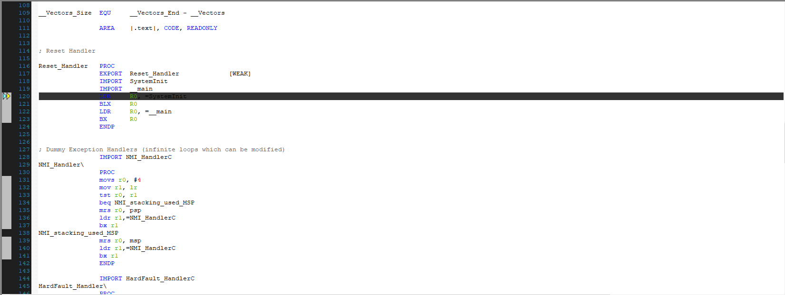


# DA14585/DA14586 and DA14531 Button Press with wake up from Sleep

---

## Example description

This SDK6 example shows how to configure
multiple buttons that will wake up the system from
sleep. In the wake up handler it will detect the source
of the wake up. When button SW2 is the source of the
wake up, the LED P1_0 will turn on. Alternatively, when 
button SW3 is the source of the wake up, the LED will 
remain off. In both cases a message will 
be send to the serial terminal (i.e. Tera Term, PuTTy or any 
other of your own preference) displaying the wake up source.

## HW and SW configuration

	- This example runs on The DA14585 and the DA14531 Bluetooth Smart SoC devices	
	- The Basic / Pro Development kit can be used for the DA14585
	- The DA14531 requires the Pro Development kit
	
	User manual for the Pro Development kit can be found [here](https://www.dialog-semiconductor.com/products/da14531-development-kit-pro)
	
	Follow the hardware configuration according to your Daughter board (DA14585 or DA14531) and Development Kit, Pro or Basic.

* **Hardware configuration DA14531 using Pro Development Kit**

- Connect the USB Development kit to the host computer
- UART TX: connect P21 on J2 to UTX pin 17 on J1 as shown in the image below (the blue line)
- LED jumper is configured to P1_0 (red box 2)
- SW2 (button 2) is configured to P3_1 (red box 1)
- SW3 (button 3) is configured to P0_7 (P27), see green line in the image below 

	
		
* **Hardware configuration DA14585 using the Pro Development Kit**

	- Connect the USB Development kit to the host computer.
	- UART TX jumper on P0_4 (red box 1)
	- LED jumper is configured to P1_0 (red box 3)
	- SW2 (button 2) is configured to P0_6 (red box 4)
	- SW2 (button 3) is configured to P1_1 (red box 2)

	

* **Hardware configuration DA14585 using the Basic Development Kit**

	- Connect the USB Development kit to the host computer.
	- UART TX/RX jumper on P0_4/P0_5
	- LED jumper is configured to P1_0
	- An active-low switch should be connected to P1_1 (this switch will be SW3) as displayed in the following schematic
	- An active-low switch should be connected to P0_6 (this switch will be SW2) as displayed in the following schematic
	
	   

* **Software configuration**

	- This example requires:
	* (optional) SmartSnippets Toolbox v5.0.10
    * SDK6.0.12
	* Keil5
	- **SEGGER’s J-Link** tools should be downloaded and installed.

## How to run the example

For initial setup of the example please visit [initial project setup](https://www.dialog-semiconductor.com/sites/default/files/sw-example-da145x-example-setup.pdf).

If not done already, please visit the getting started guide according to your device [DA14585](http://lpccs-docs.dialog-semiconductor.com/da14585_getting_started/index.html) or [DA14531](NO LINK AVAILABLE YET)

The example is running from SRAM. To run the program from flash please visit chapter 11 of the [SmartSnippets Toolbox User Manual](https://support.dialog-semiconductor.com/resource/um-b-083-smartsnippets-toolbox-user-manual).

### Initial Setup

 - Start Keil
 - Expand the dialog shown in the red box in the image below

	  
	  
 - Select your device DA14531, DA14586 or DA14585
		
	  
	  
 - (optional) Change GPIO pin configuration in *user_periph_setup.h*
 - (optional) Change configuration in one or more of the *user_config* files
 - Compile (F7) and launch (ctrl F5) the example, if the warning (shown below) pops up press OK
 
	  

 - A screen similar to the image below is shown, press F5 to run the example

	  
	
 - Open the development kit serial port with the following parameters

		- baud rate: 115200
		- data: 8 bits
		- stop: 1 bit
		- parity: None
		- flow  control: none

### While running the example

 - Note that uart messages will only be send to your serial monitor if *CFG_PRINTF_UART2* is defined, the definition can be found in *user_periph_setup.h* 
 
 - Identify the corresponding led 
	- For the Pro Development Kit the led is called *D5* and the color of the led is *orange*.
 	- For the Basic Development Kit the led is called *USR* and the color of the led is *green*.
	
 - After launch the example will start advertising, no message is send to the serial terminal
 
 - If button SW2 or SW3 is pressed and the system is awake the system will go to sleep and "System going to sleep" is printed on your serial monitor, if the user led was on it will switch off
 
 - If button SW2 is pressed and the system is asleep the system will wake up and "Wakeup source: SW2" is printed on your serial monitor and the user led will be turned on
 
 - If button SW3 is pressed and the system is asleep the system will wake up and "Wakeup source: SW3" is printed on your serial monitor **but because SW3 is the wake up source the user led will remain off**
 
 - (optional) See power usage via SmartSnippets toolbox, good to see the difference between advertising and sleeping.   
	- **Note when using SmartSnippets with the DA14531 configure (in user_periph_setup.h) and connect SW2 to another pin than P0_11 (red box 1), because SmartSnippets uses this pin** 
	
	  Image below shows a capture of SmartSnippets
	  
		
## About this Example
This example was built on top of the Barebone project from SDK6. The code can be found in *user_wakeup.c*.
The function, to initialize the parameters of the example, **user_wakeup_example_init(void)**, is called from the **user_app_init(void)** in *the user_barebone.c* file.
In the *da1458x_config_basic.h* file the SLEEP_WITHOUT_ADVERTISING flag is undefined by default. When sleep without advertising is required, defining this flag will ensure this.
Mind that *da1458x_config_basic.h* has a section for the DA14531 and a shared section for DA14585 and DA14586. 

To set up the wake up interrupt, wkupct_enable_irq(uint32_t sel_pins, uint32_t pol_pins, uint16_t events_num, uint16_t deb_time) from the wkupct_quadec driver is used with the following parameters:

 - 	sel_pins: (WKUPCT_PIN_SELECT(GPIO_SW2_PORT, GPIO_SW2_PIN) | WKUPCT_PIN_SELECT(GPIO_SW3_PORT, GPIO_SW3_PIN)). WKUPCT_PIN_SELECT uses the GPIO Port and GPIO Pin to create the correct
	bit mask for setting the wake up interrupt in the corresponding register(s). If more than one interrupt source is to be set, as is the case here, use an OR operation to combine all the bit masks.
 - 	pol_pins: (WKUPCT_PIN_POLARITY(GPIO_SW2_PORT, GPIO_SW2_PIN, 1) | WKUPCT_PIN_POLARITY(GPIO_SW3_PORT, GPIO_SW3_PIN, 1)). WKUPCT_PIN_POLARITY uses the GPIO Port, GPIO Pin and polarity parameter to create the correct
	bit mask for setting the polarity of the wake up source in the corresponding register(s). If more than one interrupt source is to be set, as is the case here, use an OR operation to combine all the bit masks.
 - 	events_num: (1). The number of wake up events before an interrupt is triggered ranging from 1 - 255.
 - 	deb_time: (30). The debounce time in milliseconds ranging from 0 - 63 (0x00 - 0x3F).
 
 The wake up callback is set using the wkupct_register_callback(wakeup_handler_function_t callback) function from the wkupct_quadec driver. In this case it is set to the user_app_wakeup_press_cb(void).
 
 In the user_app_wakeup_press_cb(void) the following is done:
 * When the device isn't sleeping, put the device to sleep by calling the following functions:
 
	- app_easy_gap_advertise_stop(); This function will stop the advertising. (Function is only called when the SLEEP_WITHOUT_ADVERTISING is defined)
	- arch_set_sleep_mode(ARCH_EXT_SLEEP_ON); This function will change the default sleep state.	
	- arch_ble_ext_wakeup_on(); This function prevents the BLE core from waking up the system. Only an external event (i.e. button press) can wake up the system.
	
* When the device is sleeping, wake up the device by calling the following functions:

	- arch_set_sleep_mode(ARCH_SLEEP_OFF); This will change the default sleep state.
    	- arch_ble_force_wakeup(); This will wake up the BLE core when only external event can wake up the system. 
    	- arch_ble_ext_wakeup_off(); This will enable the BLE core to wake up the system from sleep.
	- Furthermore, the source of the interrupt will be checked and displayed accordingly. 
	
With the wake up interrupt there isn't a good way do differentiate between level detection and edge detection 
as is the case with normal GPIO interrupts by setting the correct value in the GPIO_INT_LEVEL_CTRL_REG. 
For the wake up interrupt there is no similar register to achieve this result.

## Known Limitations

- There are No known limitations for this example.
- For the DA14585 and the DA14586 known hardware limitations please visit [known hardware limitations DA1458x](https://www.dialog-semiconductor.com/sites/default/files/da1458x-knownlimitations_2019_01_07.pdf "known hardware limitations DA1458x").
- For the DA14531 known hardware limitations please visit [DA14531 known hardware limitations](https://www.dialog-semiconductor.com/da14531_HW_Limitation)

## License

**************************************************************************************

 Copyright (c) 2019 Dialog Semiconductor. All rights reserved.

 This software ("Software") is owned by Dialog Semiconductor. By using this Software
 you agree that Dialog Semiconductor retains all intellectual property and proprietary
 rights in and to this Software and any use, reproduction, disclosure or distribution
 of the Software without express written permission or a license agreement from Dialog
 Semiconductor is strictly prohibited. This Software is solely for use on or in
 conjunction with Dialog Semiconductor products.

 EXCEPT AS OTHERWISE PROVIDED IN A LICENSE AGREEMENT BETWEEN THE PARTIES OR AS
 REQUIRED BY LAW, THE SOFTWARE IS PROVIDED "AS IS", WITHOUT WARRANTY OF ANY KIND,
 EXPRESS OR IMPLIED, INCLUDING BUT NOT LIMITED TO THE WARRANTIES OF MERCHANTABILITY,
 FITNESS FOR A PARTICULAR PURPOSE AND NON-INFRINGEMENT. EXCEPT AS OTHERWISE PROVIDED
 IN A LICENSE AGREEMENT BETWEEN THE PARTIES OR BY LAW, IN NO EVENT SHALL DIALOG
 SEMICONDUCTOR BE LIABLE FOR ANY DIRECT, SPECIAL, INDIRECT, INCIDENTAL, OR
 CONSEQUENTIAL DAMAGES, OR ANY DAMAGES WHATSOEVER RESULTING FROM LOSS OF USE, DATA OR
 PROFITS, WHETHER IN AN ACTION OF CONTRACT, NEGLIGENCE OR OTHER TORTIOUS ACTION,
 ARISING OUT OF OR IN CONNECTION WITH THE USE OR PERFORMANCE OF THE SOFTWARE.

**************************************************************************************
