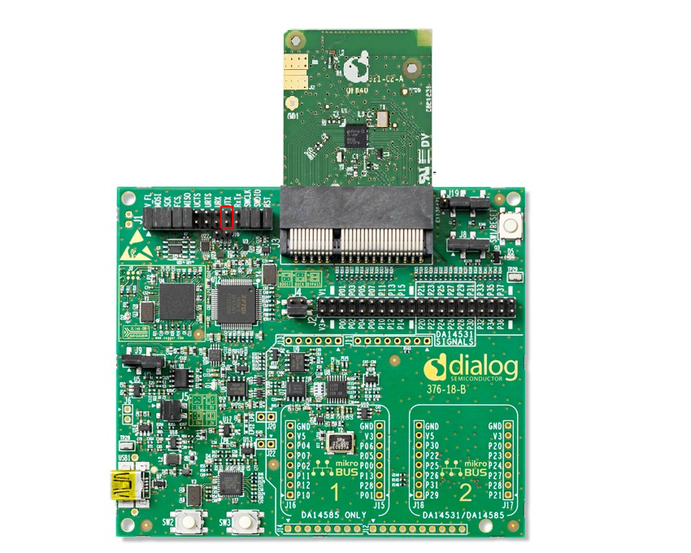
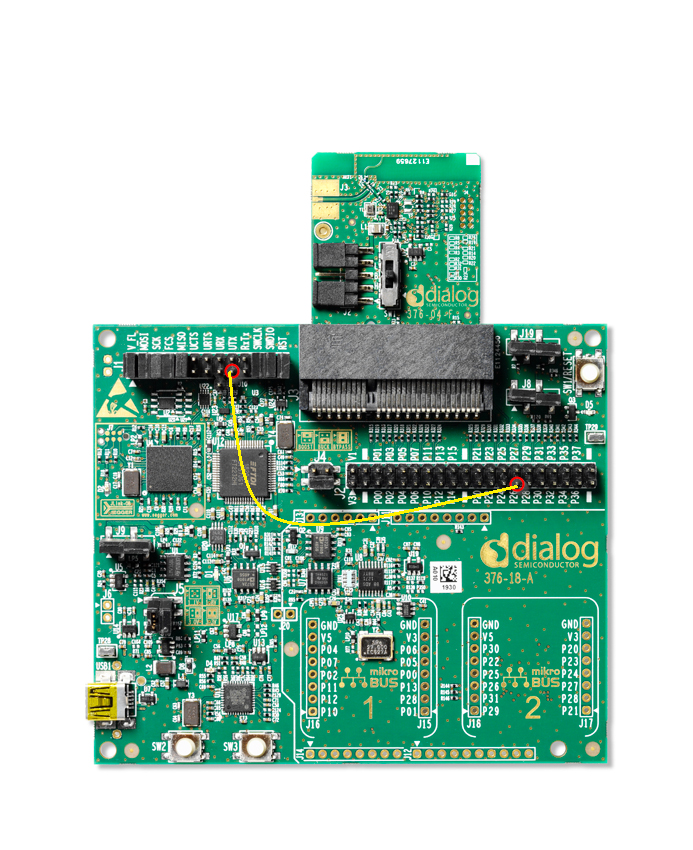
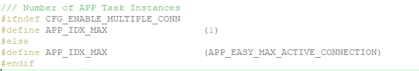
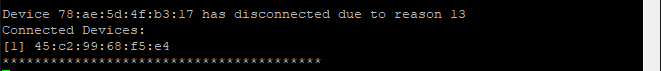

# DA14585/DA14586 - DA14531 Multiperipheral Example

---

## Example description

This SDK6 DA14585 / DA14531 example demostrates how a single peripheral can be connected to more than one centrals. DA14531 is able to support up to 3 and the DA14585 up to 8 simultaneous connections. The current demo also demonstrates how one could keep different characteristic values depending on different connections. The demo will start advertising and store the first 3 connections from different centrals in a user space variable, in case an extra central tries to connect, the demo will overwrite an inactive connection entry. Application will also retain the values of the connection orientated characteristics and make sure to report the proper value only to the requesting central.  

The demo exposes a custom profile including 3 services.

 - Service 1: Includes some of the standard characteristics and functionallity of the default custom profile. This database is common to all connected peripherals, hence data values are common to any device is connected. 
 - Service 2: Includes one characteristic with read and write properties. This is a connection oriented characteristic, hence the device will only report the values that correspond to the specific connection.
 - Service 3: Include one characteristic with read properties. This is a connection oriented characteristic, hence the device will only report the values that correspond to the specific connection. 
	
## HW and SW configuration

* **Hardware configuration**

	- This example runs on The DA14585/DA14586/DA14531 Bluetooth Smart SoC devices.
	- The Basic / Pro Development kit is needed for this example.
	- Connect the DA145xx Pro Development Kit to the host computer.
	- UART TX on P0_4 for DA14585/DA14586 (place jumper between J1:17 and J1:18) for printing functionallity.

		
	- UART TX on P0_6 for DA14531 (Place wire between J1:17 and J2:27) for printing functionallity.
	
		

* **Software configuration**

	- This example requires:
    * Smartsnippets Toolbox 2.0.12.
    * SDK6.0.14
	- **SEGGER’s J-Link** tools should be downloaded and installed.
	- **A simple serial terminal** should be installed on the PC

## SDK Changes

The default settings of the SDK supports only one connection, hence to properly run this example the user should apply changes to the files of the SDK in order to be able to connect to multiple centrals. In the files provided in the example all the SDK code related changes are moved to application level via bypassing the SDK code. Minor changes in the SDK files that should be applied in order to change SDK configuration or override SDK functions should be guarded via the CFG_ENABLE_MULTIMPLE_CONN, which is defined in da1458x_config_basic.h file. The changes are mentioned below:
- To be able to overide the default functions of the SDK the __ __EXCLUDE_ROM_APP_TASK__ __ be defined in the C/C++ tab in the "options for target" in keil (the ROM functions that correspond to that the specific guard should also be removed from the da14531_symbols.txt).

	
- app.h : apply to the APP_EASY_MAX_ACTIVE_CONNECTION the maximum connections that should be supported (DA14531 - 3 maximum connections and DA14585/6 - 8 maximum connections)
	
	
- app_task.h : apply to the APP_IDX_MAX the maximum number or task instances that the application should support. This should agree with the max active connections that the device is supporting.
	
	
- app.c : In this file specific functions need to be used in application level or being overiden by application code. The functions with the additional implementation for supporting multiple connections is located in the user_multi_peripheral.c file.
	- In order to be able to use the app_db_init_next() function in application level for initializing the device's database the "static" identifier should be removed.
	
		
	- The app_db_init_start() function needs to be modified to support multiple connections. To apply the changes in application level, in the original SDK function, the __WEAK identifier should be added and provide the new function in application level.
	
		  
- app_task.c : In app_task.c file the connection and disconnection handlers of the device should be modified in order to support the multiple connection feature. The complete functions supporting multiple connections are located in the user_multi_peripheral.c file of the example. In order to overide the SDK functions a __WEAK identifier is added in the app.c file in the:
	- gapc_connection_ind_handler

		
	- gapc_disconnect_ind_handler

		

## How to run the example

For initial setup of the example please refer to [this section of the dialog support portal](https://support.dialog-semiconductor.com/resource/da1458x-example-setup).

### Initial Setup

 - Compile and launch the example.
 - Open the development kit serial port with the following parameters.

		- baudrate: 115200
		- data: 8 bits
		- stop: 1 bit
		- parity: None
		- flow  control: none
 - As soon as the example runs the following message should appear on the terminal indicating that the device is advertising and there are no currently connected devices.
 	
	 
 - As soon as the device advertises, one could connect the first central. The following message will be printed on the terminal indicating the amount of centrals connected to the peripheral as well as their bd addresses. In every new connection all the bd addresses of the currently connected devices will be printed out.
	
	
	
	
	
- The example includes 2 services where the read and write data are connection dependant. The values of each characteristic are not stored in the peripheral's database but in application variables. Each time a read or a write is performed the values of each connection and characteristic is printed out on the terminal.
	
	

- In every disconnection the currently disconnected device will be printed out along with the disconnection reason.
	
	

## Known Limitations

- There are no known limitations for this example. But you can check and refer to the following application note for
[known hardware limitations for DA1458x devices](https://www.dialog-semiconductor.com/sites/default/files/da1458x-knownlimitations_2019_01_07.pdf) or [known hardware limitations for DA14531 devices](https://www.dialog-semiconductor.com/da14531_HW_Limitation).
- Dialog Software [Forum link](https://www.dialog-semiconductor.com/forum).
- you can also refer to the [DA14585/DA14586 Getting Started Guide with the PRO-Development Kit](http://lpccs-docs.dialog-semiconductor.com/da14585_getting_started/index.html) or the [DA14531 Getting Started guide](https://www.dialog-semiconductor.com/da14531-getting-started).

## License

**************************************************************************************

 Copyright (c) 2020 Dialog Semiconductor. All rights reserved.

 This software ("Software") is owned by Dialog Semiconductor. By using this Software
 you agree that Dialog Semiconductor retains all intellectual property and proprietary
 rights in and to this Software and any use, reproduction, disclosure or distribution
 of the Software without express written permission or a license agreement from Dialog
 Semiconductor is strictly prohibited. This Software is solely for use on or in
 conjunction with Dialog Semiconductor products.

 EXCEPT AS OTHERWISE PROVIDED IN A LICENSE AGREEMENT BETWEEN THE PARTIES OR AS
 REQUIRED BY LAW, THE SOFTWARE IS PROVIDED "AS IS", WITHOUT WARRANTY OF ANY KIND,
 EXPRESS OR IMPLIED, INCLUDING BUT NOT LIMITED TO THE WARRANTIES OF MERCHANTABILITY,
 FITNESS FOR A PARTICULAR PURPOSE AND NON-INFRINGEMENT. EXCEPT AS OTHERWISE PROVIDED
 IN A LICENSE AGREEMENT BETWEEN THE PARTIES OR BY LAW, IN NO EVENT SHALL DIALOG
 SEMICONDUCTOR BE LIABLE FOR ANY DIRECT, SPECIAL, INDIRECT, INCIDENTAL, OR
 CONSEQUENTIAL DAMAGES, OR ANY DAMAGES WHATSOEVER RESULTING FROM LOSS OF USE, DATA OR
 PROFITS, WHETHER IN AN ACTION OF CONTRACT, NEGLIGENCE OR OTHER TORTIOUS ACTION,
 ARISING OUT OF OR IN CONNECTION WITH THE USE OR PERFORMANCE OF THE SOFTWARE.

**************************************************************************************
