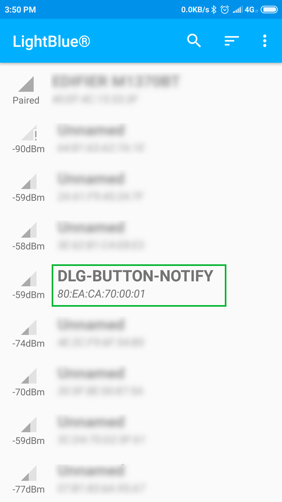
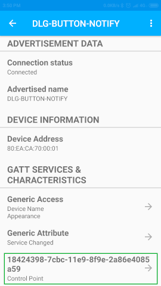
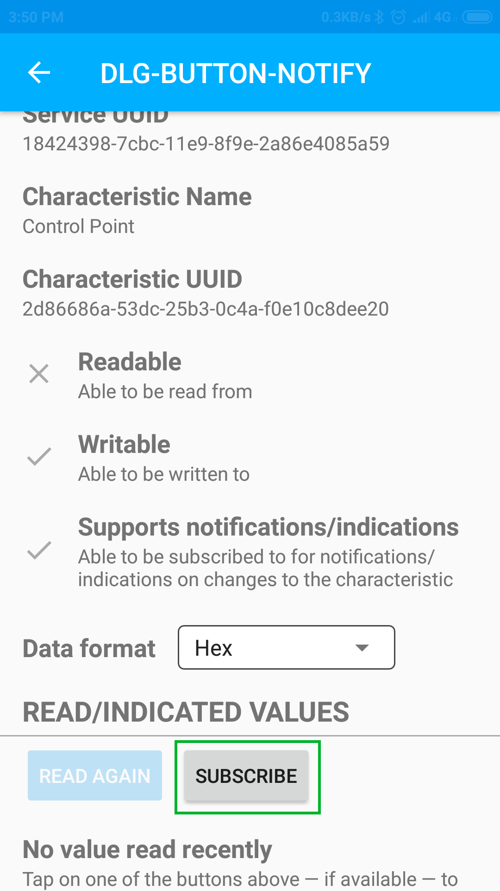
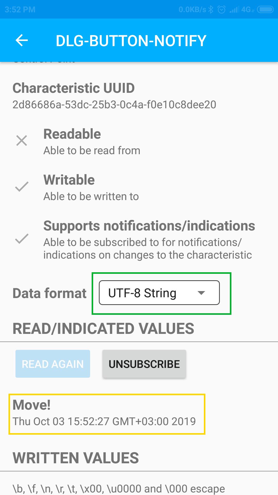
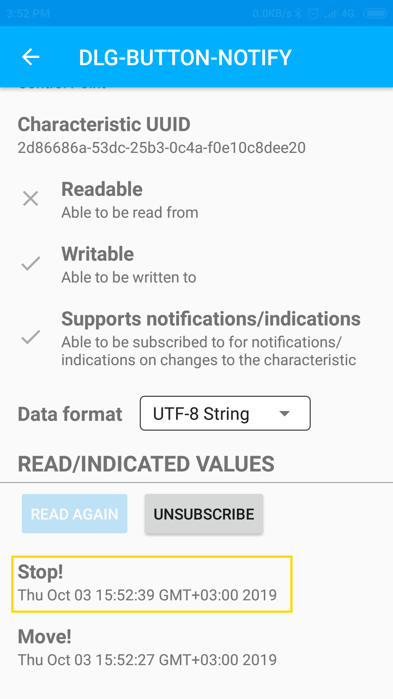
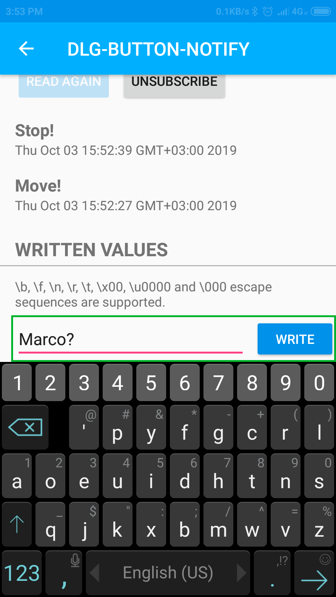
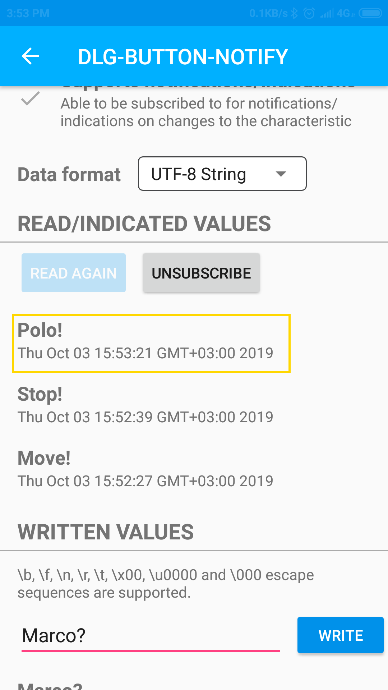

# DA14531 Multi-button wake-up and notify

---

## Example description

This SDK6 example shows how to configure a DA14531 device to send notifications to a BLE central by pushing the programmable buttons on the DA145xx Pro Development Kit motherboard. It also demonstrates how the software can be configured to catch write notifications to a service and behave accordingly.

## HW and SW configuration
- This example runs on the DA14531 Bluetooth Smart SoC devices.	
- The DA145xx Pro Development kit is needed for this example.

### Hardware configuration

- Connect the DA145xx Development kit to the host computer.
- Connect the P24 pin on header J2 with the second pin on header J19 as shown in the figure below (the mark indicates the first pin). Connect with a jumper the third and fourth pins.
 
	

### Software configuration

 This example requires:
 - SDK v6.0.11.1009
 - **SEGGER’s J-Link** tools should be downloaded and installed.
 - Additionaly, an application like LightBlue Explorer must be used to act as a BLE central

## How to run the example

For initial setup of the example please refer to [this section of the dialog support portal](https://support.dialog-semiconductor.com/resource/da1458x-example-setup).

### Initial Setup

 - Start Keil
 - Select the DA14531 device in the box shown below 

	

 - Compile and launch the example

 ### Connecting to the device
 The following instructions are using the LightBlue Explorer app.
 - Start the LightBlue Explorer. The application will list all the Bluetooth devices that are advertising. 
 - Connect to the `DLG_BUTTON_NOTIFY` device
 	
	 

 - Once connected, the application will list all discovered services. Connect to the service named `Control Point`.

  	

 - Press the subscribe button to subscribe to notifications.

  	

- Change the data format to `UTF-8 String` and then press the SW3 button on the Pro Development Kit. The device will respond with a notification with the text "Move!"

  	

- Press the SW2 button on the Pro Development Kit. The device will respond with a notification with the text "Stop!"

  	

- In the Written Values field, enter the text "Marco?" in the text box as shown below. Beware to remove any trailing spaces, and press `Write`.

  	

- You'll immediately see the device responding "Polo!".

	

	
## Known Limitations

- There are No known limitations for this example. But you can check and refer to the following application note for
[known hardware limitations](https://support.dialog-semiconductor.com/system/files/resources/DA1458x-KnownLimitations_2018_02_06.pdf "known hardware limitations").
- Dialog Software [Forum link](https://support.dialog-semiconductor.com/forums).
- you can Refer also for the Troubleshooting section in the DA1585x Getting Started with the Development Kit UM-B-049.

## License

**************************************************************************************

 Copyright (c) 2019 Dialog Semiconductor. All rights reserved.

 This software ("Software") is owned by Dialog Semiconductor. By using this Software
 you agree that Dialog Semiconductor retains all intellectual property and proprietary
 rights in and to this Software and any use, reproduction, disclosure or distribution
 of the Software without express written permission or a license agreement from Dialog
 Semiconductor is strictly prohibited. This Software is solely for use on or in
 conjunction with Dialog Semiconductor products.

 EXCEPT AS OTHERWISE PROVIDED IN A LICENSE AGREEMENT BETWEEN THE PARTIES OR AS
 REQUIRED BY LAW, THE SOFTWARE IS PROVIDED "AS IS", WITHOUT WARRANTY OF ANY KIND,
 EXPRESS OR IMPLIED, INCLUDING BUT NOT LIMITED TO THE WARRANTIES OF MERCHANTABILITY,
 FITNESS FOR A PARTICULAR PURPOSE AND NON-INFRINGEMENT. EXCEPT AS OTHERWISE PROVIDED
 IN A LICENSE AGREEMENT BETWEEN THE PARTIES OR BY LAW, IN NO EVENT SHALL DIALOG
 SEMICONDUCTOR BE LIABLE FOR ANY DIRECT, SPECIAL, INDIRECT, INCIDENTAL, OR
 CONSEQUENTIAL DAMAGES, OR ANY DAMAGES WHATSOEVER RESULTING FROM LOSS OF USE, DATA OR
 PROFITS, WHETHER IN AN ACTION OF CONTRACT, NEGLIGENCE OR OTHER TORTIOUS ACTION,
 ARISING OUT OF OR IN CONNECTION WITH THE USE OR PERFORMANCE OF THE SOFTWARE.

**************************************************************************************
