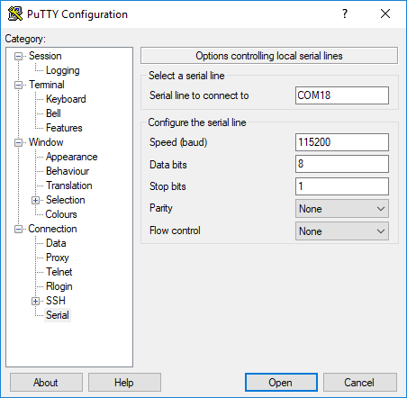
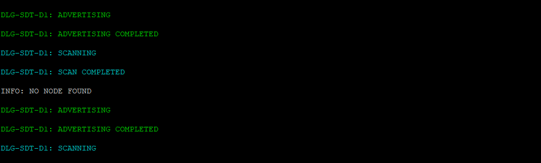
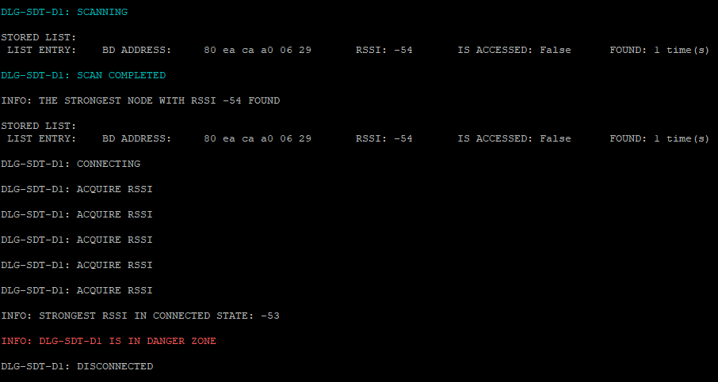

# DA14531 Social Distancing Tag software example

## Example description

This example configures a DA14531 device to be used for social distancing purposes. This Social Distancing Tag (SDT) is a reference software example that targets mainly, but not exclusively, wearable devices allowing its users to be warned in the case they do not comply with social distancing recommendations. In the COVID-19 pandemic context, the SDT users should not gather with a physical distance lower than 1.5m. The users in a professional environment should be warned they are not complying with the recommended physical distanciation.

## HW and SW configuration
- This example runs on the DA14531 Bluetooth Smart SoC devices.
- You will need to have two target devices, the DA14531 Smartbond daughterboard evaluation kit or the DA14531 Smartbond TINY module. One of them is recommended to be the DA14531 Smartbond TINY module.
- The DA145xx Pro Development Kit is needed for this example, and it can be used with the DA14531 Smartbond daughterboard evaluation kits or the DA14531 Smartbond TINY module.

### Hardware configuration for use with the DA14531 Smartbond TINY Module

- Connect the USB1 connector of the DA145xx Pro Development Kit to the host computer.
- Connect the jumpers as shown in the graphic for downloading your binary to the SPI flash via the one-wire UART. Connect the left pin of the UTX row on header J1 with P26 on header J2 with a flywire for UART output.
- For using the LED mounted on the module PCB, you can find more instructions on the  [DA14531 Smartbond TINY Module Development Kit Hardware User Manual](https://www.dialog-semiconductor.com/da14531-module-HW-DevKit-UM)

	

### Hardware configuration for use with the DA14531 Smartbond daughterboard

- Connect the USB1 connector of the DA145xx Pro Development Kit to the host computer.
- Connect the JTAG debugger with the appropriate jumpers as seen below on header J1.
- Connect the left pin of the UTX row on header J1 with P26 on header J2 with a flywire for UART output.
- Connect P25 on header J2 with the bottom pin of header J8 with a flywire for the LED indication.	
	
	

### Software configuration

 This example requires:
 - SDK v6.0.14 or later
 - **SEGGER’s J-Link** tools should be downloaded and installed.
 - A serial port terminal, like PuTTY or similar.

## How to run the example

For initial setup of the example please refer to [this section of the dialog support portal](https://www.dialog-semiconductor.com/sites/default/files/sw-example-da145x-example-setup.pdf).

### Initial Setup

 - Start Keil
 - Open the file ``src/config/user_periph_setup.h`` and define ``USER_CFG_DA14531_MOD`` for use with the DA14531 Module.
 - Compile the example by pressing the "Build" button. 
 - Load the executable to the SPI flash memory (have a look at the [SmartSnippets Toolbox User Manual](http://lpccs-docs.dialog-semiconductor.com/UM-B-083/tools/SPIFlashProgrammer.html) for instructions) and disconnect the DA14531 module from the motherboard. Insert a type CR2032 battery to the module.

 - Connect the second target device and connect the pins as shown in the second figure with flywires. Undefine in ``src/config/user_periph_setup.h`` the ``USER_CFG_DA14531_MOD`` macro.
 - Open up your Device Manager (for Windows OS) and there will be two COM ports enumerated as shown in the following figure.

- Open your serial port terminal and choose the first one as your port. Configure the connection with baud rate 115200, 8 data bits and 1 stop bit, no parity and no flow control. For PuTTY you should configure your Session as in the following picture

and under Connection -> Serial

and press "Open".

- In Keil, start a debugging session and then press the "Run" button or F5.
	

	
 ### Monitoring distance
At this point you will have the executable running on your DA14531 module and on the device connected to your motherboard, with the latter printing messages on your serial port terminal. 

The device will switch between being a BLE Advertiser and a Scanner. In the Advertising state peer devices will detect its presence and measure its Received Signal Strength Indicator (RSSI). In the Scanning state, it will detect peer devices nearby and store their address, RSSI and the number of times an advertising report has been received, and this information will be put in a dynamic list. To rule out the case that a device has been momentarily in the vicinity, the RSSIs are filtered with a running average filter. 

When scanning completes, the dynamic list entries will be print, the list will be traversed and if there is a device with a strong signal nearby, it will initiate a connection. Upon connection, the entry list will be marked as "Accessed", and then the devices will exchange their measured RSSIs through a GATT service for a configurable number of times and the maximum RSSI will be used as an indication for the distance. At this point, the LED will blink according to the proximity zone that the devices are in. The same procedure will be repeated with every device that is in close range, and then an advertising and scanning cycle will start again.

You can monitor the device state on the UART output. Below is a list of all the associated messages:

* DLG-SDT-D1: ADVERTISING: The device is advertising its presence to peer devices.
* DLG-SDT-D1: ADVERTISING COMPLETED: The device has completed advertising.
* DLG-SDT-D1: SCANNING: The device is searching for peer devices.
* DLG-SDT-D1: SCAN COMPLETED: The device has finished searching for peer devices.

In the next figure you can see the case when no device has been detected and Social Distancing Tag will switch between being an Advertiser and a Scanner.

When an advertising report is received, all the entries of the dynamic list will be printed out:

* STORED LIST:
  LIST ENTRY:    BD ADDRESS:     80 ea ca a0 06 aa       RSSI: -57       IS ACCESSED: False      FOUND: 1 time(s) : The list entry stores the BD Address of the peer device, the filtered RSSI value, a flag which indicates if a connection has been initiated, and the number of advertising reports that have been received.

When a connection is initiated:
* DLG-SDT-D1: ACQUIRE RSSI: At this point the device is measuring the connection RSSI
* INFO: STRONGEST RSSI IN CONNECTED STATE: -44: This is the strongest RSSI measured and determines the proximity zone.
* INFO: DLG-SDT-D1 IS IN DANGER ZONE: The device has determined the proximity zone and the associated indication will be triggered.
* DLG-SDT-D1: DISCONNECTED: The current connection has been dropped, and the device will either check for another proximity candidate or start advertising its presence. 

This procedure can be seen in the next screenshot:

### Implementation details
The threshold levels that determine the proximity zone are defined in ``user_social_distancing.c`` in the array named ``user_prox_zones_rssi``. Four proximity zones are defined, namely Danger Zone, Warning Zone, Coarse Zone, and BLE Limit Zone. In there, you can change the RSSI thresholds to the ones that are most suitable for your application.  

When the device gets initialized, the function ``user_app_adv_start()`` will be called as the default advertising operation. This will set a timer which will time out after ``USER_SWITCH_ADV_SCAN_TO`` plus a small random value, which in turn will call the ``user_switch_adv_scan_timer_cb()``. When this callback function is called, it will stop the advertising and it will enter the Scanner state.

Scanning starts with the function ``user_scan_start()`` and is configured with the parameters of ``user_scan_conf`` struct. At this point, if there is an active alert, it will be canceled. Every time a new advertising report is received, the function ``user_app_on_adv_report_ind()`` will be called, which will add a peer device's advertising report in a dynamic list. 

When scanning completes, the ``user_app_on_scanning_completed()`` function will be called. The list will be searched to check the maximum RSSI node (if there is one) and if it exceeds the RSSI threshold, a connection will be initiated. If not, the device will enter another Advertising/Scanning cycle.

Connections are initiated with the ``user_initiator_timer_cb()`` every ``USER_INITIATOR_TO`` interval. Upon connection, the function ``user_poll_conn_rssi_timer_cb`` will check the connection RSSI every ``USER_UPD_CONN_RSSI_TO`` interval and in turn the function ``user_collect_conn_rssi()`` will collect the measurements. This will also trigger an RSSI exchange with the peer device. If the strongest RSSI, peer or own, exceeds the thresholds defined in ``user_prox_zones_rssi`` array, an alert will start, which will blink with a frequency related to the proximity zone that was estimated. After ``USER_CON_RSSI_MAX_NB`` measurements, the link will be disconnected. The list will be traversed to find the next connection candidate, and when the list is exhausted, a new Advertising/Scanning cycle will begin.  

## Known Limitations

- When trying to program DA14531 SMARTBOND TINY™ MODULE using Keil, an error stating "No Cortex-M SW Device found" may occur when the user tries to open the debugger session. User must lower the JTAG clock speed to 2MHz. For further reading you can see the section [KEIL Installation](http://lpccs-docs.dialog-semiconductor.com/UM-B-139-Getting-Started-with-DA14531-TINY-Module/05_Software_Development_Tools/Software_Development_Tools.html#keil-installation) in the UM-B-139 Getting Started with DA14531 TINY Module document.
- There are no known limitations for this example. But you can check and refer to the following application note for [known hardware limitations for DA14531 devices](https://www.dialog-semiconductor.com/da14531_HW_Limitation).
- Dialog Software [Forum link](https://www.dialog-semiconductor.com/forum).
- You can also refer to the [DA14531 Getting Started guide](https://www.dialog-semiconductor.com/da14531-getting-started).

## License

**************************************************************************************

 Copyright (c) 2020 Dialog Semiconductor. All rights reserved.

 This software ("Software") is owned by Dialog Semiconductor. By using this Software
 you agree that Dialog Semiconductor retains all intellectual property and proprietary
 rights in and to this Software and any use, reproduction, disclosure or distribution
 of the Software without express written permission or a license agreement from Dialog
 Semiconductor is strictly prohibited. This Software is solely for use on or in
 conjunction with Dialog Semiconductor products.

 EXCEPT AS OTHERWISE PROVIDED IN A LICENSE AGREEMENT BETWEEN THE PARTIES OR AS
 REQUIRED BY LAW, THE SOFTWARE IS PROVIDED "AS IS", WITHOUT WARRANTY OF ANY KIND,
 EXPRESS OR IMPLIED, INCLUDING BUT NOT LIMITED TO THE WARRANTIES OF MERCHANTABILITY,
 FITNESS FOR A PARTICULAR PURPOSE AND NON-INFRINGEMENT. EXCEPT AS OTHERWISE PROVIDED
 IN A LICENSE AGREEMENT BETWEEN THE PARTIES OR BY LAW, IN NO EVENT SHALL DIALOG
 SEMICONDUCTOR BE LIABLE FOR ANY DIRECT, SPECIAL, INDIRECT, INCIDENTAL, OR
 CONSEQUENTIAL DAMAGES, OR ANY DAMAGES WHATSOEVER RESULTING FROM LOSS OF USE, DATA OR
 PROFITS, WHETHER IN AN ACTION OF CONTRACT, NEGLIGENCE OR OTHER TORTIOUS ACTION,
 ARISING OUT OF OR IN CONNECTION WITH THE USE OR PERFORMANCE OF THE SOFTWARE.

**************************************************************************************
