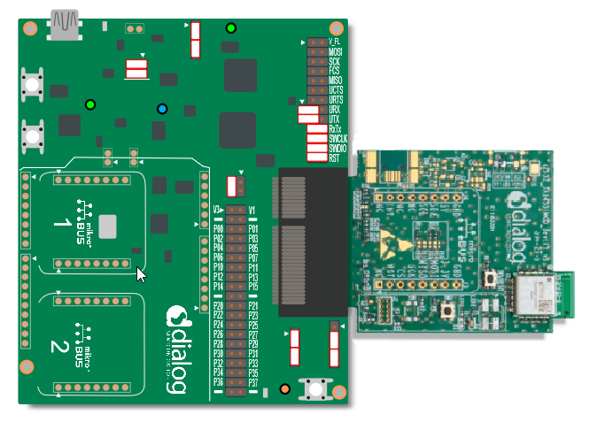
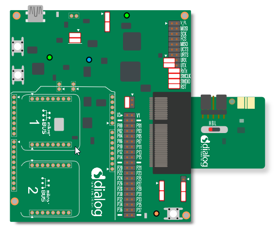
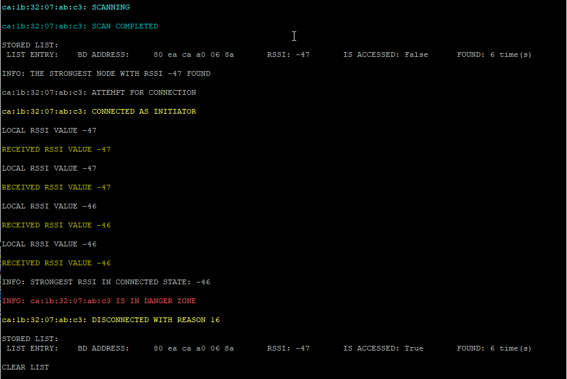

# DA14531 Social Distancing Tag software example

## Example description

This example configures a DA14531 device to be used for social distancing purposes. This Social Distancing Tag (SDT) is a reference software example that targets mainly, but not exclusively, wearable devices allowing its users to be warned in the case they do not comply with social distancing recommendations. In the COVID-19 pandemic context, the SDT users should not gather with a physical distance lower than 1.5m. The users in a professional environment should be warned that they are not complying with the recommended physical distanciation.

## HW and SW configuration
- This example runs on the DA14531 Bluetooth Smart SoC devices.
- You will need to have at least two target devices to run the example. The DA14531 Smartbond daughterboard evaluation kit or the DA14531 Smartbond TINY module or the DA14531 USB kit can be used.
- The DA145xx Pro Development Kit is needed for this example in order to print out the messages generated from the SW. Along with the motherboard, the DA14531 Smartbond daughterboard evaluation kits or the DA14531 Smartbond TINY module can be used.

### Hardware configuration for use with the DA14531 Smartbond TINY Module

- Connect the USB1 connector of the DA145xx Pro Development Kit to the host computer.
- Connect the jumpers as shown in the graphic for downloading your binary to the RAM either via JTAG (using Keil or Smart Snippets Toolbox) or via UART using the P05 single wire UART configuration (only via the Smart Snippets Toolbox).
- For burning the flash on the TINY module you can find more instructions for the jumper configuration on the below links:
  - [DA14531 Smartbond TINY Module Development Kit Hardware User Manual](https://www.dialog-semiconductor.com/da14531-module-HW-DevKit-UM)

- The LED that indicates the proximity alert is on pin P09 by default, thus the alert indication is on D2 on TINY module.
- The UART output is on pin P05 (single wire UART), thus the downloading of the fw via UART and the printing of the application messages is done via the same pin. 

	

### Hardware configuration for use with the DA14531 Smartbond daughterboard

- Connect the USB1 connector of the DA145xx Pro Development Kit to the host computer.
- Connect the jumpers as shown in the graphic for downloading your binary to the RAM either via JTAG (using Keil or Smart Snippets Toolbox) or via UART using the P05 single wire UART configuration (only via the Smart Snippets Toolbox).
- For burning the onboard flash on DA14xxx Pro Development Kit you can find more instructions for the jumper configuration at the below link:
  - [DA14531 Development Kit Pro Hardware User Manual](https://www.dialog-semiconductor.com/sites/default/files/um-b-114_da14531_devkit_pro_hardware_user_manual_1v2.pdf)
- The LED that indicates the proximity alert is on pin P09 by default, thus the alert indication is on D5 on DA14xxx Pro Development Kit for the case of the DA14531 daughtercard.
- The UART output is on pin P05 (single wire UART), thus the downloading of the fw via UART and the printing of the application messages is done via the same pin.	
	
	

### Software configuration

 This example requires:
 - SDK v6.0.14 or later
 - **SEGGER’s J-Link** tools should be downloaded and installed.
 - A serial port terminal, like PuTTY or similar.

## How to run the example

The example comes along with the latest SDK6 release. The project is located under the ``SDK_6.0.14.1114\DA145xx_SDK\6.0.14.1114\projects\target_apps\social_distancing_demo``

### Initial Setup

 - Start Keil
 - Compile the example by pressing the "Build" button. 
 - Depending on the available devices on the end user side, one can either burn the SPI flash of the TINY module and detach the TINY module from the motherboard, apply a coin cell battery and operate. Or download the fw directly to RAM on a TINY module or a DA14531 daughtercard and remain attach to the motherboard in order to print out the messages generated. On this demo setup only two devices are used and both DA14531 used remain connected to their motherboards and both are printing on different terminals.
 - For loading the executable to the SPI flash memory (have a look at the [SmartSnippets Toolbox User Manual](http://lpccs-docs.dialog-semiconductor.com/UM-B-083/tools/SPIFlashProgrammer.html) for instructions).
 - As soon as the devices are hooked on the PC open up your Device Manager (for Windows OS) and there will be four COM ports enumerated as shown in the following figure. In this case there are two motherboards connected on the PC each motherboard exposes one pair of serial ports each. Always choose the lowest port number of each pair for printing out UART messages generated from the fw.

- Open your serial port terminal and choose the lowest port for each connected motherboard. Configure the connection with baud rate 115200, 8 data bits and 1 stop bit, no parity and no flow control. For PuTTY you should configure your Session as in the following picture

and under Connection -> Serial

and press "Open".

- In Keil, start a debugging session and then press the "Run" button or F5.
	

	
 ### Programming using the Dialog SmartBond Flash Programmer Standalone tool
 The SDT example is also available for downloading/flashing via the Flash programmer Standalone tool. Via pressing the ``Online Resources`` button you can select the Social Distancing project .hex and directly burn the file into the flash.
 For more information regarding the Flash Programmer Standalone tool check the below link:
  - [Dialog Smartbond Flash Programmer User Manual](http://lpccs-docs.dialog-semiconductor.com/um-b-138/introduction.html)

 
 ### Monitoring distance
At this point you should have the executable running on two DA14531.

The device will switch between being a BLE Advertiser and a Scanner. In the Advertising state, peer devices will detect its presence and measure its Received Signal Strength Indicator (RSSI). In the Scanning state, it will detect peer devices nearby and store their address, RSSI and the number of times an advertising report has been received, and this information will be put in a dynamic list.

When scanning completes, the dynamic list entries will be printed, the list will be traversed and if there is a device with a strong signal nearby the scanning device will initiate a connection. The "nearby strong signal" is assumed a device with an RSSI smaller then -70dbm (this threshold is configurable from the user_prox_zones_rssi array). Upon connection, the entry list will be marked as "Accessed", and then the devices will exchange their measured RSSIs through a GATT service for a configurable number of times and the maximum RSSI will be used as an indication for the distance. At this point, the LED will blink according to the proximity zone that the devices are in. The same procedure will be repeated with every device that is in close range, and then an advertising and scanning cycle will start again.

**``WARNING:`` There are cases where a device that performs scan may not report all nearby devices or when initiating a connection the connection might fail. That may occur because the other device has switched to scanning mode or it is already connected with another device**

The SW uses a unique static random address that derives from the OTP header data. 

You can monitor the device state on the UART output. Below is a list of all the associated messages:

* xx:xx:xx:xx:xx:xx : ADVERTISING: The device is advertising its presence to peer devices.
* xx:xx:xx:xx:xx:xx : ADVERTISING COMPLETED: The device has completed advertising.
* xx:xx:xx:xx:xx:xx : SCANNING: The device is searching for peer devices.
* xx:xx:xx:xx:xx:xx : SCAN COMPLETED: The device has finished searching for peer devices.

In the next figure you can see the case when no device has been detected and Social Distancing Tag will switch between being an Advertiser and a Scanner.

 

When a scanning operation completes, all the entries of the dynamic list will be printed out:

* STORED LIST:
  LIST ENTRY:    BD ADDRESS:     XX XX XX XX XX XX       RSSI: -57       IS ACCESSED: False      FOUND: 1 time(s) : The list entry stores the BD Address of the peer device, the filtered RSSI value, a flag which indicates if a connection has been initiated, and the number of advertising reports that have been received.

When the device completes with the scanning period it will go through the advertising list and start initiating connections with all the available devices in the list, starting with the strongest RSSI node. As soon as a connection is established both devices exchange their RSSI values 4 times(this parameter is configurable via USER_CON_RSSI_MAX_NB definition). From the exchanged RSSI values the stronger one is taken into account in order to initiate the corresponding alert:
1. CA:1B:32:07:AB:C3: SCAN COMPLETED : Has completed a scanning period. 
2. INFO: THE STRONGEST NODE WITH RSSI -47 FOUND: This is the strongest RSSI measured during scanning.
3. CA:1B:32:07:AB:C3: ATTEMPT FOR CONNECTION: The device initiates a connection request to the specific device.
4. CA:1B:32:07:AB:C3: CONNECTED AS INITIATOR: The connection request was successful and the device is the initiator on this connection (on the peer device a message CONNECTED AS SLAVE should be prompted).
5. LOCAL RSSI VALUE -47: The local received signal strength is obtained, send to the peer through the GATT service and also printed 4 times.
6. RECEIVED RSSI VALUE -47: The received RSSI is obtained from the peer through GATT service and printed 4 times.
7. INFO: STRONGEST RSSI IN CONNECTED STATE: -46: Indicating the strongest RSSI obtained from the exchange.
8. INFO: CA:1B:32:07:AB:C3 IS IN DANGER ZONE: based on the value of the RSSI the device is located in very close proximity with another device.
9. CA:1B:32:07:AB:C3: DISCONNECTED WITH REASON 16: After the alert is done the devices get disconnected. the disconnection request is issued always from the initiator of the connection, hence the disconnection reasons should be. 
  * The 0x16 corresponds to the reason ERROR_CON_TERM_BY_LOCAL_HOST at the initiator side.
  * The 0x13 corresponds to the reason ERROR_REMOTE_USER_TERM_CON at the slave side
  * There are cases where a disconnection occurs for different reasons (other than 0x16 or 0x13), due to various errors that my occur during connection or timeouts.
10. LIST ENTRY:    BD ADDRESS:     80 ea ca a0 06 8a       RSSI: -47       IS ACCESSED: True       FOUND: 6 time(s): After the disconnection occurs the device will indicate the current status of the scanned devices indicating the one that just disconnected from as accessed.
11. CLEAR LIST: The device will check if there are more devices in scanning list to connect to. If no other devices are available the device will clear the scanning list and start advertising again. If there are devices in the scanning list not yet accessed then will initiate a connection to next available node.

This procedure can be seen in the next screenshot:

The corresponding procedure from the slave side can be seen in the next screenshot (the capture is from the same device in another instance when connected as slave):

### Implementation details
The threshold levels that determine the proximity zone are defined in ``user_social_distancing.c`` in the array named ``user_prox_zones_rssi``. Four proximity zones are defined, namely Danger Zone, Warning Zone, Coarse Zone, and BLE Limit Zone. In there, you can change the RSSI thresholds to the ones that are most suitable for your application.  

When the device gets initialized, the function ``user_app_adv_start()`` will be called as the default advertising operation. This will set a timer which will time out after ``USER_SWITCH_ADV_SCAN_TO`` plus a small random value, which in turn will call the ``user_switch_adv_scan_timer_cb()``. When this callback function is called, it will stop the advertising and it will enter the Scanner state.

Scanning starts with the function ``user_scan_start()`` and is configured with the parameters of ``user_scan_conf`` struct. Every time a new advertising report is received, the function ``user_app_on_adv_report_ind()`` will be called, which will add a peer device's advertising report in a dynamic list. 

While scanning for advertising devices the scanner will populate a list with the found devices along with the RSSI value which was obtained while advertising and some additional data. Based on this advertising RSSI value the scanner will later decide if the device is located in close proximity and if it is, a connection attempt will start. The close proximity threshold is defined by the ``user_prox_zones_rssi[USER_PROX_ZONE_COARSE]``. The values of the advertising RSSI are populated in two ways. Either have the stack filter all advertising messages that come from the same device so the advertising RSSI is obtained by a single message or instruct the stack not to filter the messages and report to the application all the advertising messages tracked. In the later case the scanner will perfrom a running average filter over the RSSI's received from the same device. To enable or disable the above functionality the user should assign in the ``user_scan_config.filter_duplic`` structure either ``SCAN_FILT_DUPLIC_EN`` for enabling stack filtering and get a signle RSSI value per device or ``SCAN_FILT_DUPLIC_DIS`` for accepting all advertising messages and perform the running average.

When scanning completes, the ``user_app_on_scanning_completed()`` function will be called. The list will be searched to check the maximum RSSI node (if there is one) and if it exceeds the advertising RSSI threshold, a connection will be initiated. If not, the device will enter another Advertising/Scanning cycle.

The reason the device is performing connections instead of estimating proximity using the RSSI from the advertising messages is due to the fact that, while in connection the device operates over a larger range of channels than advertising resulting in more accurate RSSI measurements.

Connections are initiated with the ``user_app_on_scanning_completed()`` via the ``initiate_connection_attempt()`` either when the previous connection is over or if the ``USER_INITIATE_CONN_TO`` time elapses. Upon connection, the function ``user_poll_conn_rssi_timer_cb`` will check the connection RSSI every ``USER_UPD_CONN_RSSI_TO`` interval and in turn the same will collect the measurements. This will also trigger an RSSI exchange with the peer device. If the strongest RSSI, peer or own, exceeds the thresholds defined in ``user_prox_zones_rssi`` array, an alert will start, which will blink with a frequency related to the proximity zone that was estimated. After ``USER_CON_RSSI_MAX_NB`` measurements and as soon as the alert is done the link will be disconnected. The list will be traversed to find the next connection candidate, and when the list is exhausted, a new Advertising/Scanning cycle will begin.

The indication of the proximity is done via blinking the LED on the device. The ON/OFF period of the alert depends on the proximity zone estimation. The ON/OFF periods are configurable through the below definitions:
- ``#define DANGER_ZONE`` : default 20ms period
- ``#define WARNING_ZONE``: default 100ms period
- ``#define COARSE_ZONE`` : default 150ms period
Along with the timers that control the alert interval, a seperate timer is also started that counts down until the disconnection event is issued from the initiator of the connection. This time is also configurable via the ``ALERT_TIME`` which defaults to 1 second. 

As already mentioned the devices running the SDT SW are going through periods of Advertising, Scanning and if a peer is a candidate it will initiate a connection procedure. The amount of time the above three actions are taking place in configurable through the ``ADVERTISING_TIMEOUT_msec`` definition which determines the amount of the advertising period. The scanning and connection initiation periods are defined as percentages of the advertising period via the ``SCANNING_PERCENTAGE`` and the ``CONNECT_INIT_PERCENTAGE`` definitions. Additionally in order to avoid identical Advertising and Scanning periods for each device a random offset is also added in each Advertising / Scanning period.  

## Known Limitations

- When trying to program DA14531 SMARTBOND TINY™ MODULE using Keil, an error stating "No Cortex-M SW Device found" may occur when the user tries to open the debugger session. User must lower the JTAG clock speed to 2MHz. For further reading you can see the section [KEIL Installation](http://lpccs-docs.dialog-semiconductor.com/UM-B-139-Getting-Started-with-DA14531-TINY-Module/05_Software_Development_Tools/Software_Development_Tools.html#keil-installation) in the UM-B-139 Getting Started with DA14531 TINY Module document.
- There are no known limitations for this example. But you can check and refer to the following application note for [known hardware limitations for DA14531 devices](https://www.dialog-semiconductor.com/da14531_HW_Limitation).
- Dialog Software [Forum link](https://www.dialog-semiconductor.com/forum).
- You can also refer to the [DA14531 Getting Started guide](https://www.dialog-semiconductor.com/da14531-getting-started).

## License

**************************************************************************************

 Copyright (c) 2020 Dialog Semiconductor. All rights reserved.

 This software ("Software") is owned by Dialog Semiconductor. By using this Software
 you agree that Dialog Semiconductor retains all intellectual property and proprietary
 rights in and to this Software and any use, reproduction, disclosure or distribution
 of the Software without express written permission or a license agreement from Dialog
 Semiconductor is strictly prohibited. This Software is solely for use on or in
 conjunction with Dialog Semiconductor products.

 EXCEPT AS OTHERWISE PROVIDED IN A LICENSE AGREEMENT BETWEEN THE PARTIES OR AS
 REQUIRED BY LAW, THE SOFTWARE IS PROVIDED "AS IS", WITHOUT WARRANTY OF ANY KIND,
 EXPRESS OR IMPLIED, INCLUDING BUT NOT LIMITED TO THE WARRANTIES OF MERCHANTABILITY,
 FITNESS FOR A PARTICULAR PURPOSE AND NON-INFRINGEMENT. EXCEPT AS OTHERWISE PROVIDED
 IN A LICENSE AGREEMENT BETWEEN THE PARTIES OR BY LAW, IN NO EVENT SHALL DIALOG
 SEMICONDUCTOR BE LIABLE FOR ANY DIRECT, SPECIAL, INDIRECT, INCIDENTAL, OR
 CONSEQUENTIAL DAMAGES, OR ANY DAMAGES WHATSOEVER RESULTING FROM LOSS OF USE, DATA OR
 PROFITS, WHETHER IN AN ACTION OF CONTRACT, NEGLIGENCE OR OTHER TORTIOUS ACTION,
 ARISING OUT OF OR IN CONNECTION WITH THE USE OR PERFORMANCE OF THE SOFTWARE.

**************************************************************************************
