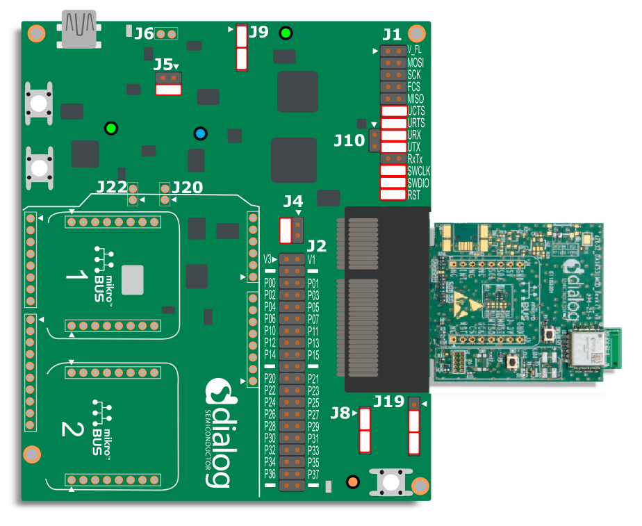
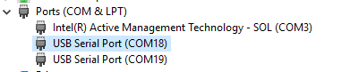

# Social Distancing Tag software example

## Example description

This example configures a DA14531 device to be used for social distancing purposes. This Social Distancing Tag (SDT) is a reference software example that targets mainly, but not exclusively, wearable devices allowing its users to be warned in the case they do not comply with social distancing recommendations. In the COVID-19 pandemic context, the SDT users should not gather with a physical distance lower than 1.5m. The users in a professional environment should be warned they are not complying with the recommended physical distanciation.

## HW and SW configuration
- This example runs on the DA14531 Bluetooth Smart SoC devices.	
- The DA145xx Pro Development Kit is needed for this example, and it can be used with the DA14531 Smartbond daughterboard evaluation kits or the DA14531 Smartbond TINY module.

### Hardware configuration for use with the DA14531 Smartbond daughterboard

- Connect the USB1 connector of the DA145xx Pro Development Kit to the host computer.
- Connect the JTAG debugger with the appropriate jumpers as seen below on header J1.
- Connect the left pin of the UTX row on header J1 with P26 on header J2 with a flywire.
- Connect P25 on header J2 with the bottom pin of header J8 with a flywire.	
	

### Hardware configuration for use with the DA14531 Smartbond TINY Module

- Connect the USB1 connector of the DA145xx Pro Development Kit to the host computer.
- Connect the jumpers as shown in the graphic for downloading your binary to the SPI flash via the one-wire UART.
- For using the LED mounted on the module PCB, you can find more instructions on the  [DA14531 Smartbond TINY Module Development Kit Hardware User Manual](https://www.dialog-semiconductor.com/sites/default/files/um-b-141_da14531_smartbond_tinytm_module_development_kit_hardware_user_manual_1.1.pdf)

	

### Software configuration

 This example requires:
 - SDK v6.0.14 or later
 - **SEGGER’s J-Link** tools should be downloaded and installed.
 - A serial port terminal, like PuTTY or similar.

## How to run the example

For initial setup of the example please refer to [this section of the dialog support portal](https://www.dialog-semiconductor.com/sites/default/files/sw-example-da145x-example-setup.pdf).

### Initial Setup

 - Start Keil
 - Open the file ``src/user_social_distancing.c`` and define ``USER_CFG_DA14531_MOD`` for use with the DA14531 Module.
 - Compile the example by pressing the "Build" button. 
 - For exploring the functionality of this example, you should have two or more devices available. You can run the executable from the SPI flash memory (have a look at the [SmartSnippets Toolbox User Manual](http://lpccs-docs.dialog-semiconductor.com/UM-B-083/tools/SPIFlashProgrammer.html) for instructions), or you could run a Debug session.

    Start a debugging session.
	
	
	and then press the "Run" button or F5.

 ### Monitoring distance
You should complete the previous steps for two or more devices. Once your motherboard is connected, there will be two COM ports enumerated as shown in the following figure.

Open your serial port terminal and choose the first one as your port. Configure the connection with baud rate 115200, 8 data bits and 1 stop bit, no parity and no flow control.

The device will switch between being a BLE Advertiser and a Scanner. When scanning completes, you will see the peer device showing up in the list on your serial terminal, and if the distance between the devices is too close, the LED will blink.

## Known Limitations

- There are no known limitations for this example. But you can check and refer to the following application note for [known hardware limitations for DA14531 devices](https://www.dialog-semiconductor.com/da14531_HW_Limitation).
- Dialog Software [Forum link](https://www.dialog-semiconductor.com/forum).
- You can also refer to the [DA14531 Getting Started guide](https://www.dialog-semiconductor.com/da14531-getting-started).

## License

**************************************************************************************

 Copyright (c) 2020 Dialog Semiconductor. All rights reserved.

 This software ("Software") is owned by Dialog Semiconductor. By using this Software
 you agree that Dialog Semiconductor retains all intellectual property and proprietary
 rights in and to this Software and any use, reproduction, disclosure or distribution
 of the Software without express written permission or a license agreement from Dialog
 Semiconductor is strictly prohibited. This Software is solely for use on or in
 conjunction with Dialog Semiconductor products.

 EXCEPT AS OTHERWISE PROVIDED IN A LICENSE AGREEMENT BETWEEN THE PARTIES OR AS
 REQUIRED BY LAW, THE SOFTWARE IS PROVIDED "AS IS", WITHOUT WARRANTY OF ANY KIND,
 EXPRESS OR IMPLIED, INCLUDING BUT NOT LIMITED TO THE WARRANTIES OF MERCHANTABILITY,
 FITNESS FOR A PARTICULAR PURPOSE AND NON-INFRINGEMENT. EXCEPT AS OTHERWISE PROVIDED
 IN A LICENSE AGREEMENT BETWEEN THE PARTIES OR BY LAW, IN NO EVENT SHALL DIALOG
 SEMICONDUCTOR BE LIABLE FOR ANY DIRECT, SPECIAL, INDIRECT, INCIDENTAL, OR
 CONSEQUENTIAL DAMAGES, OR ANY DAMAGES WHATSOEVER RESULTING FROM LOSS OF USE, DATA OR
 PROFITS, WHETHER IN AN ACTION OF CONTRACT, NEGLIGENCE OR OTHER TORTIOUS ACTION,
 ARISING OUT OF OR IN CONNECTION WITH THE USE OR PERFORMANCE OF THE SOFTWARE.

**************************************************************************************
