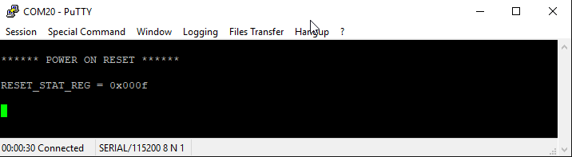

------

# Different ways of handling RESET mechanism in DA14531

------

## Example Description
Both DA14531 and DA14585/586 devices comprise three main reset signals that can be triggered from different sources, the reset signals are 
* **POR** : Triggred when VDD (VBAT_LOW and VBAT_HIGH rails only for the DA14531) voltage crosses the minimum voltage threshold value or optionally triggered by a configured GPIO or if the RST pad is held high for more than the POR_TIMER_REG value.
* **HW RESET** : Triggered by the RST pad (P00 for the DA14531), the watchdog, or when waking up from sleep while having the RESET_ON_WAKEUP bit set. 
* **SW RESET** : Triggered when setting the SW_RESET bit.

The current SW example demonstrates how to issue and identify the different kinds of reset on the DA14531 and DA14585/586 devices as well as identifying if the device issued a Hardfault or an NMI Handler.

The DA14531 includes a special register that indicates the reset source previously occured (RESET_STAT_REG) while in order to identify the reset source on the DA14585/586 devices registers that retain their values, through the different kinds of resets, are used. The SDK 6.0.14.1114 includes a weak function in the system_init() which can be implemented on user space in order for the application to be aware of the current reset.    

## Key Features
- Store data in the uninitialized section of the Retention-RAM for tracking an NMI or a Hardfault.
- Detect source of :
    - Hardware reset
    - Software reset
    - Reset by WDOG expiration
    - Power-on-Reset
- Using UART2 for debugging purposes
- 128-bit UUID custom profile 
    - For reading the previous reset reason.
    - For issuing a new reset.

## SDK modifications
The current example uses the un-initialized data section in order to store identification flags for the application code to be aware if an NMI or a Hardfault has occured. The identification flag is preceded and followed by 32bit magic values that act as memory integrity check.
For setting the flags minor changes has to be applied in the SDK in order for the flags to be set if the NMI or the Hardfault handler occurs. The user will have to add: 
- For the Hardfault:
  - Include the user_reser_mechanism.h file in the hardfaut_handler.c:
    ```c
    #include "user_reset_mechanism.h"
    ```
  - In the top of the HardFault_HandlerC() function, invoke the function:
    ```c 
    user_set_hardfault_flag(); 
    ```
- For the NMI:
  - Include the user_reser_mechanism.h file in the nmi_handler.c:
    ```c
    #include "user_reset_mechanism.h"
    ``` 
  - At the top of the NMI_HandlerC() function, invoke the function:
    ```c 
    user_set_watchdog_flag(); 
    ```

## HW and SW configuration

* **Hardware configuration**
	- This example runs on DA14531 and DA14585/586 Bluetooth Smart SoC device.
  - Any of the following Development Kits can be used : 
    - DA14531 Daughter board + DA145xxDEVKT-P PRO Motherboard
    - DA14531 SmartBond TINY™ Module + DA145xxDEVKT-P PRO Motherboard
    - DA14585 Daughter board + DA145xxDEVKT-P PRO Motherboard
    - DA14586 Daughter board + DA145xxDEVKT-P PRO Motherboard

  - For running the example on a **DA14531 Daughter board + DA145xxDEVKT-P PRO Motherboard** the following configuration is required.         
      - Connect the DA145xx Pro Development Kit to the host computer.
      - UART TX on P0_6 for DA14531 (Place wire between J1:17 and J2:27) for printing functionality.
	
	

* **Software configuration**

	This example requires:
    * SmartSnippets Toolbox 5.0.14.
    * SDK6.0.14
	- **SEGGER’s J-Link** tools should be downloaded and installed.
	- **A simple serial terminal** should be installed on the PC (e.g. Putty or Teraterm)

## Custom profile
An 128-bit UUID custom profile is included with 1 custom service. 
The BLE database contains 2 characteristics as shown in the table below

<table>
  <caption> <b> <i> Custom Service 1 Characteristic Values and Properties</i></b></caption>
<thead>
  <tr class="header">
  <th style="text-align: left;">Name</th>
  <th style="text-align: left;">Properties</th>
  <th style="text-align: left;">Length(B)</th>
  <th style="text-align: left;">Description</th>
  </tr>
</thead>
<tbody>
  <tr class="odd">
  <td style="text-align: left;">Control Point</td>
  <td style="text-align: left;">Write</td>
  <td style="text-align: left;">1</td>
  <td style="text-align: left;">Accept commands from peer</td>
  </tr>
  <tr class="even">
  <td style="text-align: left;">Reset Detection</td>
  <td style="text-align: left;">Read</td>
  <td style="text-align: left;">2</td>
  <td style="text-align: left;">Source of the reset and fault in the peer device</td>
  </tr>
</tbody>
</table>

> __Note:__ 
For more information on adding characteristics in a custom service database and creating Custom Profiles, see [this tutorial](http://lpccs-docs.dialog-semiconductor.com/tutorial-custom-profile-DA145xx/introduction.html).

User can explicitly  cause a RESET by writing the appropriate value in the "Control Point" characteristic, as shown in the table below:

<table>
  <caption> <b> <i> Values of Control Point characteristic</i></b></caption>
<thead>
  <tr class="header">
  <th style="text-align: left;">Value</th>
  <th style="text-align: left">Enumeration</th>
  <th style="text-align: left;">Description</th>
  </tr>
</thead>
<tbody>
  <tr class="odd">
  <td style="text-align: left;"> 0x01</td>
  <td style="text-align: left;"> TRIGGER_WDOG_NMI</td>
  <td style="text-align: left;"> Trigger the WDOG timer to generate an NMI interrupt at 0. The device if DEVELOPMENT_DEBUG is undefined will issue a SW reset</td>
  </tr>
   <tr class="even">
  <td style="text-align: left;"> 0x02</td>
  <td style="text-align: left;"> TRIGGER_HARDFAULT</td>
  <td style="text-align: left;"> Trigger a Hardfault interrupt by unaligned memory access will cause the Hardfault handler to execute and in turn by waiting in a while(1) loop the NMI Handler will issue a SW reset.</td>
  </tr>
  <tr class="odd">
  <td style="text-align: left;"> 0x03</td>
  <td style="text-align: left;"> TRIGGER_WDOG_RESET</td>
  <td style="text-align: left;"> Trigger the WDOG timer to generate a HW reset (NMI interrupt will not occur)</td>
  </tr>
  <tr class="even">
  <td style="text-align: left;"> 0x04</td>
  <td style="text-align: left;"> TRIGGER_SW_RESET</td>
  <td style="text-align: left;"> Trigger a Software Reset be setting the SYS_CTRL_REG[SW_RESET] bitfield to  1.</td>
  </tr>
  <tr class="odd">
  <td style="text-align: left;"> 0x05</td>
  <td style="text-align: left;"> TRIGGER_HW_RESET</td>
  <td style="text-align: left;"> Trigger a HW reset by enabling RESET_ON_WAKEUP, sleep is enabled and on wake up the device will reset. The same reset can also be triggered by the RST pad or P00 (for the DA14531).</td>
  </tr>
  <tr class="even">
  <td style="text-align: left;"> 0x06</td>
  <td style="text-align: left;"> TRIGGER_POR_RESET</td>
  <td style="text-align: left;"> Trigger a POR reset on P0_5 when pin goes high. The code will activate the internal pull up and de-activate sleep until the reset occurs.</td>
  </tr>
</tbody>
</table>

Table below demonstrates the different values of the "Reset Detection" characteristic:

<table>
  <caption> <b> <i>Values of Reset Detection characteristic</i></b></caption>
<thead>
  <tr class="header">
  <th style="text-align: left;">Description</th>
  <th style="text-align: center;">Value (DA14531)</th>
  <th style="text-align: center;">Value (DA14585/586)</th>
  </tr>
</thead>
<tbody>
  <tr class="odd">
  <td style="text-align: left;">No RESET</td>
  <td style="text-align: center;" colspan="2"> 0x0000 </td>
  </tr>
  <tr class="even">
  <td style="text-align: left;">SW reset NMI has occured</td>
  <td style="text-align: center;" colspan="2"> 0x0204 </td>
  </tr>
  <tr class="odd">
  <td style="text-align: left;">SW reset Hardfault has occured</td>
  <td style="text-align: center;" colspan="2"> 0x0304 </td>
  </tr>
  <tr class="even">
  <td style="text-align: left;">HW Reset caused by Watchdog</td>
  <td style="text-align: center;"> 0x000E </td>
  <td style="text-align: center;"> 0x0006 </td>
  </tr>
  <tr class="odd">
  <td style="text-align: left;">Software Reset</td>
  <td style="text-align: center;" colspan="2"> 0x0004 </td>
  </tr>
  </tr>
  <tr class="even">
  <td style="text-align: left;">Hardware Reset</td>
  <td style="text-align: center;" colspan="2"> 0x0006 </td>
  </tr>
  </tr>
  <tr class="even">
  <td style="text-align: left;">Power on Reset</td>
  <td style="text-align: center;" colspan="2"> 0x000F </td>
  </tr>
</tbody>
</table>

>__Note:__
The DA14585/586 is not able to identify the difference between a HW reset that occured from the watchdog or a common HW reset occured from the RST pad or RESET_ON_WAKEUP.

>__Note:__
Since the DA14585/586 doesn't include a HW for reset identification the determination of the reset type is done via reading register values that either retain their state depending on the reset. The values assigned for the reset types in the DA14585 by the fw are identical to the ones that the DA14531 HW uses.

## Reset Mechanism in DA14531

See **Section 5** in [DA14531 datasheet](https://www.dialog-semiconductor.com/da14531_datasheet) for more detailed information on RESET functionality.

As mentioned the DA14531 includes a special register for identifying the 

<table>
  <caption> <b> <i>Values of RESET_STAT_REG</i></b></caption>
<thead>
  <tr class="header">
  <th style="text-align: left;">Description</th>
  <th style="text-align: center;">WDOGRESET_STAT</th>
  <th style="text-align: center;">SWRESET_STAT</th>
  <th style="text-align: center;">HWRESET_STAT</th>
  <th style="text-align: center;">PORESET_STAT</th>
  <th style="text-align: center;">Value (hex)</th>
  <th style="text-align: left;">Macro Definition</th>
  </tr>
</thead>
<tbody>
  <tr class="odd">
  <td style="text-align: left;">WDOG</td>
  <td style="text-align: center;">1</td>
  <td style="text-align: center;">1</td>
  <td style="text-align: center;">1</td>
  <td style="text-align: center;">0</td>
  <td style="text-align: center;">0x0E</td>
  <td style="text-align: left;">WDOGRESET_VAL</td>
  </tr>
  <tr class="odd">
  <td style="text-align: left;">Software Reset</td>
  <td style="text-align: center;">0</td>
  <td style="text-align: center;">1</td>
  <td style="text-align: center;">0</td>
  <td style="text-align: center;">0</td>
  <td style="text-align: center;">0x04</td>
  <td style="text-align: left;">SWRESET_VAL</td>
  </tr>
  <tr class="odd">
  <td style="text-align: left;">Hardware Reset</td>
  <td style="text-align: center;">0</td>
  <td style="text-align: center;">1</td>
  <td style="text-align: center;">1</td>
  <td style="text-align: center;">0</td>
  <td style="text-align: center;">0x06</td>
  <td style="text-align: left;">HWRESET_VAL</td>
  </tr>
  <tr class="odd">
  <td style="text-align: left;">Power-on-Reset</td>
  <td style="text-align: center;">1</td>
  <td style="text-align: center;">1</td>
  <td style="text-align: center;">1</td>
  <td style="text-align: center;">1</td>
  <td style="text-align: center;">0x0F</td>
  <td style="text-align: left;">PORESET_VAL</td>
  </tr>
</tbody>
</table>

For more information on **RESET_STAT_REG**, see **Table 270** in [DA14531 datasheet](https://www.dialog-semiconductor.com/da14531_datasheet).

## How to run

### Initial Setup

- For the initial setup of the example please refer to [this section](http://lpccs-docs.dialog-semiconductor.com/Software_Example_Setup/index.html) of the dialog support portal.

- For the DA14531 Getting started guide you can refer to this [link](https://www.dialog-semiconductor.com/da14531-getting-started).

- For the DA14585/586 Getting started guide you can refer to this [link](http://lpccs-docs.dialog-semiconductor.com/da14585_getting_started/index.html).

### Compile & Run

1. Open the project via Keil µVision 5

2. Build the project and load it to target. The project can be run either from ``System-RAM`` or ``SPI Flash``. 
    > __Note:__ 
    In case of SPI Flash, the [Flash Programmer](http://lpccs-docs.dialog-semiconductor.com/UM-B-083/tools/SPIFlashProgrammer.html) from SmartSnippets Toolbox should be used. Refer to the [user manual](http://lpccs-docs.dialog-semiconductor.com/UM-B-083/index.html) to get familiar with the SmartSnippets Toolbox.


3. Set up a serial terminal session by selecting the proper virtual COM port and set the port configuration as shown below:
      - Baudrate: 115200
      - Data: 8 bits
      - Stop: 1 bit
      - Parity: None
      - Flow  control: none

    > __Note:__ 
    Refer to **Section 10** in [Get Started tutorial](http://lpccs-docs.dialog-semiconductor.com/Tutorial_SDK6/serial_port.html) for more information on enabling the UART for debugging purposes.

4. In the initial boot, the following message should be displayed in the Serial Terminal:

    

5. Open a generic BLE mobile application and the ``Reset Detection`` device name should be detected, as shown below.

    

6. Connect to the ``Reset Detection``

7. Once the device is connected to the cell phone, a custom service with two characteristics should be detected.

    

8. Write **0x02** for triggering a Hardfault. 

9. After the device reboots, in the serial terminal the following message should be displayed indicating that the source of the RESET was the WDOG expiration.

    

10. If it is re-connected to the mobile application, the value  of the **Reset detection** characteristic should be **0x0304**. 

## Known Limitations


- There are no known limitations for this example. But you can check and refer to the following application note for [known hardware limitations for DA14531 devices](https://www.dialog-semiconductor.com/da14531_HW_Limitation).
- For general support questions, please contact the [Dialog Forum](https://www.dialog-semiconductor.com/forum).
- You can also refer to the [DA14531 Getting Started guide](https://www.dialog-semiconductor.com/da14531-getting-started).


## License


**************************************************************************************

 Copyright (c) 2020 Dialog Semiconductor. All rights reserved.

 This software ("Software") is owned by Dialog Semiconductor. By using this Software
 you agree that Dialog Semiconductor retains all intellectual property and proprietary
 rights in and to this Software and any use, reproduction, disclosure or distribution
 of the Software without express written permission or a license agreement from Dialog
 Semiconductor is strictly prohibited. This Software is solely for use on or in
 conjunction with Dialog Semiconductor products.

 EXCEPT AS OTHERWISE PROVIDED IN A LICENSE AGREEMENT BETWEEN THE PARTIES OR AS
 REQUIRED BY LAW, THE SOFTWARE IS PROVIDED "AS IS", WITHOUT WARRANTY OF ANY KIND,
 EXPRESS OR IMPLIED, INCLUDING BUT NOT LIMITED TO THE WARRANTIES OF MERCHANTABILITY,
 FITNESS FOR A PARTICULAR PURPOSE AND NON-INFRINGEMENT. EXCEPT AS OTHERWISE PROVIDED
 IN A LICENSE AGREEMENT BETWEEN THE PARTIES OR BY LAW, IN NO EVENT SHALL DIALOG
 SEMICONDUCTOR BE LIABLE FOR ANY DIRECT, SPECIAL, INDIRECT, INCIDENTAL, OR
 CONSEQUENTIAL DAMAGES, OR ANY DAMAGES WHATSOEVER RESULTING FROM LOSS OF USE, DATA OR
 PROFITS, WHETHER IN AN ACTION OF CONTRACT, NEGLIGENCE OR OTHER TORTIOUS ACTION,
 ARISING OUT OF OR IN CONNECTION WITH THE USE OR PERFORMANCE OF THE SOFTWARE.

**************************************************************************************
