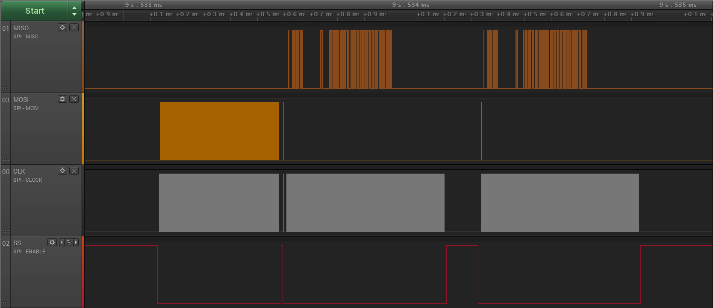
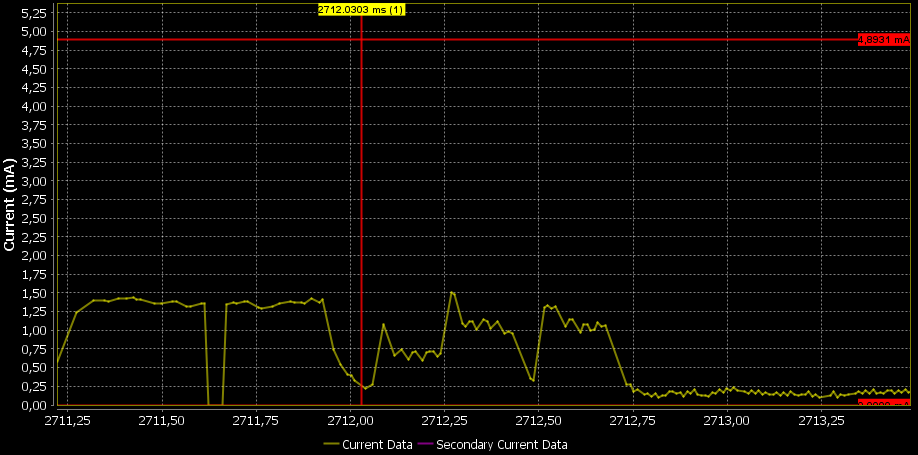

# DMA example using SPI

---

## Example description

This example project demonstrates how to use DMA with the SPI peripheral.
All example functions are in the *SPI\_DMA.c* file, the demo function is executed on startup.

There are three important functions in the *SPI\_DMA.c* file. *spi_transmit*, *spi_receive* and *spi_tranceive*.
All three functions set up the required DMA registers for their respective tasks. 

The general flow of a DMA transfer is as follows:
- Set up the source and destination address registers.
- Set the length of the transfer.
	- Optionally set the amount of transfers until an interrupt is generated.
- Configure the data request mux for the correct peripheral.
- Prepare the DMA channels for the transfer, configure the bus width, turn on DREQ\_MODE\(data request mode\) and finally set the DMA\_ON bit.
- Initiate the transfer by doing the first transaction by hand, usually the *spi\_access\(\)* function.
	
The parameters of the demo can be tweaked to test different transfer sizes and sending methods. This can be found in *user\_config.h*
	
## HW and SW configuration

**Hardware configuration**

  - This example runs on the DA14585/DA14586 Bluetooth Smart devices.
  - The basic/pro development kit is needed for this example.

 **Software configuration**

- This example requires:
  - Keil µVision 5
  - SDK6.0.10
  - **SEGGER’s J-Link** tools should be downloaded and installed.

## How to run the example

### Initial Setup

- Configure the development kit for SPI, the correct jumper positions are printed on the board
  - Optional, connect a logic analyzer to the SPI bus.
  
 
  
- Compile the code and start debugging in Keil µVision 5

The resulting SPI transactions look like this:

This demo application will generate a software cursor in the SmartSnippets toolbox power profiler. The cursor will be placed before the transfers,
as is shown below

## Power considerations

The main advantage of the DMA is that the CPU remains free to do other tasks.
This will ultimately result in the device completing its tasks quicker, so it can spend more time in sleep mode.
Transferring data by DMA is approximately 10% slower than transferring via the CPU, this is caused by the lack of fifo support in the DMA controller.
It is also possible to save power by using the DMA for blocking transfers. This will only save power for big transfers (over 190 bytes), due to the time it takes to set up a DMA transfer.

## Known Limitations

- There are No known limitations for this example. But you can check and refer to the following application note for
[known hardware limitations](https://support.dialog-semiconductor.com/system/files/resources/DA1458x-KnownLimitations_2018_02_06.pdf "known hardware limitations").
- Dialog Software [Forum link](https://support.dialog-semiconductor.com/forums).
- you can Refer also for the Troubleshooting section in the DA1585x Getting Started with the Development Kit UM-B-049.

## License

**************************************************************************************

 Copyright (C) 2018 Dialog Semiconductor. This computer program or computer programs included in this package ("Software") include confidential, proprietary information of Dialog Semiconductor. All Rights Reserved.
 
 THIS SOFTWARE IS AN UNOFFICIAL RELEASE FROM DIALOG SEMICONDUCTOR (‘DIALOG’) AND MAY ONLY BE USED BY RECIPIENT AT ITS OWN RISK AND WITHOUT SUPPORT OF ANY KIND.  THIS SOFTWARE IS SOLELY FOR USE ON AUTHORIZED DIALOG PRODUCTS AND PLATFORMS.  RECIPIENT SHALL NOT TRANSMIT ANY SOFTWARE SOURCE CODE TO ANY THIRD PARTY WITHOUT DIALOG’S PRIOR WRITTEN PERMISSION.
 
 UNLESS SET FORTH IN A SEPARATE AGREEMENT, RECIPIENT ACKNOWLEDGES AND UNDERSTANDS THAT TO THE FULLEST EXTENT PERMITTED BY LAW, THE SOFTWARE IS DELIVERED “AS IS”, WITHOUT WARRANTIES OR CONDITIONS OF ANY KIND, EITHER EXPRESS OR IMPLIED, INCLUDING, BUT NOT LIMITED TO, ANY IMPLIED WARRANTIES OF FITNESS FOR A PARTICULAR PURPOSE, MERCHANTABILITY, TITLE OR NON-INFRINGEMENT, AND ALL WARRANTIES THAT MAY ARISE FROM COURSE OF DEALING, CUSTOM OR USAGE IN TRADE. FOR THE SAKE OF CLARITY, DIALOG AND ITS AFFILIATES AND ITS AND THEIR SUPPLIERS DO NOT WARRANT, GUARANTEE OR MAKE ANY REPRESENTATIONS (A) REGARDING THE USE, OR THE RESULTS OF THE USE, OF THE LICENSED SOFTWARE IN TERMS OF CORRECTNESS, COMPLETENESS, ACCURACY, RELIABILITY OR OTHERWISE, AND (B) THAT THE LICENSED SOFTWARE HAS BEEN TESTED FOR COMPLIANCE WITH ANY REGULATORY OR INDUSTRY STANDARD, INCLUDING, WITHOUT LIMITATION, ANY SUCH STANDARDS PROMULGATED BY THE FCC OR OTHER LIKE AGENCIES.
 
 IN NO EVENT SHALL DIALOG BE LIABLE FOR ANY DIRECT, INDIRECT, INCIDENTAL, SPECIAL, EXEMPLARY, OR CONSEQUENTIAL DAMAGES (INCLUDING, BUT NOT LIMITED TO, PROCUREMENT OF SUBSTITUTE GOODS OR SERVICES; LOSS OF USE, DATA, OR PROFITS; OR BUSINESS INTERRUPTION) HOWEVER CAUSED AND ON ANY THEORY OF LIABILITY, WHETHER IN CONTRACT, STRICT LIABILITY, OR TORT (INCLUDING NEGLIGENCE OR OTHERWISE) ARISING IN ANY WAY OUT OF THE USE OF THIS SOFTWARE, EVEN IF ADVISED OF THE POSSIBILITY OF SUCH DAMAGE.

**************************************************************************************
