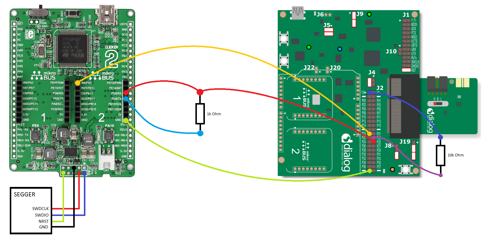
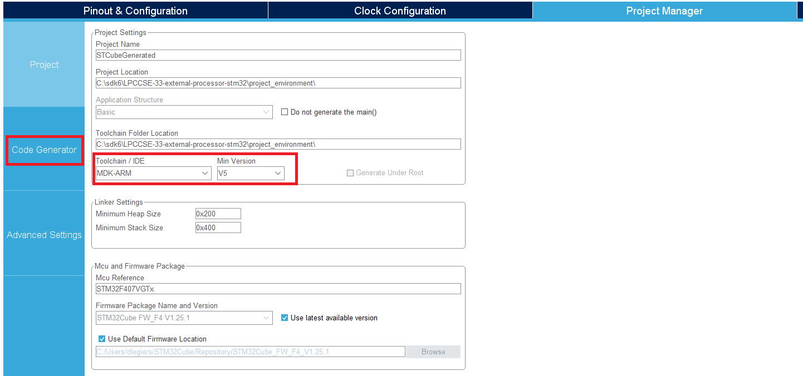
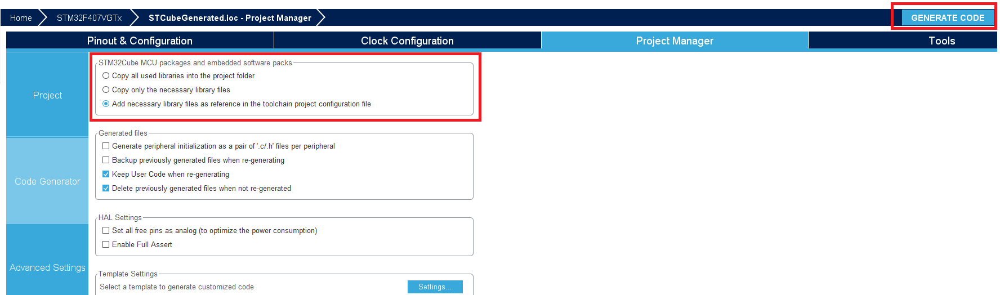
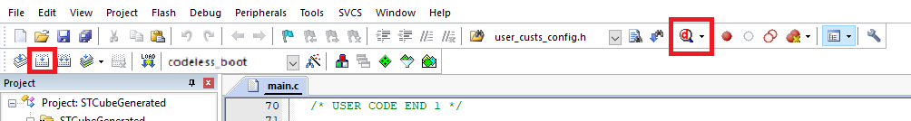
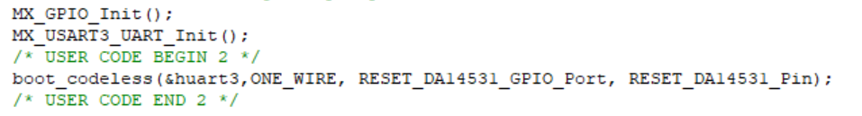
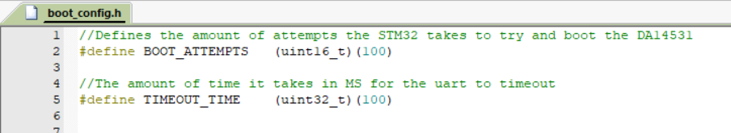


# Booting the DA14531 with Codeless through an STM32

---

## Example description

The expected result of the example can be verified by:

## HW and SW configuration

### Required hardware

- DA14531 daughter board + DA145xxDEVKT-P PRO-Motherboard.
- Clicker 2 for STM32 Developmentboard by MikroE
- J-Link SEGGER

The user manual for the development kits can be found:

- [here](https://www.dialog-semiconductor.com/products/da14531-development-kit-pro) for the DA145xxDEVKT-P PRO-Motherboard.

### General Hardware configuration using the DA145xxDEVKT-P PRO-Motherboard and Clicker 2 for STM32

- Connect the DA145xxDEVKT-P PRO-Motherboard to the working station through USB1 connector (only needed for power).
- Connect the J-Link Segger to the Clicker 2 for STM32 using the ARM-debug wiring
- Connect the Clicker 2 for STM32 to the PRO-Motherboard:
  
  * Clicker 2 pins PD8 and PD9 together with a 1k resistor
  * Clicker 2 pin PD9 to pin P25 on the PRO-Motherboard
  * Clicker 2 pin PA3 to pin P20 on the PRO-Motherboard
  * Add a 10k pullup resistor to pin P23 on the PRO-Motherboard

### Software configuration

**This example requires:**

- Keil 5
- **STM32CubeMX** should be downloaded and installed
- **SEGGER’s J-Link** tools should be downloaded and installed.
- BLE scanner for your smartphone

**Running the code**

Open the project_environment folder and locate the codeless_boot.ioc file. Open this file in STM32CubeMX and once it is opened click on **Pinout & Configuration**.
This window should look like this:

If the pinout is configured incorrectly then configure pins PD8 and PD9 as asynchronous usart3 and pin PA3 as GPIO_OUTPUT. When it is set correctly go to the screen **Project Manager**
The following settings should be configured like the picture bellow:

- Toolchain/IDE
- Min Version

when the project settings are configured click on **Code Generator** on the left side of the screen.
In this screen make sure that **STM32Cube MCU packages and embedded software packs** is set to **Add  necessary library as reference in the toolchain project configuration file**
After that click on the **Generate Code** button. On the prompt to open the project click **Open Project**.

Once the project has opened in Keil click the **Options for target...** Button. In this screen goto Debug and set the debugger to **J-LINK / J-TRACE Cortex**
after that click on the **Settings** Button. Within this screen select the J-link module that is connected and set the **Port:** to **SW**. Save these settings.

After all the settings have been set the project can be build. Press the **Build** button or the **F7** key to start building the project.
When the build is done press the **Start/Stop Debug Session** button or the key combination **Ctrl + F5** to load to program into the STM32.

In the debug screen press the **Run** button or the **F5** key to start the program and the boot process should start.

## Expected Result

After about 5 seconds when the run button is pressed the DA14531 should start advertising itself as **CLv2**.

## Code settings

There are settings wihtin the code that can be changed if needed. The first one being which interface to use,
either 1 wire UART or 2 wire UART can be chosen as a parameter of the boot functions.

The second one being, which version of Codeless to boot the DA14531 with. This settings can be found in the **codeless_config.h** file. At the moment the three versions of Codeless are **Standalones 1, Standalone 2 and Datapump**. The other settings in this file are the attempt amount to boot and the timeout time of uart communication. The boot attempts are the amount of tries the STM32 takes to boot codeless. The timeout time specifies the amount of time in milliseconds how long the STM32 waits for a response from the DA14531.

## Known Limitations

- Refer to the following application note for DA14531 known [hardware limitations](https://www.dialog-semiconductor.com/da14531_HW_Limitation)
- Also refer to Dialog Software [Forum Link](https://support.dialog-semiconductor.com/forum)

## License

**************************************************************************************

 Copyright (c) 2019 Dialog Semiconductor. All rights reserved.

 This software ("Software") is owned by Dialog Semiconductor. By using this Software
 you agree that Dialog Semiconductor retains all intellectual property and proprietary
 rights in and to this Software and any use, reproduction, disclosure or distribution
 of the Software without express written permission or a license agreement from Dialog
 Semiconductor is strictly prohibited. This Software is solely for use on or in
 conjunction with Dialog Semiconductor products.

 EXCEPT AS OTHERWISE PROVIDED IN A LICENSE AGREEMENT BETWEEN THE PARTIES OR AS
 REQUIRED BY LAW, THE SOFTWARE IS PROVIDED "AS IS", WITHOUT WARRANTY OF ANY KIND,
 EXPRESS OR IMPLIED, INCLUDING BUT NOT LIMITED TO THE WARRANTIES OF MERCHANTABILITY,
 FITNESS FOR A PARTICULAR PURPOSE AND NON-INFRINGEMENT. EXCEPT AS OTHERWISE PROVIDED
 IN A LICENSE AGREEMENT BETWEEN THE PARTIES OR BY LAW, IN NO EVENT SHALL DIALOG
 SEMICONDUCTOR BE LIABLE FOR ANY DIRECT, SPECIAL, INDIRECT, INCIDENTAL, OR
 CONSEQUENTIAL DAMAGES, OR ANY DAMAGES WHATSOEVER RESULTING FROM LOSS OF USE, DATA OR
 PROFITS, WHETHER IN AN ACTION OF CONTRACT, NEGLIGENCE OR OTHER TORTIOUS ACTION,
 ARISING OUT OF OR IN CONNECTION WITH THE USE OR PERFORMANCE OF THE SOFTWARE.

**************************************************************************************
