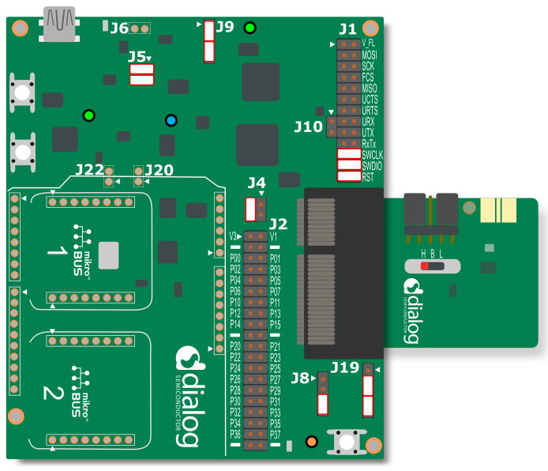
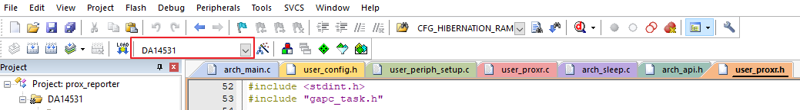
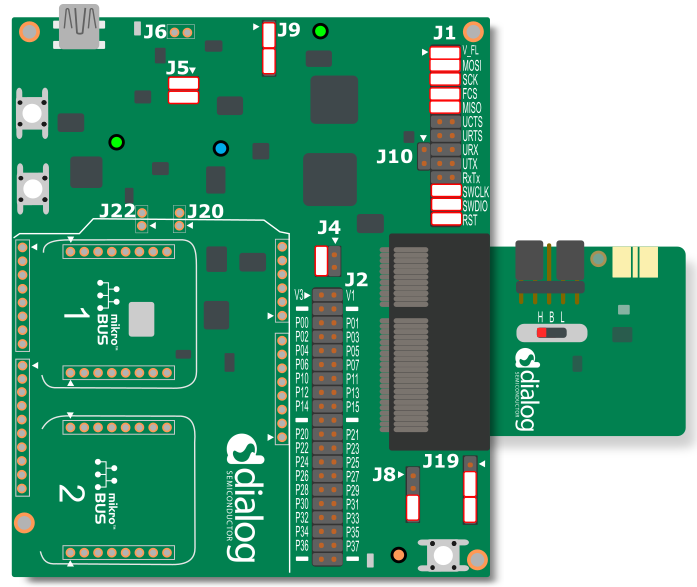
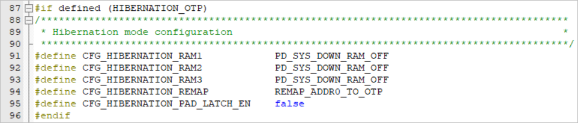


# Configuring DA14531 hibernation mode

---


## Example description

- Using the proximity reporter as the base project, the device advertises until the advertisement timeout occurs during which it is in extended sleep.
- After the timeout, the device enters hibernation mode
- P0_5 on the motherboard is used to wake up the device from hibernation to active state and it continues to advertise until the adv_timeout
- On wake-up the address 0 is remapped to either OTP or ROM or SysRAM depending on how the device is programmed to wake-up. 

The expected result of the example can be verified by:
- Connecting the motherboard to the desktop/laptop and observing the power profile in SmartSnippets Studio.

## HW and SW configuration

This example runs on the BLE Smart SoC (System on Chip) devices:
- DA14531 daughter board + DA145xxDEVKT-P PRO-Motherboard.
	
The user manuals for the development kits can be found:
- [here](https://www.dialog-semiconductor.com/products/da14531-development-kit-pro) for the DA145xxDEVKT-P PRO-Motherboard.

To run the program from flash or OTP, please visit chapter 11 of the [SmartSnippets Toolbox User Manual](http://lpccs-docs.dialog-semiconductor.com/SmartSnippetsToolbox5.0.8_UM/index.html )

* **General Hardware configuration DA14531 using DA145xxDEVKT-P PRO-Motherboard**

	- The general hardware configuration remains the same for the 3 use-cases here. Only for the SPI Flash use-case we need additional jumper settings.
	- Connect the DA145xxDEVKT-P PRO-Motherboard to the working station through USB1 connector. 

	
	
* **Software configuration**

	- This example requires:
	* SmartSnippets Toolbox v5.0.10
    * [SDK6.0.12](https://www.dialog-semiconductor.com/da14531_sdk_latest)
	* Keil5
	- **SEGGER’s J-Link** tools should be downloaded and installed.

## How to run the example
### Setup
Before launching the Keil project, make sure to link the SDK and project environment using the Python linker script `dlg_make_keil_vx.xxx`. More information [here](https://www.dialog-semiconductor.com/sites/default/files/sw-example-da145x-example-setup.pdf).
1. Start Keil using the `prox_reporter.uvprojx` Keil project file.
 
2. Expand the dialog shown in the red box in the image below.



3. Select the device: DA14531

4. Compile (F7) the program

Now we can start implementing the use-cases for hibernation mode. 

## Use-case

To demonstrate the hibernation example there are three use-cases which mainly depends on where the booting is from:
1. SPI Flash (address 0 remap to ROM)
2. OTP (address 0 remap to OTP) 
3. SysRAM (address 0 remap to SysRAM1)

### Using SPI Flash 

To enter the hibernation after booting from SPI Flash, the following software modification needs to be done. 

1. In Keil, Project explorer, open the *user_proxr.h*

2. In the defines, define CFG_APP_GOTO_HIBERNATION to select the hibernation sleep mode and also define HIBERNATION_SPI and undefine the others,

```
#if defined (__DA14531__)
	#define CFG_APP_GOTO_HIBERNATION
	
	#define HIBERNATION_SPI
	#undef HIBERNATION_OTP
	#undef HIBERNATION_SYSRAM
```

3. In the Hibernation mode configuration, this selection switches off all the three RAM blocks and remap the address 0 to ROM as shown below, 


4. In *user_periph_setup.h* file configure the GPIO that would be used to wake-up the device from hibernation mode. In our case we have chosen P0_5 as the wake-up GPIO. 

```
/****************************************************************************************/
/* Wake-up from hibernation configuration                                               */
/****************************************************************************************/
#if defined (__DA14531__) 
    #define HIB_WAKE_UP_PORT        GPIO_PORT_0
    #define HIB_WAKE_UP_PIN         GPIO_PIN_5
    #define HIB_WAKE_UP_PIN_MASK    (1 << HIB_WAKE_UP_PIN)
#endif
```

5. Specify the advertisement period in the *user_config* file,  

```
/*
 ****************************************************************************************
 *
 * Default handlers configuration (applies only for @app_default_handlers.c)
 *
 ****************************************************************************************
 */
static const struct default_handlers_configuration  user_default_hnd_conf = {
    // Configure the advertise operation used by the default handlers
    // Possible values:
    //  - DEF_ADV_FOREVER
    //  - DEF_ADV_WITH_TIMEOUT
    .adv_scenario = DEF_ADV_WITH_TIMEOUT,

    // Configure the advertise period in case of DEF_ADV_WITH_TIMEOUT.
    // It is measured in timer units. Use MS_TO_TIMERUNITS macro to convert
    // from milliseconds (ms) to timer units.
    .advertise_period = MS_TO_TIMERUNITS(18000), //this is for 18s

    // Configure the security start operation of the default handlers
    // if the security is enabled (CFG_APP_SECURITY)
    // Possible values:
    //  - DEF_SEC_REQ_NEVER
    //  - DEF_SEC_REQ_ON_CONNECT
    .security_request_scenario = DEF_SEC_REQ_NEVER
};

```

This will configure the advertising period as 18s after which the device will enter the hibernation mode. To wake-up from hibernation use the P0_5 which was configured before as wake-up GPIO.

6. Save all the changes done in the project and Compile (F7).

7. Program the DA14531 using the compiled hex file and boot from flash. To do this, please refer to chatper 13 SPI Flash Programmer in the [SmartSnippets Toolbox User Manual](http://lpccs-docs.dialog-semiconductor.com/SmartSnippetsToolbox5.0.8_UM/index.html ).
	


### using OTP 

The process is the same as using SPI as we have seen in the previous section, except we define the HIBERNATION_OTP and undefine the rest, 

```
#if defined (__DA14531__)
	#define CFG_APP_GOTO_HIBERNATION
	
	#undef HIBERNATION_SPI
	#define HIBERNATION_OTP
	#undef HIBERNATION_SYSRAM
```

This would define the configuration of Hibernation mode to remap the address 0 to OTP while booting. 



After doing this, repeat the steps from 4 - 7. In order to program the OTP and boot from OTP, please refer to chapter 12 OTP programmer in the [SmartSnippets Toolbox User Manual](http://lpccs-docs.dialog-semiconductor.com/SmartSnippetsToolbox5.0.8_UM/index.html ).


### Using SysRAM1

The process is the same as mentioned in previous section, again, except we define the HIBERNATION_SYSRAM and undefine the rest, 

```
#if defined (__DA14531__)
	#define CFG_APP_GOTO_HIBERNATION
	
	#undef HIBERNATION_SPI
	#undef HIBERNATION_OTP
	#define HIBERNATION_SYSRAM
```

This would define the configuration of Hibernation mode to remap the address 0 to SysRAM1 while booting. Also since we are running it from SysRAM we need to retain the retention memory blocks. 


After doing this, repeat the steps from 4 - 6. In order to program the OTP and boot from OTP, please refer to chapter 8 Booter in the [SmartSnippets Toolbox User Manual](http://lpccs-docs.dialog-semiconductor.com/SmartSnippetsToolbox5.0.8_UM/index.html ).

## Expected Result

### DA14531 with DA145xxDEVKT-P PRO-Motherboard
1. Open the Power Profiler in the SmartSnippets Toolbox. please refer to chapter 10 Power Profiler in the [SmartSnippets Toolbox User Manual](http://lpccs-docs.dialog-semiconductor.com/SmartSnippetsToolbox5.0.8_UM/index.html ). 

2. After running the program either from SysRAM, Flash or OTP, the device advertises for 18s and enters the hibernation mode. On wake-up (using the P0_5) the device advertises again. 


3. End of example.		


## License


**************************************************************************************

 Copyright (c) 2019 Dialog Semiconductor. All rights reserved.

 This software ("Software") is owned by Dialog Semiconductor. By using this Software
 you agree that Dialog Semiconductor retains all intellectual property and proprietary
 rights in and to this Software and any use, reproduction, disclosure or distribution
 of the Software without express written permission or a license agreement from Dialog
 Semiconductor is strictly prohibited. This Software is solely for use on or in
 conjunction with Dialog Semiconductor products.

 EXCEPT AS OTHERWISE PROVIDED IN A LICENSE AGREEMENT BETWEEN THE PARTIES OR AS
 REQUIRED BY LAW, THE SOFTWARE IS PROVIDED "AS IS", WITHOUT WARRANTY OF ANY KIND,
 EXPRESS OR IMPLIED, INCLUDING BUT NOT LIMITED TO THE WARRANTIES OF MERCHANTABILITY,
 FITNESS FOR A PARTICULAR PURPOSE AND NON-INFRINGEMENT. EXCEPT AS OTHERWISE PROVIDED
 IN A LICENSE AGREEMENT BETWEEN THE PARTIES OR BY LAW, IN NO EVENT SHALL DIALOG
 SEMICONDUCTOR BE LIABLE FOR ANY DIRECT, SPECIAL, INDIRECT, INCIDENTAL, OR
 CONSEQUENTIAL DAMAGES, OR ANY DAMAGES WHATSOEVER RESULTING FROM LOSS OF USE, DATA OR
 PROFITS, WHETHER IN AN ACTION OF CONTRACT, NEGLIGENCE OR OTHER TORTIOUS ACTION,
 ARISING OUT OF OR IN CONNECTION WITH THE USE OR PERFORMANCE OF THE SOFTWARE.

**************************************************************************************
