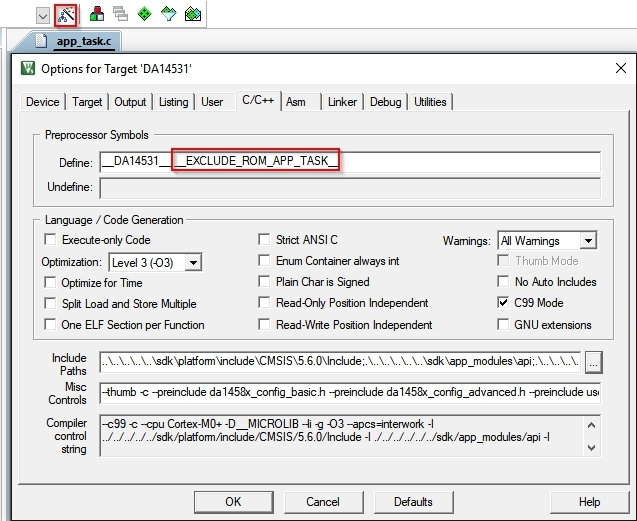
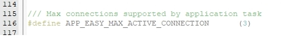
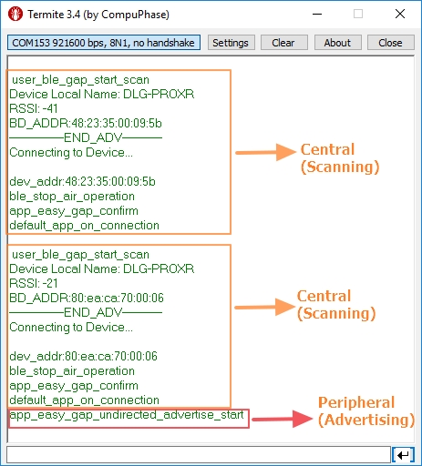

# Multirole Example

## Example Description

The example demonstrates the capabilities of the DA14531 as a Central and a peripheral i.e. scan and advertise role. 
The project works as a Central connecting to 2 peripherals, and once connected, it advertises so another central can connect to it.

**Note**: This project assumes that the 2 peripherals will stay connected to the DA14531 central. 

## HW setup
 - 3 DA14531 Pro kit with Module/Daugherboard connected to host computer via USB and an android or iPhone.
 - For Central, extra jumpers are required for the UART to see the communication logs. Use fly wires from **J1_TxD to P26**.
 
 
 
 The user manuals for the development kits can be found [here](https://www.dialog-semiconductor.com/products/da14531-development-kit-pro) for the DA145xxDEVKT-P PRO-Motherboard.

## SW setup 

 - SDK 6.0.14.1112 
 - SmartSnippets Toolbox 5.0.14.3038 
 - a terminal for UART logs (teraterm, termite, etc..)
 
## How to run the example

1. Download Prox_reporter binaries (binaries are available in the binaries folder of the SDK) to 2 DA14531 devices (as explained [here](http://lpccs-docs.dialog-semiconductor.com/UM-B-083/getting_started/getting_started.html)). Verify with an Android device that they have all started advertising

2. Use the python script (in the Multirole project folder) to link the SDK path to the example. More information [here](http://lpccs-docs.dialog-semiconductor.com/Software_Example_Setup/index.html)

3. Using Keil IDE, open the multirole project. 

4. To be able to overide the default functions of the SDK the __ EXCLUDE_ROM_APP_TASK __ should be defined in the C/C++ tab in the "options for target" in keil, like so,

	
	

5. On the project explorer, navigate to "app.h" and modify it to support 3 connections, like so, 

	
	
	
6. Open File explorer on your computer, navigate to the project, like so, 

	`C:\......\6.0.14.1112\sdk\common_project_files\misc`
	
	in the misc folder, open da14531_symbols in a text editor, and comment out the __EXCLUDE_ROM_APP_TASK__ parts. Use a semi-colon (";") to comment out.
	
	
	
	
7. Build and compile the project.		

8. Download the binary to another DA14531 device (use SS toolbox). 

**Note**: Use any android/iPhone BLE scanner to connect/disconnect to/from the DA14531.

## Use-cases from the example

For the ease of understanding, following notations are used. 

* C0/P0 -> DA14531 central/peripheral
* P1,P2 -> DA14531 peripheral 
* C1 -> Phone central

**Use case 1:** The flow of this use-case is mentioned below. Basically the central starts to scan first, then two peripherals start to advertise and get connected to the central. 

<ins>Connection</ins>
- First C0 starts to scan
- P1 advertises and gets connected
- P2 advertises and gets connected
- P0 advertises
- C1 connects to P0 

<ins>Disconnection<ins>
- C1 disconnects
- P0 advertises
- C1 connects to P0 again

**Note**: While using iPhone, if you wish to disconnect from DA14531 device, please check the iPhone bluetooth settings as the phone might have to be disconnected from there. 
For Android, you can use any BLE scanner app to connect and disconnect.

**Use case 2:** The flow of this use-case is mentioned below. Basically the peripherals starts to advertise first and then the Central starts scan process, and it finds and connectes to 2 peripherals. 

<ins>Connection<ins>
- P1 is advertising
- P2 is advertising
- C0 starts to scan, finds P1 and P2 and connects
- P0 advertises
- C1 connects to P0

<ins>Disconnection<ins>
- C1 disconnects
- P0 advertises
- C1 connects to P0 again

This can be verified in the UART logs.

**Note**: UART terminal: 921600, no flow control

## Troubleshooting

- Try a different USB1 cable.

- Try different jumper wires, if used.

- Verify using any BLE scanner that the 2 peripherals are advertising before attempting connection. 

- If none of the above helps, please check with the customer support team who would be glad to provide you the solution.

## License

**************************************************************************************

 Copyright (c) 2020 Dialog Semiconductor. All rights reserved.

 This software ("Software") is owned by Dialog Semiconductor. By using this Software
 you agree that Dialog Semiconductor retains all intellectual property and proprietary
 rights in and to this Software and any use, reproduction, disclosure or distribution
 of the Software without express written permission or a license agreement from Dialog
 Semiconductor is strictly prohibited. This Software is solely for use on or in
 conjunction with Dialog Semiconductor products.

 EXCEPT AS OTHERWISE PROVIDED IN A LICENSE AGREEMENT BETWEEN THE PARTIES OR AS
 REQUIRED BY LAW, THE SOFTWARE IS PROVIDED "AS IS", WITHOUT WARRANTY OF ANY KIND,
 EXPRESS OR IMPLIED, INCLUDING BUT NOT LIMITED TO THE WARRANTIES OF MERCHANTABILITY,
 FITNESS FOR A PARTICULAR PURPOSE AND NON-INFRINGEMENT. EXCEPT AS OTHERWISE PROVIDED
 IN A LICENSE AGREEMENT BETWEEN THE PARTIES OR BY LAW, IN NO EVENT SHALL DIALOG
 SEMICONDUCTOR BE LIABLE FOR ANY DIRECT, SPECIAL, INDIRECT, INCIDENTAL, OR
 CONSEQUENTIAL DAMAGES, OR ANY DAMAGES WHATSOEVER RESULTING FROM LOSS OF USE, DATA OR
 PROFITS, WHETHER IN AN ACTION OF CONTRACT, NEGLIGENCE OR OTHER TORTIOUS ACTION,
 ARISING OUT OF OR IN CONNECTION WITH THE USE OR PERFORMANCE OF THE SOFTWARE.

**************************************************************************************