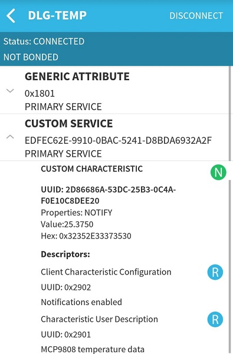

# DA14585/DA14586 Reading out an I2C temperature sensor and sending notification data

---

## Example description

This SDK6 DA14585 example shows how to communicate with an I2C temperature sensor.
The sensor data gets sent over BLE with a notification. 

## HW and SW configuration

### Hardware configuration

- This example runs on The DA14585/DA14586 Bluetooth Smart SoC devices.
- The Basic or pro Development kit is needed for this example.
- Connect the SCL pin of the MCP9808 to pin 0-7 of the development board.
- Connect the SDA pin of the MCP9808 to pin 1-2 of the development board.
  - These pins are defined in the MCP9808.h file
- Connect the USB Development kit to the host computer.

### Software configuration

- This example requires:
    - SDK6.0.10
	- A smartphone with a BLE scanning app (for example BLE scanner on Android or Lightblue on IOS)
	- **SEGGER’s J-Link** tools should be downloaded and installed.

## How to run the example

For initial setup of the example please refer to [this section of the dialog support portal](https://support.dialog-semiconductor.com/resource/da1458x-example-setup).

### Compile and run

- Open the project in Keil µVision 5
  - Optionally, change the parameters in MCP9808.h
- Compile and run the project
- Open the BLE scanner app and look for DLG-TEMP
- Connect to the device
- Subscribe to the notification

If everything went well, you should be able to receive temperature data as the value of the custom characteristic. As shown below:

## How it works

Tutorial 3 on the [Dialog Semiconductor support](https://support.dialog-semiconductor.com) website shows how to make your own custom profile.
The *user_catch_rest_hndl* function in user_temperaturereporter.c will handle the messages for our custom profile.
This application only has one possible custom action: a write to the notification. When this occurs the *user_svc1_temperature_wr_ntf_handler* function is called.
This function will check the contents of the write. If the content of the write equals zero, the temperature timer is canceled.
If the value is anything else, the *user_svc1_temperature_send_ntf* function is called. This function will read out the sensor data and convert it to a string(for demo purposes).
The string will be placed in a message, along with some other parameters, like the connection ID and the characteristic handle.
After the message is sent, the *app_easy_timer* function is used to schedule the next call to the *user_svc1_temperature_send_ntf* function. This will ensure the temperature is transmitted regularly.
The *app_easy_timer* function has a resolution of 10ms hence we divide the desired delay in ms by 10.

## Known Limitations

- There are No known limitations for this example. But you can check and refer to the following application note for
[known hardware limitations](https://support.dialog-semiconductor.com/system/files/resources/DA1458x-KnownLimitations_2018_02_06.pdf "known hardware limitations").
- Dialog Software [Forum link](https://support.dialog-semiconductor.com/forums).
- you can Refer also for the Troubleshooting section in the DA1585x Getting Started with the Development Kit UM-B-049.

## License

**************************************************************************************

 Copyright (c) 2018 Dialog Semiconductor. All rights reserved.

 This software ("Software") is owned by Dialog Semiconductor. By using this Software
 you agree that Dialog Semiconductor retains all intellectual property and proprietary
 rights in and to this Software and any use, reproduction, disclosure or distribution
 of the Software without express written permission or a license agreement from Dialog
 Semiconductor is strictly prohibited. This Software is solely for use on or in
 conjunction with Dialog Semiconductor products.

 EXCEPT AS OTHERWISE PROVIDED IN A LICENSE AGREEMENT BETWEEN THE PARTIES OR AS
 REQUIRED BY LAW, THE SOFTWARE IS PROVIDED "AS IS", WITHOUT WARRANTY OF ANY KIND,
 EXPRESS OR IMPLIED, INCLUDING BUT NOT LIMITED TO THE WARRANTIES OF MERCHANTABILITY,
 FITNESS FOR A PARTICULAR PURPOSE AND NON-INFRINGEMENT. EXCEPT AS OTHERWISE PROVIDED
 IN A LICENSE AGREEMENT BETWEEN THE PARTIES OR BY LAW, IN NO EVENT SHALL DIALOG
 SEMICONDUCTOR BE LIABLE FOR ANY DIRECT, SPECIAL, INDIRECT, INCIDENTAL, OR
 CONSEQUENTIAL DAMAGES, OR ANY DAMAGES WHATSOEVER RESULTING FROM LOSS OF USE, DATA OR
 PROFITS, WHETHER IN AN ACTION OF CONTRACT, NEGLIGENCE OR OTHER TORTIOUS ACTION,
 ARISING OUT OF OR IN CONNECTION WITH THE USE OR PERFORMANCE OF THE SOFTWARE.

**************************************************************************************
