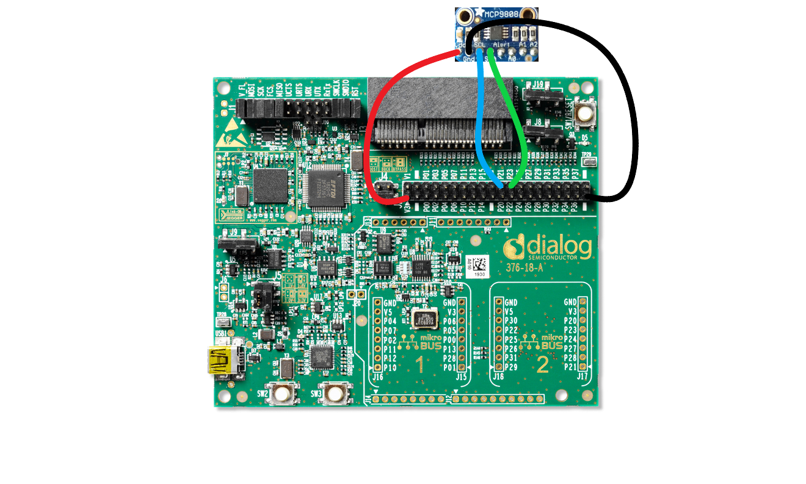

# DA14585/DA14586/DA14531 Peripheral BLE- MCP9808 Temperature sensor BLE notifications

---

## Example description

This SDK6 example shows how to use I2C to read the temperature data and send the temperature data via BLE notifications.

## HW and SW configuration

	-This example runs on The DA14585,DA14586 and the 14531 Bluetooth Smart SoC devices.	
	-The Basic / Pro Development kit is needed for this example.

* **Hardware configuration**
Hardware configurations are the same for all daughterboards.
	- Connect MCP9808 SCL to to J2 pin 24 (P23)
	- Connect MCP9808 SDA to to J2 pin 22 (P21)
	These pins are defined in user_periph_setup.h
	- Connect MCP9808 VDD to to J2 pin 1 (V3)
	- Connect MCP9808 GND to to J2 pin 39
	- Make sure the jumpers are set as shown in the image below
	- Connect the USB Development kit to the host computer
	The image below shows the Motherboard with jumper (wire) configuration

		

* **Software configuration**

	- This example requires:
    * Smartsnippets Studio 1.6.3.
    * SDK6.0.10
	- **SEGGER’s J-Link** tools should be downloaded and installed.

## How to run the example

For initial setup of the example please refer to [this section of the dialog support portal](https://support.dialog-semiconductor.com/resource/da1458x-example-setup).

### Initial Setup

 - Open the project in Keil µVision 5 
 - Select your device in the red box shown below (DA14585, DA14586 or DA14531)

 - (optionally) Parameters can be changed in MCP9808.h
 - (optionally) In user_periph_setup.h I2C configuration can be changed, I2C pins included.
 - Compile and launch the example
 - Open "BLE Scanner", this app can be found in the play store, and look for "DLG-TEMP"

If everything went well, you should be able to receive temperature data as the value of the custom characteristic, as shown in the image below:

	

## How it works

Tutorial 3 on the [Dialog Semiconductor support](https://www.dialog-semiconductor.com/sites/default/files/training_03_custom_profile_gatt_cmd_example_v1.2.pdf) website shows how to make your own custom profile. The **user_catch_rest_hndl** function in user_peripheral.c will handle the messages for our custom profile. This application only has one possible 
custom action: a write to the notification. When this occurs the **user_temperature_message_handler** function is called. This function will check the contents of the write. If the content of the write equals zero, the temperature timer is canceled. If the value is 
anything else, a timer is generated that calls **user_send_temperature_ntf** after NOTIFICATION_DELAY ms. **user_send_temperature_ntf** will read out the sensor data and convert it to a string(for demo purposes). The string will be placed in a message, along with some other parameters, like the connection ID
and the characteristic handle. After the message is sent, the app_easy_timer function is used to schedule the next call to the **user_send_temperature_ntf** function. This will ensure the temperature is transmitted regularly. The app_easy_timer function
has a resolution of 10ms hence we divide the desired delay in ms by 10.

## Known Limitations

- There are No known limitations for this example. But you can check and refer to the following application note for
[known hardware limitations](https://support.dialog-semiconductor.com/system/files/resources/DA1458x-KnownLimitations_2018_02_06.pdf "known hardware limitations").
- Dialog Software [Forum link](https://support.dialog-semiconductor.com/forums).
- you can Refer also for the Troubleshooting section in the DA14585x or DA14531 Getting Started with the Development Kit UM-B-049.

## License

**************************************************************************************

 Copyright (c) 2019 Dialog Semiconductor. All rights reserved.

 This software ("Software") is owned by Dialog Semiconductor. By using this Software
 you agree that Dialog Semiconductor retains all intellectual property and proprietary
 rights in and to this Software and any use, reproduction, disclosure or distribution
 of the Software without express written permission or a license agreement from Dialog
 Semiconductor is strictly prohibited. This Software is solely for use on or in
 conjunction with Dialog Semiconductor products.

 EXCEPT AS OTHERWISE PROVIDED IN A LICENSE AGREEMENT BETWEEN THE PARTIES OR AS
 REQUIRED BY LAW, THE SOFTWARE IS PROVIDED "AS IS", WITHOUT WARRANTY OF ANY KIND,
 EXPRESS OR IMPLIED, INCLUDING BUT NOT LIMITED TO THE WARRANTIES OF MERCHANTABILITY,
 FITNESS FOR A PARTICULAR PURPOSE AND NON-INFRINGEMENT. EXCEPT AS OTHERWISE PROVIDED
 IN A LICENSE AGREEMENT BETWEEN THE PARTIES OR BY LAW, IN NO EVENT SHALL DIALOG
 SEMICONDUCTOR BE LIABLE FOR ANY DIRECT, SPECIAL, INDIRECT, INCIDENTAL, OR
 CONSEQUENTIAL DAMAGES, OR ANY DAMAGES WHATSOEVER RESULTING FROM LOSS OF USE, DATA OR
 PROFITS, WHETHER IN AN ACTION OF CONTRACT, NEGLIGENCE OR OTHER TORTIOUS ACTION,
 ARISING OUT OF OR IN CONNECTION WITH THE USE OR PERFORMANCE OF THE SOFTWARE.

**************************************************************************************
