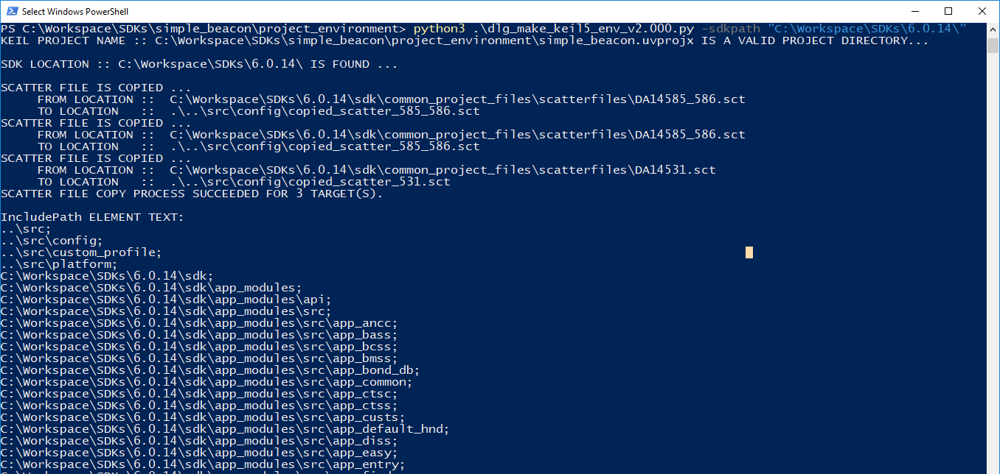
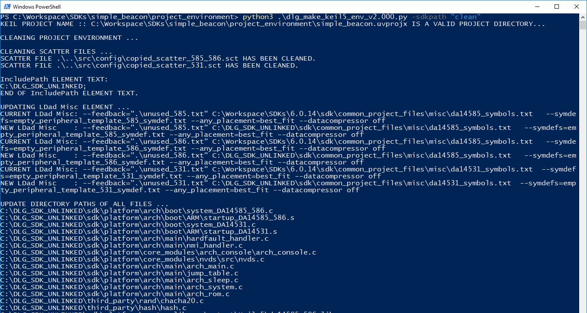

# Smartbond SDK6 Application Examples

This is the repository storing example for the [DA145xx family](https://www.dialog-semiconductor.com/products/bluetooth-low-energy/da14530-and-da14531).

For information about the DA145xx platform and how to bring up your development kit, please refer to the [Getting started User Manual](http://lpccs-docs.dialog-semiconductor.com/UM-B-117-DA14531-Getting-Started-With-The-Pro-Development-Kit/index.html)

## Example usage
<br/>
To run any of these SW examples, the user needs:

- DA14531/DA14585/DA14586 hardware.
- Keil µvision.
- Dialog SDK 6.0.14 available
- Python script

<br/>
Begin by cloning this repository locally and then link the SW example to the SDK. Below is the description on how to use the python script to link the SDK and the SW example, and to clean the SW example project environment (remove absolute paths).


**Note**: _It is highly recommended the user creates files that are added in the *src* folder of the SW example. By default, the Python script does not process user files located outside the *src* folder. You are free to create any folder under the *src* user space. You need to make sure the new folder path under *src* is added in the Keil project as a relative path._


<br/>

### <ins> Linking the project environment and the Dialog 6.0.14 SDK </ins>

<br/>

**Note**: _Linking the SW example project environment and Dialog 6.0.14 SDK adds absolute file paths to files in your SW example project environment path containing information about your system’s folder structure. The Python script also supports cleaning these absolute file paths. See “Cleaning the project environment”._

<br/>

Below are the steps to link the SW example project environment to the 6.0.14 SDK.

1. Python 2.7 or higher is required to run the small example environment generation script.
Python can be downloaded from [Python.org](http://python.org).

2. Navigate to the main page of the github SDK6 examples repository and download the SW example. You can do so by clicking on "Code" and selecting "Download Zip", or use the HTTPS or SSH to clone the repository to your local.

3. Extract the zip file.

4. Open a terminal and run:

    ```console
    > cd <example folder>/project_environment
    > python dlg_make_keil5_env_v2.000.py -sdkpath “<path to your sdk repository>”
    ```

    For instance:
    ```console
    > python dlg_make_keil5_env_v2.000.py -sdkpath “C:\dev\6.0.14”
    ```

5. The script should indicate successful execution, as shown below, 



<br/>

### <ins> Cleaning the project environment </ins>

<br/>

Linking the project adds absolute paths to the project files, pointing them to the 6.0.14 SDK. The clean functionality removes these absolute paths.
Since absolute paths contain intermediate directory names, the clean command makes sure these intermediate directories are not shared with internal and external application users.

Example: After linking, `C:\Users\Your_name\Upcoming_project\Keil_5` reveals the user’s name and the name of the project the user is working on.
Below are the steps to clean the SW example project environment.

<br/>

1. Python 2.7 or higher is required to run the small example environment generation script.
Python can be downloaded from [Python.org](http://python.org).

2. Navigate to the main page of the github SDK6 examples repository and download the SW example. You can do so by clicking on "Code" and selecting "Download Zip", or use the HTTPS or SSH to clone the repository to your local.

3. Extract the zip file.

4. Open a terminal and run:

    ```console
    > cd <example folder>/project_environment
    > python dlg_make_keil5_env_v2.000.py -sdkpath “clean”
    ```

5. The script should indicate successful execution, as shown below,



<br/>
<br/>

## Example compatibility

Not all the examples will run on the latest version of the SDK6, the tested version is indicated in the Readme. If you find and example that needs porting to the latest version please report it in the issues.