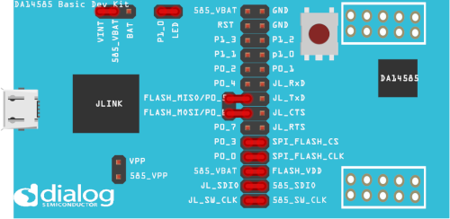
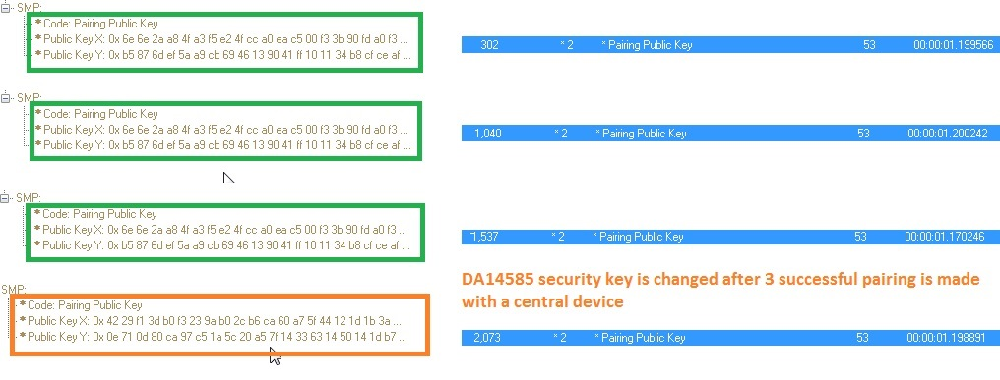

# DA14585/DA14586 BLE Erratum 10734 - security vulnerability

---

## Example description

This SDK6 DA14585 example shows how to send a command
from the applicaiton layer to the BLE STACK to ensure and
update the security key.
As a proof of concept it can be confirmed by analyzing SMP in BLE sniffer log.

## HW and SW configuration

* **Hardware configuration**

	- This example runs on The DA14585/DA14586 Bluetooth Smart SoC devices.
	- The Basic or pro Development kit is needed for this example.
	- Connect the USB Development kit to the host computer.
	- SPI jumper on P00/P03/P05/P06/BATT_SEL

* **Software configuration**

	- This example requires:
    * Smartsnippets Studio 1.6.3.
    * SDK6.0.10
	- **SEGGER’s J-Link** tools should be downloaded and installed.

## How to run the example

For initial setup of the example please refer to [this section of the dialog support portal](https://support.dialog-semiconductor.com/resource/da1458x-example-setup).

### Initial Setup

 - Start Keil
 - Compile and launch the example
 - Open the development kit serial port with the following parameters

		- baudrate: 115200
		- data: 8 bits
		- stop: 1 bit
		- parity: None
		- flow  control: none

As a proof of concept it can be confirmed by analyzing SMP in BLE sniffer log.

## Known Limitations

- There are No known limitations for this example. But you can check and refer to the following application note for
[known hardware limitations](https://support.dialog-semiconductor.com/system/files/resources/DA1458x-KnownLimitations_2018_02_06.pdf "known hardware limitations").
- Dialog Software [Forum link](https://support.dialog-semiconductor.com/forums).
- you can Refer also for the Troubleshooting section in the DA1585x Getting Started with the Development Kit UM-B-049.

## License

**************************************************************************************

 Copyright (c) 2018 Dialog Semiconductor. All rights reserved.

 This software ("Software") is owned by Dialog Semiconductor. By using this Software
 you agree that Dialog Semiconductor retains all intellectual property and proprietary
 rights in and to this Software and any use, reproduction, disclosure or distribution
 of the Software without express written permission or a license agreement from Dialog
 Semiconductor is strictly prohibited. This Software is solely for use on or in
 conjunction with Dialog Semiconductor products.

 EXCEPT AS OTHERWISE PROVIDED IN A LICENSE AGREEMENT BETWEEN THE PARTIES OR AS
 REQUIRED BY LAW, THE SOFTWARE IS PROVIDED "AS IS", WITHOUT WARRANTY OF ANY KIND,
 EXPRESS OR IMPLIED, INCLUDING BUT NOT LIMITED TO THE WARRANTIES OF MERCHANTABILITY,
 FITNESS FOR A PARTICULAR PURPOSE AND NON-INFRINGEMENT. EXCEPT AS OTHERWISE PROVIDED
 IN A LICENSE AGREEMENT BETWEEN THE PARTIES OR BY LAW, IN NO EVENT SHALL DIALOG
 SEMICONDUCTOR BE LIABLE FOR ANY DIRECT, SPECIAL, INDIRECT, INCIDENTAL, OR
 CONSEQUENTIAL DAMAGES, OR ANY DAMAGES WHATSOEVER RESULTING FROM LOSS OF USE, DATA OR
 PROFITS, WHETHER IN AN ACTION OF CONTRACT, NEGLIGENCE OR OTHER TORTIOUS ACTION,
 ARISING OUT OF OR IN CONNECTION WITH THE USE OR PERFORMANCE OF THE SOFTWARE.

**************************************************************************************
