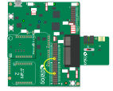
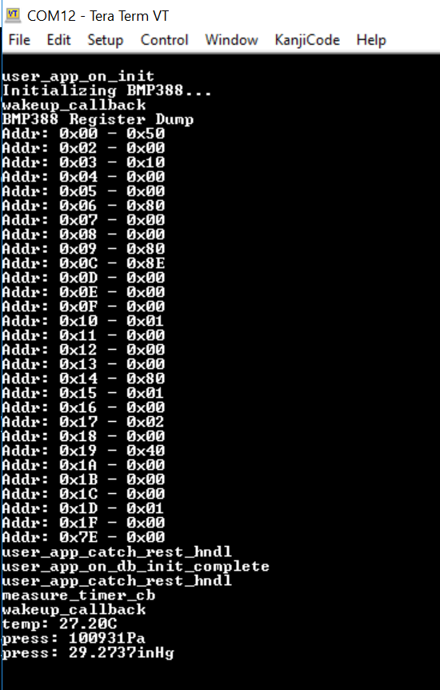
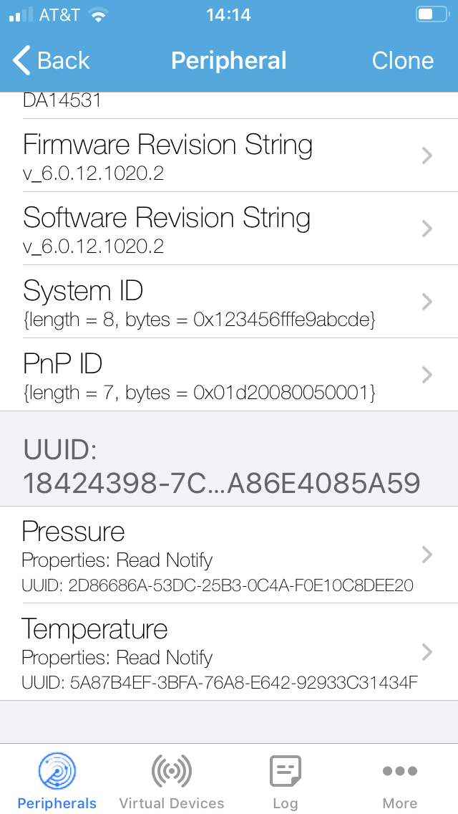

# ble pressure sensor bmp388

Digital Pressure Sensor with Bluetooth LE

## Example description

Simple example showing how to interface the DA14531 with the Bosch BMP388 Digital Pressure Sensor via I2C or SPI. When connected to a BLE central this example allows the measured pressure and temperature values to be read. 

## HW and SW configuration

* **Hardware configuration**

    - This example runs on the DA14531 Bluetooth Smart SoC device.
    - A DA14531 PRO Development kit (DA14531-00FXDEVKT-P) and a MikroBUS Pressure 5 Click Board ([MIKROE_3566](https://www.mikroe.com/pressure-5-click)) are required.

* **Software configuration**

    - This example requires:
        * Smartsnippets Studio 2.0.12 (or later)
        * SDK6.0.14 (or later)
        * SEGGER’s J-Link tools should be downloaded and installed.

## How to run the example

Please refer to [this section of the dialog support portal](http://lpccs-docs.dialog-semiconductor.com/Software_Example_Setup/index.html) for details of how to install 
the example application before proceeding with the following instructions to setup and run the demo:

1. 	Connect the BMP388 Click Board to the MikroBUS 1 interface on the Development Kit PRO motherboard (this will require soldering sockets into the locations for connectors J15 and J16):

2.  You'll also need to connect the following jumper wire to the Development Kit PRO motherboard (to connect the INT pin on the BMP388 sensor to P0_8 on the DA14531):

        - J2 pin 15 to pin 29 (INT)

NOTE: The BMP388 has both SPI and I2C interfaces. By default, the MikroBUS board, and this example, are configured to use the SPI interface. If you want to use the I2C interface instead then
the following additional jumper wires should be connected to the Development Kit PRO motherboard.

        - J2 pin 9 to pin 28 (SDA)
        - J2 pin 12 to pin 27 (SCL)

If you want to use the I2C interface, you will also need to configure the example by changing the BMP interface type in the file bmp388.h as follows:

        #define BMP388_INTERFACE          BMP388_I2C

Finally, you'll need to change the jumper settings on the BMP388 MikroBUS board to use the I2C interface. See [MIKROE_3566](https://www.mikroe.com/pressure-5-click) for further details.

3.  Setup a terminal (such as TeraTerm) so you can monitor the UART debug output from the DA14531: 

        - baudrate: 115200
        - data: 8 bits
        - stop: 1 bit
        - parity: None
        - flow control: none

4.  Build and download the example using the Keil IDE. 

5.  Run the example using the Keil debugger.

6.  Monitor the debug output using the terminal you setup in step 3 and you should see the following:

 
7.  Now connect to the device using a Smart Device running an App such as LightBlue. The example advertises with the name "DIALOG-BMP388":

8.  You'll now be able to see a custom service with characteristics that allow reading of the current pressure and temperature levels read by the sensor.

## Known Limitations

- There are no known limitations for this example. But you can check and refer to the following 
  application note for known hardware limitations for DA14531 devices:
  https://www.dialog-semiconductor.com/sites/default/files/da14531_errata_1v0.pdf
- Dialog Software [Forum Link](https://support.dialog-semiconductor.com/forums/dialog-smartbond-bluetooth-low-energy-%E2%80%93-software "Forum Link").
- You can also refer to the troubleshooting section in the [Getting Started with the DA14531 PRO Development Kit](http://lpccs-docs.dialog-semiconductor.com/UM-B-117-DA14531-Getting-Started-With-The-Pro-Development-Kit/index.html).

## License

**************************************************************************************

 Copyright (c) 2020 Dialog Semiconductor. All rights reserved.

 This software ("Software") is owned by Dialog Semiconductor. By using this Software
 you agree that Dialog Semiconductor retains all intellectual property and proprietary
 rights in and to this Software and any use, reproduction, disclosure or distribution
 of the Software without express written permission or a license agreement from Dialog
 Semiconductor is strictly prohibited. This Software is solely for use on or in
 conjunction with Dialog Semiconductor products.

 EXCEPT AS OTHERWISE PROVIDED IN A LICENSE AGREEMENT BETWEEN THE PARTIES OR AS
 REQUIRED BY LAW, THE SOFTWARE IS PROVIDED "AS IS", WITHOUT WARRANTY OF ANY KIND,
 EXPRESS OR IMPLIED, INCLUDING BUT NOT LIMITED TO THE WARRANTIES OF MERCHANTABILITY,
 FITNESS FOR A PARTICULAR PURPOSE AND NON-INFRINGEMENT. EXCEPT AS OTHERWISE PROVIDED
 IN A LICENSE AGREEMENT BETWEEN THE PARTIES OR BY LAW, IN NO EVENT SHALL DIALOG
 SEMICONDUCTOR BE LIABLE FOR ANY DIRECT, SPECIAL, INDIRECT, INCIDENTAL, OR
 CONSEQUENTIAL DAMAGES, OR ANY DAMAGES WHATSOEVER RESULTING FROM LOSS OF USE, DATA OR
 PROFITS, WHETHER IN AN ACTION OF CONTRACT, NEGLIGENCE OR OTHER TORTIOUS ACTION,
 ARISING OUT OF OR IN CONNECTION WITH THE USE OR PERFORMANCE OF THE SOFTWARE.

**************************************************************************************
