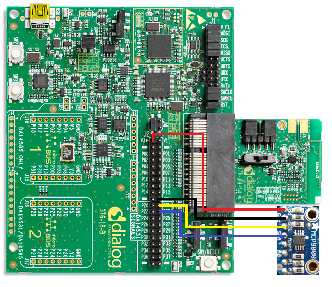
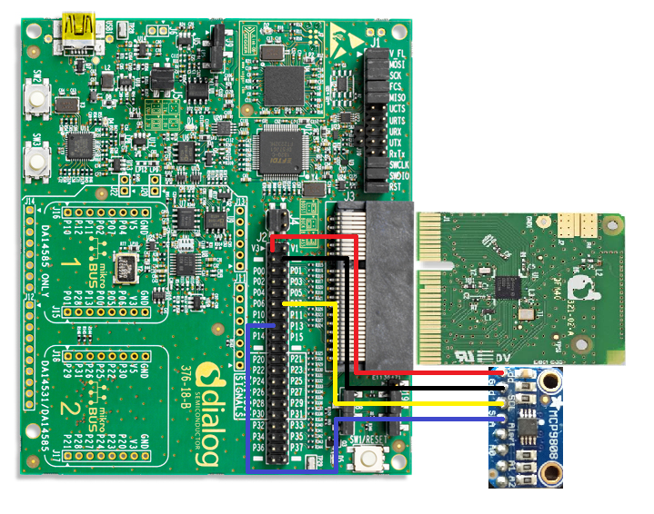
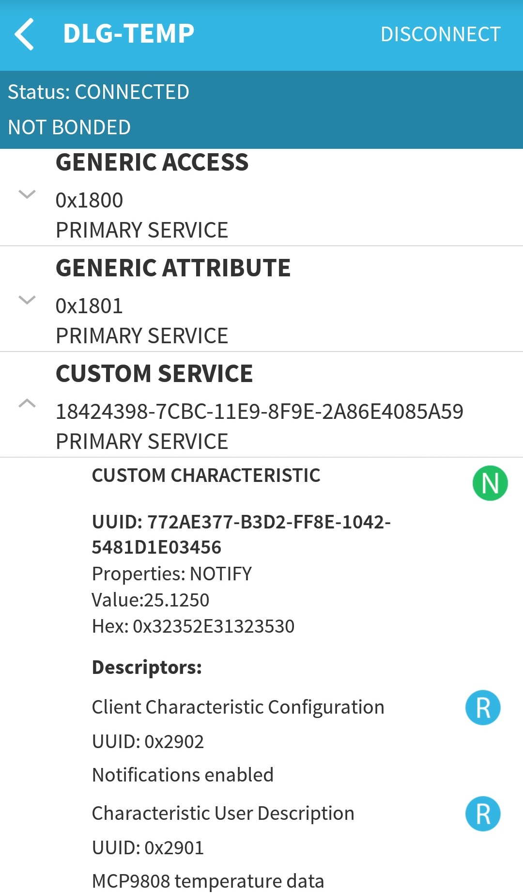

# DA14585/DA14586/DA14531 Peripheral BLE- Measuring temperature using MCP9808 or DA14531 internal sensor 

---

## Example description

This example shows:
- How to use I2C to read MCP9808 temperature register.
- How to use I2C to write MCP9808 resolution register.
- How to measure the temperature using DA14531 internal temperature sensor.
	- __The internal temperature sensor is not available for the DA14585 and DA14586.__

The functionality can be verified by:
- BLE notifications.

## HW and SW configuration
This example runs on the BLE Smart SoC (System on Chip) devices:
- DA14585/DA14586 or DA14531 daughter board + DA145xxDEVKT-P PRO-Motherboard.
- DA14585/DA14586 daughter board + Basic dev Kit mother board.

The user manuals for the development kits can be found:
- [here](https://www.dialog-semiconductor.com/products/da14531-development-kit-pro) for the DA145xxDEVKT-P PRO-Motherboard.
- [here](https://www.dialog-semiconductor.com/sites/default/files/um-b-048_da14585da14586_getting_started_guide_v2.0_0.pdf) for the Basic Development Kit.

* __Hardware configuration DA14531 using DA145xxDEVKT-P PRO-Motherboard__
	- Using MCP9808 temperature sensor.
		- Connect Vdd to V3 on J2 (red line in the image below).
		- Connect Gnd to ground on J2 (black line in the image below).
		- Connect SCL to P21 on J2 (yellow line in the image below).
		- Connect SDA to P23 on J2 (blue line in the image below).
	- Using internal sensor
		- Apply the jumper configuration of the image shown below.

	

* __Hardware configuration DA14585/DA14586 using DA145xxDEVKT-P PRO-Motherboard__
	- Connect Vdd to V3 on J2 (red line in the image below).
	- Connect Gnd to ground on J2 (black line in the image below).
	- Connect SCL to P07 on J2 (yellow line in the image below).
	- Connect SDA to P12 on J2 (blue line in the image below).		

	

* __Hardware configuration DA14585 using the basic dev kit__
	- Connect Vdd to V3 on J4 (red line in the image below).
	- Connect Gnd to ground on J4 (black line in the image below).
	- Connect SCL to P07 on J4 (orange line in the image below).
	- Connect SDA to P12 on J4 (yellow line in the image below).		

	

* __Software configuration__
This example requires:
	- [SDK6.0.12](https://www.dialog-semiconductor.com/da14531_sdk_latest).
	- Keil5.
	- __SEGGER’s J-Link__ tools should be downloaded and installed..

## How to measure temperature using the DA14531 internal Sensor
	-Select the build for DA14531.
	-Uncomment the CFG_USE_INTERNAL_TEMP_SENSOR definition (found in da1458x_config_basic.h) to acquire temperature via the internal temperature sensor. See line 205 in the image shown below.

## How to run the example
### Setup
Before launching the Keil project, make sure to link the SDK and project environment using the Python linker script `dlg_make_keil_vx.xxx`. More information [here](https://www.dialog-semiconductor.com/sites/default/files/sw-example-da145x-example-setup.pdf).
1. Start Keil using the `ble_temperature_ntf.uvprojx` Keil project file.

2. Expand the dialog shown in the red box in the image below.

3. Select your device: DA14531, DA14586 or DA14585.
		

4. Compile (F7) and launch (ctrl + F5) the example.\
If the warning (shown below) pops up press OK.
 

## Expected Results

1. Open the BLE scanner app and look for "DLG-TEMP".

2. Connect to the device.

3. Subscribe to the notifications.

If everything went well, you should be able to receive temperature data as the value of the custom characteristic, as shown in the image below.

__Note that the DA14531 internal temperature sensor uses int8_t instead of the double temperature value shown below__

## How it works

Tutorial 3 on the [Dialog Semiconductor support](https://www.dialog-semiconductor.com/sites/default/files/training_03_custom_profile_gatt_cmd_example_v1.2.pdf) website shows how to make your own custom profile. The **user_catch_rest_hndl** function in user_peripheral.c will handle the messages for our custom profile. This application only has one possible 
custom action: a write to the notification. When this occurs the **user_temperature_message_handler** function is called. This function will check the contents of the write. If the content of the write equals zero, the temperature timer is canceled. If the value is 
anything else, a timer is generated that calls **user_send_temperature_ntf** after NOTIFICATION_DELAY ms. **user_send_temperature_ntf** will read out the sensor data and convert it to a string(for demo purposes). The string will be placed in a message, along with some other parameters, like the connection ID
and the characteristic handle. After the message is sent, the app_easy_timer function is used to schedule the next call to the **user_send_temperature_ntf** function. This will ensure the temperature is transmitted regularly. The app_easy_timer function
has a resolution of 10ms hence we divide the desired delay in ms by 10.

## Troubleshooting
- Please check that the steps according to your daughter board (DA14531, DA14585 or DA14586) and mother board (basic dev kit or DA145xxDEVKT-P PRO-Motherboard) are followed correctly.

- Try a different USB1 cable.

- Try different jumper wires, if used.

- Note that the internal temperature sensor only works for the DA14531

- If none of the above helps, please check the user manual according to your daughter board and mother board. User manual can be found ["here"](##HW-and-SW-configuration)

## License

**************************************************************************************

 Copyright (c) 2019 Dialog Semiconductor. All rights reserved.

 This software ("Software") is owned by Dialog Semiconductor. By using this Software
 you agree that Dialog Semiconductor retains all intellectual property and proprietary
 rights in and to this Software and any use, reproduction, disclosure or distribution
 of the Software without express written permission or a license agreement from Dialog
 Semiconductor is strictly prohibited. This Software is solely for use on or in
 conjunction with Dialog Semiconductor products.

 EXCEPT AS OTHERWISE PROVIDED IN A LICENSE AGREEMENT BETWEEN THE PARTIES OR AS
 REQUIRED BY LAW, THE SOFTWARE IS PROVIDED "AS IS", WITHOUT WARRANTY OF ANY KIND,
 EXPRESS OR IMPLIED, INCLUDING BUT NOT LIMITED TO THE WARRANTIES OF MERCHANTABILITY,
 FITNESS FOR A PARTICULAR PURPOSE AND NON-INFRINGEMENT. EXCEPT AS OTHERWISE PROVIDED
 IN A LICENSE AGREEMENT BETWEEN THE PARTIES OR BY LAW, IN NO EVENT SHALL DIALOG
 SEMICONDUCTOR BE LIABLE FOR ANY DIRECT, SPECIAL, INDIRECT, INCIDENTAL, OR
 CONSEQUENTIAL DAMAGES, OR ANY DAMAGES WHATSOEVER RESULTING FROM LOSS OF USE, DATA OR
 PROFITS, WHETHER IN AN ACTION OF CONTRACT, NEGLIGENCE OR OTHER TORTIOUS ACTION,
 ARISING OUT OF OR IN CONNECTION WITH THE USE OR PERFORMANCE OF THE SOFTWARE.

**************************************************************************************
