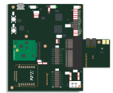
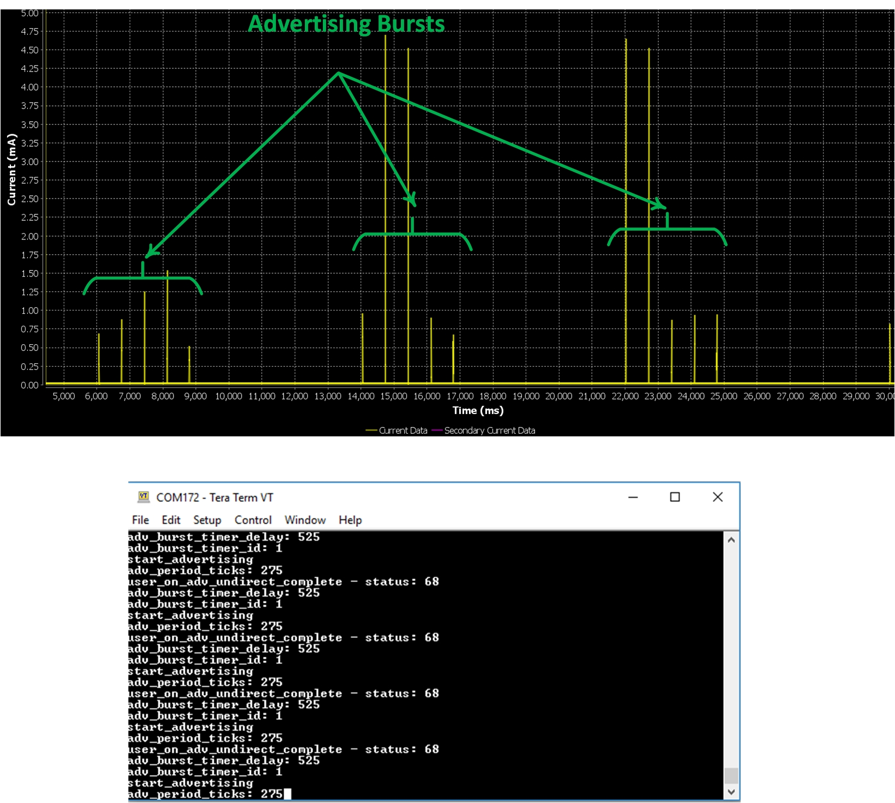
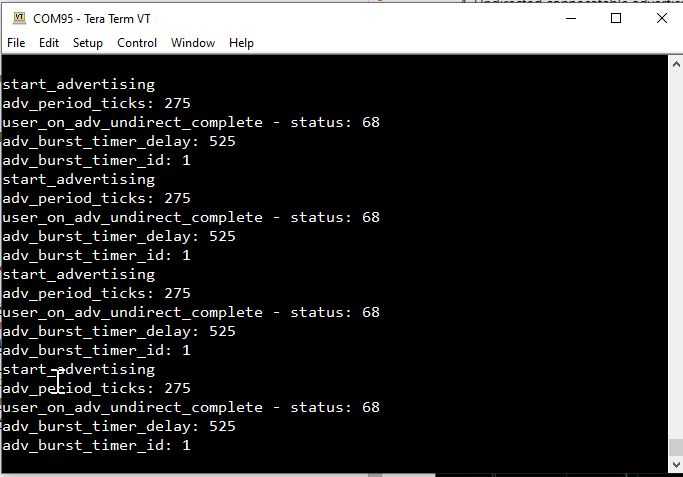

# Burst Advertising with Bluetooth LE

## Example description

Simple example showing how to implement 'burst' advertising on the DA1453x and DA1458x devices. Burst 
advertising is the process of sending a number of advertising events and then having 
a delay before sending another group of advertising events. This example allows the 
user to configure the number of advertising events to be transmitted per burst and 
the time between bursts. 

Devices naming:

- DA1453x is refering to DA14531-00, DA14531-01, DA14530 and DA14535.
- DA1458x is refering to DA14585 and DA14586.
- The DA14531-00 is the main DA14531 device. The -00 is just a new naming to introduce the variant DA14531-01. The DA14531-01 is a ROM variant of the main DA14531-00.
- The DA14535 is a DA14531 upgrade.	
## HW and SW configuration

- This example runs on the DA1453x (DA14531-00, DA14531-01 and DA14535) and DA14585/586 Bluetooth Smart SoC devices.
- The DA145xxDEVKT-P PRO-Motherboard with jumper setting for SPI flash programming. The user manuals for the development kits can be found [Here](https://www.renesas.com/us/en/products/wireless-connectivity/bluetooth-low-energy/da14531-00fxdevkt-p-smartbond-tiny-da14531-bluetooth-low-energy-51-system-chip-development-kit-pro) for the DA145xxDEVKT-P PRO-Motherboard.

- For the DA14531 getting started guide you can refer to [UM-B-117](https://lpccs-docs.renesas.com/UM-B-117-DA14531-Getting-Started-With-The-Pro-Development-Kit/index.html)

- For the DA14535 getting started guide you can refer to this [UM-B-165](https://lpccs-docs.renesas.com/DA14535/UM-B-165-DA14531-Getting-Started-With-The-Pro-Development-Kit/index.html#device-family-getting-started-with-the-pro-development-kits)

- For the DA14531 Module getting started guide you can refer to this [UM-B-139](https://lpccs-docs.renesas.com/UM-B-139-Getting-Started-with-DA14531-TINY-Module/index.html)
- For the DA14585/586 getting started guide you can refer to this [UM-B-049](https://lpccs-docs.renesas.com/da14585_getting_started/index.html).

For the UART to see the communication logs, check the setup shown below for DA14531 and DA14585/586

### Hardware configuration for the DA14531

### Hardware configuration for the DA14585/586

 

- This example works also on the DA1453x DEVKT-P with with any DA1453x Daughterboard and with the same UART connection.
	
The user manuals for the development kits can be found:

- [Here](https://www.dialog-semiconductor.com/products/da14531-development-kit-pro) for the DA145xxDEVKT-P PRO-Motherboard.

	
### Software configuration

- This example requires:
    * Smartsnippets Studio 2.0.16 (or later)
    * [SDK6.0.14](https://www.dialog-semiconductor.com/da14531_sdk_latest).

## How to run the example

For the initial setup of the project that involves linking the SDK to this SW example, please follow the Readme [here](../../Readme.md).

### Initial Setup

1.  Build and download the example using the Keil IDE. 
2.  Run the example using the Keil debugger.
3.  Observe bursts of advertising events using Power Profiler found within the SmartSnippets Toolbox, monitor UART debug output using a terminal such as Teraterm etc as following:
		   
  		    - baudrate: 115200
		    - data: 8 bits
		    - stop: 1 bit
		    - parity: None
		    - flow control: none
				
4. Undirected connecatable advertising is used for this demonstration. Monitor transmitted advertising events using a Smart Phone App such as LightBlue.

The device should display the advertising data as shown in the picture below:

## Further reading

- [Wireless Connectivity Forum](https://lpccs-docs.renesas.com/lpc_docs_index/DA145xx.html)

## Known Limitations

- There are no known limitations for this example. But you can check and refer to the following application note for
[SDK6 known limitations](https://lpccs-docs.renesas.com/sdk6_kll/index.html)

## Feedback and support ?

If you have any comments or suggestions about this document, you can contact us through:

- [Wireless Connectivity Forum](https://community.renesas.com/wireles-connectivity)

- [Contact Technical Support](https://www.renesas.com/eu/en/support?nid=1564826&issue_type=technical)

- [Contact a Sales Representative](https://www.renesas.com/eu/en/buy-sample/locations)

