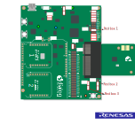
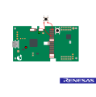

# DA1453x and DA14585/586 - Changing advertising methods using GPIO button interrupt or timer callbacks

## Example description

This example shows how to:
- Use a button to switch between advertising methods.
- Sleep or wake up after pressing a button for 3 seconds.
- Use timer callbacks to switch between advertising methods. 
- Use timer callbacks to go to sleep or wake up.

The expected result of the example can be verified by:
- Connecting a serial terminal on the work station to the MB (Mother Board) using UART.
- The status of the LED.

## HW and SW configuration


### **Hardware configuration**

This example runs on the BLE Smart SoC (System on Chip) devices:
- DA14585/DA14586 or DA1453x daughter board + DA145xxDEVKT-P PRO-Motherboard or DA1453x DEVKT-P Motherboard.
- DA14585/DA14586 basic development kit.

The user manuals for the development kits can be found:
- [Here](http://lpccs-docs.renesas.com/UM-B-117-DA14531-Getting-Started-With-The-Pro-Development-Kit/index.html) for the DA14531 DEVKT-P Motherboard or DA1453x DEVKT-P Motherboard.
- [Here](https://www.renesas.com/tw/en/products/interface-connectivity/wireless-communications/bluetooth-low-energy/da14531-00fxdevkt-u-smartbond-tiny-da14531-bluetooth-low-energy-51-system-chip-usb-development-kit) for the Basic Development Kit.

* __Hardware configuration DA14531 using DA145xxDEVKT-P PRO-Motherboard__

	- UART TX: connect P21 on J2 to UTX pin 17 on J1 as shown in the image below (the blue line).
	- LED jumper on J8 is configured to P0_9 (red box 2).
	- Button jumper on J19 is configured from SW2 pin to P3_1 (red box 1)
		- To clarify the J19 configuration from up (see arrow on MB): pin, jumper, jumper, pin, pin. 
	- Connect the DA145xxDEVKT-P PRO-Motherboard to the working station through USB1 connector.

	The image below shows the Motherboard with jumper (wire) configuration for the DA14531.

	
		
	

* __Hardware configuration DA14585 using the DA145xxDEVKT-P PRO-Motherboard__

	- UART TX jumper on P0_4, located on J1 (red box 1).
	- LED jumper is configured to P1_0, located on J8 (red box 3).
	- Button jumper is configured from SW3 pin to P1_1, located on J19 (red box 2).
	- Connect the DA145xxDEVKT-P PRO-Motherboard to the working station through USB1 connector.

	The image below shows the Motherboard with jumper configuration for the DA14585

	

* __Hardware configuration DA14585 using the basic dev kit__

	- UART TX/RX jumper on P0_4/P0_5, located on J4.
	- LED jumper is configured to P10, located on J9.
	- An active-low switch should be connected to P1_1, located on J4, as displayed in the following schematic.
	- Connect the basic dev kit to the working station through USB1 connector.

	


## Software Configuration
Download the latest version of [SDK6 latest version](https://www.dialog-semiconductor.com/da14531_sdk_latest)..
Install SEGGER’s J-Link tools.

Keil5.
__SEGGER’s J-Link__ tools should be downloaded and installed.
Serial Terminal software. For example Tera Term or PuTTY.

If using e² studio with LLVM instead of Keil, ensure your project settings are adjusted accordingly (instructions below).


## Using e² studio with LLVM
Setup for e² studio
#. Switching to e² studio: Instead of using Keil, you can use e² studio with LLVM as the compiler toolchain. Make sure your project is configured for LLVM by selecting the appropriate toolchain in e² studio.


#. Compile and Build: Open your project in e² studio and compile using LLVM. Ensure your environment variables and paths are properly set for the Renesas toolchain.

#. Run and Debug: Connect your device, set the proper debug configuration in e² studio, and start debugging using J-Link.


By switching to e² studio and LLVM, you can take advantage of advanced debugging tools and an open-source toolchain, while maintaining full compatibility with Renesas DA145xx devices.

For detailed steps on using e² studio, refer to the Renesas e² studio User Guide available on the [Renesas website](https://lpccs-docs.renesas.com/e2_studio_sdk6_getting_started/index.html).

	


## How to run the example

### Setup

For the initial setup of the project that involves linking the SDK to this SW example, please follow the Readme [here](../../Readme.md).

1. Start Keil using the `changing_advertising.uvprojx` Keil project file.

2. Expand the dialog shown in the red box in the image below.

   

3. Select your device: DA14531, DA14586 or DA14585.
		
   

4. Open a serial terminal on the work station using for example Tera Term/PuTTY with the following parameters:
	```
	- baud rate: 115200
	- data: 8 bits
	- stop: 1 bit
	- parity: None
	- flow  control: none
	```

5. Compile (F7) and launch (ctrl + F5) the example.\


## GPIO identification 
Make sure to read the correct identification according to your mother board and daughter board.

### DA14585/DA14586 GPIO identification with DA145xxDEVKT-P PRO-Motherboard
1. Identify LED:
	- The LED controlled in this example is `D5` and the color is `orange`.
2. Identify button:
	- `SW3` is used as button in this example

### DA1453x GPIO identification with DA145xxDEVKT-P PRO-Motherboard
1. Identify LED:
	- The LED controlled in this example is `D5` and the color is `orange`.
2. Identify button:
	- `SW2` is used as button in this example

### DA14585/DA14586 GPIO identification with Basic Dev Kit
1. Identify LED:
	- The LED controlled in this example is `USR` and the color is `green`.
2. Identify button:
	- The button connected (by the user) to P1_1 on J4

## Expected Results button example
- The changing advertising example is now running. 
- Make sure that the ADV_EXAMPLE and the ADV_BUTTON_EXAMPLE are both defined defined in _user_config.h_.
- Make sure *CFG_PRINTF*  is defined if UART messages are desired.
- The LED status is toggle when the advertising is started. The LED state will toggle between advertising changes and will remain off during permanent sleep periods. 
- The image below describes the behavior.


## Expected Results timer example
- The changing advertising example is now running.
- Make sure ADV_EXAMPLE is defined in _user_config.h_ (if only the ADV_EXAMPLE definition is enabled the demo will change the advertising state via timer).
- Make sure that ADV_BUTTON_EXAMPLE is __not__ defined.
- Make sure *CFG_PRINTF*  is defined if UART messages are desired.
- The LED status is toggle when the advertising is started. The LED is set inactive when the system is going to sleep. 
- The image below describes the behavior.


## Optional software configurations

 - The following parameters can be configured in _user_barebone.h_
 	- Set *UNDIRECT_ADV_INTERVAL* to the desired value in milliseconds to configure the undirected advertising interval.
 	- Set *NONCONN_ADV_INTERVAL* to the desired value in milliseconds to configure the non-connectible advertising interval.
 	- Set *UNDIRECT_ADV_DURATION* to the desired value multiplied by 10 milliseconds to determine the duration of the undirected advertising in the timer based example.
 	- Set *NONCONN_ADV_DURATION* to the desired value multiplied by 10 milliseconds to determine the duration of the non-connectible advertising in the timer based example.
 	- Set *SLEEP_DURATION* to the desired value multiplied by 10 milliseconds to determine the sleep duration in the timer based example.

## About this example
Starting point for this example is the BLE barebone project from SDK6. This provides the right framework for the advertising events used in this example.

- Comparing to BLE barebone project from SDK6 some changes were made to _user_barebone.c_, these changes can be easily traced as they are marked with the ADV_EXAMPLE flag.
- Minor changes were made to the _user_peripheral_setup_ files to accommodate the button functionality and LED indication.
- The user_callback_config.h has been slightly modified. Callback is added for non-connectible advertising.
- The user_button.h and user_button.c were added. These files accommodate the button functionality used in this example.


## Note
This example can be built by e2studio and LLVM compiler instead of using Keil.

## Further reading

- [Wireless Connectivity Forum](https://lpccs-docs.renesas.com/lpc_docs_index/DA145xx.html)


## Known Limitations

- There are no known limitations for this example. But you can check and refer to the following application note for
[SDK6 known limitations](https://lpccs-docs.renesas.com/sdk6_kll/index.html)

## Feedback and support ?

If you have any comments or suggestions about this document, you can contact us through:

- [Wireless Connectivity Forum](https://community.renesas.com/wireles-connectivity)

- [Contact Technical Support](https://www.renesas.com/eu/en/support?nid=1564826&issue_type=technical)

- [Contact a Sales Representative](https://www.renesas.com/eu/en/buy-sample/locations)


