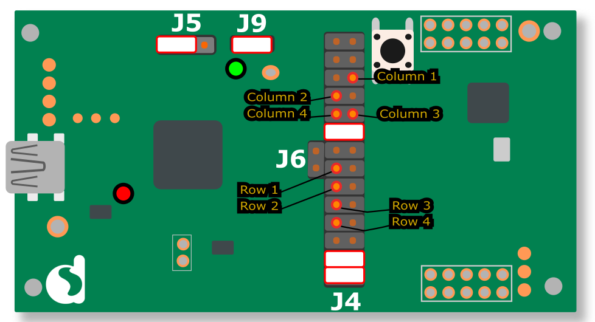

# DA14585 Simple Remote Control Unit peripheral example

---

## Example description
This SDK6 DA14585 example provides an implementation of a Simple RCU using a custom BLE profile. The example uses a 4x4 button matrix, which state is read and buffered with the keyboard module from the [Voice RCU reference design](https://support.dialog-semiconductor.com/connectivity/product/da14585?qt-product_restricted_=5&qt-view__reference_designs__block_1=4#qt-view__reference_designs__block_1). The example makes use of the update parameter request and slave latency functionality.

## HW and SW configuration

* **Hardware configuration**

	- This example runs on the DA14585 Bluetooth Smart SoC devices. This includes both the Pro and basic development kit.
	- A button matrix (shown underneath) needs to be connected to the development kit.

	**4x4 button matrix**

	

	- To connect the button matrix to the development board and to make sure the jumper settings are correct, consult the lay-out sketch underneath (configurations for the pro and basic kit are the same):
		- The Columns (1-4) of the matrix are displayed in the yellow and orange color scheme. This is the default configuration. The pin configuration can be changed in the app_kbd_scan_matrix.h file.
		- The Rows (1-4) of the matrix are displayed in the blue and cyan color scheme. This is the default configuration. The pin configuration can be changed in the app_kbd_scan_matrix.h file.
		- The jumpers are displayed in pink.

	**Lay-out sketch**

	

* **Software configuration**

	- This example requires:
    * Smartsnippets Studio 1.6.3.
    * SDK6.0.10
	- **SEGGER’s J-Link** tools should be downloaded and installed.

## How to run the example

For the initial setup of the project that involves linking the SDK to this SW example, please follow the Readme [here](https://github.com/dialog-semiconductor/BLE_SDK6_examples).

The example is running from SRAM. For programming to Flash, see chapter 11 in the [SmartSnippets Toolbox User Manual](https://support.dialog-semiconductor.com/resource/um-b-083-smartsnippets-toolbox-user-manual).

### Initial Setup

 - Start Keil
 - Compile and launch the example
 - Open the serial terminal of your choice (i.e. Tera Term) with the following parameters.

	- baudrate: 115200
	- data: 8 bits
	- stop: 1 bit
	- parity: None
	- flow  control: none

 - Pressing the button (P1_1) will initiate the following sequence:

### How to use the example
- The RCU will start in extended sleep by default.
- Pressing a key on the keyboard matrix will initiate advertising with a duration of 10 seconds.
- Use a central device to connect to the RCU using a Bluetooth scanner (Lightblue on iOS or BLE scanner on Android).
 - Upon connection a parameter update request will occur, changing the BLE parameters.
 - If the parameter update request is accepted the RCU will make use of the slave latency feature.
- Enable notifications in the Remote control example service.
	- Upon activation of notifications the keycode buffer contents will be transmitted.
- Upon a button press/release a 32-bit keycode will be transmitted.
	-	The 16 most significant bits will depict the button state: 0x0000 -> released, 0x0001 -> pressed.
	- The 16 least significant bits will depict the button, represented by it's ASCII value. These values can be modified in the kbd_keymap array in the app_kbd_matrix.h file.
- A connection time-out will occur after 5 minutes of inactivity.
- During the runtime of the example a LED (P1_0) will indicate the different states:
	- LED off -> IDLE state.
	- LED flickering -> Advertising state.
	- LED on -> Connected state.
	- LED indication can be turned of at compile time by undefining the LED_INDICATION flag in the da1458x_config_basic.h file.
-  During runtime UART message to a serial terminal of your choice (i.e. Tera Term) will indicate the different procedures for debugging purpose.
 - UART can be disabled at compile time by undefining the CFG_PRINTF flag.  

### About this example
This section will highlight the most important aspects of the RCU example in order to get a better idea of it's internal workings.

- The keyboard module from the Voice RCU Reference Design is used for reading the keyboard matrix input.
	- More information on this can be found in the [UM-B-086 DA14585 Voice RCU Software Manual](https://support.dialog-semiconductor.com/resource/um-b-086-da14585-voice-rcu-software-manual)
	- The files belonging to the keyboard module are grouped together as kbd_module in the Keil project.
	- The keyboard module has some dependencies on the port module. The port_module group in the Keil project contains all of these files.
	- Upon each button event the keyboard module will send a notification to the application layer by means of the registered keyboard notification callback.
- the user_rcu_example source and header file contains the application code. It contains:
	- Callback functions to handle different BLE and system events:
	 - System powered: user_on_system_powered()
	 - BLE powered: user_on_ble_powered()
	 - Application initialization: user_app_init()
	 - Default advertisement operation: user_app_adv_start()
	 - Connection: user_app_connection()
	 - Disconnection: user_app_disconnect()
	 - Directed advertising complete: user_app_adv_undirect_complete()
	 - BLE message: user_catch_rest_hndl()
	- The aforementioned keyboard notification callback: user_kbd_notification_cb()
	- LED indication functionality.
- The user_con_timeout.h constitutes an API for a timer based connection time-out.
	- user_con_timeout_init(uint32_t delay, uint8_t connection_id): Will start a timer to terminate the connection after the specified time. It will override an existing timer.
	- user_con_timeout_cancel(): Cancel the timer (if one is currently running).
	- user_con_timeout_reset(): Resets the timer (if one is currently running). This is used by the application to reset the timer after each button event.
- The example uses a Custom BLE profile. More information on creating a custom profile can be found [here](https://support.dialog-semiconductor.com/resource/tutorial-3-custom-profile-gatt-cmd-examplev11)

## Known Limitations

- There are No known limitations for this example. But you can check and refer to the following application note for
[known hardware limitations](https://support.dialog-semiconductor.com/system/files/resources/DA1458x-KnownLimitations_2018_02_06.pdf "known hardware limitations").
- Dialog Software [Forum link](https://support.dialog-semiconductor.com/forums).
- you can Refer also for the Troubleshooting section in the DA1585x Getting Started with the Development Kit UM-B-049.

