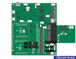
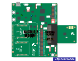
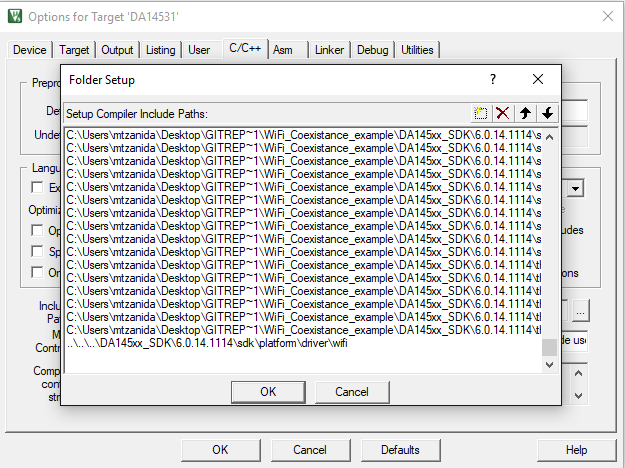
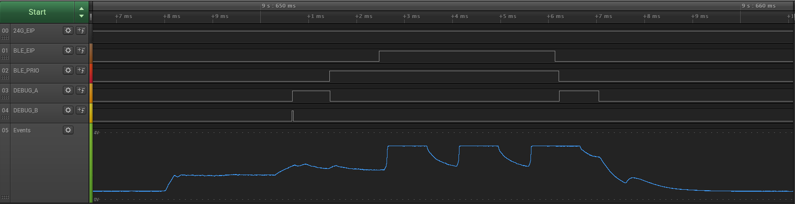
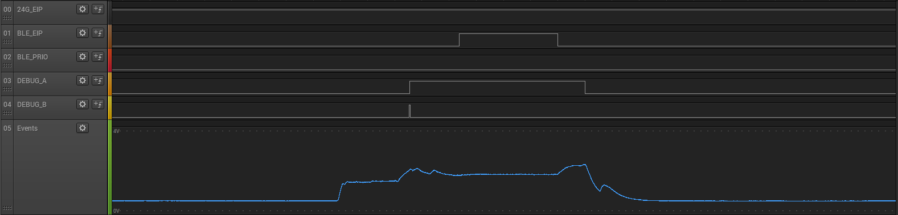
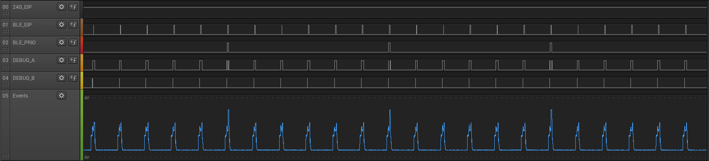
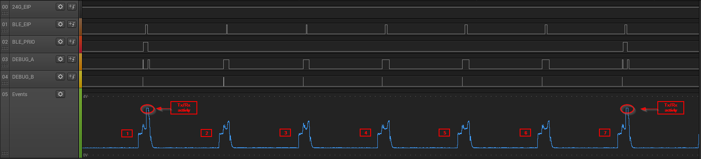

## Example Description

Purpose of the current example is to demonstrate the WiFi coexistence feature available in the SDK 6.0.14.1114. The example provides guidelines on how the feature can be enabled on the SDK as well as the signal behavior that should be expected on the configured pins under the various states and priority configuration rules set from application level.

The WLAN coexistence feature on DA14585/586/531 is designed to allow multiple 2.4 GHz devices to operate without signals from one radio interfering with adjacent radios. This is done by a handshaking protocol between the BLE device and the other 2.4 GHz device using the following signals:

 - **WLAN_COEX_BLE_EIP**: Output signal of the device. The DA14585/586/531 can communicate its radio status in advance using this signal. **WLAN_COEX_BLE_EIP** is an envelop of the scheduled TX and RX radio activity of the BLE Radio and it starts before the actual radio activity so it can upfront inform the coexisting system of scheduled RF activity. The signal is de-asserted synchronously directly after radio activity is finished.
 - **WLAN_COEX_BLE_PRIO**: Output signal of the device. The DA14585/586/531 can enable a priority line to indicate that it can not be interrupted for a defined activity. The activity for which BLE needs priority can be defined through the SDK API. The API which controls the signal enables the application to assign a priority to certain packet types on specific connections. The user should define the type of the packet, the connection handle (if the specific packet type is associated with a connection) and the conditions via the ```wlan_coex_prio_criteria_add(prioritized packet type, connection handle, missed number of packets)``` API.
 - **WLAN_COEX_24G_EIP**: Input signal of the device. External 2.4GHz device event in progress indication. Asserting the pin will force the BLE device to suppress its radio activity if no higher priority for the upcoming BLE packet is defined.
 - **DEBUG A**: Debugging output signal of the device. Asserted when the BLE radio is overruled from 24G external request.
 - **DEBUG B**: Debugging output signal of the device. Asserted when a 24G request arrives.

## HW and SW Configurationuser_empty_peripheral_template
Example requirements:
- A DA14531 or DA14585/586 Smartbond daughterboard evaluation kit.
- The DA145xx Pro Development Kit is proposed for this example since it provides the proper headers for attaching a logic analyzer for signal observation.
- A logic analyzer for monitoring the signals.

### Hardware Configuration for the DA14585/586 and DA14531 daughter board evaluation kit

- The USB1 connector of the DA145xx Pro Development Kit should be connected to the host computer
- The jumpers should be connected as shown in the graphic for downloading the binary to the RAM via JTAG (using Keil or Smart Snippets Toolbox).
- The current example monitors the signals on the assigned COEX pins. By default the signals are exposed on specific pins thus the probes of the analyzer should be attached on the following pins:
	- WLAN_COEX_24G_EIP exposed on P05 (for DA14531) or P00 (for DA14585/586)
	- WLAN_COEX_BLE_EIP exposed on P06 (for DA14531) or P03 (for DA14585/586)
	- WLAN_COEX_BLE_PRIO exposed on P07 (for DA14531) or P02 (for DA14585/586)
	- DEBUG A exposed on P09 (for DA14531) or P01 (for DA14585/586)
	- DEBUG B exposed on P08 (for DA14531) or P13 (for DA14585/586)
- In order to emulate an external device requesting radio transmission a simple button can be used and connected on pin J2:1 (V3) of the motherboard and on WLAN_COEX_24G_EIP pin (default at P05 for DA14531 or P00 for DA14585/586).

<figure>

	<figcaption>Fig. 1: DA14531 Daughter Board along with Pro Dev Kit</figcaption>


	<figcaption>Fig. 2: DA14585/586 Daughter Board along with Pro Dev Kit</figcaption>
</figure>

### Software Configuration

 Example requirements:
- SDK v6.0.14 or later
- **SEGGER’s J-Link** tools downloaded and installed
- Logic Analyzer software.

## Enable the COEX feature in a project

***Useful Note*** : 
		All the following changes described are already applied to the accompanied software example. The below instructions refer in a case where the user would like to apply the coexistence scheme on a custom project.

The following guidelines enable the COEX feature on the template example located in the default SDK.

1. Open the template example located under the following directory **C:\sdk_dir\DA145xx_SDK\6.0.14.1114\projects\target_apps\template\empty_peripheral_template\Keil_5\empty_peripheral_template.uvprojx**.
2. The wlan_coex.c file contains the APIs of the COEX feature, thus it should be added in the project. For adding the source file right click on the sdk_driver in Keil's project tree and select the "Add existing files to Group 'sdk_driver'. In the explorer window navigate into the following directory **sdk_root\sdk\platform\driver\wifi** select the **wlan_coex.c** file and click add in the explorer to include the file into the project.

<figure>

	<figcaption>Fig. 3: Add wlan_coex.c in Keil project</figcaption>
</figure>

3. To include the corresponding header file of the API you will have to select the **options for target** button and navigate to the **C/C++** tab. Select the **Include paths** and add the header file **wlan_coex.h** from the following directory **sdk_root\sdk\platform\driver\wifi**.

<figure>

	<figcaption>Fig. 4: Add wlan_coex.h in Keil project</figcaption>
</figure>

4. In da1458x_config_advanced.h, at the corresponding sections either for DA14531 or DA14585/586, use the following preprocessor definitions in order to enable WLAN coexistence mode with or without debugging signals and set the preferred polarity of the BLE event in progress signal. The CFG_WLAN_COEX_BLE_EVENT_INV should only be used in case the application requires the signal **WLAN_COEX_BLE_EIP** inverted (de-asserted high, asserted low).
```c
/****************************************************************************************************************/
/* WLAN coexistence mode: Enable/disable the mode.                                                              */
/****************************************************************************************************************/
#define CFG_COEX

/****************************************************************************************************************/
/*  WLAN coexistence mode: Enable/disable the debugging signals.                                                */
/****************************************************************************************************************/
#define CFG_WLAN_COEX_DEBUG

/****************************************************************************************************************/
/* WLAN coexistence mode: Controls the polarity of the BLE event in progress signal.                            */
/* - defined: BLE event in progress signal is active low.                                                       */
/* - undefined: BLE event in progress signal is active high.                                                    */
/****************************************************************************************************************/
#undef CFG_WLAN_COEX_BLE_EVENT_INV
```
5. In the **user_periph_setup.h** file the following snippet of definitions should be added for the WLAN coexistence pin mapping. All COEX signals can be assigned to any pins (if not used for any other functionality other than the coexistence).

	All signals but the **WLAN_COEX_BLE_EIP** are used as common GPIO pins. The **WLAN_COEX_BLE_EIP** signal is an internal HW signal and can be mapped only to pins **from P00 to P07** (on both DA14531 and DA14585) with the default SDK coex driver (check the **Note** at the bottom of the paragraph for using alternative pins for the BLE_EIP signal). The change of the pin should be applied from the **WLAN_COEX_BLE_EIP_PIN** definition.
	
```c
/****************************************************************************************/
/* WLAN COEX pin configuration                                                          */
/****************************************************************************************/

#if (WLAN_COEX_ENABLED)
#if defined (__DA14531__)

   /// Input signal to device: 2.4GHz external device event in progress indication.
   #define WLAN_COEX_24G_EIP_PORT      GPIO_PORT_0
   #define WLAN_COEX_24G_EIP_PIN       GPIO_PIN_5

   /// Output signal from device: BLE event in progress indication.
   #define WLAN_COEX_BLE_EIP_PORT      GPIO_PORT_0
   #define WLAN_COEX_BLE_EIP_PIN       GPIO_PIN_6

   /// Output signal from device: BLE priority indication.
   #define WLAN_COEX_BLE_PRIO_PORT     GPIO_PORT_0
   #define WLAN_COEX_BLE_PRIO_PIN      GPIO_PIN_7

#if defined (CFG_WLAN_COEX_DEBUG)
   /// BLE radio overruled signal pin definition.
   /// This signal goes high when the BLE radio is forced to be off due to external 2.4GHz device activity.
   #define WLAN_COEX_DEBUG_A_PORT      GPIO_PORT_0
   #define WLAN_COEX_DEBUG_A_PIN       GPIO_PIN_9

   /// External 2.4GHz device EIP handler signal pin definition.
   /// This signal indicates when an external 2.4GHz device wants to start or stop sending data.
   #define WLAN_COEX_DEBUG_B_PORT      GPIO_PORT_0
   #define WLAN_COEX_DEBUG_B_PIN       GPIO_PIN_8
#endif

#else

   /// Input signal to device: 2.4GHz external device event in progress indication.
   #define WLAN_COEX_24G_EIP_PORT      GPIO_PORT_0
   #define WLAN_COEX_24G_EIP_PIN       GPIO_PIN_0

   /// Output signal from device: BLE event in progress indication.
   #define WLAN_COEX_BLE_EIP_PORT      GPIO_PORT_0
   #define WLAN_COEX_BLE_EIP_PIN       GPIO_PIN_3

   /// Output signal from device: BLE priority indication.
   #define WLAN_COEX_BLE_PRIO_PORT     GPIO_PORT_0
   #define WLAN_COEX_BLE_PRIO_PIN      GPIO_PIN_2

#if defined (CFG_WLAN_COEX_DEBUG)
   /// BLE radio overruled signal pin definition.
   //  This signal goes high when the BLE radio is forced to be off due to external 2.4GHz device activity.
   #define WLAN_COEX_DEBUG_A_PORT      GPIO_PORT_0
   #define WLAN_COEX_DEBUG_A_PIN       GPIO_PIN_1

   /// External 2.4GHz device EIP handler signal pin definition.
   /// This signal indicates when an external 2.4GHz device wants to start or stop sending data.
   #define WLAN_COEX_DEBUG_B_PORT      GPIO_PORT_1
   #define WLAN_COEX_DEBUG_B_PIN       GPIO_PIN_3
#endif

#endif

// GPIO IRQ number. Interrupt is fired when 2.4GHz external device event in progress signal is activated.
#define WLAN_COEX_IRQ            4

#endif // WLAN_COEX_ENABLED
```
6. In user_periph_setup.c we should apply the following changes in order to enable properly WLAN coexistence feature.
	- Add the required include file. Include wlan_coex.h in the Include Files section.
	```c
	#if (WLAN_COEX_ENABLED)
	#include "wlan_coex.h"
	#endif
	```
	- Add the following global variable definition (configuration struct for WLAN coexistence).
	```c
	#if (WLAN_COEX_ENABLED)
	// Configuration struct for WLAN coexistence
	const wlan_coex_cfg_t wlan_coex_cfg = {
	.ext_24g_eip_port = WLAN_COEX_24G_EIP_PORT,
	.ext_24g_eip_pin = WLAN_COEX_24G_EIP_PIN,
	.ble_eip_port = WLAN_COEX_BLE_EIP_PORT,
	.ble_eip_pin = WLAN_COEX_BLE_EIP_PIN,
	.ble_prio_port = WLAN_COEX_BLE_PRIO_PORT,
	.ble_prio_pin = WLAN_COEX_BLE_PRIO_PIN,
	#if defined (CFG_WLAN_COEX_DEBUG)
	.debug_a_port = WLAN_COEX_DEBUG_A_PORT,
	.debug_a_pin = WLAN_COEX_DEBUG_A_PIN,
	.debug_b_port = WLAN_COEX_DEBUG_B_PORT,
	.debug_b_pin = WLAN_COEX_DEBUG_B_PIN,
	#endif
	.irq = WLAN_COEX_IRQ,
	};
	#endif
	```
	- Reserve GPIOs used by the module by adding the following block of code inside GPIO_reservations() function.
	
	```c
	#if (WLAN_COEX_ENABLED)
    RESERVE_GPIO(COEX_EIP, wlan_coex_cfg.ble_eip_port, wlan_coex_cfg.ble_eip_pin, PID_GPIO);
    RESERVE_GPIO(COEX_PRIO, wlan_coex_cfg.ble_prio_port, wlan_coex_cfg.ble_prio_pin, PID_GPIO);
    RESERVE_GPIO(COEX_REQ, wlan_coex_cfg.ext_24g_eip_port, wlan_coex_cfg.ext_24g_eip_pin, PID_GPIO);
	#endif

	#if defined (CFG_WLAN_COEX_DEBUG)
	RESERVE_GPIO(DEBUGPIN1, wlan_coex_cfg.debug_b_port, wlan_coex_cfg.debug_b_pin, PID_GPIO);
	RESERVE_GPIO(DEBUGPIN2, wlan_coex_cfg.debug_a_port, wlan_coex_cfg.debug_a_pin, PID_GPIO);
	#endif
	```
	- Call wlan_coex_gpio_cfg() function at the end of set_pad_functions() to initialize GPIOs used by the module and to configure 2.4GHz external device event in progress signal to act as a GPIO interrupt.
	```c
	#if (WLAN_COEX_ENABLED)
   	wlan_coex_gpio_cfg();
	#endif
	```
7. Now the COEX feature is enabled in the project. A final step is required in order to access the API from application level. The following modifications are required in the user_empty_peripheral_template.c file or the corresponding user file that holds the user application.
	- Add the required include files, wlan_coex.h and lld.h in the Include Files section.
	```c
	#if (WLAN_COEX_ENABLED)
	#include "wlan_coex.h"
	#include "lld.h"
	#endif
	```
	- Invoke through the ```.app_on_init callback```, in this example's case the user_app_on_init() function, the following functions in order to initialize the COEX functionality and assign the desired rules for the coexistence. For example the ``` wlan_coex_prio_criteria_add(WLAN_COEX_BLE_PRIO_ADV, LLD_ADV_HDL, 0);``` rule specifies that priority over the 24G signal will have the BLE advertising packets, the LLD_ADV_HDL indicates that the specific packet is not associated with a connection and the last parameter is only taken in account when priority is assigned for missed data packets.
	```c
	#if (WLAN_COEX_ENABLED)
   	wlan_coex_init();

   	// Adds priority case for a specific connection
   	wlan_coex_prio_criteria_add(WLAN_COEX_BLE_PRIO_ADV, LLD_ADV_HDL, 0);
	#endif
	```
	- Invoke through the ```.app_validate_sleep```, in this example's case is the ```user_app_on_validate_sleep()``` function the following function in order to prepare the COEX for going to sleep.
	```c
	#if (WLAN_COEX_ENABLED)
   	wlan_coex_going_to_sleep();
	#endif
	```
	
<figure>

	<figcaption>Fig. 5: Modifications in user_empty_peripheral template</figcaption>
</figure>

>**_Note_**:
	The HW supports assigning the BLE_EIP signal to pins **P00 up to P011** for the DA14531 and to pins **P00 up to P07** and **P10 up to P13** for the DA14585. As already mentioned this is not supported from the current SDK coex driver. This is only possible by applying the following modification in the **wlan_coex_BLE_set()** and in the **wlan_coex_gpio_cfg** functions, as indicated in the below snippet.
	
The following modifications should be applied in the default SDK driver in order to assign the BLE_EIP signal on the additional available pins.

- Change the restriction of the SDK driver that limits the Diagnostic pins to P00 up to P07 in the wlan_coex_gpio_cfg() function and apply the new extended pin restriction.
	```C
	void wlan_coex_gpio_cfg(void)
	{
		// WLAN_COEX_BLE_EVENT can be applied on any pin for DA14531 and only on pins P0[0-7] and P1[1-3] for DA14585.
		#if!(__DA14531__)
			ASSERT_WARNING((wlan_coex_cfg.ble_eip_pin <= GPIO_PIN_7) && (wlan_coex_cfg.ble_eip_port == GPIO_PORT_0) ||
						(wlan_coex_cfg.ble_eip_pin <= GPIO_PIN_3) && (wlan_coex_cfg.ble_eip_port == GPIO_PORT_1));
		#endif

		// Drive to inactive state the pin used for the BLE event in progress signal
		wlan_coex_set_ble_eip_pin_inactive();

		// Configure selected GPIO as output - BLE priority
		GPIO_ConfigurePin(wlan_coex_cfg.ble_prio_port, wlan_coex_cfg.ble_prio_pin, OUTPUT, PID_GPIO, false);

		// Configure selected GPIO as input with pull-down - 2.4GHz external device event in progress
		GPIO_ConfigurePin(wlan_coex_cfg.ext_24g_eip_port, wlan_coex_cfg.ext_24g_eip_pin, INPUT_PULLDOWN, PID_GPIO, false);

		// Configure 2.4GHz external device event in progress signal to act as a GPIO interrupt
		GPIO_RegisterCallback((IRQn_Type)(GPIO0_IRQn + wlan_coex_cfg.irq), ext_24g_eip_handler);
		GPIO_EnableIRQ(wlan_coex_cfg.ext_24g_eip_port, wlan_coex_cfg.ext_24g_eip_pin, (IRQn_Type)(GPIO0_IRQn + wlan_coex_cfg.irq),
					/*low_input*/ false, /*release_wait*/ false, /*debounce_ms*/ 0);

	#if defined (CFG_WLAN_COEX_DEBUG)
		GPIO_ConfigurePin(wlan_coex_cfg.debug_a_port, wlan_coex_cfg.debug_a_pin, OUTPUT, PID_GPIO, false);
		GPIO_ConfigurePin(wlan_coex_cfg.debug_b_port, wlan_coex_cfg.debug_b_pin, OUTPUT, PID_GPIO, false);
	#endif
	}
	```

	- Replace the existing wlan_coex_BLE_set() with the following snippet.

	```c
	void wlan_coex_BLE_set(void)
	{
		uint8_t shift;
		GPIO_PIN diag_en;
	#if (__DA14531__)
		if ((wlan_coex_cfg.ble_eip_pin < GPIO_PIN_4) || (wlan_coex_cfg.ble_eip_pin > GPIO_PIN_7))
	#else
		if (wlan_coex_cfg.ble_eip_pin < GPIO_PIN_4)
	#endif
		{
	#if (__DA14531__)
			if(wlan_coex_cfg.ble_eip_pin > GPIO_PIN_7)
			{
				diag_en = (GPIO_PIN)(wlan_coex_cfg.ble_eip_pin - GPIO_PIN_8);
				shift = diag_en * 8;
			}
			else
	#endif
			{
				shift = wlan_coex_cfg.ble_eip_pin * 8;
				diag_en = wlan_coex_cfg.ble_eip_pin;
			}
			// Enable BLE event in progress
			SetBits32(BLE_DIAGCNTL_REG, DIAG0 << shift, 0x1F);
			SetBits32(BLE_DIAGCNTL_REG, DIAG0_EN << shift, 1);
		}
		else
		{
			shift = (wlan_coex_cfg.ble_eip_pin - 4) * 8;
			diag_en = wlan_coex_cfg.ble_eip_pin;
			// Enable BLE event in progress
			SetBits32(BLE_DIAGCNTL2_REG, DIAG4 << shift, 0x1F);
			SetBits32(BLE_DIAGCNTL2_REG, DIAG4_EN << shift, 1);
		}
		
		SetWord16(GPIO_BASE + 0x6 + (wlan_coex_cfg.ble_eip_port << 5) + (wlan_coex_cfg.ble_eip_pin << 1), 0x312);

	#if defined (CFG_WLAN_COEX_BLE_EVENT_INV)
		SetBits32(BLE_DIAGCNTL3_REG, (DIAG0_INV << (diag_en * 4)), 1);
	#endif
		SetBits32(BLE_DIAGCNTL3_REG, (DIAG0_BIT << (diag_en * 4)), 7);
	}
	```

## Run the Example

### Initial Setup

1. Start Keil.
2. Compile the example by pressing the **Build** button. 
3. As soon as the build is complete download the fw directly to RAM via Keil using JTAG or via the Smart Snippets Toolbox on a DA14531 or a DA14585/586 daughtercard via JTAG.
4. Start the Logic Analyzer software for probing the COEX signals while the fw is running.
 
## WLAN COEX API

As already mentioned the COEX API allows the application to set certain rules regarding what type of packets will have priority over 24G packets. If there are no rules defined from application level the 24G device will always take priority over the BLE device.
The function that sets the rules for the BLE priorities is the ``` void wlan_coex_prio_criteria_add(wlan_coex_ble_prio_t priority, uint16_t conhdl, uint16_t missed)``` function. Its parameters specify:
- **priority**: type of packet that has priority over the 24G device. Available values for the specific parameter are indicated at the Table 1.
- **conhdl**: the connection handle that is associated with the packet that will have priority over the 24G packet (only control packets, and data packets are related with a connection handle).
- **missed**: if "missed" packets are lost during a connection, the next BLE packet will be prioritized over the next 24G. The parameter is valid only if the **priority** is set to **WLAN_COEX_BLE_PRIO_MISSED**.
<p>
<table><caption>Table 1</caption>
	<tr><th>Rule</th> <th>Command</th> <th>Priority Type</th><th>conhdl</th><th>missed</th></tr>
	<tr><th>1</th> <th>WLAN_COEX_BLE_PRIO_SCAN</th> <th>Active scan</th><th>not connection related always set to LLD_ADV_HDL</th><th>ignored</th></tr>
	<tr><th>2</th> <th>WLAN_COEX_BLE_PRIO_ADV</th> <th>Advertise</th><th>not connection related always set to LLD_ADV_HDL</th><th>ignored</th></tr>
	<tr><th>3</th> <th>WLAN_COEX_BLE_PRIO_CONREQ</th> <th>Connection request</th><th>not connection related always set to LLD_ADV_HDL</th><th>ignored</th></tr> 
	<tr><th>4</th> <th>WLAN_COEX_BLE_PRIO_LLCP</th> <th>Control packet</th><th>handle of the corresponding connection</th><th>ignored</th></tr>
	<tr><th>5</th> <th>WLAN_COEX_BLE_PRIO_DATA</th> <th>Data packet</th><th>handle of the corresponding connection</th><th>ignored</th></tr>
	<tr><th>6</th> <th>WLAN_COEX_BLE_PRIO_MISSED</th> <th>Missed events</th><th>handle of the corresponding connection</th><th>amount of missed BLE events</th></tr>
</table>
</p>

If the application requires to prioritize more than one data type packet it is possible to invoke the ```wlan_coex_prio_criteria_add()``` function sequentially in order for the additional priorities to be applied. For example if BLE advertising events and data events need both higher priority over the 24G the following snippet should be applied:
```C
   // Adds priority for the advertising events only
   wlan_coex_prio_criteria_add(WLAN_COEX_BLE_PRIO_ADV, LLD_ADV_HDL, 0);
   // Adds priority for the data packets only 
   wlan_coex_prio_criteria_add(WLAN_COEX_BLE_PRIO_DATA, app_env[0].conhdl, 0);
``` 

## Monitor the signals through the Logic Analyzer

At this point you should have the executable running on the DA14531 and the Logic Analyzer connected to the proper pins while the analyzer software runs. Depending on the packet rules applied the below traces indicate the behavior of the signals.

1. ### Priority on BLE advertising packets.
The current trace demonstrates the state of the signals when BLE advertising packets are prioritized over 24G requests.
In the ```.app_on_init callback``` the ```wlan_coex_prio_criteria_add(WLAN_COEX_BLE_PRIO_ADV, LLD_ADV_HDL, 0);``` function is applied to set the rule for prioritizing advertising packets.

<figure>

	<figcaption>Fig. 6: Priority on BLE advertising events along 24G activity</figcaption>
</figure>

Since we have applied the rule for prioritizing BLE advertising events and asserted the **24G EIP** (emulating a request from the 24G device) the **BLE PRIO** pin is asserted to indicate to the 24G device not to transmit since an advertising BLE event is ongoing (the **BLE PRIO** signal will be asserted regardless if the **24G_EIP** is asserted or not). The **BLE PRIO** signal remains asserted as long as the Radio events are ongoing and de-asserts as soon as the BLE device is done with the radio. The **BLE EIP** signal always asserts during a radio event regardless the rules applied and envelopes the entire BLE radio activity.
As far as the debugging signals, **DEBUG A** is asserted when there is a request from the 24G device and de-asserted if the BLE radio is **NOT** overruled. The **Events** trace is an indication of the current consumed from the device while advertising (the 3 bumps on the trace depict the TX/RX activity of the device while advertising). **DEBUG B** signal indicates that there is a request from an external 24G device in order to send data. 

2. ### Priority on 24G packets while advertising
The current trace demonstrates the state of signals when there is no rule for prioritizing BLE advertising events. This means that either data packets are prioritised or no valid rule is applied for prioritizing BLE events.

<figure>

	<figcaption>Fig. 7: No advertising priority along with 24G request</figcaption>
</figure>

Since there is no priority on the advertising events the **BLE PRIO** signal remains de-asserted while the **BLE EIP** signal asserts regardless of the rules applied. **DEBUG A** pin asserts when waking up (since there is a 24G request) and remains asserted since the BLE radio is overruled from the 24G device. **DEBUG B** signal indicates the request from the 24G device. From the **Events** indication signal is clear that the BLE device suppresses its radio activity in order for the 24G to access the antenna.

3. #### Priority on BLE data packets
To apply the rule for prioritizing the data packets on a specific connection the ```wlan_coex_prio_criteria_add(WLAN_COEX_BLE_PRIO_DATA, app_env[0].conhdl, 0);``` function should be invoked through the ```.app_on_init callback``` to set the rule.
The current trace pictures the case where the data packets are prioritized over 24G activity. It is clearly noticeable that the **BLE PRIO** signal always asserts for every upcoming BLE event. The connection interval of the specific trace is 45ms.

<figure>

	<figcaption>Fig. 8: BLE data packets priority along with 24G request</figcaption>
</figure>

4. #### Priority on BLE missed events
The COEX API also provides a missed events rule, available only for data packets, where the application is able to specify the amount of missed events which can be tolerated before asserting the priority signal. If for example during a connection the device doesn't get an ACK for a specific amount of connection events the **BLE PRIO** signal will be asserted in order to indicate to the 24G that there should be BLE communication on the next event.
To apply the rule for prioritizing events based on the missed data packets on a specific connection the ```wlan_coex_prio_criteria_add(WLAN_COEX_BLE_PRIO_MISSED, app_env[0].conhdl, 5);``` function should be invoked through the ```.app_on_init callback``` to set the rule. The above function specifies that up to 5 connection events missed can be tolerated, on the 6th event the **BLE PRIO** signal will be asserted for the BLE to acquire the antenna.

<figure>

	<figcaption>Fig. 9: 5 BLE missed data packets priority along with 24G request</figcaption>
</figure>

Zooming in on Fig. 9 is clear that there is Tx/Rx activity on the 1st depicted connection event while the following events up to connection event 6 there is no radio activity. On connection event 7 the **BLE PRIO** signal is asserted indicating to the 24G device that BLE should acquire the antenna. 

<figure>

	<figcaption>Fig. 10: 5 BLE missed data packets priority along with 24G request zoomed in</figcaption>
</figure>

**Note: The advertising or connection events depicted on the above traces (at the "Events" channel) are indications and do not represent the actual current consumed from the events.**

## Known Limitations

- No known hardware limitations for this example, but it is recommended to see the following:
  - Application note for [known hardware limitations for DA14531 devices](https://www.renesas.com/eu/en/document/apn/b-075-da14530531-hardware-guidelines?r=1564826)
  - Dialog Software [Forum link](https://www.dialog-semiconductor.com/support)
  - [DA14531 Getting Started guide](https://www.dialog-semiconductor.com/da14531-getting-started)
