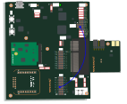
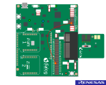
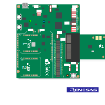
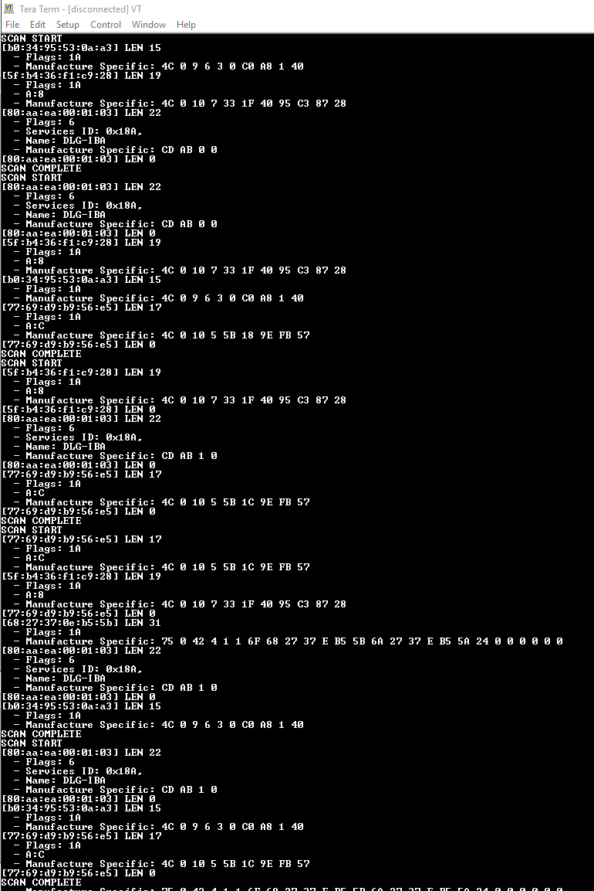

# DA1453x and DA14585/586 Active scanner

## Example description

The device is setup in active scanning mode. On advertising data report, the data is formatted and pushed on the UART. 
The user can read the peripheral advertising data in a friendly way on its serial terminal.

## HW and SW configuration

* **Hardware configuration**

    - This example runs on the DA14585, DA14586 and DA1453x Bluetooth Smart SoC devices.
    - DA14585/DA14586 or DA14531 daughter board + DA145xxDEVKT-P PRO-Motherboard are required.

* **Software configuration**

    - This example requires:
        * [SDK6 latest version](https://www.renesas.com/us/en/document/swo/sdk60221401-da1453x-da145856?r=1564826).
        * SEGGER’s J-Link tools should be downloaded and installed.

For the UART to see the communication logs, check the setup shown below for DA1453x and DA14585/586

# Hardware configuration for the DA14535:

# Hardware configuration for the DA14531:

# Hardware configuration for the DA14585/586:

 

The user manuals for the development kits can be found:

- [Here](http://lpccs-docs.renesas.com/UM-B-117-DA14531-Getting-Started-With-The-Pro-Development-Kit/02_Introduction/Introduction.html) for the DA145xxDEVKT-P PRO-Motherboard.

## How to run the example

For the initial setup of the project that involves linking the SDK to this SW example, please follow the Readme [here](../../Readme.md).

### Initial Setup

 - Start Keil
 - Compile and launch the example
 - Open the development kit serial port with the following parameters

		- baudrate: 115200
		- data: 8 bits
		- stop: 1 bit
		- parity: None
		- flow  control: none

The device should display the advertising data as shown in the picture below

## Known Limitations

- There are no known limitations for this example. But you can check and refer to the following web page [known limitations for SDK6 devices](https://lpccs-docs.renesas.com/sdk6_kll/index.html).
- Renesas Software [Forum link](https://www.dialog-semiconductor.com/forum).
- you can also refer to the [DA14585/DA14586 Getting Started Guide with the PRO-Development Kit](https://lpccs-docs.renesas.com/da14585_getting_started/index.html) or the [DA14531 Getting Started guide](https://lpccs-docs.renesas.com/UM-B-117-DA14531-Getting-Started-With-The-Pro-Development-Kit/index.html).

