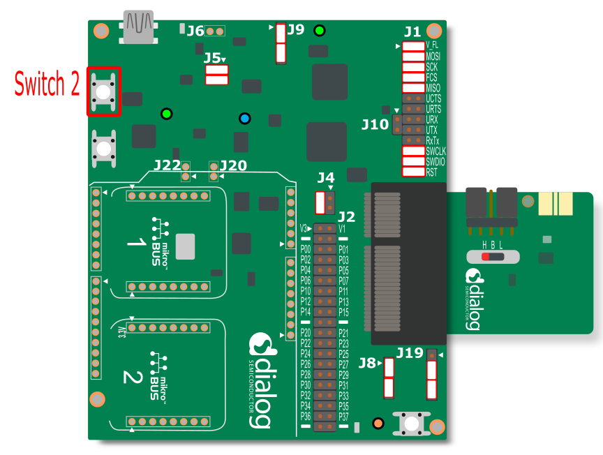
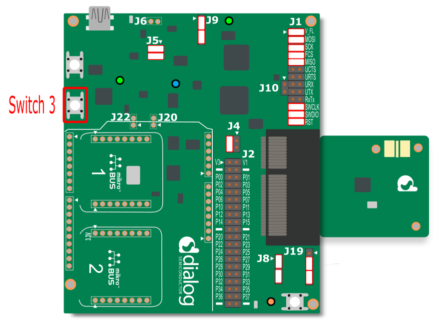
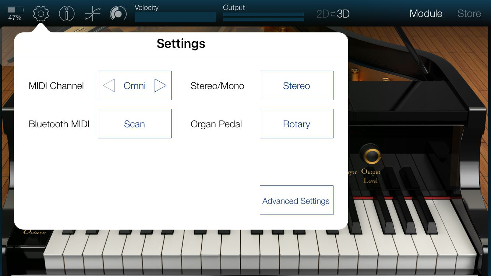
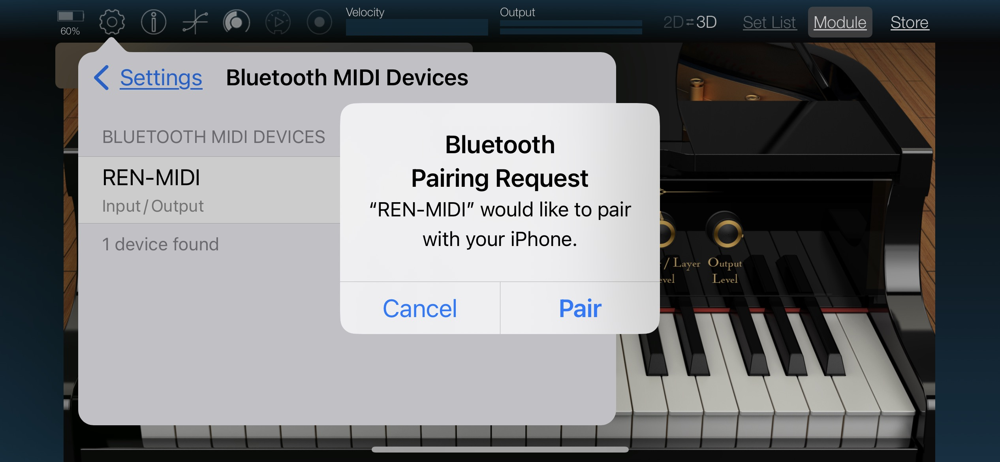

## Example description

This example shows:

- Create MIDI service on BLE peripheral side as [BLE-MIDI specification](https://www.midi.org/specifications-old/item/bluetooth-le-midi) required.
- Demonstrate playing note on an iOS APP that supports MIDI profile, by pressing the buttons on the DA1458x Pro Development kit.

You can watch this intro video:

   

      <video width="800" height="400" controls>
         <source src="midi.mp4" type="video/mp4">
         Your browser does not support this tag!
      </video>
   
<b><i>Demonstration of Dialog SmartBond™ DA14531 Module BLE Midi</i></b>
   
   
 

## HW and SW configuration

- **Hardware configuration**

- This example runs on the DA14531 and DA14585/586 Bluetooth Smart SoC devices.
- The DA145xxDEVKT-P PRO-Motherboard with jumper setting for SPI flash programming. The user manuals for the development kits can be found [Here](https://www.dialog-semiconductor.com/products/da14531-development-kit-pro) for the DA145xxDEVKT-P PRO-Motherboard.

- For the DA14531 getting started guide you can refer to this [LINK](http://lpccs-docs.dialog-semiconductor.com/UM-B-117-DA14531-Getting-Started-With-The-Pro-Development-Kit/index.html)
- For the DA14531 Module getting started guide you can refer to this [LINK](http://lpccs-docs.dialog-semiconductor.com/UM-B-139-Getting-Started-with-DA14531-TINY-Module/index.html)
- For the DA14585/586 getting started guide you can refer to this [LINK](http://lpccs-docs.dialog-semiconductor.com/da14585_getting_started/index.html).

The example is running from SRAM. To run the program from flash please visit chapter 17 of the [SmartSnippets Toolbox User Manual](http://lpccs-docs.dialog-semiconductor.com/UM-B-083/tools/mkImage.html)

* __Hardware configuration DA14531 using DA145xxDEVKT-P PRO-Motherboard__

	- SW2 (button 2) is configured to P0_11, located on J19 (red box)
	- Connect the DA145xxDEVKT-P PRO-Motherboard to the working station through USB1 connector. 

	
	
* **Hardware configuration DA14585 using the DA145xxDEVKT-P PRO-Motherboard**

	- SW3 (button 3) is configured to P1_1, located on J19 (red box)
	- Connect the DA145xxDEVKT-P PRO-Motherboard to the working station through USB1 connector.

	
	
- **Software configuration**
    - [SDK6.0.14](https://www.dialog-semiconductor.com/da14531_sdk_latest)
    - **SEGGER’s J-Link** tools should be downloaded and installed.
    - An iOS smartphone with a MIDI app (for example **KORG Module**).

## How to run the example

### Initial Setup

For the initial setup of the project that involves linking the SDK to this SW example, please follow the Readme [here](https://github.com/dialog-semiconductor/BLE_SDK6_examples).

### Compile & Run

- Navigate to ``project_environment`` folder and open the Keil project.
- Compile and then launch the example. 
- To verify please open **KORG Module** app:

    1. Open Settings page and tap the Scan button

        

    2. Find the device named **DIALOG-MIDI** and connect to it.

        

    3. Pair the device

        

    4. Press the button on the dev-kit to play the note.

        

## Known Limitations

- There are No known limitations for this example. But you can check and refer to the following application note for
[DA14585 known hardware limitations](https://www.dialog-semiconductor.com/sites/default/files/da1458x-knownlimitations_2019_01_07.pdf)
- Refer to the following application note for DA14531 known [hardware limitations](https://www.dialog-semiconductor.com/da14531_HW_Limitation)
- Also refer to Dialog Software [Forum Link](https://support.dialog-semiconductor.com/forum)

