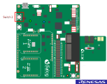
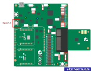
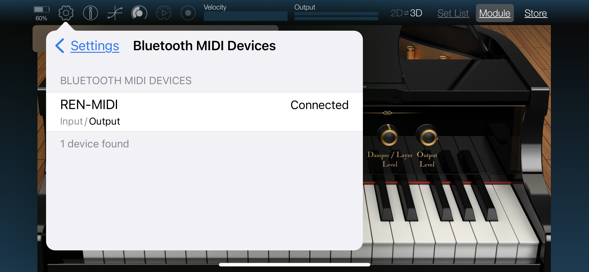

# ble-Midi

## Example description

This example shows:

- Create MIDI service on BLE peripheral side as [BLE-MIDI specification](https://midi.org/specs) required.
- Demonstrate playing note on an iOS APP that supports MIDI profile, by pressing the buttons on the DA14531-00FXDEVKT-P Development kit.

- Devices naming:
    - DA1453x is refering to DA14531-00, DA14531-01, DA14530 and DA14535.
    - DA1458x is refering to DA14585 and DA14586.
    - The DA14531-00 is the main DA14531 device. The -00 is just a new naming to introduce the variant DA14531-01. The DA14531-01 is a ROM variant of the main DA14531-00.
    - The DA14535 is a DA14531 upgrade.

You can watch this intro video:

   

      <video width="800" height="400" controls>
         <source src="midi.mp4" type="video/mp4">
         Your browser does not support this tag!
      </video>
   
<b><i>Demonstration of Renesas SmartBond™ DA14531 Module BLE Midi</i></b>
   
   
 

## HW and SW configuration

- **Hardware configuration**

- This example runs on the DA1453x (DA14531-00, DA14531-01 and DA14535) and DA14585/586 Bluetooth Smart SoC devices.
- The DA145xxDEVKT-P PRO-Motherboard with jumper setting for SPI flash programming. The user manuals for the development kits can be found [Here](https://www.renesas.com/us/en/products/wireless-connectivity/bluetooth-low-energy/da14531-00fxdevkt-p-smartbond-tiny-da14531-bluetooth-low-energy-51-system-chip-development-kit-pro) for the DA145xxDEVKT-P PRO-Motherboard.

- For the DA14531 getting started guide you can refer to [UM-B-117](https://lpccs-docs.renesas.com/UM-B-117-DA14531-Getting-Started-With-The-Pro-Development-Kit/index.html)

- For the DA14535 getting started guide you can refer to this [UM-B-165](https://lpccs-docs.renesas.com/DA14535/UM-B-165-DA14531-Getting-Started-With-The-Pro-Development-Kit/index.html#device-family-getting-started-with-the-pro-development-kits)

- For the DA14531 Module getting started guide you can refer to this [UM-B-139](https://lpccs-docs.renesas.com/UM-B-139-Getting-Started-with-DA14531-TINY-Module/index.html)
- For the DA14585/586 getting started guide you can refer to this [UM-B-049](https://lpccs-docs.renesas.com/da14585_getting_started/index.html).

The example is running from SRAM. To run the program from flash please visit section 3.1 of the [UM-B-083 SmartSnippets Toolbox User Manual](https://lpccs-docs.renesas.com/UM-B-083/index.html)

* __Hardware configuration DA1453x using DA145xxDEVKT-P PRO-Motherboard__

	- SW2 (button 2) is configured to P0_11, located on J19 (red box)
	- Connect the DA145xxDEVKT-P PRO-Motherboard to the working station through USB1 connector. 

	
    
    - 
	
* **Hardware configuration DA14585 using the DA145xxDEVKT-P PRO-Motherboard**

	- SW3 (button 3) is configured to P1_1, located on J19 (red box)
	- Connect the DA145xxDEVKT-P PRO-Motherboard to the working station through USB1 connector.

	
	
- **Software configuration**
    - [SDK6 latest version](https://www.renesas.com/sdk6_latest)
    - **SEGGER’s J-Link** tools should be downloaded and installed.
    - An iOS smartphone with a MIDI app (for example **KORG Module**).

## How to run the example

### Initial Setup

For the initial setup of the project that involves linking the SDK to this SW example, please follow the Readme [here](../../Readme.md).

### Compile & Run

- Navigate to ``project_environment`` folder and open the Keil project.
- Compile and then launch the example. 
- To verify please open **KORG Module** app:

    1. Open Settings page and tap the Scan button

        

    2. Find the device named **REN-MIDI** and connect to it.

        

    3. Pair the device

        

    4. Device conected

            

    4. Press the button on the dev-kit to play the note.

        

## Known Limitations

- There are No known limitations for this example. But you can check and refer to the following application note for
[SDK6 known limitations](https://lpccs-docs.renesas.com/sdk6_kll/index.html)

## Feedback and support ?

If you have any comments or suggestions about this document, you to contact us through:

- [Wireless Connectivity Forum](https://community.renesas.com/wireles-connectivity)

- [Contact Technical Support](https://www.renesas.com/eu/en/support?nid=1564826&issue_type=technical)

- [Contact a Sales Representative](https://www.renesas.com/eu/en/buy-sample/locations)

