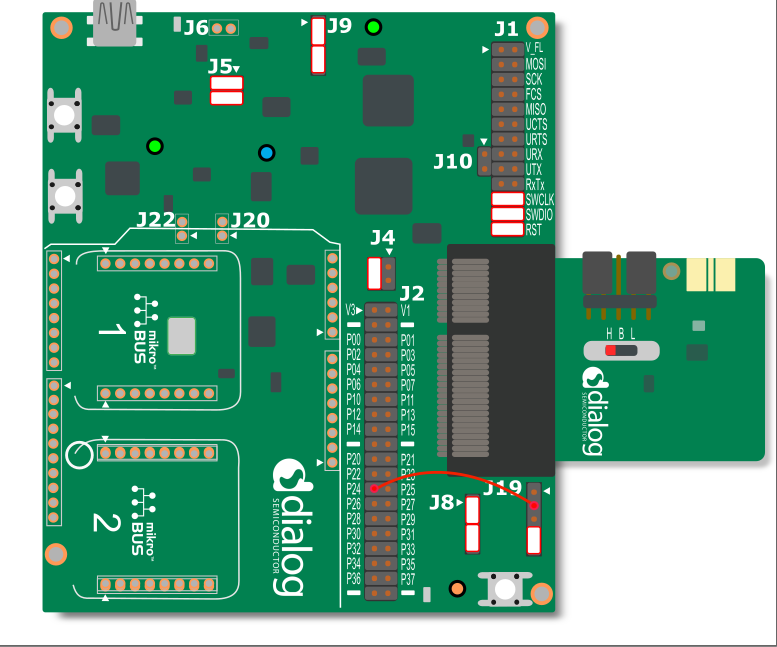
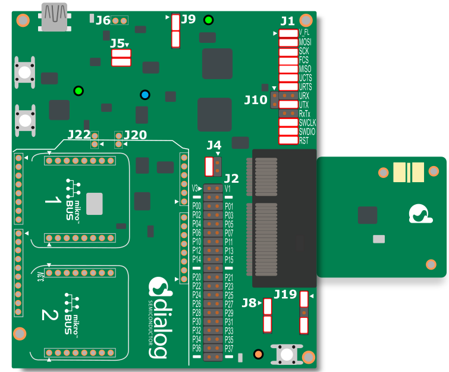
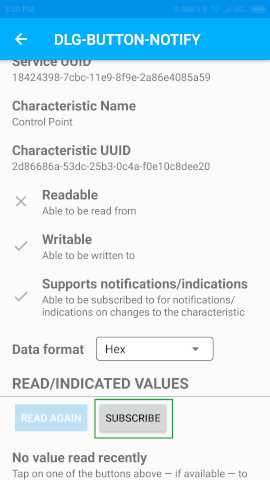
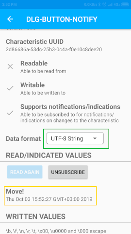

# BLE Notifications on Button Press with Wake-up Controller

## Example description

This example shows how to configure a DA14531 or DA14585/586 device to send notifications to a BLE central by button presses. The application advertises its presence and waits for a connection. When a central is connected and enables notifications, the application will be able to deliver notifications when the user presses one of the programmable buttons. The service also waits for a predefined message to which it will respond. 

## HW and SW configuration
- This example runs on the DA14531 or DA14585/586 Bluetooth Smart SoC devices.	
- The DA145xx Pro Development Kit is needed for this example, and it can be used with either the DA14531 or DA14585/DA14586 daughterboard evaluation kits.

### Hardware configuration for the DA14531

- Connect the USB1 connector of the DA145xx Pro Development Kit to the host computer.
- Connect the P24 pin on header J2 with the second pin on header J19 as shown in the figure below (the mark indicates the first pin). Connect with a jumper the third and fourth pins.
 
	

### Hardware configuration for the DA14585/586

- Connect the USB1 connector of the DA145xx Pro Development Kit to the host computer.
- Connect with a jumper the first and second pins on the J19 header (the mark indicates the first pin). Connect also with a jumper the fourth and fifth pins, as indicated in the figure below.
 
	

### Software configuration

 This example requires:
 - [SDK6.0.14](https://www.dialog-semiconductor.com/da14531_sdk_latest).
 - **SEGGER’s J-Link** tools should be downloaded and installed.
 - Additionaly, an application like LightBlue Explorer must be used to act as a BLE central. It can be found on [Google Play](https://play.google.com/store/apps/details?id=com.punchthrough.lightblueexplorer) or on the [App Store](https://apps.apple.com/gb/app/lightblue-explorer/id557428110).

## How to run the example

For the initial setup of the project that involves linking the SDK to this SW example, please follow the Readme [here](../../Readme.md).

### Initial Setup

 - Start Keil
 - Select the DA14531, DA14585 or DA14586 device in the box shown below 

	

 - Compile and launch the example

 ### Connecting to the device
 The following instructions are using the LightBlue Explorer app.
 - Start the LightBlue Explorer. The application will list all the Bluetooth devices that are advertising. 
 - Connect to the `DLG_BUTTON_NOTIFY` device
 	
	 

 - Once connected, the application will list all discovered services. Connect to the service named `Control Point`.

  	

 - Press the subscribe button to subscribe to notifications.

  	

- Change the data format to `UTF-8 String` and then press the SW3 button on the Pro Development Kit. The device will respond with a notification with the text "Move!"

  	

- Press the SW2 button on the Pro Development Kit. The device will respond with a notification with the text "Stop!"

  	

- In the Written Values field, enter the text "Marco?" in the text box as shown below. Beware to remove any trailing spaces, and press `Write`.

  	

- You'll immediately see the device responding "Polo!".

	

	
## Known Limitations

- There are no known limitations for this example. But you can check and refer to the following application note for
[known hardware limitations for DA1458x devices](https://www.dialog-semiconductor.com/sites/default/files/da1458x-knownlimitations_2019_01_07.pdf) or [known hardware limitations for DA14531 devices](https://www.dialog-semiconductor.com/da14531_HW_Limitation).
- Dialog Software [Forum link](https://www.dialog-semiconductor.com/forum).
- you can also refer to the [DA14585/DA14586 Getting Started Guide with the PRO-Development Kit](http://lpccs-docs.dialog-semiconductor.com/da14585_getting_started/index.html) or the [DA14531 Getting Started guide](https://www.dialog-semiconductor.com/da14531-getting-started).

