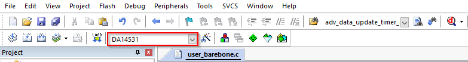
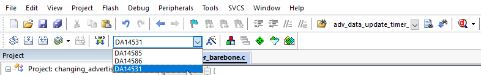

# ble GATT Role for indication

## Example description

This example shows:
- How to use I2C to read HS3001 temperature register.
- How to use I2C to write HS3001 humidity register.
- This example uses the [HS3001 High-Performance Relative Humidity and Temperature Sensor ](https://www.renesas.com/us/en/products/sensor-products/humidity-sensors/hs3001-high-performance-relative-humidity-and-temperature-sensor) from Renesas.
- How to create a custom profile for two or more services.
- How to configure DA14531 GAP peripheral as a GATT server with Indication characteristic.
- How to send GATT indications


## Profile
It's a pre-defined collection of Services that has been compiled by either the Bluetooth SIG or by the peripheral designers.
## Service
Services are used to break data up into logical entities, and contain specific chunks of data called characteristics.
Each service distinguishes itself from other services by means of a unique numeric ID called a UUID.

# GAP & GATT
It's critical to understand the differences between GAP and GATT.

The general topology of the BLE network stack is specified by GAP.
Once devices have a dedicated connection, GATT goes into great detail about the transfer of attributes (data).
GATT specifically concentrates on how data is packaged, structured, and delivered in accordance with its specified criteria. 
The Attribute Protocol (ATT), which GATT directly sits on top of in the BLE network stack, is closely linked with ATT. 
In fact, GATT employs ATT to explain how data is sent between two connected devices.

You can find more information about the Attribute Protocol in the BLE network stack at following link :
[Renesas tutorial](http://lpccs-docs.dialog-semiconductor.com/tutorial-custom-profile-DA145xx/introduction.html )

 **_NOTE:_**  Peripheral or central devices can BOTH act as a server or client, depending on how data is flowing.

## Short Summary on GATT:

GATT Operations are responsible for Data Transfer.
GATT Operations are dictated by Properties of GATT Characteristics. 
These properties are:
Read: The client can Read the value of the Characteristic
Write: The client can Write value to the Characteristic but client expects a response (ack) from server. 
Write with No Response: The client can Write value to the Characteristic
Indicate: The server can send data anytime to the client if it wishes to but server expects a response (ack) from client
Notify: Same as indication but no response is expected from Client.


 **_NOTE:_**  In this example we are illustrating only indication

## HW and SW configuration

This example runs on the BLE "SmartBond device family" devices:
- DA1453x daughter board + DA14531DEVKT-P or DA1453xDEVKT-P .

The user manuals for the development kits & HS3001 can be found:
- [Here](https://www.renesas.com/eu/en/document/mat/um-b-114-da14531-development-kit-pro-hardware-user-manual) for the DA145xxDEVKT-P PRO-Motherboard.
- [Here](https://www.renesas.com/eu/en/document/mat/um-b-117-da14531-getting-started-pro-development-kit-html-chinese) for getting started with Pro Development kit.
- [Here](https://www.renesas.com/us/en/document/dst/hs300x-datasheet) for HS3001.


## HS3001 pin configuration:

In `user_periph_setup.h` you can check the following configuration for I2c.It is also possible to modify according to your needs:

```c
#define I2C_SLAVE_ADDRESS           0x44                   // Set slave device address
#define I2C_SPEED_MODE              I2C_SPEED_FAST        // Speed mode: 	I2C_SPEED_FAST (400 kbits/s)
#define I2C_ADDRESS_MODE            I2C_ADDRESSING_7B     // Addressing mode: I2C_ADDRESSING_7B
#define I2C_ADDRESS_SIZE            I2C_1BYTES_ADDR       // Address width: 	I2C_1BYTE_ADDR 

```
## Hardware configuration:
Regarding following figure you can connect the sensor to the development board.


In the same header file you can see the following configuration for HS3001:

```c

#define HS3001_SCL_PORT            GPIO_PORT_0
#define HS3001_SCL_PIN	           GPIO_PIN_6
#define HS3001_SDA_PORT            GPIO_PORT_0
#define HS3001_SDA_PIN             GPIO_PIN_7

```

## How to run the example

### Setup
For the initial setup of the project that involves linking the SDK to this SW example, please follow the Readme [here](../../Readme.md).

1. Start Keil using the `ble_app_indication_HS3001.uvprojx` Keil project file.

2. Expand the dialog shown in the red box in the image below.



1. Select your device: DA14531, DA14586 or DA14585.
		



## Expected Results

1. Open the BLE scanner app and look for "REN_HS3001_BLE_IND".

2. Connect to the device.

3. Subscribe to the indication.

If everything went well, you should be able to receive temperature & humidity data as the value of the custom characteristic whenever there is a change in the values, as shown in the image below.

You can use different software on your phone to connect and receive the data. For example:


[SmartBond](https://play.google.com/store/apps/details?id=com.renesas.smartbond&hl=it&gl=US)

or

[LightBlue](https://play.google.com/store/apps/details?id=com.punchthrough.lightblueexplorer&hl=nl)


# In the next figures you can see the expected result on Lightblue
when you turn on your Bluetooth device and start to scan you can find the advertisement for Bluetooth under the name of `REN_HS3001_BLE_IND`.


### If you subscribe for each service indication you can receive data as soon as there is a change. 


### if you scroll down you see temperature and humidy :


### for each services you can subscribe and receive the data whenever there is a change:


### Temperature:


### Humidity:


## In the next figures you can see the expected result on SmartBond:


### Search for when you turn on your Bluetooth device and start to scan you can find the advertisement for Bluetooth under the name of `REN_HS3001_BLE_IND` :


### Open Unkown `services and subscribe` :


### Click on the bell sign and subscribe for each service you desired to connect: 


## Example description


 **_NOTE :_**   You can find custom profile Tutorial on [Renesas support](http://lpccs-docs.dialog-semiconductor.com/tutorial-custom-profile-DA145xx/introduction.html) by this you can make your own custom profile. 


 **_1_**  The **user_catch_rest_hndl** function in `user_peripheral.c` will handle the messages for our custom profile. 


 **_2_**  There are two possible custom services for this application: write to the indicator.


 **_3_**  The **user_temperature_message_handler** or **user_humidity_message_handler** function is called whenever there is a change in temperature or humidity. 
This function will examine the write's content. 


 **_4_**  The temperature timer is terminated if the content of the write is equal to zero. If the value is different, a timer is created that calls **user_send_temperature_ind** or **user_send_humidity_ind** after INDICATION_DELAY ms. 


 **_5_**  The sensor data will be read out and converted to a string (for demonstration purposes) using the **user_send_temperature_ind** or **user_send_humidity_ind** functions.
 **_6_**  Along with some other parameters, such as the connection ID, the string will be included in a message and the characteristic handle. 


 **_7_**  After the message is sent, the app_easy_timer function is used to schedule the next call to  **user_send_temperature_ind** or **user_send_humidity_ind** function. This will ensure the temperature or humidity is transmitted regularly and after each change the user will receive an indication. The `app_easy_timer`function
has a resolution of 10ms hence we divide the desired delay in ms by 10. 


## Further reading

- [Wireless Connectivity Forum](https://lpccs-docs.renesas.com/lpc_docs_index/DA145xx.html)


## Known Limitations

- There are no known limitations for this example. But you can check and refer to the following application note for
[SDK6 known limitations](https://lpccs-docs.renesas.com/sdk6_kll/index.html)

## Feedback and support ?

If you have any comments or suggestions about this document, you can contact us through:

- [Wireless Connectivity Forum](https://community.renesas.com/wireles-connectivity)

- [Contact Technical Support](https://www.renesas.com/eu/en/support?nid=1564826&issue_type=technical)

- [Contact a Sales Representative](https://www.renesas.com/eu/en/buy-sample/locations)

