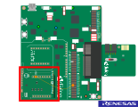
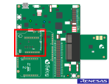
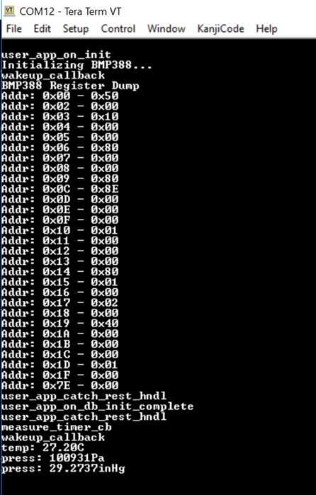
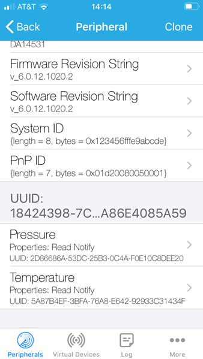

# ble_pressure_sensor_bmp388

## Example description

Simple example showing how to interface the DA14585/586 and DA14531 with the [PRESSURE 5 CLICK Board™](https://www.mikroe.com/pressure-5-click) which features the Bosch BMP388 Digital Pressure Sensor via I2C or SPI. 
When connected to a BLE central this example allows the measured pressure and temperature values to be read. 

## HW and SW configuration

### **Hardware configuration**

- This example runs on the DA14585, DA14586 and DA14531 Bluetooth Smart SoC devices.
- DA14585/DA14586 or DA14531 daughter board + DA145xxDEVKT-P PRO-Motherboard and a MikroBUS™ Pressure 5 Click Board™ are required.

### **Software configuration**
- This example requires:
  * [SDK6 latest version](https://www.renesas.com/eu/en/document/swo/sdk601811821-da1453x-da145856?r=1564826).
  * SEGGER’s J-Link tools should be downloaded and installed.

The user manuals for the development kits can be found:

- [Here](https://www.renesas.com/eu/en/document/mat/um-b-117-da14531-getting-started-pro-development-kit-html-chinese?r=1564826) for the DA145xxDEVKT-P PRO-Motherboard.

## How to run the example

For the initial setup of the project that involves linking the SDK to this SW example, please follow the Readme [here](../../Readme.md).

### Hardware configuration DA14531 using DA145xxDEVKT-P PRO-Motherboard

Connect the Pressure 5 Click Board™ to the **MikroBUS™ 2** interface on the Development Kit PRO motherboard (this will require soldering sockets into the locations for connectors J17 and J18):

Apply the jumper configuration of the image shown below.

You'll also need to connect the following jumper wire to the Development Kit PRO motherboard this is to connect the INT pin on the Pressure 5 Click to P0_8 on the DA14531 because 
the label of J18, pin 2 which indicated as P3_1 unconnected.

**NOTE 1**

The BMP388 has both SPI and I2C interfaces. By default, the MikroBUS™ board, and this example, are configured to use the SPI interface. 

**NOTE 2**

When using the I2C interface, **the JTAG/Debug interface will be no longer available** because the **P0_2** is shared between the **SWCLK** and the **I2C clock**.
This is why you can programme the onboard SPI flash with the generated binary and remove after that the JTAG debug Jumpers (J1:21-22 and J1:23-24). 
You can refer to the [section 16:SPI Flash Programmer](https://s3.eu-west-2.amazonaws.com/lpccs-docs.dialog-semiconductor.com/UM-B-083/tools/SPIFlashProgrammer.html) to see how to program the SPI flash with the Smarsnippets Toolbox.

If you would like to use the JTAG interface for debug purpose you have to choose different i2C GPIOs configurations. Be sure to update the `user_periph_setup.h` with the following configuration as an example:

	#define BMP388_I2C_SCL_PORT     GPIO_PORT_0
	#define BMP388_I2C_SCL_PIN      GPIO_PIN_1
	#define BMP388_I2C_SDA_PORT     GPIO_PORT_0
	#define BMP388_I2C_SDA_PIN      GPIO_PIN_3

Then use jumpers wires to establish following connections between the DA145xxDEVKT-P PRO-Motherboard and the sensor click board:
 
	- Connect Vdd to V3 on J2.
	- Connect Gnd to ground on J2.
	- Connect SCL to P21 on J2.
	- Connect SDA to P23 on J2.

**NOTE 3**

If you want to use the I2C interface, you will also need to configure the example by changing the BMP interface type in the file `bmp388.h ` as follows:

        #define BMP388_INTERFACE          BMP388_I2C

**NOTE 4**

Finally, you'll need to change the jumper settings on the BMP388 MikroBUS™ board to use the I2C interface. See [Pressure-5-click](https://www.mikroe.com/pressure-5-click) for further details.

### Hardware configuration DA14585/DA14586 using DA145xxDEVKT-P PRO-Motherboard

Plug the Pressure 5 Click board™ to the **MikroBUS™ 1** interface (J15-J16).	

**NOTE 5**

If you want to use the I2C interface, no jumpers wires are required, you can refer only to **NOTE 3** and **NOTE 4**.

### Setup

- Setup a terminal (such as TeraTerm) so you can monitor the UART debug output from the DA14531: 

        - baudrate: 115200
        - data: 8 bits
        - stop: 1 bit
        - parity: None
        - flow control: none

- Build and download the example using the Keil IDE. 

- Run the example using the Keil debugger.

- Monitor the debug output using the terminal you setup in step 3 and you should see the following:

 
- Now connect to the device using a Smart Device running an App such as LightBlue. The example advertises with the name "DIALOG-BMP388":

- You'll now be able to see a custom service with characteristics that allow reading of the current pressure and temperature levels read by the sensor.

## Further reading

- [Wireless Connectivity Forum](https://lpccs-docs.renesas.com/lpc_docs_index/DA145xx.html)

## Known Limitations

- There are no known limitations for this example. But you can check and refer to the following application note for
[SDK6 known limitations](https://lpccs-docs.renesas.com/sdk6_kll/index.html)

## Feedback and support ?

If you have any comments or suggestions about this document, you can contact us through:

- [Wireless Connectivity Forum](https://community.renesas.com/wireles-connectivity)

- [Contact Technical Support](https://www.renesas.com/eu/en/support?nid=1564826&issue_type=technical)

- [Contact a Sales Representative](https://www.renesas.com/eu/en/buy-sample/locations)

