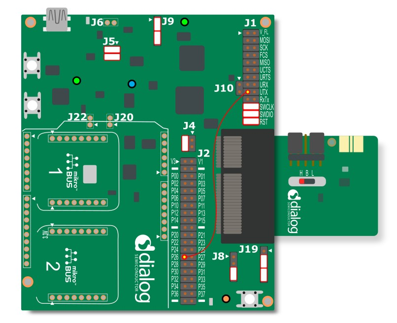
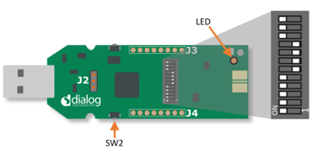
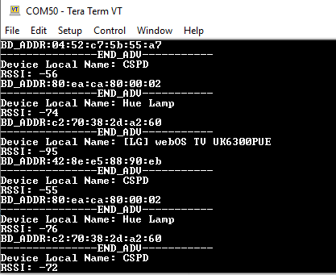
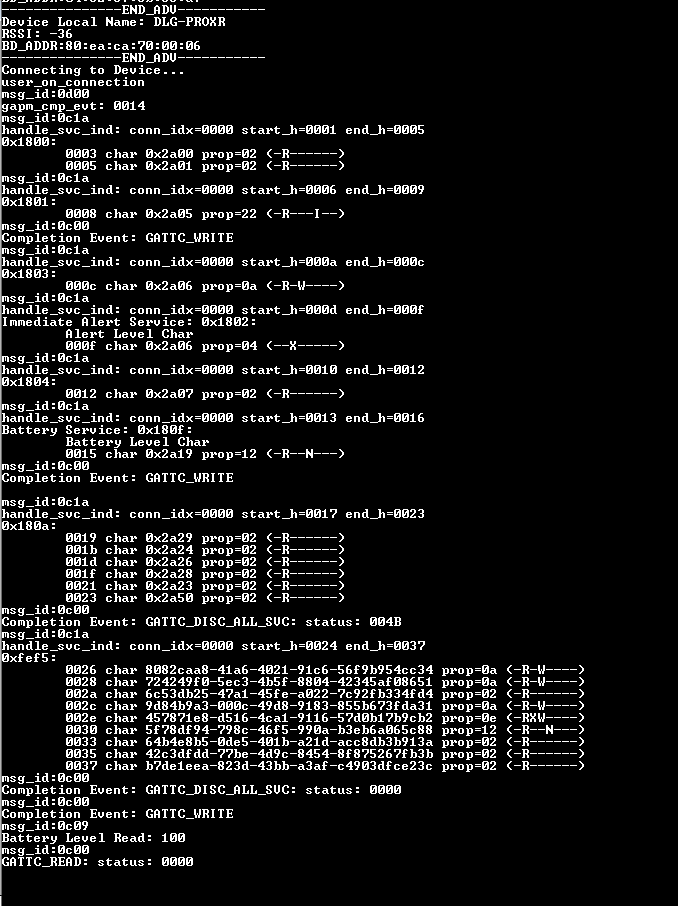
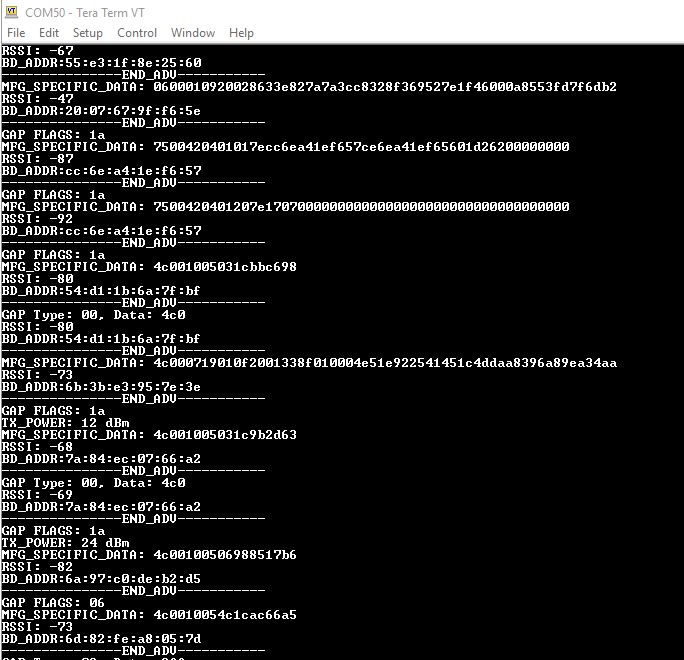

# DA14585/DA14586/DA14531 Central Implementation

---

## Example description

This project is intended to illustrate to the user:
- How to scan for peer devices
- How to parse advertisement data during the scan process
- How to connect to a peer device
- How to do a service discovery and parse the services for characteristic values
- How to perform GATT Reads, Writes, and handle notifications

This functionality can be verified by:
- Connecting to another peripheral device (Out of the Box supports Proximity Reporter)
- Reading serial output from the device.
	

## HW and SW configuration
This example runs on the BLE Smart SoC (System on Chip) devices:
- DA14585/DA14586 or DA14531 daughter board + DA145xxDEVKT-P PRO-Motherboard.
- DA14585/DA14586 Basic development Kit.
- DA14531 USB Kit

The user manuals for the development kits can be found:
- [DA14531 Development Kit Product page](https://www.dialog-semiconductor.com/products/da14531-development-kit-pro) for the DA145xxDEVKT-P PRO-Motherboard.
- [DA14585 Development Kit Basic](https://www.dialog-semiconductor.com/products/da14585-development-kit-basic) for the Basic Development Kit.
- [DA14531 USB Development Kit Product page](https://www.dialog-semiconductor.com/products/da14531-development-kit-usb) for the DA14531 USB Development Kit.

* **Hardware configuration DA14585 using the DA145xxDEVKT-P PRO-Motherboard**

	- When using DA14585/DA14586, witht the proper project configuration, the UTX jumper needs to be placed.
	
	- When using DA14531, Jumper P2_6 from J2 to UTX (Pin 17 on J1) for serial UART communication.
	
	.
	
    - When using DA14531 USB development kit no hardware configuration is needed. You need only to Redefine the UART2_TX_PIN to GPIO_PIN_5 (1 wire UART ) 
	  
	  **#define UART2_TX_PIN            GPIO_PIN_5**

	.
	
* **Software configuration**

	- This example requires:
    * SDK6.0.12 or Newer (Older versions of SDK6 require minimal changes)
	- **SEGGER’s J-Link** tools should be downloaded and installed.

## How to run the example
### Setup

Before launching the Keil project, make sure to link the SDK and project environment using the Python linker script `dlg_make_keil_vx.xxx`. More information [here](https://www.dialog-semiconductor.com/sites/default/files/sw-example-da145x-example-setup.pdf).
-Start Keil using the `central` Keil project file.

2. Expand the dialog shown in the red box in the image below.
	
	

3. Select your target device: DA14531, DA14585, DA14586

4. Open your favorite serial terminal application, e.g. TeraTerm, RealTerm, Putty - use 921600, 8, N, 1 as your settings. (A significant amount of traffic can occur during the scanning process)

5. Compile (F7) and launch (ctrl + F5) the example.\
If the warning (shown below) pops up press OK.

### Running the Example - Scan and Connect

1. Verify that your central started via the Terminal.  The default settings of the central will start scanning for devices that use a GAP_LOCAL_NAME (0x09) GAP flag type. If there are no devices in the area, there will be no output. 
	

2. The project is configured to filter for proximity reporters and to connect to the first advertismenet seen. On a seperate board, run proximity reporter.  Go within the SDK to target_apps/ble_examples/prox_reporter, open the project and compile and run as you did for this example.

3. If running from JTAG and the original example is deployed via JTAG, be sure to assign the proper JTAG serial number to each target.  In Keil, this can be done by right clicking on the project and going to Options for Target ....  Go to Debug then settings and select the serial number that matches the sticker on the board.

	
	
3. Once running, verify in the terminal that you see output for the connection and service discovery. 
	
	

4. After the service discovery, you can press the button the central device.  This will write to the alert service and start blinking the LED on the proximity reporter.  You should also see the write over the terminal if sent properly.

	
	
### Running the Example - Scan for all devices

1.  The project can be configured to filter on multiple GAP flags.  

2.  Go into user_central_config.h and change SCAN_FILTER to SCAN_FILTER_NONE

3.  Compile and Running

4.  All Local BLE devices will now be displayed over the terminal.

	

### General Project Notes
 - This example illustrates the basic building blocks for implementing a central device.  The 5xx devices are limited on memory and this should be taken into consideration
when implementing a central on the 5xx devices, is the limitaiton on memory.  The central devices should be geared more toward specific applications, opposed to a more generic central.  
This example was written generically enough that it can be exanded on for a central application.

- This example is written in a manner to have the capability of supporting more than one connection.  It must be noted that multiple connections requires
some slight modifications of the SDK, but is possible.  The 58x supports 6-8 connections where the 531 is limited to 3.

## Known Limitations

- There are no known limitations for this example. But you can check and refer to the following 
  application note for known hardware limitations.
For DA14531 devices:
  [DA14531 hardware limitations](https://www.dialog-semiconductor.com/sites/default/files/da14531_errata_1v0.pdf)
For DA14585 devices:
  [DA14585 hardware limitations](https://www.dialog-semiconductor.com/sites/default/files/da1458x-knownlimitations_2019_01_07.pdf)
- Dialog Software [Forum Link](https://support.dialog-semiconductor.com/forums/dialog-smartbond-bluetooth-low-energy-%E2%80%93-software "Forum Link").
- You can also refer to the troubleshooting section in the [Getting Started with the DA14531 PRO Development Kit](http://lpccs-docs.dialog-semiconductor.com/UM-B-117-DA14531-Getting-Started-With-The-Pro-Development-Kit/index.html).

