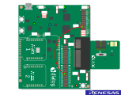
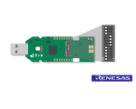

# DA1453x/DA1458x Central Implementation

## Example description

This project is intended to illustrate to the user:

- How to scan for peer devices
- How to parse advertisement data during the scan process
- How to connect to a peer device
- How to do a service discovery and parse the services for characteristic values
- How to perform GATT Reads, Writes, and handle notifications

This functionality can be verified by:

- Connecting to another peripheral device (Out of the Box supports Proximity Reporter)
- Reading serial output from the device.

Devices naming:

- DA1453x is refering to DA14531-00, DA14531-01, DA14530 and DA14535.
- DA1458x is refering to DA14585 and DA14586.
- The DA14531-00 is the main DA14531 device.
-  The -00 is just a new naming to introduce the variant DA14531-01. 
- The DA14531-01 is a ROM variant of the main DA14531-00, not supported by this example.
- The DA14535 is a DA14531 upgrade.	

## HW and SW configuration

This example runs on the BLE Smart SoC (System on Chip) devices:

- DA14585/DA14586 or DA14531 daughter board + DA145xxDEVKT-P PRO-Motherboard.
- DA14585/DA14586 Basic development Kit.
- DA14531 USB Kit

- For the DA14531 getting started guide you can refer to [UM-B-117](https://lpccs-docs.renesas.com/UM-B-117-DA14531-Getting-Started-With-The-Pro-Development-Kit/index.html)

- For the DA14535 getting started guide you can refer to this [UM-B-165](https://lpccs-docs.renesas.com/DA14535/UM-B-165-DA14531-Getting-Started-With-The-Pro-Development-Kit/index.html#device-family-getting-started-with-the-pro-development-kits)

- For the DA14531 Module getting started guide you can refer to this [UM-B-139](https://lpccs-docs.renesas.com/UM-B-139-Getting-Started-with-DA14531-TINY-Module/index.html)
- For the DA14585/586 getting started guide you can refer to this [UM-B-049](https://lpccs-docs.renesas.com/da14585_getting_started/index.html).

* **Hardware configuration using the DA145xxDEVKT-P PRO-Motherboard**

	- When using DA14585/DA14586, with the proper project configuration, the UTX jumper needs to be placed.
	
	- When using DA14531, Jumper P2_6 from J2 to UTX (Pin 17 on J1) for serial UART communication.
	
	.
	
    - When using DA14531 USB development kit no hardware configuration is needed. You need only to Redefine the UART2_TX_PIN to GPIO_PIN_5 (1 wire UART ) 
	  
	  **#define UART2_TX_PIN            GPIO_PIN_5**

	.
	- This example works also on the DA1453x DEVKT-P with with any DA1453x Daughterboard
		

* **Software configuration**

This example requires:
- [SDK6 latest version](https://www.renesas.com/sdk6_latest)
- SEGGER’s J-Link tools should be downloaded and installed.

## How to run the example

### Setup

For the initial setup of the project that involves linking the SDK to this SW example, please follow the Readme [here](../../Readme.md).

-Start Keil using the `central` Keil project file.

2. Expand the dialog shown in the red box in the image below.
	
	

3. Select your target device: DA14531, DA14585, DA14586

4. Open your favorite serial terminal application, e.g. TeraTerm, RealTerm, Putty - use 921600, 8, N, 1 as your settings. (A significant amount of traffic can occur during the scanning process)

5. Compile (F7) and launch (ctrl + F5) the example.\
If the warning (shown below) pops up press OK.

### Running the Example - Scan and Connect

1. Verify that your central started via the Terminal.  The default settings of the central will start scanning for devices that use a GAP_LOCAL_NAME (0x09) GAP flag type. If there are no devices in the area, there will be no output. 
	

2. The project is configured to filter for proximity reporters and to connect to the first advertisement seen. On a separate board, run proximity reporter.  Go within the SDK to target_apps/ble_examples/prox_reporter, open the project and compile and run as you did for this example.

3. If running from JTAG and the original example is deployed via JTAG, be sure to assign the proper JTAG serial number to each target.  In Keil, this can be done by right clicking on the project and going to Options for Target ....  Go to Debug then settings and select the serial number that matches the sticker on the board.

	
	
3. Once running, verify in the terminal that you see output for the connection and service discovery. 
	
	

4. After the service discovery, you can press the button the central device.  This will write to the alert service and start blinking the LED on the proximity reporter.  You should also see the write over the terminal if sent properly.

	
	
### Running the Example - Scan for all devices

1.  The project can be configured to filter on multiple GAP flags.  

2.  Go into user_central_config.h and change SCAN_FILTER to SCAN_FILTER_NONE

3.  Compile and Running

4.  All Local BLE devices will now be displayed over the terminal.

	

### General Project Notes
 - This example illustrates the basic building blocks for implementing a central device.  The 5xx devices are limited on memory and this should be taken into consideration
when implementing a central on the 5xx devices, is the limitation on memory.  The central devices should be geared more toward specific applications, opposed to a more generic central.  
This example was written generically enough that it can be exanded on for a central application.

- This example is written in a manner to have the capability of supporting more than one connection.  It must be noted that multiple connections requires
some slight modifications of the SDK, but is possible.  The 58x supports 6-8 connections where the 531 is limited to 3.

## Description of functions

The application functionality is broken up into three source code files: user_central_app.c, user_ble_gap.c and user_ble_gatt.c. The description of the most important functions is as follows:

1.  user_central_app.c
    -   app_button_press_cb: The function that will be called back when the button is pressed and the associated interrupt triggered. It will perform a write alert level to the Immediate Alert Service for every connected peripheral.
	-   configure_alert_button: Register the callback function and the interrupt which will fire on button press.
	-	handle_service_disc_finished: Will be called when a message is delivered to the application task which signals that the Service Discovery has finished. If the Battery Service is enabled on the peripheral, it will read the Battery Level and configure the button for alert.
	-	user_on_adv_report_ind: Application hook which formats and outputs the advertising reports and saves the identity of the peripheral for later connection.
	-	user_on_connection: Application hook for a connection event. It will trigger a Service Discovery. 
	-	handle_svc_ind: Outputs information of the Characteristics during the Service Discovery and checks for the Battery Service and Immediate Alert Service. Handles, UUIDs, properties etc. can be checked here for later processing and use by the application. 
2.	user_ble_gap.c
	-	user_ble_gap_start_scan: Configures scanning parameters and starts scanning for peripherals.
	-	user_ble_gap_connect: Initiates a connection request.
3.	user_ble_gatt.c
	-	user_gatt_discover_all_services: Starts a Service Discovery for all handle values (0 to maximum permitted, 0xFF).
	-	user_ble_gatt_write: Helper function to write values to Characteristics.
	-	user_gatt_read_simple: Helper function to read the value of a Characteristic.
	-	user_gatt_parse_service: Parses a service.

## Further reading

- [Wireless Connectivity Forum](https://lpccs-docs.renesas.com/lpc_docs_index/DA145xx.html)

## Known Limitations

- There are no known limitations for this example. But you can check and refer to the following application note for
[SDK6 known limitations](https://lpccs-docs.renesas.com/sdk6_kll/index.html)

## Feedback and support ?

If you have any comments or suggestions about this document, you can contact us through:

- [Wireless Connectivity Forum](https://community.renesas.com/wireles-connectivity)

- [Contact Technical Support](https://www.renesas.com/eu/en/support?nid=1564826&issue_type=technical)

- [Contact a Sales Representative](https://www.renesas.com/eu/en/buy-sample/locations)

