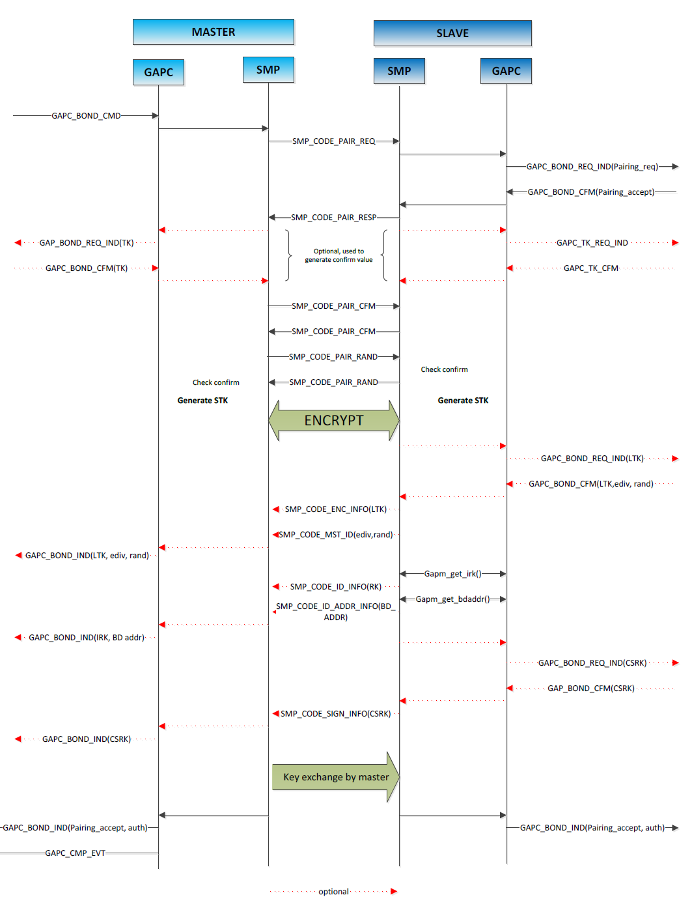
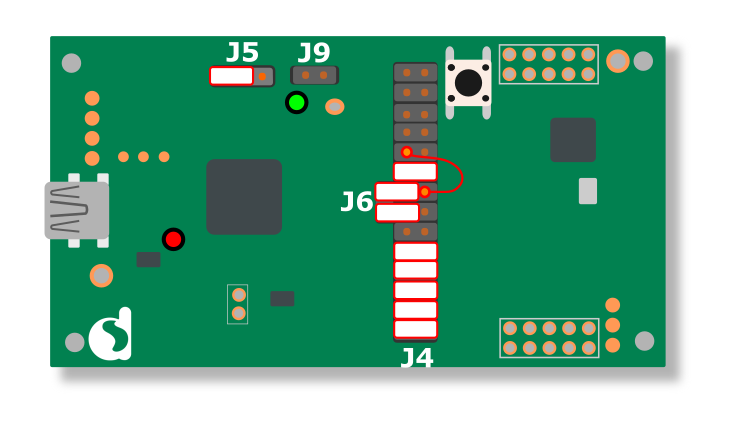

# BLE Central Security Demo Project


## Example description
A DA14585/6 or DA14531 Central side project with basic scan/connect and security feature. The main purpose is to demonstrate the basic pairing, encryption and bonding process on central side.
It will actively pair up with peripheral devices and store bonding information on connection or passively respond to security request from peripheral. None SDK related functions on both central and peripheral sides can be printed to track the process of pairing/bonding process.

# Features
1. Interactive scanner through the UART serial port terminal
2. Pairing process actively started by central side on connection or passively triggered by security request from peripheral side
3. Attempt to directly encrypt the connection instead of pairing if the bonding info already exists
4. Attempt to relaunch pairing process if peripheral side is missing previousely bonded key **(SDK code modification required for this feature)**

# How security binding works
To learn basic security feature of BLE, please refer to the [training material](https://support.dialog-semiconductor.com/resource/tutorial-5-ble-security-examplev12 "BLE Security Tutorial") from the support website.

The pairing and bonding process is a series of command and credential info exchange happening between master and slave devices, after which both device stores the information for encrypt the connection. The info will be stored in a dedicated bonding database(short for bdb) for later use, and the database can be configured to retain on SPI flash or I2C EEPROM. The SDK provides necessary APIs to manipulate the database.

To make the bonding process clear, it can be explained as the flow chart below:


Seems a lot of messages to be handled. Lucily most of them is already taken care by existing SDK functions or BLE stack, as long as the default handlers are correctly registered in **user_callback_config.h**. What we really need to do(as a master device) is to initial the process when slave device is configured not to actively send security request, or correctly respond to the security request, by sending bond/encrypt request.

In this example, master device will first check the bonding database to see if the connected device is previously paired. If yes, it will directly send encrypt request and skip the pairing procedule. Otherwise it will try to pair up with the slave device.

An exception is the situation that the slave device somehow removed stored info of the master device, an error will be triggered and halt the program during the debug session. A workaround was introduced in the software configuration part

## HW and SW configuration
* **Hardware configuration**
	- DA14585 Basic/Pro dev kit * 2.

	* Peripheral: 
		- Jumpers placed as standard SPI flash setup, plus an extra jumper for UTX prints on P04 - JL_RxD.

	* Central:
		- Jumpers placed as standard SPI flash setup, plus extra jumpers for UTX prints on P04 - JL_RxD,and jumping wiring for **JL_TxD on P02**. See illustration below:
        
        

* **Software configuration**
	* Peripheral:
		- Use original SDK included ble_app_security for peripheral side app.
		- Change **.security_request_scenario** under **user_default_hnd_conf** in *user_config.h* to alter the security request behavior. DEF_SEC_REQ_NEVER by default.
            - DEF_SEC_REQ_NEVER: Slave do not send security requests.
            - DEF_SEC_REQ_ON_CONNECTION: Slave send security request on connection

	* Central:
		- Serial Terminal (e.g. TeraTerm) is required for the demo to work. A key input for number is required to choose the device to connect. The settings should be default DA14585 UART connection configuration:
            - 115200 Baudrate
            - 8 bit data
            - No parity
            - 1 stop bits
		- Define/undefine **CFG_SECURITY_ACTIVE** in *da1458x_config_basic.h* to change security behavior. When defined, central device will send bonding request on connection, ignoring the security request. When undefined, central device will wait for security_request from peripheral to start the pairing process.

	* Compatibility:
The project was originally created on SDK6.10.511, some codes in SDK files should be modified for full feature.
The source file should work with other SDK file without any modification.


## How to run the example

### Initial Setup

For the initial setup of the project that involves linking the SDK to this SW example, please follow the Readme [here](../../Readme.md).

1. Following codes should be modified in SDK file to handle the missing key error during the encrypt process, otherwise connecting to a previously paired peripheral with missing key will result in ASSERT_ERROR:
- Added handling for SMP_ERROR_ENC_KEY_MISSING error in *gapc_cmp_evt_handler* in *app_task.c*
``` C
static int gapc_cmp_evt_handler(ke_msg_id_t const msgid,
                                struct gapc_cmp_evt const *param,
                                ke_task_id_t const dest_id,
                                ke_task_id_t const src_id)
{
    switch(param->operation)
    {
        // reset completed
        case GAPC_UPDATE_PARAMS:
        {
            if ((param->status != CO_ERROR_NO_ERROR))
            {
                // it's application specific what to do when the Param Upd request is rejected
                CALLBACK_ARGS_1(user_app_callbacks.app_on_update_params_rejected, param->status)
            }
            else
            {
                CALLBACK_ARGS_0(user_app_callbacks.app_on_update_params_complete)
            }
        }
        break;

        default:
        {
            if(param->status != GAP_ERR_NO_ERROR)
            {
                if(param->status==SMP_ERROR_ENC_KEY_MISSING){
                    CALLBACK_ARGS_0(user_extra_app_callbacks.app_on_encrypt_key_missing)
                }
                else{
                    ASSERT_ERROR(0); // unexpected error
                }
            }
            if (app_process_catch_rest_cb != NULL)
            {
                app_process_catch_rest_cb(msgid, param, dest_id, src_id);
            }
        }
        break;
    }

    return (KE_MSG_CONSUMED);
}
```

2.  Build and download the example using the Keil IDE. 
3.  Run the example using the Keil debugger.

## Known Limitations


- The central app should work with any BLE peripheral theoratically, but only guaranteed to work with ble_app_security example in the SDK
- For ease of the key input, only 10 peripherals will be scanned and printed at one scanning activity
- The demo will take no action after successfully pairing/encryption, manually reset on either side is required to run the demo again

