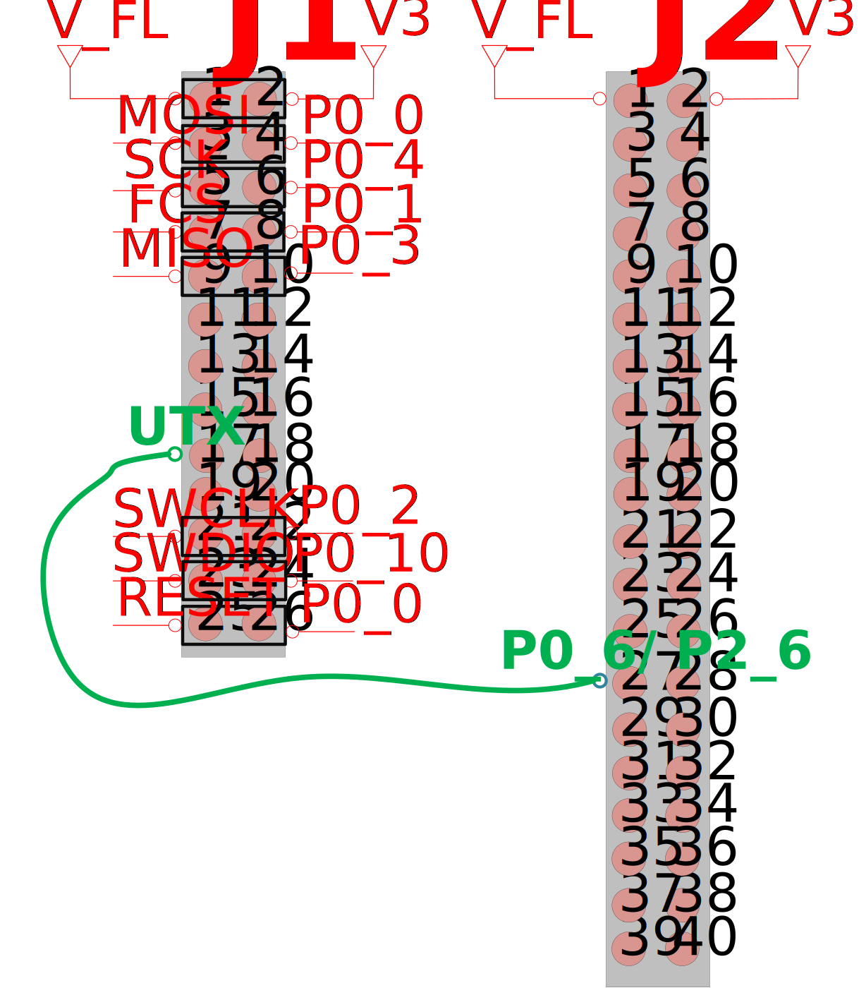

# DA14531-DA14585/586 Dynamic Custom Service

---

## Example description

The main purpose of this software example is to demonstrate creating a service dynamically using the Generic Transport Layer (GTL).

For more information about the GTL, please refer to the [GTL Manual](https://www.renesas.com/eu/en/document/swo/um-b-143-dialog-external-processor-interface-gtl-interface).

The service can be interrogated using a BLE scanning app. 

## HW and SW configuration

- **Hardware configuration**
  - This example runs on the DA14531, DA14585/586 Bluetooth Smart SoC devices.
  - The DA1458x / DA145xx Pro Development kit is needed for this example with the jumper configuration depicted below 
  - Connect the USB Development kit to the host computer.
- **Software configuration**
  - [SDK6.0.16](https://www.dialog-semiconductor.com/da14531_sdk_latest).
  - **SEGGER’s J-Link** tools should be downloaded and installed.
  - A smartphone with a BLE scanning app (for example **BLE scanner** on Android or **Lightblue** on IOS).
  - A terminal emulator (for example **Tera Term**)

## How to run the example

### Initial Setup

For the initial setup of the project that involves linking the SDK to this SW example, please follow the Readme [here](https://github.com/dialog-semiconductor/BLE_SDK6_examples).

- For the DA14585/586 getting started guide you can refer to this [link](http://lpccs-docs.dialog-semiconductor.com/da14585_getting_started/index.html).
- For the DA14531 Getting started guide you can refer to this [link](https://www.dialog-semiconductor.com/da14531-getting-started).

### Terminal Setup

- Launch terminal emulator with below serial port settings 

### Compile & Run
- Navigate to ``project_environment`` folder and open the **Keil** project, dyn_custom_svc
- Select the target device you are building for, like so,

- Compile (F7) and launch (ctrl + F5) the example.
- You can also download the firmware into SPI Flash. To download the firmware into SPI Flash, the  SPI Flash programmer from SmartSnippets Toolbox should be used as described 
  [here](http://lpccs-docs.dialog-semiconductor.com/UM-B-083/index.html), or the stand-alone flash programmer.

## How it works
- A custom service with 2 characteristics is created using the GTL. The first characteristic has read and write permissions. The second characteristic has write and notify permissions. The device can be interrogated using a BLE scanning app. Below shows the custom service with the 2 characteristics. 

   
 
- Investigating the first characteristic, each time a read is performed a 4 byte random number is returned. The terminal prints the bytes sent in response to the read request which can be verified in the BLE scanning app.

   

- Writing a value to the first characteristic, you can verifiy the data is received by the device and printed to the terminal.

   

- To verify notifications on characteristic two, enable notifications.

   
- Once notifications are enabled, writing data to characteristic 1 will result in a notification on characteristic 2 with a 4 byte random number. 

## Known Limitations

- Refer to the following application note for [DA1458x known hardware limitations](https://www.renesas.com/us/en/document/oth/da1458x-hardware-known-limitations  "known hardware limitations").
- Refer to the following application note for [DA14531 known hardware limitations](https://www.renesas.com/us/en/document/dve/da14531-errata-datasheet  "known hardware limitations"). 
- Renesas [Forum link](https://renesasrulz.com/wireles-connectivity/f/bluetooth-low-energy).

