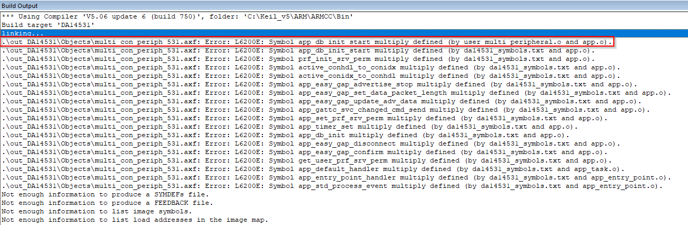

------
# Multi-peripheral Example
------

## Example description

This example demonstrates how a single peripheral can be connected to more than one central. DA14531 is able to support up to 3 connections and the DA14585 up to 8 simultaneous connections. Additionally it also demonstrates how one could keep different characteristic values depending on different connections.

The demo will start advertising and will store the 3 first connections from different centrals in a user space variable. In case an extra central tries to connect, the demo will overwrite an inactive connection entry if available, else if there is no available connection slot no connection will be established. Application will also retain the values of the connection orientated characteristics and make sure to report the proper value only to the requesting central.  

The demonstration exposes a custom profile including 3 services.

- Service 1: Includes some of the standard characteristics and functionality of the default custom profile. This database is common to all connected peripherals, hence data values are common to any device is connected.
- Service 2: Includes one characteristic with read and write properties. This is a connection oriented characteristic, hence the device will only report the values that correspond to the requesting central.
- Service 3: Include one characteristic with read properties. This is a connection oriented characteristic, hence the device will only report the values that correspond to the requesting central.

## HW and SW configuration

### Hardware configuration

This example runs on The BLE Smart SoC (System on Chip) devices.

- DA14585/DA14586 Daughter board + DA145xxDEVKT-P PRO Motherboard
- DA14531 Daughter board + DA145xxDEVKT-P PRO Motherboard

For running the example on a DA14585/DA14586 Daughter board + DA145xxDEVKT-P PRO Motherboard the following configuration is required.

- Connect the DA145xx Pro Development Kit to the host computer.
- UART TX on P0_4 for DA14585/DA14586 (place jumper between J1:17 and J1:18) for printing functionality.


For running the example on a DA14531 Daughter board + DA145xxDEVKT-P PRO Motherboard the following configuration is required.

- Connect the DA145xx Pro Development Kit to the host computer.
- UART TX on P0_6 for DA14531 (Place wire between J1:17 and J2:27) for printing functionality.


### Software configuration

This example requires:

- SmartSnippets Toolbox 2.0.16.
- SDK6.0.14
- **SEGGER’s J-Link** tools should be downloaded and installed.
- **A simple serial terminal** should be installed on the PC (e.g. Putty or Teraterm)

## SDK Changes

The default settings of the SDK supports only one connection, hence to properly run this example the user should apply changes to the files of the SDK6 in order to be able to connect to multiple centrals. In the files provided in the example all the SDK code related changes are moved to application level via bypassing the SDK code.

Minor changes in the SDK files, that should be applied in order to change SDK configuration or override SDK functions, should be guarded via the CFG_ENABLE_MULTIMPLE_CONN, which is defined in da1458x_config_basic.h file. The changes are mentioned below:

- To be able to override the default functions of the SDK the ____EXCLUDE_ROM_APP_TASK__ __ should be defined in the C/C++ tab in the "options for target" in keil.


   **Note:** The ROM functions that correspond to **\_\_EXCLUDE_ROM_APP_TASK\_\_** guard should also be removed from the da14531_symbols.txt. If not removed the linker will output an error for multiple defined functions. From the error of the linker it is visible to the end user which function should be removed from the .txt file (the da14531_symbols.txt file is located in */sdk/common_project_files/misc/*).

   When all ROM functions are commented from the da14531_symbols.txt file the linking should also fail due to the multiple definition of the app_db_init_start() function declared in the user_multmi_peripheral.c file. This is an SDK function that it will be overridden via application level code.

   

- Changes in app.h :

  - apply to the #define APP_EASY_MAX_ACTIVE_CONNECTION the maximum connections that should be supported (DA14531 - 3 maximum connections and DA14585/6 - 8 maximum connections). The maximum supported connections are defined in the BLE_CONNECTION_MAX definition.

  ```c
    /// Max connections supported by application task
    #ifdef CFG_ENABLE_MULTIPLE_CONN
    #define APP_EASY_MAX_ACTIVE_CONNECTION      (BLE_CONNECTION_MAX)
    #else
    #define APP_EASY_MAX_ACTIVE_CONNECTION      (1)
    #endif
  ```

  - Apply the following changes according to the below snippet in order for the app_db_init_next() function to be invoked from application level.

  ```c
    #if (defined (__DA14531__) && !defined (__EXCLUDE_ROM_APP_TASK__)) || defined (CFG_ENABLE_MULTIPLE_CONN)
    /**
    ****************************************************************************************
    * @brief Initialize the database for all the included profiles.
    * @return true if succeeded, else false
    ****************************************************************************************
    */
    bool app_db_init_next(void);
    #endif
  ```

- Changes in app_task.h : apply to the APP_IDX_MAX the maximum number or task
  instances that the application should support. This should agree with the max active connections that the device is supporting.

  ```c
  /// Number of APP Task Instances
  #ifdef CFG_ENABLE_MULTIPLE_CONN
  #define APP_IDX_MAX      (1)
  #else
  #define APP_IDX_MAX      (APP_EASY_MAX_ACTIVE_CONNECTION)
  #endif
  ```

- Changes in app.c : In this file specific functions need to be used in application level or being overridden by application code. The functions with the additional implementation for supporting multiple connections is located in the user_multi_peripheral.c file.

  - In order to be able to use the app_db_init_next() function in application level for
    initializing the device's database the "static" identifier should be removed.

    ``` C
      /**
      ****************************************************************************************
      * @brief Initialize the database for all the included profiles.
      * @return true if succeeded, else false
      ****************************************************************************************
      */
      #if (!defined (__DA14531__) || defined (__EXCLUDE_ROM_APP_TASK__)) && !defined (CFG_ENABLE_MULTIPLE_CONN)
      static bool app_db_init_next(void)
      #else
      bool app_db_init_next(void)
      #endif
      {
        static uint8_t i __SECTION_ZERO("retention_mem_area0"); //@RETENTION MEMORY;
        static uint8_t k __SECTION_ZERO("retention_mem_area0"); //@RETENTION MEMORY;

    ```
    
  - The app_db_init_start() function needs to be modified to support multiple
    connections. To apply the changes in application level, the SDK function needs to be excluded from the build using the CFG_ENABLE_MULTIPLE_CONN guard.

    ``` C
      #if !defined (__DA14531__) || defined (__EXCLUDE_ROM_APP_TASK__)
      #if !defined (CFG_ENABLE_MULTIPLE_CONN)
      bool app_db_init_start(void)
      {
        // Indicate if more services need to be added in the database
        bool end_db_create;

        // We are now in Initialization State
        ke_state_set(TASK_APP, APP_DB_INIT);

        end_db_create = app_db_init_next();

        return end_db_create;
      }
      #endif
    ```

  - Changes in app_task.c : In app_task.c file the connection and disconnection
    handlers of the device should be modified in order to support the multiple connection feature. The complete functions supporting multiple connections are located in the user_multi_peripheral.c file of the example. In order to override the SDK functions a __WEAK identifier is added in the in each function:

  - gapc_connection_ind_handler

  ```c
    /**
    ****************************************************************************************
    * @brief Handles connection complete event from the GAP. Will enable profile.
    * @param[in] msgid     Id of the message received.
    * @param[in] param     Pointer to the parameters of the message.
    * @param[in] dest_id   ID of the receiving task instance (TASK_GAP).
    * @param[in] src_id    ID of the sending task instance.
    * @return If the message was consumed or not.
    ****************************************************************************************
    */
    #ifdef CFG_ENABLE_MULTIPLE_CONN
    __WEAK int gapc_connection_req_ind_handler(ke_msg_id_t const msgid,
                        struct gapc_connection_req_ind const *param,
                        ke_task_id_t const dest_id,
                        ke_task_id_t const src_id)


    #else
    static int gapc_connection_req_ind_handler(ke_msg_id_t const msgid,
                        struct gapc_connection_req_ind const *param,
                        ke_task_id_t const dest_id,
                        ke_task_id_t const src_id)
    #endif
                                              {
      // Connection Index
      if (ke_state_get(dest_id) == APP_CONNECTABLE)
      {
        uint8_t conidx = KE_IDX_GET(src_id);

  ```

  - gapc_disconnect_ind_handler

  ```c

    /**
    ****************************************************************************************
    * @brief Handles disconnection complete event from the GAP.
    * @param[in] msgid     Id of the message received.
    * @param[in] param     Pointer to the parameters of the message.
    * @param[in] dest_id   ID of the receiving task instance (TASK_GAP).
    * @param[in] src_id    ID of the sending task instance.
    * @return If the message was consumed or not.
    ****************************************************************************************
    */

    #ifdef CFG_ENABLE_MULTIPLE_CONN
    __WEAK int gapc_disconnect_ind_handler(ke_msg_id_t const msgid,
                        struct gapc_disconnect_ind const *param,
                        ke_task_id_t const dest_id,
                        ke_task_id_t const src_id)


    #else
    static int gapc_disconnect_ind_handler(ke_msg_id_t const msgid,
                      struct gapc_disconnect_ind const *param,
                      ke_task_id_t const dest_id,
                      ke_task_id_t const src_id)
    #endif
                                              

    {
      uint8_t state = ke_state_get(dest_id);
      uint8_t conidx = KE_IDX_GET(src_id);
  ```

## How to run the example

For the initial setup of the project that involves linking the SDK to this SW example, please follow the Readme [here](../../Readme.md).

### Initial Setup

- Compile and launch the example.
- Open the development kit serial port with the following parameters.

  - baud-rate: 115200
  - data: 8 bits
  - stop: 1 bit
  - parity: None
  - flow  control: none

- As soon as the example runs the following message should appear on the terminal
  indicating that the device is advertising and there are no currently connected devices.

  

- As soon as the device advertises, one could connect the first central. The following message will be printed
  on the terminal indicating the amount of centrals connected to the peripheral as well as their bd addresses. In every new connection all the bd addresses of the currently connected devices will be printed out.

  

  

- The example includes 2 services where the read and write data are connection dependent. The values of each
  characteristic are not stored in the peripheral's database but in application variables. Each time a read or a write is performed the values of each connection and characteristic is printed out on the terminal.

  

- In every disconnection the currently disconnected device will be printed out along with the disconnection
  reason.

  

## Known Limitations

- There are No known limitations for this example. But you can check and refer to: 

	- [SDK6 Known Limitations](http://lpccs-docs.dialog-semiconductor.com/sdk6_kll/index.html).
	- [known hardware limitations for DA14531 devices](https://www.dialog-semiconductor.com/da14531_HW_Limitation).
	- [DA14531 Getting Started guide](https://www.dialog-semiconductor.com/da14531-getting-started).
	- [DA14585 hardware limitations](https://www.dialog-semiconductor.com/sites/default/files/da1458x-knownlimitations_2019_01_07.pdf)
	- [DA14585/DA14586 Getting Started with the Development Kit UM-B-049](http://lpccs-docs.dialog-semiconductor.com/da14585_getting_started/index.html).
	- [Dialog BLE Support Forum](https://www.dialog-semiconductor.com/BLE_Support).
