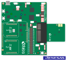
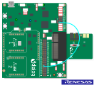
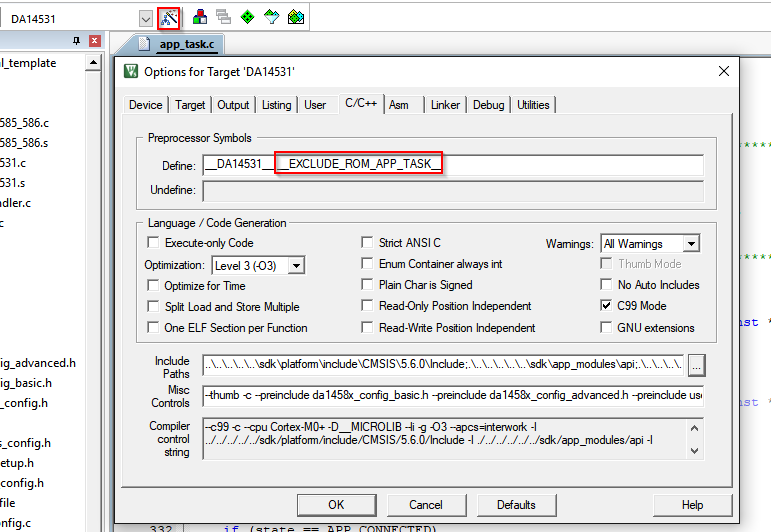
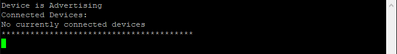
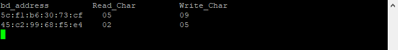

# Multi-peripheral Example

---

## Example description

This example demonstrates how a single peripheral can be connected to more than one central. DA14531 is able to support up to 3 connections and the DA14585 up to 8 simultaneous connections. Additionally it also demonstrates how one could keep different characteristic values depending on different connections.

The demo will start advertising and will store the 3 first connections from different centrals in a user space variable. In case an extra central tries to connect, the demo will overwrite an inactive connection entry if available, else if there is no available connection slot no connection will be established. Application will also retain the values of the connection orientated characteristics and make sure to report the proper value only to the requesting central.  

The demonstration exposes a custom profile including 3 services.

- Service 1: Includes some of the standard characteristics and functionality of the default custom profile. This database is common to all connected peripherals, hence data values are common to any device is connected.
- Service 2: Includes one characteristic with read and write properties. This is a connection oriented characteristic, hence the device will only report the values that correspond to the requesting central.
- Service 3: Include one characteristic with read properties. This is a connection oriented characteristic, hence the device will only report the values that correspond to the requesting central.

## HW and SW configuration

### Hardware configuration

This example runs on The BLE Smart SoC (System on Chip) devices.

- DA14585/DA14586 Daughter board + DA145xxDEVKT-P PRO Motherboard
- DA14531 Daughter board + DA145xxDEVKT-P PRO Motherboard

For running the example on a DA14585/DA14586 Daughter board + DA145xxDEVKT-P PRO Motherboard the following configuration is required.

- Connect the DA145xx Pro Development Kit to the host computer.
- UART TX on P0_4 for DA14585/DA14586 (place jumper between J1:17 and J1:18) for printing functionality.

For running the example on a DA14531 Daughter board + DA145xxDEVKT-P PRO Motherboard the following configuration is required.

- Connect the DA145xx Pro Development Kit to the host computer.
- UART TX on P0_6 for DA14531 (Place wire between J1:17 and J2:27) for printing functionality.

### Software configuration

This example requires:

- SmartSnippets Toolbox 2.0.16.
- SDK6.0.14
- **SEGGER’s J-Link** tools should be downloaded and installed.
- **A simple serial terminal** should be installed on the PC (e.g. Putty or Teraterm)

## SDK Changes

The default settings of the SDK supports only one connection, hence to properly run this example the user should apply changes to the files of the SDK6 in order to be able to connect to multiple centrals. In the files provided in the example all the SDK code related changes are moved to application level via bypassing the SDK code.

Minor changes in the SDK files, that should be applied in order to change SDK configuration or override SDK functions, should be guarded via the CFG_ENABLE_MULTIMPLE_CONN, which is defined in da1458x_config_basic.h file. The changes are mentioned below:

- To be able to override the default functions of the SDK the ____EXCLUDE_ROM_APP_TASK__ __ should be defined in the C/C++ tab in the "options for target" in keil.

- This example needs changes in the SDK to work. To apply the patch file, execute the following command inside your sdk directory:
'''
git apply path/to/patch/SDK6patch.diff
'''

## How to run the example

For the initial setup of the project that involves linking the SDK to this SW example, please follow the Readme [here](../../Readme.md).

### Initial Setup

- Compile and launch the example.
- Open the development kit serial port with the following parameters.

  - baud-rate: 115200
  - data: 8 bits
  - stop: 1 bit
  - parity: None
  - flow  control: none

- As soon as the example runs the following message should appear on the terminal
  indicating that the device is advertising and there are no currently connected devices.

  

- As soon as the device advertises, one could connect the first central. The following message will be printed
  on the terminal indicating the amount of centrals connected to the peripheral as well as their bd addresses. In every new connection all the bd addresses of the currently connected devices will be printed out.

  

  

- The example includes 2 services where the read and write data are connection dependent. The values of each
  characteristic are not stored in the peripheral's database but in application variables. Each time a read or a write is performed the values of each connection and characteristic is printed out on the terminal.

  

- In every disconnection the currently disconnected device will be printed out along with the disconnection
  reason.

  

## Known Limitations

- There are no known limitations for this example. But you can check and refer to the following application note for
[known hardware limitations for DA1458x devices](https://www.dialog-semiconductor.com/sites/default/files/da1458x-knownlimitations_2019_01_07.pdf) or [known hardware limitations for DA14531 devices](https://www.dialog-semiconductor.com/da14531_HW_Limitation).
- Dialog Software [Forum link](https://www.dialog-semiconductor.com/forum).
- you can also refer to the [DA14585/DA14586 Getting Started Guide with the PRO-Development Kit](http://lpccs-docs.dialog-semiconductor.com/da14585_getting_started/index.html) or the [DA14531 Getting Started guide](https://www.dialog-semiconductor.com/da14531-getting-started).
