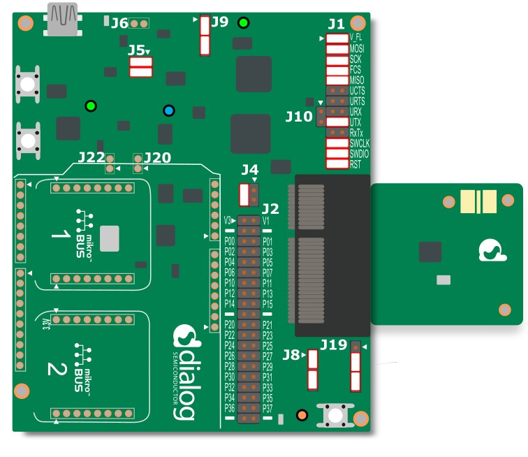
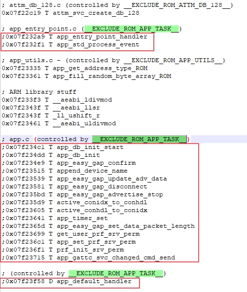

# DA14531/585/586 Multirole Example

## Example Description

The example demonstrates the capabilities of the DA14531/585/586 as a Central and a peripheral i.e. scan and advertise role. 

**Note**: This example applies for DA14585/586 as well. The DA14531 is capabable of handling upto 3 connections and the DA14585/586 can handle upto 8 connections.

The project works as a Central connecting to 2 peripherals, and once connected, it advertises so another central can connect to it.

**Note**: This project assumes that the 2 peripherals will stay connected to the DA14531 central. 

## HW setup
 - 3 DA14531 Pro-DK kit with Module/Daugherboard connected to host computer via USB and an android or iPhone.
 - For Central, extra jumpers are required for the UART to see the communication logs. Check the setup shown below for DA14531 and DA14585/586.
 
 <ins>DA14531 daughterboard</ins>
 
 
 
  <ins>DA14531 module</ins>
  
 
 
 <ins>DA14585 daughterboard</ins>
 
 
 
 
 The user manuals for the development kits can be found [here](https://www.dialog-semiconductor.com/um-114-da14531-development-kit-pro) for the DA145xxDEVKT-P PRO-Motherboard.

## SW setup 

 - SDK 6.0.14.1114 
 - SmartSnippets Toolbox 5.0.14.3038 
 - a terminal for UART logs (teraterm, termite, etc..)
 
## How to run the example

1. For the initial setup of the project that involves linking the SDK to this SW example, please follow the Readme [here](https://github.com/dialog-semiconductor/BLE_SDK6_examples).

2. Download Prox_reporter binaries with **different BD addresses and default device name "DLG-PROXR"** to 2 DA14531 devices (as explained [here](http://lpccs-docs.dialog-semiconductor.com/UM-B-083/getting_started/getting_started.html)). 
You can refer to this [document](http://lpccs-docs.dialog-semiconductor.com/um-b-138/introduction.html) to program the flash with the prox_reporter binaries. Press reset (SW1) on the motherboard and verify with an Android device that they have all started advertising

Note: To configure your device with different BD addresses, follow [here](http://lpccs-docs.dialog-semiconductor.com/DA145xx_Advertising_Tutorial/setting_the_BD_address_and_device_name.html#setting-the-bd-address)

3. Using Keil IDE, open the multirole project and compile the project to build the indexes. You will see errors but ignore it for this step, error will go away after the compilation in step 7.

4. To be able to overide the default functions of the SDK the __ EXCLUDE_ROM_APP_TASK __ should be defined in the C/C++ tab in the "options for target" in keil, like so,

	
	

5. On the project explorer, navigate to "app.h" and modify it to support 3 connections, like so, 

	
	
	
6. Open File explorer on your computer, navigate to the project, like so, 

	`C:\......\6.0.14.1114\sdk\common_project_files\misc`
	
	in the misc folder, open da14531_symbols.txt in a text editor, and comment out the __EXCLUDE_ROM_APP_TASK__ parts. Use a semi-colon (";") to comment out.
	
	
	
	
7. Build and compile the project.		

8. Download the binary to another DA14531 device (Use flash programmer tool as mentioned in step 1). 

**Note**: Use any android/iPhone BLE scanner to connect/disconnect to/from the DA14531.

**Note: For the DA14585, using more than 4 active connections, the default value of the #define CFG_RET_DATA_SIZE 2048, needs to changed to 4096, in the user_config.h file.**

## Supported use-case for the example

Below mentioned is the use-case that is supported with this example. In future releases, more use-cases will be added especially with regards to the disconnections.

For the ease of understanding, following notations are used. 

* C0/P0 -> DA14531 central/peripheral
* P1,P2 -> DA14531 peripheral 
* C1 -> Phone central

**Use case:** The flow of this use-case is mentioned below. Basically the peripherals starts to advertise first and then the Central starts scan process, and it finds and connects to 2 peripherals. 

<ins>Connection<ins>
- P1 is advertising
- P2 is advertising
- C0 starts to scan, finds P1 and P2 and connects
- P0 advertises
- C1 connects to P0

<ins>Disconnection<ins>
- C1 disconnects
- P0 advertises
- C1 connects to P0 again

This can be verified in the UART logs.

**Note**: While using iPhone, if you wish to disconnect C1 from DA14531 device, please check the iPhone bluetooth settings as the phone might have to be disconnected from there. 
Once it disconnects, you will see P0 advertising again while being connected to P1 and P2. 
For Android, you can use any BLE scanner app to connect and disconnect.

**Note**: UART terminal: 921600, 8N1, no flow control

## Limitations

- The current example doesn't handle the disconnection of P1 or P2 from their central C0. This will be handled in future release.

## Troubleshooting

- Try a different USB1 cable.

- Try different jumper wires, if used.

- Verify using any BLE scanner that the 2 peripherals are advertising before attempting connection. 

- If none of the above helps, please check with the customer support team who would be glad to provide you the solution.

