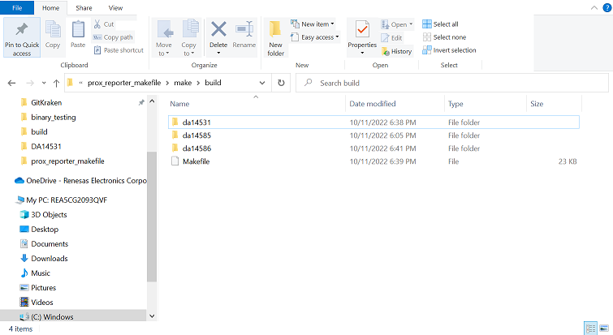

## Example description

Example makefile for SDK6 using GCC. 

SDK6 supports the use of GCC in conjuction with the Eclipse IDE as noted in the [SDK6 Tutorial](http://lpccs-docs.renesas.com/Tutorial_SDK6/eclipse_gcc.html).

This example demonstrates using a makefile to build a project from the command line, rather than relying on the Eclipse IDE to perform the necessary build steps. 
The source/project files here are a copy of the prox_reporter sample project included with SDK6. A makefile has been added to build the project and the default makefile.targets
file has been modified. 


## Software configuration

- [SDK6.0.14](https://www.dialog-semiconductor.com/da14531_sdk_latest).
- The [GNU Toolcahin for ARM](https://developer.arm.com/Tools%20and%20Software/GNU%20Toolchain) should be downloaded. Note this requirement can be met by installing Smart Snippets Stuido, an Eclipse based IDE.
The [DA1469x Getting Started Guide](http://lpccs-docs.renesas.com/um-b-090-da1469x_getting_started/Software_Development_Tools/Software_Development_Tools.html#smartsnippets-tm-studio-installation-and-starting)
will walk you through the Smart Snippets Studio installation process.  
- On Windows a Unix terminal, such as [cygwin](https://www.cygwin.com/), should be downloaded.


## How to run the example

### Compile

By default the makefile is configured run from a particular location within the SDK directory structure as depecited below.  

Example Directory Structure:

```
6.0.x.y
└───projects
│   └───target_apps
│        └───ble_examples
│            └───prox_reporter_makefile
│                └───make
│                    └───makefile.targets
│                    └───build
│                        └───makefile
│
```

This project can either be moved to the appropriate position within the SDK directory structure, or the user can provide the appropriate paths to the SOURCEROOT and APP_SOURCE_DIR variables when calling make.
SOURCEROOT is the path to the top level directory of the SDK (e.g. 6.0.16.1144). APP_SOURCE_DIR in the path to the top level project source files (e.g. <path on your machine>/prox_reporter_makefile/src).

A separate build configuration is available for each of the three supported processors (DA14531, DA14585, DA14586). A user MUST specify a build configuration by setting the BUILD_CONFIG variable when calling make 
in order to run the default target.

Example call to build the DA14531 build configuration:

```
make BUILD_CONFIG=da14531
```

Example call to build DA14531 build configuration with different SOURCEROOT and APP_SOURCE_DIR:

```
make BUILD_CONFIG=da14531 SOURCEROOT=<path_to_sdk>/6.0.16.1144 APP_SOURCE_DIR=<path_to_examples_directory>/BLE_SDK6_examples/connectivity/prox_reporter_makefile/src
```

Please note on Windows paths default to using a backslash (`\`) but the paths above should use a forward slash (`/`).

A separate output directory is created for each of the 3 build configurations: 



For each build configuration, the top level output directory contains the primary build artifacts including the .map, .elf, .bin, and .hex files. The user may optionally change the names of these artifacts by specifying the the BUILD_ARTIFACT_NAME when building.
The sdk, third_party, and user directories contain the .o and .d outputs for each file built.


To clean you have two options. To clean a specific build configuration output (e.g. DA14531) you must specify the BUILD_CONFIG when calling clean:

```
make clean BUILD_CONFIG=da14531
```

Please note if your build requires redefining the SOURCEROOT and APP_SOURCE_DIR variables, these variables must also be defined when cleaning:

```
make clean BUILD_CONFIG=da14531 SOURCEROOT=<path_to_sdk>/6.0.16.1144 APP_SOURCE_DIR=<path_to_examples_directory>/BLE_SDK6_examples/connectivity/prox_reporter_makefile/src
```

If no BUILD_CONFIG is specified when calling clean, all build configurations outputs will be cleaned.
