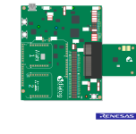
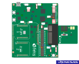
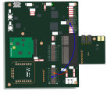
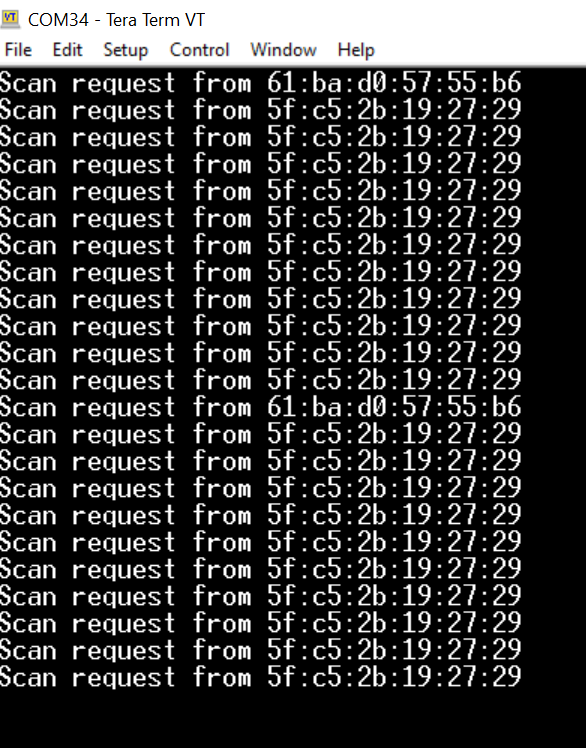
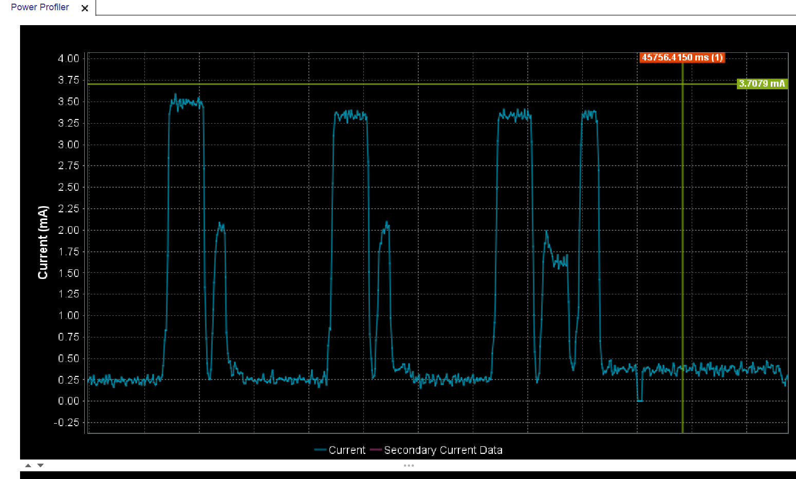

# DA14585/DA14586 - DA14531 Scan Request Track

## Example description

This SDK6 DA14585 / DA14531 example demonstrates how a peripheral device can track if it is scanned and which central device 
performs the scanning procedure.
The central device needs to scan in active mode since the peripheral device will track if it is scanned via
the scan request from central.
The example doesn't require any change in the SDK 6.0.14 code as in previous SDK releases, the scan request is tracked in every BLE END event.
	
## HW and SW configuration

* **Hardware configuration**

	- This example runs on The DA14585/DA14586/DA14531 Bluetooth Smart SoC devices.
	- The Basic / Pro Development kit is needed for this example.
	- Connect the DA145xx Pro Development Kit to the host computer.
	- UART TX on P0_4 for DA14585/DA14586 (place jumper between J1:17 and J1:18)
		
	
	- UART TX on P0_6 for DA14531 (Place wire between J1:17 and J2:27)
		

	- UART TX on P0_6 for DA14535 (Place wire between J1:17 and J2:27)
		

	- For the cursor to operate on DA14531 on the Pro Development kit a fly wire is needed 
	connecting J2:24 with J8.2 pin (default jumper on J8 should be removed).
	- For the cursor to operate on DA14585 on the Pro Development kit a jumper is needed connecting J8:1 with J8.2 pin (default jumper connection).

* **Software configuration**

	- This example requires:
    * Smartsnippets Toolbox 5.0.16 or later.
    * [SDK6 Latest version ](https://www.renesas.com/eu/en/document/swo/sdk601811821-da1453x-da145856?r=1564826).
	- **SEGGER’s J-Link** tools should be downloaded and installed.
	- **A simple serial terminal** should be installed on the PC

## How to run the example

For the initial setup of the project that involves linking the SDK to this SW example, please follow the Readme [here](https://github.com/dialog-semiconductor/BLE_SDK6_examples).

### Initial Setup

 - Compile and launch the example
 - Open the development kit serial port with the following parameters

		- baudrate: 115200
		- data: 8 bits
		- stop: 1 bit
		- parity: None
		- flow  control: none
 - If the device is actively scanned the FW will print the BD address that scanned the device.
 
	
 - In the case of a scan request, a cursor will also appear in the power profiler of Smart Snippets.

	

## Further reading

- [Wireless Connectivity Forum](https://lpccs-docs.renesas.com/lpc_docs_index/DA145xx.html)

## Known Limitations

- There are no known limitations for this example. But you can check and refer to the following application note for
[SDK6 known limitations](https://lpccs-docs.renesas.com/sdk6_kll/index.html)

## Feedback and support ?

If you have any comments or suggestions about this document, you can contact us through:

- [Wireless Connectivity Forum](https://community.renesas.com/wireles-connectivity)

- [Contact Technical Support](https://www.renesas.com/eu/en/support?nid=1564826&issue_type=technical)

- [Contact a Sales Representative](https://www.renesas.com/eu/en/buy-sample/locations)

