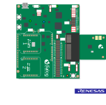
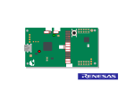
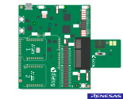
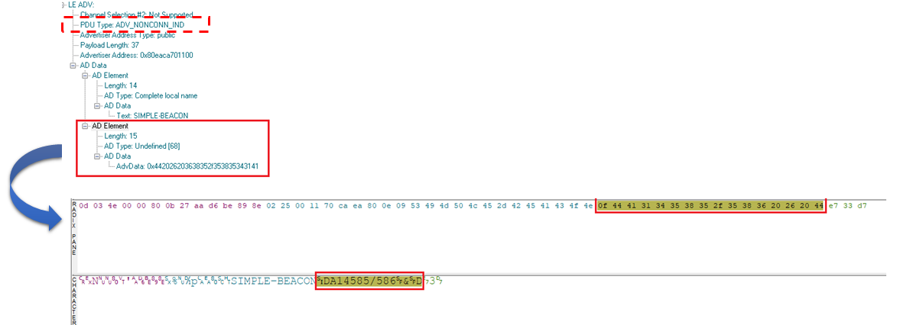
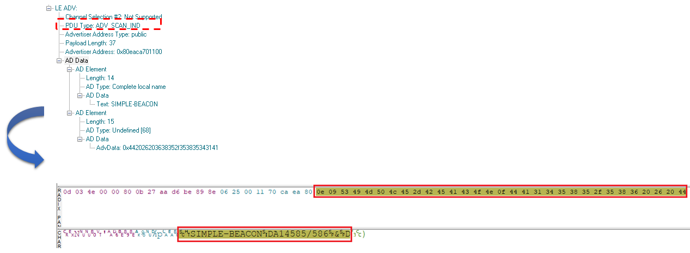

# DA14531 - DA14585/586 Simple Beacon Example


## Example description

The main purpose of this Software Εxample is to demonstrate creating a ***Non-Connectable Advertising*** application example. To make Non-Connectable advertising more efficient the ``flag type`` field of an advertising packet is optional (please check ***Core Specification Supplement v6 by Bluetooth SIG***). If ``flag type`` is not used, it can free up to 3 bytes of space which can then be used for sending more advertising data.

## What is a Beacon?

**Beacons** are battery-powered devices that advertise a particular ***Bluetooth Low Energy*** payload with identifying information. 


This Software Example is just to demonstrate creating a **Simple Beacon** project with ***Non-Connectable Advertising***. However, it can be customized for more advanced use cases, such as:

  * Adaptive modification of advertising data

  * Choosing from various beacon formats

  * Interleaving connectable advertising events

  * Software Updates Over The Air (SUOTA)

## Non-Connectable Advertising

Non-connectable advertising allows users to advertise data with the lowest power consumption.


The SDK includes a non-connectable advertising application example. The project is in the SDK directory:

​    <sdk_root_directory>/projects/target_apps/misc

The Keil v5 project file is:

​    <sdk_root_directory>/projects/target_apps/misc/ble_app_noncon/Keil_5/ble_app_noncon.uvprojx

The ***main difference*** between Simple Beacon SW Example and Non-Connectable example of the SDK is that in current implementation, user can define the data which will be appended within the Advertising or Scan Response packet. In the SDK Example, this possibility does not exist, as data stored in the adverting or Scan response packet is fixed (***default value : 0xA5***). To do so, Beacons will advertise a particular Bluetooth Low Energy payload with identifying information selected by the user. 

The available APIs  used are listed below :

 - ***app_easy_gap_non_connectable_advertise_get_active()*** : Get non connectable advertising message with filled parameters.

 - ***app_easy_gap_non_connectable_advertise_start()*** : Start advertising for non-connectable peripheral.

For getting more information about the Non-Connectable Advertising, please refer to [Advertising Tutorial](https://www.dialog-semiconductor.com/sites/default/files/advertising_concept.pdf) from our [support website](https://www.dialog-semiconductor.com/bluetooth-low-energy).

## Hardware & Software Configuration

This example runs on DA14531 and DA14585/586 Bluetooth Smart SoC devices. 

  - Connect the ***DA145xx Pro Development Kit***  to the host computer via the USB connector. 

  - Please find below the appropriate hardware configurations.

### DA14585/586 Hardware Configuration

In case of DA14585/586,  DA145xx Pro Development Kit is required with default jumper configuration. Please see illustration below:



The Example can also run on ***DA14585 Basic Development Kit*** with default jumper configuration, as demonstrated below:



Refer to the getting started guide of [DA14585 Basic Development Kit](http://lpccs-docs.dialog-semiconductor.com/DA14585_Getting_Started_basic/index.html).

### DA14531 Hardware Configuration

In case of DA14531, the ***DA14531 Pro Development Kit*** is also required for this Software Example with default jumper configuration. Please see the illustrations below:

Jumpers are placed in default configurations. Refer to the getting started guide of [DA14531 Pro Development Kit](https://www.dialog-semiconductor.com/da14531-getting-started).




### Software configuration


  - [SDK6.0.14](https://www.renesas.com/eu/en/document/swo/sdk601811821-da1453x-da145856) or later

  - ***SEGGER’s J-Link*** tools should be downloaded and installed.

  - A smartphone with a BLE scanning app (for example ***BLE scanner*** on Android or ***Lightblue*** on IOS).

  - A BLE Sniffing tool is also useful; though not mandatory .

## How to run the example

### Initial Setup

For the initial setup of the project that involves linking the SDK to this SW example, please follow the Readme [here](https://github.com/dialog-semiconductor/BLE_SDK6_examples).

- For the DA14585/586 getting started guide you can refer to this [link](http://lpccs-docs.dialog-semiconductor.com/da14585_getting_started/index.html).

- For the DA14531 Getting started guide you can refer to this [link](https://www.dialog-semiconductor.com/da14531-getting-started).

### Compile & Run

- Navigate to ``project_environment`` folder and open the ***Keil*** project.

- Compile and then launch the demonstration example. You can download the firmware either into System-RAM or SPI Flash. To download the firmware into SPI Flash, the  SPI Flash programmer from SmartSnippets Toolbox should be used. 

- Define the data that is to append into ``Adverting`` or ``Scan Response`` data packet by configuring the ***USER_DATA*** macro in `user_simple_beacon.h`. By default, ***USER_DATA*** is defined as follow :

```c

#define USER_DATA  ("DA14585/586 & DA14531 Simple Beacon Software Example")

```

***Note:***

**USER_DATA** are stored in the ***uninitialized section of the Retention-RAM***

```c

uint8_t user_store_data[USER_DATA_LEN]    __attribute__((section("retention_mem_area_uninit") , zero_init));  //@RETENTION MEMORY

```

and copied into the `user_store_data[]` array:

```c

memcpy(user_store_data, USER_DATA ,USER_DATA_LEN );

```

- Initially, the device initiates non-connectable advertising (***ADV_NONCONN_IND***) and then proceeds with sending an advertising scan indication (***ADV_SCAN_IND***).  Finally, the device is switched back to non-connectable advertising mode. This is a full loop and is repeated all the time. 

- Initially, the code checks if `user_store_data[]` is not empty. 

- Every time the SW timer elapses, the `adv_data_update_timer_cb()` callback routine is triggered and each element of `user_store_data[]` is stored in the Advertising Data or Scan Response data packet.

- The firmware checks whether the advertising data are full or not. If not, the next item from ``user_store_data[]`` will be appended into them. 

- Once the Advertising data packet is full and given that more data are present in ``user_store_data[]` , the next user data will be stored into the Scan Response data packet (***SCAN_RESP***).

To verify please take a look at the BLE sniffer log data

1. Initially only the the Device Name is placed into Adverising Data.


2. Advertising Data are now full.



3. Switching from ADV_NONCONN_IND to ADV_SCAN_IND.



4. Central sends a scan request (SCAN_REQ) in order to receive a scan response (SCAN_RESP) from the advertiser.


5. Full Scan Response Data.


## Further reading

- [Wireless Connectivity Forum](https://lpccs-docs.renesas.com/lpc_docs_index/DA145xx.html)


## Known Limitations

- There are no known limitations for this example. But you can check and refer to the following application note for
[SDK6 known limitations](https://lpccs-docs.renesas.com/sdk6_kll/index.html)

## Feedback and support ?

If you have any comments or suggestions about this document, you can contact us through:

- [Wireless Connectivity Forum](https://community.renesas.com/wireles-connectivity)

- [Contact Technical Support](https://www.renesas.com/eu/en/support?nid=1564826&issue_type=technical)

- [Contact a Sales Representative](https://www.renesas.com/eu/en/buy-sample/locations)

