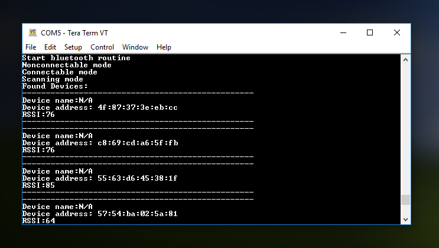
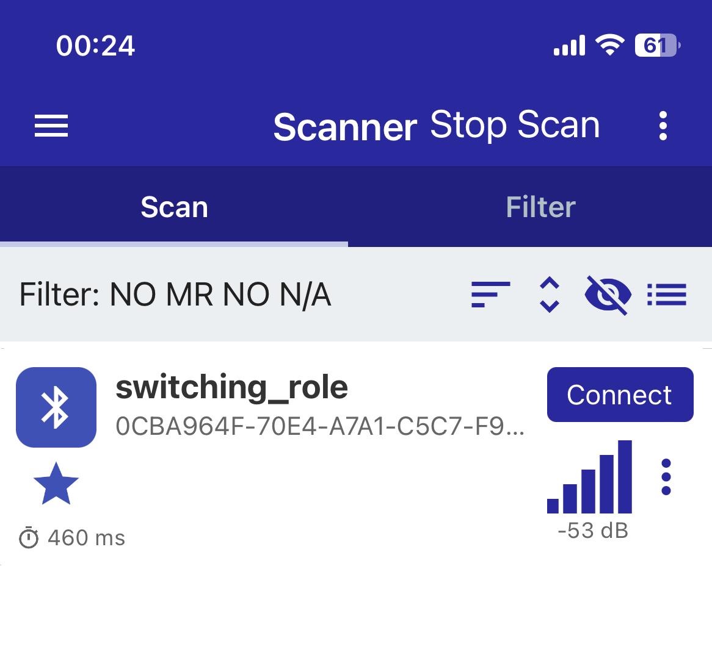
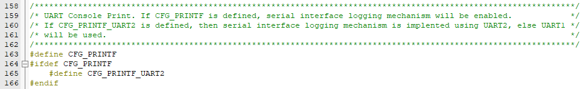
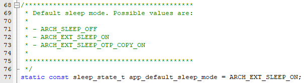

# Switching the DA1453x between BLE modes

## Example description

In this example a closer look will be taken at switching BLE roles for the DA14531. The SDK offers an interface for switching between GAP roles. This example looks at the following roles:

- Broadcaster unidirectional connection (Advertising connectable)
- Broadcaster connectionless (Advertising nonconnectable)
- Oberserver (Scanning role)
- No role

Devices naming:

- DA1453x is refering to DA14531-00, DA14531-01, DA14530 and DA14535.
- The DA14531-00 is the main DA14531 device. The -00 is just a new naming to introduce the variant DA14531-01. 
- The DA14531-01 is a ROM variant of the main DA14531-00.
- The DA14535 is a DA14531 upgrade.

## HW and SW configuration

This example runs on the DA14531 SoC (System on Chip) device:

- DA14531 daughter board + DA145xxDEVKT-P PRO-Motherboard.

The user manual for the development kits can be found:

- For the DA14531 getting started guide you can refer to [UM-B-117](https://lpccs-docs.renesas.com/UM-B-117-DA14531-Getting-Started-With-The-Pro-Development-Kit/index.html)

- For the DA14535 getting started guide you can refer to this [UM-B-165](https://lpccs-docs.renesas.com/DA14535/UM-B-165-DA14531-Getting-Started-With-The-Pro-Development-Kit/index.html#device-family-getting-started-with-the-pro-development-kits)

### Hardware configuration

For this example the headers should be configured as on the image below.

- This example works also on the DA1453x DEVKT-P with with any DA1453x Daughterboard
	

### Software configuration

This example requires:

- Terminal software like Termite or Teraterm
- [SDK6 latest version](https://www.renesas.com/sdk6_latest)
- **SEGGER’s J-Link** tools should be downloaded and installed.

### Running the example

**Setup the code**
For the initial setup of the project that involves linking the SDK to this SW example, please follow the Readme [here](../../Readme.md).

1. Start Keil using the `switching_roles_example.uvprojx` Keil project file.
2. Expand the dialog shown in the red box in the image below.
3. Select the device: DA14531
4. Press the **Build** button or the **F7** key to start compiling.

**Setup the debugger**
Setup the debugger so the code is loaded on the DA14531 via the PRO-Motherboard and afterwards run the code. More info on how to do this can be found [here](http://lpccs-docs.dialog-semiconductor.com/UM-B-117-DA14531-Getting-Started-With-The-Pro-Development-Kit/06_Your_First_DA145x_Applications/Your_First_DA145x_Applications.html#the-blinky-peripheral-example-application).

### Viewing the example results

There are three ways to see this example and action. These are all turned on by default. The three ways are as follows:

1. Via UART which can be viewed with an terminal app on the PC.
2. Via a BLE scanner app
3. LED **D5** on the PRO-Motherboard (flickers on every role transition and received packages)

**Terminal**
The serial communication is configured as follows:

- Baudrate of 115200
- 8 Data bits
- No parity bit
- 1 stop bit
  
If configured correctly and the programming is running then each time the DA14531 switches roles a message should appear. These are the messages and their meaning:

- `Start bluetooth routine` - Indicates when the routine starts a new round
- `Nonconnectable mode` - The DA14531 has switched to Broadcaster connectionless (advertising nonconnecteable)
- `Connectable mode` - The DA141531 has switched to Broadcaster unidirectional mode (advertising connectable)
- `Scanning mode` - The DA14531 has switched to Observer mode and starts printing the received packets to the terminal
- `Pause...` - The DA14531 has entered sleep mode and has no role

**BLE scanner**
Within the BLE app the DA14531 can be identified by the name **DIALOG-TMPL**. When in nonconnectable mode the **CONNECT** button will not be available. In all other modes it will be. During the pause the DA14531 should not appear in this list as it is not adevertising in this mode.

**Configuring the code**
The code comes with some configurable options which can be found in the file `user_routine_config.h`. This file looks as follows:

In this table the name of each option will be coupled to its function within the code:
|Name|Function|
|---|---|
|CFG_ENALBE_LED|When this is defined the LED will be enabled  which triggers on every event. Can be commented or removed to disable the LED|
|ROUTINE_CYCLE_TIME_MS| defines the amount of time between each mode BLE mode in milliseconds|
|ROUTINE_PAUSE_TIME_MS| defines the amount of time the DA14531 should wait before starting a new routine|
|LED_NONCONN_PULSES| defines the amount of LED pulses when the DA14531 switches to nonconnectable mode|
|LED_NONCONN_TIME_MS| defines the amount of time each pulse should take for the nonconnectable LED pulses in milliseconds|
|LED_CONN_PULSES| defines the amount of LED pulses when the DA14531 switches to connectable mode|
|LED_CONN_TIME_MS| defines the amount of time each pulse should take for the connectable LED pulses in milliseconds|
|LED_CONN_PULSES| defines the amount of LED pulses when the DA14531 switches to scanning mode|
|LED_CONN_TIME_MS| defines the amount of time each pulse should take for the scanning LED pulses in milliseconds|
|LED_RECEIVED_TIME_MS| defines how long the LED should turn on when a BLE package has been received in milliseconds|

The terminal can also be turned of, but this is a funcion within the SDK itself and can be configured in the `da1458x_config_basic.h`. The option that can be toggled is called **CGF_PRINTF** and can be commented in to activate the **printf** funcion or commented out to disable it.

**Side notes**
In order to make no role possible another option has to be configured within the file `user_config.h`. The setting **app_default_sleep_mode** has to be set to **ARCH_EXT_SLEEP_ON**. If this is not done then the watchdog will throw an error, because the DA14531 will not be doing anything while it stays on.

## Further reading

- [Wireless Connectivity Forum](https://lpccs-docs.renesas.com/lpc_docs_index/DA145xx.html)

## Known Limitations

- There are no known limitations for this example. But you can check and refer to the following application note for
[SDK6 known limitations](https://lpccs-docs.renesas.com/sdk6_kll/index.html)

## Feedback and support ?

If you have any comments or suggestions about this document, you can contact us through:

- [Wireless Connectivity Forum](https://community.renesas.com/wireles-connectivity)

- [Contact Technical Support](https://www.renesas.com/eu/en/support?nid=1564826&issue_type=technical)

- [Contact a Sales Representative](https://www.renesas.com/eu/en/buy-sample/locations)

