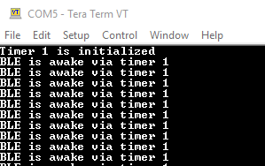
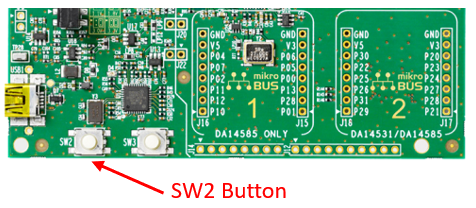

------
# DA14531 Timer1 Software Example
------

## Example Description

This software example demonstrates the usage of the **TIMER1** hardware block. The SW example exposes the basic functions that **TIMER1** offers through the following use cases:
1. **Simple counting** which is enabled via setting the **ENABLE_TMR_COUNTING** definition to **1** in the `demo_config.h` file. In this case **TIMER1** is used as an ordinary counter/timer and exposes the capability of the timer to run while sleep and wake up the device.
2. **Frequency measurement** exposes the counting capability of the HW and is enabled via setting the **ENABLE_FREQ_COUNTING** definition to **1** in the `demo_config.h` file. In this case **TIMER1** is used as a frequency counter and measures the frequency which is applied on a software specified pin.
3. **Pulse measurement** exposes the capturing capability of the hw and is enabled via setting the **ENABLE_PULSE_MEASURING** definition to **1** in the `demo_config.h` file. In this case **TIMER1** is used to measure the length of a low or a high pulse applied on a specified pin. 

***Useful Note*** :

    The demo is capable of running only one SW configuration per build. If more than one SW configurations are enabled the compiler will assert an error and prompt to build with only one configuration activated.

The example can be downloaded from Here.

## Introduction

The DA14531 product family incorporates three (3) HW timer blocks **Timer0**, **Timer1**, **Timer2**. From the aforementioned timers only Timer1 is capable of running while the device is in sleep mode since its physically located in a separate power domain (PD_TIM). Thus **Timer1** can be used as a wake up source while the device is in extended or deep sleep.  


For getting more information about the HW Timers on DA14531, please refer to the [datasheet](https://www.dialog-semiconductor.com/da14531_datasheet).
 
***Useful Note*** :    

    Timer0 and Timer2 examples are provided within the SDK. The projects are located under the following SDK paths:

    - Timer0 example: <sdk_root_directory>\projects\target_apps\peripheral_examples\timer0.
    - Timer2 example: <sdk_root_directory>\projects\target_apps\peripheral_examples\timer2.

## Timer 1

It is an 11-bit timer which supports Counting and Input Capturing, as input clock source either the **System Clock (sys_clk)** or **Low Power Clock (lp_clk)** can be used. Of course when the device is in sleep mode and the timer should be kept active the LP clock source should be selected. It is powered by a separated power domain **PD_TIM** which can be kept active even if the system enters sleep mode. It can operate either in **count up** or **count down** mode, generate an interrupt when the timer reaches the **max/min value** or the **reload** value. As mentioned in the **Example description**, three different functionalities are demonstrated in this software example:

1. **Timer Functionality**: In this sw configuration the DA14531 device is in sleep mode and **TIMER1** HW is running in the background. When the timer overflows it will generate an interrupt and wake up the device in order to toggle a LED and print a wake up message.

2. **Capturing Functionality**: In this sw configuration the sw exposes the capture capabilities of the timer by measuring in cycles and converting in microseconds the amount of time a GPIO is forced low or high. During start up the sw will check the status of the assigned GPIO (by default P11). The current status of the line will be assigned as the idle state of the pin. Then the sw will monitor the GPIO via timer1. Upon a rising or a falling edge on the specified GPIO, timer1 will capture the current value of the timer and issue an interrupt that corresponds to a rising or a falling event. The interrupt will trigger a simple state machine that will decide about the state of the line. During an active pulse the overflow interrupt is also enabled in order to count for timer overflows during the active pulse. As soon as the GPIO is released and returns to its idle state the corresponding falling or rising edge will also be captured and the sw will report the diff between the two events on the next timer1 overflow interrupt.

3. **Counter Functionality**: In this sw configuration the sw exposes the frequency counter capability that Timer1 implements. The user can apply an external frequency on a DA14531 pin (by default pin P011 is used), the maximum frequency that can be measured from the device depends on the clock selection of the timer1 module. In the example timer 0 is used for generating a frequency for demonstration purposes.

## HW and SW Configuration

### HW Configuration

- This example runs on the DA14531 Bluetooth Smart SoC device.
- The ***DA145xx Pro Development Kit*** is needed for this example.
- Connect the ***DA145xx Pro Development Kit***  to the host computer via the USB connector. 
- Use a Logic Analyzer to verify the example (optional)
- Jumpers should be placed on default setup.
- For UART configuration (optional), extra wiring (in red) is required from J2.24 (P23) to J2.21.

**DA14531 Pro Kit Daughterboard +  DA14531 Pro Kit Daughterboard**


**DA14531 Pro Kit Daughterboard +  DA14531 Module Daughterboard**


### SW Configuration

- This example requires:
  - [SDK6.0.14.1114](https://www.dialog-semiconductor.com/da14531_sdk_latest)
  - **SEGGER’s J-Link** tools should be downloaded and installed.

## How to run the example

### Initial Setup

- For the initial setup, please refer to [this readme](https://github.com/ibenamor/BLE_SDK6_examples/blob/main/Readme.md).

- For the DA14531 Getting started guide you can refer to this [link](https://www.dialog-semiconductor.com/da14531-getting-started).

### Compile & Run

- Νavigate to the `project_environment` folder and open the `Keil` project.
- Compile and launch the example. You should download the firmware either into System-RAM or SPI Flash through the SPI Flash programmer of the SmartSnippets Toolbox. When booting from SPI Flash, jumpers should be placed on the standard SPI flash setup.

### Macro Definitions
In the table below, the user macro definitions for the various demo settings are illustrated, all the configuration macros are located in the user_config.h file:

<table>
<thead>
  <tr class="header">
  <th style="text-align: left;">Macro</th>
  <th style="text-align: left;">Demo function description</th>
  </tr>
</thead>
<tbody>
  <tr class="odd">
  <td style="text-align: left;">ENABLE_TMR_COUNTING</td>
  <td style="text-align: left;">Enable simple counting. The device goes in extended sleep and wakes up either to perform an advertising event or on every timer1 overflow (timer1 selected clock is the LP clock). </td>
  </tr>
  <tr class="even">
  <td style="text-align: left;">ENABLE_FREQ_COUNTING</td>
  <td style="text-align: left;">Enable frequency counting. The user can either apply an external frequency on the default pin (P011) or use timer0 for generating the frequency under measurement. The device will start a frequency count on periodic basis defined by the <b>FREQ_CNT_INTERVAL</b> definition. Upon completing the measurement the device will report the measurement and setup a kernel timer for the next one to occur</td>
  </tr>
  <tr class="even">
  <td style="text-align: left;">ENABLE_PULSE_MEASURING</td>
  <td style="text-align: left;">Enable the pulse measuring functionality. The capture input channel is connected to the SW2 button. On start up the the sw will check the state of the P011 pin and assume the idle state of the pin. By default the sw sets P011 in <b>INPUT PULLUP</b>. After booting the sw will monitor the line and report the length of the low pulses occurred (how long the button is pressed).</td>
  </tr>
</tbody>
</table>

### GPIOs Definitions
In this section, GPIOs definitions are demonstrated as defined in `user_periph_setup.h` header file per sw configuration.

<table>
<thead>
  <tr class="header">
  <th style="text-align: left;">SW Configuration</th>
  <th style="text-align: left;">Macro definition</th>
  <th style="text-align: left;">Pins Used</th>
  <th style="text-align: left;">Description</th>
  </tr>
</thead>
<tbody>
  <tr class="odd">
  <td style="text-align: left;">ENABLE_TMR_COUNTING</td>
  <td style="text-align: left;">GPIO_LED_PIN</th>
  <td style="text-align: left;">P0_9</td>
  <td style="text-align: left;">Toggling LED in Simple Counting Mode configuration.</td>
  </tr>
  <tr class="even">
  <td style="text-align: left;">ENABLE_FREQ_COUNTING</td>
  <td style="text-align: left;">GPIO_SIGNAL_PIN</th>
  <td style="text-align: left;">P0_11</td>
  <td style="text-align: left;">Frequency under measurement. Either connect an external frequency or if <b>PWM_TIMER0_ENABLE</b> is enabled it is used as the output of PWM0.</td>
  </tr>
  <tr class="even">
  <td style="text-align: left;">ENABLE_PULSE_MEASURING</td>
  <td style="text-align: left;">GPIO_SIGNAL_PIN</th>
  <td style="text-align: left;">P0_11</td>
  <td style="text-align: left;">Connected with SW2 button on pro DK.</td>
  </tr>
</tbody>
</table>

### Timer 1 Default Settings
For all the demo sw configurations timer1 uses some default settings that apply in all mentioned configurations: 

<table>
<thead>
  <tr class="header">
  <th style="text-align: left;">Define</th>
  <th style="text-align: left;">Setting</th>
  <th style="text-align: left;">Description</th>
  </tr>
</thead>
<tbody>
  <tr class="odd">
  <td style="text-align: left;">FREE_RUN</td>
  <td style="text-align: left;">TIM1_FREE_RUN_ON</td>
  <td style="text-align: left;">Timer 1 operates in free run mode, after reaching the max value the timer will go to zero and start counting again. Applicable only when timer counts up.</td>
  </tr>
  <tr class="even">
  <td style="text-align: left;">COUNT_DIRECTION</td>
  <td style="text-align: left;">TIM1_CNT_DIR_UP</td>
  <td style="text-align: left;">Timer counts up.</td>
  </tr>
  <tr class="even">
  <td style="text-align: left;">RELOAD_VALUE</td>
  <td style="text-align: left;">TIM1_RELOAD_MAX</td>
  <td style="text-align: left;">Reload value is set to the maximum value.</td>
  </tr>
  <tr class="even">
  <td style="text-align: left;">INPUT_CLK</td>
  <td style="text-align: left;">TIMER1_ON_LPCLK</td>
  <td style="text-align: left;">Set the timer 1 input clock as the LP clock.</td>
  </tr>
</tbody>
</table>

### UART Mechanism

- To enable the UART mechanism, the **CFG_PRINTF** macro should be defined in `da1458x_config_basic.h`.
- Use any terminal emulator that you are comfortable with (PuTTY, RealTerm, Tera Term etc.).
- Set up your preferable terminal emulator by selecting the virtual COM port and set the port configuration.


## Use-case 1 : Simple Counting Mode
1. Set to **(1)** the **ENABLE_TMR_COUNTING** macro configuration in `demo_config.h` in order to run the example in Simple Counting mode:

```c
#define   ENABLE_TMR_COUNTING     (1)
```

2. The demo uses the following #defines for the timer configuration.

    <table>
    <thead>
      <tr class="header">
      <th style="text-align: left;">#define</th>
      <th style="text-align: left;">Setting</th>
      <th style="text-align: left;">Description</th>
      </tr>
    </thead>
    <tbody>
      <tr class="odd">
      <td style="text-align: left;">INTERRUPT_MASK_TMR</td>
      <td style="text-align: left;">TIM1_IRQ_MASK_OFF</td>
      <td style="text-align: left;">Enable the timer1 overflow interrupt.</td>
      </tr>
      <tr class="even">
      <td style="text-align: left;">TIMER1_OVF_COUNTER</td>
      <td style="text-align: left;">7</td>
      <td style="text-align: left;">While using the LP clock a timer1 wrap around will occur in around 140ms (LP typical frequency 15KHz). The sw will count <b>TIMER1_OVF_COUNTER</b> wraps before toggling the LED and printing a wake up message.</td>
      </tr>
    </tbody>
    </table>

**Results**

- The D5 LED will start blinking. 


- If **CFG_PRINTF** is defined in the `da1458x_config_basic.h`, the following results should be displayed in the serial monitor :



## Use-case 2 : Frequency Counting
1. Set to **(1)** the **ENABLE_FREQ_COUNTING** macro configuration in `demo_config.h` in order to run the example in Frequency Counting mode. For enabling timer 0 to provide a frequency under test set to **(1)** the **PWM_TIMER0_ENABLE** definition. If an external frequency will be applied set to **(0)** the **PWM_TIMER0_ENABLE** and set in the **EXTERNAL_FREQUENCY_HZ** the maximum expected frequency that will be applied to the pin in HZ.

```c
#define ENABLE_FREQ_COUNTING            (1)
#define PWM_TIMER0_ENABLE               (1)
#define EXTERNAL_FREQUENCY_HZ           (0)
```

2. Timer0 default PWM configurations are shown below. Configuration can be changed according to application requirements.

```c
#define     TIMER_ON        1000
#define     PWM_HIGH        500
#define     PWM_LOW         500
```

3. The preprocessor will compute the **PERIOD COUNT** (edges) that timer 1 should count before issuing the interrupt based on the maximum frequency applied. The maximum frequency applied should be defined at the **EXTERNAL_FREQUENCY_HZ** definition or if timer0 is used for generating the frequency the frequency is calculated from the preprocessor. 

4. Based on the **PERIOD_COUNT** the preprocessor will check if with the existing timer1 clock there will be no wrap around of the TIMER1_CAPCNT1_VALUE before completing the measurements of 2 full periods. If the **PERIOD_COUNT** is less than 2 then an assertion will occur.

**Results**

If **CFG_PRINTF** is defined in the `da1458x_config_basic.h`, the following results should be displayed in the serial monitor :


## Use-case 3 : Pulse Measurement
1. Set to **(1)** the **ENABLE_PULSE_MEASURING** macro configuration in `demo_config.h` in order to run the example in Pulse measurement mode.

```c
#define ENABLE_PULSE_MEASURING          (1)  
```

2. In this SW configuration both of the event channels of timer 1 are set in rising and falling edge. During start up the initialize_pulse_length_sm() will check the state of the signal pin in order to determine the idle state of the pin. If the pin is found **HIGH** then **LOW** periods are going to be reported from the demo. The opposite stands if the pin is found low during start up.

3. When the SW starts running the device will wake up in order to advertise and when the rising or the falling events occur. When a rising or a falling event occurs the pulse_measure_sm() function will execute in order to read the timer captured values. As soon as the state of the pin returns to its idle state the device will report via UART the amount of time the pin was out of idle state in microseconds.

    ***Useful Note***:

    The demo is using the SW2 button for toggling the line high or low, due to the bouncing of the switch miscounts may occur, especially if the system clock is used as a clock source for timer1. In cases where bouncing is expected a more sophisticated scheme should be applied based on the bouncing profile of the signal.

    

**Results**

If **CFG_PRINTF** is defined in the `da1458x_config_basic.h`, the following results should be displayed in the serial monitor :


Of course the results depend on how much timer the SW2 button is pressed. 

## Known Limitations

- There are No known limitations for this example. But you can check and refer to: 

	- [SDK6 Known Limitations](http://lpccs-docs.dialog-semiconductor.com/sdk6_kll/index.html).
	- [known hardware limitations for DA14531 devices](https://www.dialog-semiconductor.com/da14531_HW_Limitation).
	- [DA14531 Getting Started guide](https://www.dialog-semiconductor.com/da14531-getting-started).
	- [Dialog BLE Support Forum](https://www.dialog-semiconductor.com/BLE_Support).
