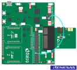
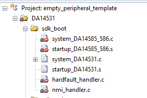
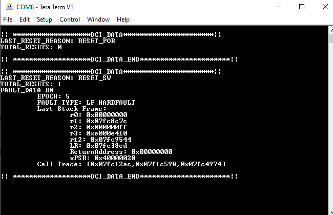
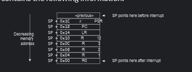
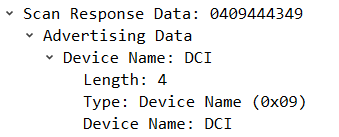

# dlg_crash_info

## Example description

The intent of this application is to provide a module to the user that enables a more detailed crash information log.  This example provides the user with a dlg crash info (DCI) module to utilize in their project, along with an example BLE service for gathering crash info and communicating to a host.  

The DCI module is interleaved into the fault handlers, and upon exception entry, will gather the stack frame along with a stack trace and log this into memory.  This data is stored into an unitialized section of RAM, and following a reset, the user can acess this data to deliver to a host system for further analysis.  

Utilizing this type of mechanism will allow a more seemless debugging approach with production level builds, as the developers can get more complete stack traces remotely, and not rely on 'hot attach' and replication methods.  

## HW and SW configuration

* **Hardware Configuration**
This particular example runs on the DA1453x architecture but could easily be ported to any ARMv7 core. To run this project 'as-is', any of the following kits can be used:
    - DA14531 Daughter board + DA145xxDEVKT-P PRO Motherboard
    - DA14531 SmartBond TINY™ Module + DA145xxDEVKT-P PRO Motherboard
    - For running the example on a **DA14531 Daughter board + DA14531DEVKT-P PRO Motherboard** or **DA14535 Daughter board + DA1453xDEVKT-P PRO Motherboard**the following configuration is required.
      - Connect the DA145xx Pro Development Kit to the host computer.
      - UART TX on P0_6 for DA14531 (Place wire between J1:17 and J2:27) for printing functionality.

      
	  

* **Software configuration**

This example requires:

* SDK6.0.14 or newer (Keil project is present for armv5 and armv6 compilers)
* **SEGGER’s J-Link** tools should be downloaded and installed.
* **A simple serial terminal** should be installed on the PC (e.g. Putty or Teraterm).

## Project Modifications

In your project, make sure to exclude the default fault handler files, hardfault_handler.c and nmi_handler.c:



## How to run

### Initial Setup

For the initial setup of the project that involves linking the SDK to this SW example, please follow the Readme [here](https://github.com/dialog-semiconductor/BLE_SDK6_examples).

- For the DA14531 Getting started guide you can refer to this [link](https://www.dialog-semiconductor.com/da14531-getting-started).


### Compile & Run

1. Open the project via Keil µVision 5.

2. Build the project and load it to target. The project can be run either from ``System-RAM`` or ``SPI Flash``. 
    > __Note:__ 
    In case of SPI Flash, the [Flash Programmer](http://lpccs-docs.dialog-semiconductor.com/UM-B-083/tools/SPIFlashProgrammer.html) from SmartSnippets Toolbox should be used. Refer to the [user manual](http://lpccs-docs.dialog-semiconductor.com/UM-B-083/index.html) to get familiar with the SmartSnippets Toolbox. Or a simplified tool Smartbond Flash Programmer can be used. [SmartBond Flash Programmer](https://www.renesas.com/us/en/software-tool/smartbond-flash-programmer)

3. Set up a serial terminal session by selecting the proper virtual COM port and set the port configuration as shown below:
      - Baudrate: 115200
      - Data: 8 bits
      - Stop: 1 bit
      - Parity: None
      - Flow  control: none

    > __Note:__ 
    Refer to **Section 10** in [Get Started tutorial](http://lpccs-docs.dialog-semiconductor.com/Tutorial_SDK6/serial_port.html) for more information on enabling the UART for debugging purposes.

4.  On boot, you will see a printout of number of resets along with reset issues.  Press SW2 on the motherboard to induce an error.  The terminal will provide two printouts: 1) The original boot message with no errors 2) The crash information log after the error is created.

    


5.  In addition to the UART printout, advertising data, along with a custom service is enabled to retrive the data.  A seperate tool has been created for the DA14531, as a central, to retrieve this data using GTL and python. The BLE interface is described below, and the ReadMe.md for central_crash_info can be referred to for operation.  

## DCI API and Use

All API functions can be referred to in dci.h.  The intent is to simplify the use for an end application. To use the module in another application, the process is as follows:

### *Basic API use*
1) There is a WEAK function declaration, within the SDK for reset_indication.  The user should define this function and call dci_init here, passing the RESET_STAT_REG value from the reset_indication callback.  
2) If the user would like to add an epoch to each reset data point, they should initialize the epoch to zero pending the dci_init() return value:  TRUE indicates that data segments need to be initialized.  In the case an epoch should be retained across resets, conditionally initalize it here.  
3) Call dci_get_data() to retrieve the reset data available.  
4) Clear the tracked data, to allow for tracking of new resets.  Once the data has reached its intended target, the user should clear the data, to allow for tracking of more resets.  If the buffer is full, no more resets will be tracked. 
5) Implement the optional epoch callback.  When the module is finished parsing a reset, it will call into the WEAK function dci_get_epoch().  The user can implement a uint32_t value here, to assign to the reset buffer.   
6) Storing this to NVM is preferred for this type of data and would need to be implemented by the user.   In this case, the user should set DCI_NUM_RESETS (1), after the application is initialized, call dci_get_data() and store this in NVM.   The application should then clear this data immediately with dci_clear_data().  Retrieval and storage is left to the user.  

### *DCI Configuration*
There is a configuration file dci_config.h that allows for simple configurations
- DCI_RAMAP_ADDR0_TEST:  This modifies the software reset and boot sequence to boot back into RAM.  Simplifies debugging of the application for continous development of the module. 
> __Note:__ 
**WARNING!!!** This is used for testing RAM builds only, for debugging and development of the DCI Module.  This SHOULD be disabled once the application is stored into NVM.  
- DCI_CALL_DEPTH:  Stack trace buffer length.  Length is equal to DCI_CALL_DEPTH * sizeof(uint32_t).  Default is set to 6 as this empirically gives enough history to solve the majority of issues.  If constrained on memory, the user can lower this value.  
- DCI_NUM_RESETS:  Should be set to 1 if storing this in Non Volatile memory.  In the case of it being retained in RAM, the user can set the number of resets that can be stored at once.  
- DCI_PRINTF:  Application uart printing mechanism.  Default set to arch_printf() to enable native debug printing from the SDK.  
- DCI_PRINT_VERBOSE:  Enables the API for dci_print_verbose.   Calling into dci_print_verbose will deserialize the data and print it in a readable format.  This functionality can take up additionally code and data space.  
- ENABLE_DCI_SERVICE:  Enables the native custom service for offloading the DCI data.  

## DCI Data types

Each data type used in this application, can be referred to in dci_types.h.
dci_get_data returns a type of dci_info_t

```c
typedef __PACKED_STRUCT
{
	uint8_t			header;
	uint16_t 		length;
	dci_data_t	    	*data;		
}dci_info_t;
```

- header: Sanity check for data retrieval.  Values is defined by DCI_HEADER.
- length:  *data length, to allow for proper buffer allocation.  
- data:  dci_data_t data type

```c
typedef __PACKED_STRUCT
{
	dci_reset_reason_t	last_reset_reason;
	uint8_t			num_resets;
	dci_fault_info_t	fault_data[DCI_NUM_RESETS_STORED];
}dci_data_t;
```

- last_reset_reason:  as defined by dci_reset_reason_t
- num_resets: number of resets currently stored.  Indicates how many resets are present in the fault_data array.  
- fault_data:  Array of individual resets stored as defined in the dci_config.h file.  

```c
typedef enum
{
	RESET_POR,
	RESET_HW,
	RESET_SW,
	RESET_WDOG,
	RESET_LAST,
}dci_reset_reason_t;
```

- dci_reset_reason_t:  This enum maps to the possible values in RESET_STAT_REG on the DA14531. 

```c
typedef enum
{
	LF_HARDFAULT,
	LF_NMI,
	LF_PLATFORM_RESET,
}dci_last_fault_hdlr_t;
```

- dci_last_fault_hdlr_t:  On the Cortex-M0+, ARMv7 specification, there are only two fault handlers defined.  HardFault and NMI.  This enum indicates which fault handler was called.  Please refer to the [Vector Table Definition](https://developer.arm.com/documentation/dui0662/b/The-Cortex-M0--Processor/Exception-model/Vector-table) for more information.  

> __Note:__ 
LF_PLATFORM_RESET is currently not implemented.  This typically is a result of memory allocation issues on the heap, and is escalated into an NMI via an ASSERT_ERROR(0).  This should be evident in the call_trace when parsed.

```c
typedef __PACKED_STRUCT
{
	uint8_t 			data_valid;
	uint32_t			epoch;
	dci_last_fault_hdlr_t		fault_handler;
	cortex_m0_stack_frame_t		stack_frame;
	uint8_t				num_of_call_vals;
	uint32_t			call_trace[DCI_CALL_DEPTH];
	
}dci_fault_info_t;
```

- data_valid:  Sanity check for valid data.
- epoch:  Implemented by the user for optional time tracking.  
- fault_handler:  as described above for dci_last_fault_hdlr_t
- stack_frame:  Stack frame that is pushed by the Cortex-M0+ device, on exception entry, as specified by the [exception entry model](https://developer.arm.com/documentation/dui0662/b/The-Cortex-M0--Processor/Exception-model/Exception-entry-and-return)

    
- num_of_call_vals:  Number of linked addresses found on the stack.  Used to determine valid number of values in call_trace.
- call_trace:  Call stack prior to exception entry.  Memory values determined as Linked Addresses on the stack.  
> __Note:__ 
The DCI Module uses the property of the ARM core pushing linked addresses to the stack as odd values.  The module looks for values on the stack that are odd, and within executable range.  It does not decipher between code and data, so it is possible that data could be interpreted as linked.  It happens rarely, as this requires an odd value, within executable range (RAM Heap or data) to be pushed to the stack by the assembler. 

## DCI Service and BLE Usage

There is a [PyBLEManager Example](https://github.com/dialog-semiconductor/py_ble_manager/tree/main/examples/central/3_central_crash_info) that can be  used to directly pull the DCI data from this example or be used for reference in a custom application.  

### *Advertising*

This example uses advertising to indicate to a central that there is reset data available.  The advertising payload uses service data, and then appends the number of resets from dci_data_t.  This allows for a central to scan and determine if a device has reset information it can connect and extract data from.  Please see the following example for more references on [service data adertising](https://github.com/dialog-semiconductor/BLE_SDK6_examples/tree/main/connectivity/svc_data_beacon)

This example uses the UUID from the DCI Service and appends a uint8_t for the number of resets.

***Advertising Data***

| AD # | AD Length | AD Type                          | AD Data                                               |
|------|-----------|----------------------------------|-------------------------------------------------------|
|  1   |     2     | GAP_AD_TYPE_FLAGS                | 0x06 (BR/EDR Not Supported, LE Gerneral Discoverable) |
|  2   |     18    | GAP_AD_TYPE_SERVICE_128_BIT_DATA | <DCI Sevice UUID, Number of Resets>                   |


***Scan Response Data***
| AD # | AD Length | AD Type                          | AD Data |
|------|-----------|----------------------------------|---------|
|  1   |     4     | GAP_AD_TYPE_COMPLETE_NAME        | "DCI"   |



### *DCI Service*

***Overview***

The DCI service is a custom service with two main characteristics.  It is used to extract the dci_info_t data from the 531.  The service is configured as following:

|             | UUID                                 | Type                | Properties               | Descriptors           | Additional Info                          |
|-------------|--------------------------------------|---------------------|--------------------------|-----------------------|------------------------------------------|
| DCI Service | 21ce31fc-da27-11ed-afa1-0242ac120002 | Service Declaration | Read                     | None                  |                                          |
| DCI_TX      | 17738e00-54f9-4a2c-a6ed-1ee67e00f323 | Char Declaration    | Notify                   | CCC, User Description | Used to transmit data from 531 to client |
| DCI_RX      | 8a8b791b-82f3-4ecf-9ce4-7d422c371a01 | Char Declaration    | Write, Write Request     | User Description      | Used for client to write to 531          |

For generating your own customer service, take a look at the following [tutorial](https://lpccs-docs.renesas.com/tutorial-custom-profile-DA145xx/create_custom_profile_characteristic.html)

Once the service is discovered, the client should write a 1 to the Client Characterstic Configuration to enable notifications.

***DCI_RX Characteristic***

There are two available commands to extract the DCI data from the DA14531, defined by dci_svc_command_t:

| Command            | Value  | Description                                      |
|--------------------|--------|--------------------------------------------------|
| GET_ALL_RESET_DATA | 0x01   | Retrieves all reset data available in dci_info_t |
| GET_NUM_RESETS     | 0x02   | Retrieves number of resets stored                |

Writing this command to the RX Characteristic will result in the service notifiying the data on the DCI_TX characteristic

***DCI_TX Characteristic***

The service uses this characteristic to transmit DCI data back to the client.  The data is formatted as follows:

| FIELD           | Type              | Description                                                       | Size                                         |
|-----------------|-------------------|-------------------------------------------------------------------|----------------------------------------------|
| current command | uint16_t          | Command that is associated with the data                          | 2                                            |
| length          | uint16_t          | length of total data to follow                                    | 2                                            |
| data            | uint8_t *         | variable array depending on total resets communicated and command | variable                                     |

***GET_ALL_RESET_DATA Response***

| FIELD           | Type              | Value                                          | Size                                                |
|-----------------|-------------------|------------------------------------------------|-----------------------------------------------------|
| current command | uint16_t          | 0x01 (GET_ALL_RESET_DATA)                      | 2                                                   |
| length          | uint16_t          | depends on number of stored resets             | 2                                                   |
| dci_data        | dci_data_t        | fault data for resets stored on device         | variable depending on number of resets              |

***GET_NUM_RESETS Response***

| FIELD           | Type              | Value                                          | Size |
|-----------------|-------------------|------------------------------------------------|------|
| current command | uint16_t          | 0x02 (GET_NUM_RESETS)                          | 2    |
| length          | uint16_t          | 0x01                                           | 2    |
| num resets      | uint8_t           | number of resets that are stored on the device | 1    |


## Further reading

- [Wireless Connectivity Forum](https://lpccs-docs.renesas.com/lpc_docs_index/DA145xx.html)


## Known Limitations

- There are no known limitations for this example. But you can check and refer to the following application note for
[SDK6 known limitations](https://lpccs-docs.renesas.com/sdk6_kll/index.html)

## Feedback and support ?

If you have any comments or suggestions about this document, you can contact us through:

- [Wireless Connectivity Forum](https://community.renesas.com/wireles-connectivity)

- [Contact Technical Support](https://www.renesas.com/eu/en/support?nid=1564826&issue_type=technical)

- [Contact a Sales Representative](https://www.renesas.com/eu/en/buy-sample/locations)

