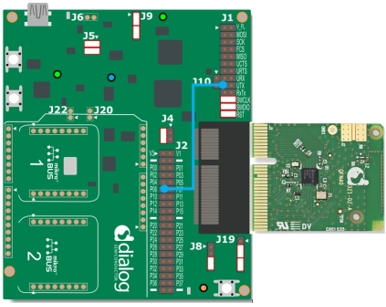
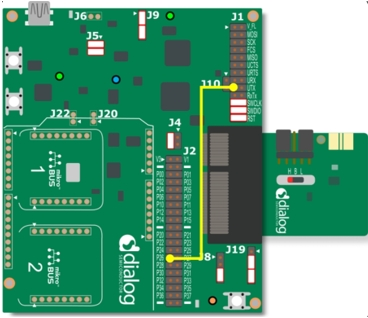
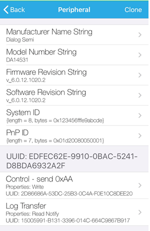
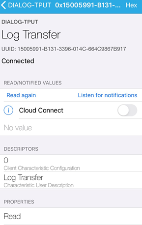
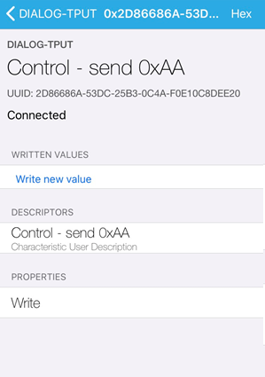

# DA14585/DA14586/DA14531 DLE and L2CAP Packet Optimization

---

## Example description

This project is intended to illustrate to the user:
- How to do a peer feature request for determining peer DLE capability
- How to request DLE and utilize larger packets to enhance throughput
- Basic principles of L2CAP 100% packet utilization
- Packet optimization for non DLE devices

This functionality can be verified by:
- Using a BLE handset
- Reading serial output from the device.
	

## HW and SW configuration
This example runs on the BLE Smart SoC (System on Chip) devices:
- DA14585/DA14586 or DA14531 daughter board + DA145xxDEVKT-P PRO-Motherboard.
- DA14585/DA14586 Basic development Kit.
- DA14531 USB Kit

The user manuals for the development kits can be found:
- [DA14531 Development Kit Product page](https://www.dialog-semiconductor.com/products/da14531-development-kit-pro) for the DA145xxDEVKT-P PRO-Motherboard.
- [DA14585 Development Kit Basic](https://www.dialog-semiconductor.com/products/da14585-development-kit-basic) for the Basic Development Kit.
- [DA14531 USB Development Kit Product page](https://www.dialog-semiconductor.com/products/da14531-development-kit-usb) for the DA14531 USB Development Kit.

* **Hardware configuration DA14585 using the DA145xxDEVKT-P PRO-Motherboard**

	- When using DA14585/DA14586, Jumper P0_6 from J2 to UTX (Pin 17 on J1).
	
	.
	
	- When using DA14531, Jumper P2_6 from J2 to UTX (Pin 17 on J1) for serial UART communication.
	
	.
	
    - When using DA14531 USB development kit no hardware configurationis needed. You need only to Redefine the UART2_TX_PIN to GPIO_PIN_5 (1 wire UART ) 
	  
	  **#define UART2_TX_PIN            GPIO_PIN_5**

	.
	
* **Software configuration**

	- This example requires:
    * SDK6.0.12 or later (Older versions of SDK6 require minimal changes)
	- **SEGGER’s J-Link** tools should be downloaded and installed.

## How to run the example

### Setup

For the initial setup of the project that involves linking the SDK to this SW example, please follow the Readme [here](__Github sdk6 readme link__).

-Start Keil using the `tput_optimization.uvprojx` Keil project file.

2. Expand the dialog shown in the red box in the image below.
	
	

3. Select your target device: DA14531, DA14585, DA14586

4. Open your favorite serial terminal application, e.g. TeraTerm, RealTerm, Putty - use 115200, 8, N, 1 as your settings.

5. Compile (F7) and launch (ctrl + F5) the example.\
If the warning (shown below) pops up press OK.

### Running the Example

1. Open a BLE application on your handset and look for "DIALOG-TPUT"

2. Connect to the device.
	
	
	
3. Subscribe to notifications on the Log Transfer characteristic.
	
	

4. Write the value to 0xAA to the Control Point Characteristic. 
	
	

5. This will begin a log transfer of static bytes. 

6. Check your terminal for debug output and throughput calculation.
	
	

## How it works
### General Logic
The example uses a successive approach for optimization throughput.  In the Link Layer, we are limited to two basic buffer sizes depending on
The support for DLE: 27, 251.  First, we do a peer feature request to see if DLE is supported - If supported, we utilize
the additional packet space.  From here, we do a connection parameter update, and following the result of this we do an MTU Exchange. 
The MTU exchange is intended to grant a larger payload for non-DLE devices and provide adequate buffer space for DLE devices.
Following the MTU exchange, the optimal packet size is determined.  We calculate the required overhead of the L2CAP and ATT and force
our payload then to utilize the the rest of the space.  For non-DLE devices that have MTUs greater than 104, we statically set the payloadsize to
101.  This number is has been emperically determined to provide good throughput in a noisier environment. Full packet utilization provides
a good enhancement on throughput if otherwised not considered. 

### Note
This example does not consider a more complex connection parameter scheme for throughput optimization.  This would be an excercise to the user.
Note that DSPS does include this functionality for reference and provides optimal connection parameters for DLE and non-DLE devices.

## Known Limitations

- There are no known limitations for this example. But you can check and refer to the following 
  application note for known hardware limitations.
For DA14531 devices:
  [DA14531 hardware limitations](https://www.dialog-semiconductor.com/sites/default/files/da14531_errata_1v0.pdf)
For DA14585 devices:
  [DA14585 hardware limitations](https://www.dialog-semiconductor.com/sites/default/files/da1458x-knownlimitations_2019_01_07.pdf)
- Dialog Software [Forum Link](https://support.dialog-semiconductor.com/forums/dialog-smartbond-bluetooth-low-energy-%E2%80%93-software "Forum Link").
- You can also refer to the troubleshooting section in the [Getting Started with the DA14531 PRO Development Kit](http://lpccs-docs.dialog-semiconductor.com/UM-B-117-DA14531-Getting-Started-With-The-Pro-Development-Kit/index.html).

