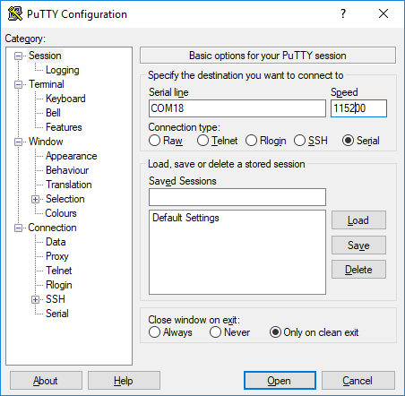

## Example Description

This example configures a DA14531 device to be used for social distancing purposes. The Social Distancing Tag (SDT) is a reference software example that targets mainly, but not exclusively, wearable devices allowing its users to be warned if they do not comply with social distancing recommendations. In the COVID-19 pandemic context, the SDT users should not gather with a physical distance lower than 1.5m. The users in a professional environment should be warned that they are not complying with the recommended physical distanciation.

## HW and SW Configuration
Example requirements:
- At least two DA14531 Bluetooth Smart SoC devices.
  The DA14531 Smartbond daughterboard evaluation kit, the DA14531 Smartbond TINY module, or the DA14531 USB kit can be used.
- The DA145xx Pro Development Kit to print out the messages generated from the SW.
  Along with the motherboard, the DA14531 Smartbond daughterboard evaluation kits or the DA14531 Smartbond TINY module can be used

### Hardware Configuration for the DA14531 Smartbond TINY Module

- The USB1 connector of the DA145xx Pro Development Kit should be connected to the host computer
- The jumpers should be connected as shown in the graphic for downloading your binary to the RAM either via JTAG (using Keil or Smart Snippets Toolbox) or via UART using the P05 single wire UART configuration (only via the Smart Snippets Toolbox)
- For more information on burning the flash on the TINY module, see [DA14531 Smartbond TINY Module Development Kit Hardware User Manual](https://www.dialog-semiconductor.com/da14531-module-HW-DevKit-UM).

- The LED that indicates the proximity alert is on pin P09 by default, thus the alert indication is on D2 on TINY module
- The UART output is on pin P05 (single wire UART), thus the downloading of the fw via UART and the printing of the application messages is done via the same pin

	

### Hardware Configuration for the DA14531 Smartbond Daughterboard

- The USB1 connector of the DA145xx Pro Development Kit should be connected to the host computer
- The jumpers should be connected as shown in the graphic for downloading your binary to the RAM either via JTAG (using Keil or Smart Snippets Toolbox) or via UART using the P05 single wire UART configuration (only via the Smart Snippets Toolbox)
- For more information on burning the onboard flash on DA14xxx Pro Development Kit, see [DA14531 Development Kit Pro Hardware User Manual](https://www.dialog-semiconductor.com/um-114-da14531-development-kit-pro).
- The LED that indicates the proximity alert is on pin P09 by default, thus the alert indication is on D5 on DA14xxx Pro Development Kit for the case of the DA14531 daughtercard
- The UART output is on pin P05 (single wire UART), thus the downloading of the fw via UART and the printing of the application messages is done via the same pin	
	
	

### Hardware Configuration for the DA14531 USB Kit

- The USB J1 connector of the USB Development Kit should be connected to the host computer
- The switches should be configured as shown in the graphic for downloading your binary to the RAM either via JTAG (using Keil or Smart Snippets Toolbox) or via UART using the P05 single wire UART configuration (only via the Smart Snippets Toolbox)
- For more information on burning the onboard flash on DA14531 USB Development Kit, see [DA14531 USB Development Kit Hardware](https://www.dialog-semiconductor.com/UM-B-125-da14531-usb-HW-Devkit).
  
- The LED that indicates the proximity alert is on pin P09 by default, thus the alert indication is on D7 on DA14531 USB Development Kit.
- The UART output is on pin P05 (single wire UART), thus the downloading of the fw via UART and the printing of the application messages is done via the same pin	
	
	

### Software Configuration

 Example requirements:
- SDK v6.0.14 or later
- **SEGGER’s J-Link** tools downloaded and installed
- A serial port terminal, like PuTTY or similar

## Run the Example

The example is delivered with the latest SDK6 release. The project is located under the following directory: ``DA145xx_SDK\6.0.14.1114\projects\target_apps\Social_Distancing_Tag``

### Initial Setup

1. Start Keil.
2. Compile the example by pressing the **Build** button. 
3. Depending on the devices available on the end user side, do one of the following:
   - Burn the SPI flash of the TINY module and detach the TINY module from the motherboard, and then apply a coin cell battery and operate
   - Download the fw directly to RAM on a TINY module or a DA14531 daughtercard and remain attach to the motherboard to print out the messages generated.

   For this example setup only two DA14531 devices are used and both devices remain connected to their motherboards and are printing on different terminals.
4. To load the executable to the SPI flash memory, see [SmartSnippets Toolbox User Manual](http://lpccs-docs.dialog-semiconductor.com/UM-B-083/tools/SPIFlashProgrammer.html) for instructions).
5. After the devices are connected the PC, open **Device Manager** (for Windows OS) and see four COM ports enumerated as shown in the following figure.
   In this example, two motherboards are connected to the PC and each motherboard exposes one pair of serial ports each. Always choose the lowest port number of each pair for printing out UART messages generated from the fw.

	

6. Open your serial port terminal and choose the lowest port for each connected motherboard.
7. Configure the connection with baud rate 115200, 8 data bits and 1 stop bit, no parity and no flow control, and then press **Open**.
   - For PuTTY, configure your Session as follows:

	

   - For Connection -> Serial as follows:

	

8. In Keil, start a debugging session, and then press **Run** or F5 (for downloading to RAM using Keil option).
	
	
	
 ### Program Using the Dialog SmartBond Flash Programmer Standalone Tool
 The SDT example is also available for downloading/flashing via the Flash programmer Standalone tool. To select the Social Distancing project .hex and directly burn the file into the flash, press the **Online Resources** button.
 For more information regarding the Flash Programmer Standalone tool, see [Dialog Smartbond Flash Programmer User Manual](http://lpccs-docs.dialog-semiconductor.com/um-b-138/introduction.html).

 
 ### Monitor Distance
At this point you should have the executable running on two DA14531.

The device can switch between being a BLE Advertiser and a Scanner. In the **Advertising** state, scanner device detects an advertiser's presence and measures its Received Signal Strength Indicator (RSSI). In the **Scanning** state, the device detects advertising devices nearby and store their addresses, RSSI, and the number of times an advertising report was received. This information is stored in a dynamic list.

After scanning is completed, the dynamic list entries are printed. The list is traversed, and if there is a device with a strong signal nearby, the scanning device will initiate a connection. By "nearby strong signal" is assumed a device with an RSSI stronger than -70 dbm (this threshold is configurable in the user_prox_zones_rssi array). After the connection, the entry list is marked as **Accessed**, and then the devices exchange their measured RSSIs through a GATT service for a configurable number of times and the maximum RSSI is used as an indication for the distance. At this point, the LED blinks according to the proximity zone of the devices. The same procedure is repeated with every device that is in close range, and then an advertising and scanning cycles start again.

``**WARNING**: Sometimes a scanning device may not report all nearby devices or the initiated connection may fail. That may happen because the other device is switched to scanning mode or it is already connected with another device.``

The SW uses a unique static random address derived from the OTP header data. 

You can monitor the device state on the UART output. The associated messages are:

* xx:xx:xx:xx:xx:xx : ADVERTISING: The device is advertising its presence to peer devices
* xx:xx:xx:xx:xx:xx : ADVERTISING COMPLETED: The device completed advertising
* xx:xx:xx:xx:xx:xx : SCANNING: The device is searching for peer devices
* xx:xx:xx:xx:xx:xx : SCAN COMPLETED: The device finished searching for peer devices

The next figure shows the case when no device is detected and SDT switches from being a Scanner to Advertiser.

 

When a scanning operation completes, all the entries of the dynamic list are printed out:

* STORED LIST:
  LIST ENTRY:    BD ADDRESS:     XX XX XX XX XX XX       RSSI: -57       IS ACCESSED: False      FOUND: 1 time(s) : The list entry stores the BD Address of the peer device, the filtered RSSI value, a flag which indicates if a connection is initiated, and the number of received advertising reports.

When the device completes the scanning, it goes through the advertising list and initiates connections with all the available devices in the list, starting with the strongest RSSI node. After a connection is established, both devices exchange their RSSI values 4 times (this parameter is configurable via USER_CON_RSSI_MAX_NB definition). The strongest exchanged RSSI value is taken to initiate the corresponding alert.

This procedure is shown in the next screenshot:

1. CA:1B:32:07:AB:C3: SCAN COMPLETED : Completed the scanning period.
2. INFO: THE STRONGEST NODE WITH RSSI -47 FOUND: This is the strongest RSSI measured during scanning.
3. CA:1B:32:07:AB:C3: ATTEMPT FOR CONNECTION: The device initiates a connection request to the specific device.
4. CA:1B:32:07:AB:C3: CONNECTED AS INITIATOR: The connection request is successful and the device is the initiator of this connection (on the peer device a message CONNECTED AS SLAVE should be prompted).
5. LOCAL RSSI VALUE -47: The local received signal strength is obtained, sent to the peer through the GATT service, and printed 4 times.
6. RECEIVED RSSI VALUE -47: The received RSSI is obtained from the peer through GATT service and printed 4 times.
7. INFO: STRONGEST RSSI IN CONNECTED STATE: -46: Indicates the strongest RSSI obtained from the exchange.
8. INFO: CA:1B:32:07:AB:C3 IS IN DANGER ZONE: The device is located in very close proximity with another device based on the RSSI value.
9. CA:1B:32:07:AB:C3: DISCONNECTED WITH REASON 16: After the alert is finished, the devices disconnect. The disconnection request is issued always from the initiator of the connection, hence the disconnection reasons should be.
  
	- The 0x16 corresponds to the reason ERROR_CON_TERM_BY_LOCAL_HOST at the initiator side
	- The 0x13 corresponds to the reason ERROR_REMOTE_USER_TERM_CON at the slave side
	- Sometimes a disconnection occurs for the reasons other than 0x16 or 0x13, due to various errors that my happen during connection or timeouts

10. LIST ENTRY:    BD ADDRESS:     80 ea ca a0 06 8a       RSSI: -47       IS ACCESSED: True       FOUND: 6 time(s): After the disconnection, the device indicates the current status of the scanned devices marking the disconnected one as accessed.
11. CLEAR LIST: The device checks for the devices to connect to available in scanning list. If no other devices are available, the device clears the scanning list and starts advertising again. If the scanning list contains the devices that are not accessed yet, then the device initiates a connection to next available node.

The corresponding procedure from the slave side is shown in the next screenshot (it is taken from the same device in another instance when the devices is connected as slave):

### Implementation Details
The threshold levels that determine the proximity zone are defined in ``user_social_distancing.c`` in the array named ``user_prox_zones_rssi``. Four proximity zones are defined, namely **Danger Zone**, **Warning Zone**, **Coarse Zone**, and **BLE Limit Zone**. In this file, you can change the RSSI thresholds to the values suitable for your application.

When the device is initialized, the function ``user_app_adv_start()`` is called as the default advertising operation. This sets a timer that times out after ``USER_SWITCH_ADV_SCAN_TO`` plus a small random value, which in turn calls the ``user_switch_adv_scan_timer_cb()``. When this callback function is called, the device stops advertising and enters the **Scanner** state.

Scanning starts with the function ``user_scan_start()`` and is configured with the parameters of ``user_scan_conf`` struct. Every time a new advertising report is received, the function ``user_app_on_adv_report_ind()`` is called, this adds a peer device's advertising report to a dynamic list. 

When scanning for advertising devices, the scanner populates a list with the found devices along with the RSSI value obtained while advertising and some additional data. Based on this advertising RSSI value, the scanner decides if the device is located in close proximity, and if yes, a connection attempt starts. The close proximity threshold is defined by the ``user_prox_zones_rssi[USER_PROX_ZONE_COARSE]``. The values of the advertising RSSI are populated in two ways. The first method: the stack filters all advertising messages that come from the same device so the advertising RSSI is obtained by a single message. The second method: the stack does not filter the messages and reports to the application all the advertising messages tracked. In the second case, the scanner uses a running average filter over the RSSI's received from the same device. To enable or disable the above functionality, the user should assign one of the following in the ``user_scan_config.filter_duplic`` structure:
- ``SCAN_FILT_DUPLIC_EN`` to enable stack filtering and get a signle RSSI value per device
- ``SCAN_FILT_DUPLIC_DIS`` to accept all advertising messages and perform the running average

When scanning completes, the ``user_app_on_scanning_completed()`` function is called. The list is searched to check the maximum RSSI node (if there is one) and if it exceeds the advertising RSSI threshold, a connection is initiated. If not, the device enters another Advertising/Scanning cycle.

The reason the device executes connections instead of estimating proximity based on the RSSI from the advertising messages is because during the connection the device operates over a larger range of channels than during advertising, and can more accuratly measure RSSI.

Connections are initiated with the ``user_app_on_scanning_completed()`` via the ``initiate_connection_attempt()`` either when the previous connection is over or if the ``USER_INITIATE_CONN_TO`` time elapses. After the connection, the function ``user_poll_conn_rssi_timer_cb`` checks the connection RSSI every ``USER_UPD_CONN_RSSI_TO`` interval and also evaluates the measurements. This also triggers an RSSI exchange with the peer device. If the strongest RSSI, peer or own, exceeds the thresholds defined in ``user_prox_zones_rssi`` array, an alert starts, which blinks with a frequency related to the proximity zone that was estimated. After ``USER_CON_RSSI_MAX_NB`` measurements and as soon as the alert is done, the link is disconnected. The list is traversed to find the next connection candidate, and when the list is exhausted, a new Advertising/Scanning cycle begins.

The indication of the proximity is done via blinking of the LED on the device. The ON/OFF period of the alert depends on the proximity zone estimation. The ON/OFF periods are configurable through the below definitions:
- ``#define DANGER_ZONE`` : default 20 ms period
- ``#define WARNING_ZONE``: default 100 ms period
- ``#define COARSE_ZONE`` : default 150 ms period

Along with the timers that control the alert interval, a seperate timer also starts and counts down until the disconnection event is issued from the initiator of the connection. This timer is also configurable via the ``ALERT_TIME`` which defaults to 1 second. 

As already mentioned, the devices running the SDT SW go through periods of Advertising, Scanning, and connection initiation periods. The amount of time spend on the above three actions can be configurede through the ``ADVERTISING_TIMEOUT_msec`` definition which determines time amount for the advertising period. The scanning and connection initiation periods are defined as percentages of the advertising period via the ``SCANNING_PERCENTAGE`` and the ``CONNECT_INIT_PERCENTAGE`` definitions. Additionally, to avoid identical Advertising and Scanning periods for each device, a random offset is also added in each Advertising/Scanning period.

## Known Limitations

- When programing DA14531 SMARTBOND TINY™ MODULE using Keil, an error stating "No Cortex-M SW Device found" may occur when the user tries to open the debugger session. User must lower the JTAG clock speed to 2 MHz. For more information, see the section [KEIL Installation](http://lpccs-docs.dialog-semiconductor.com/UM-B-139-Getting-Started-with-DA14531-TINY-Module/05_Software_Development_Tools/Software_Development_Tools.html#keil-installation) in the UM-B-139 Getting Started with DA14531 TINY Module document
- No known hardware limitations for this example, but it is recommended to see the following:
  - Application note for [known hardware limitations for DA14531 devices](https://www.dialog-semiconductor.com/da14531_HW_Limitation)
  - Dialog Software [Forum link](https://www.dialog-semiconductor.com/forum)
  - [DA14531 Getting Started guide](https://www.dialog-semiconductor.com/da14531-getting-started)

