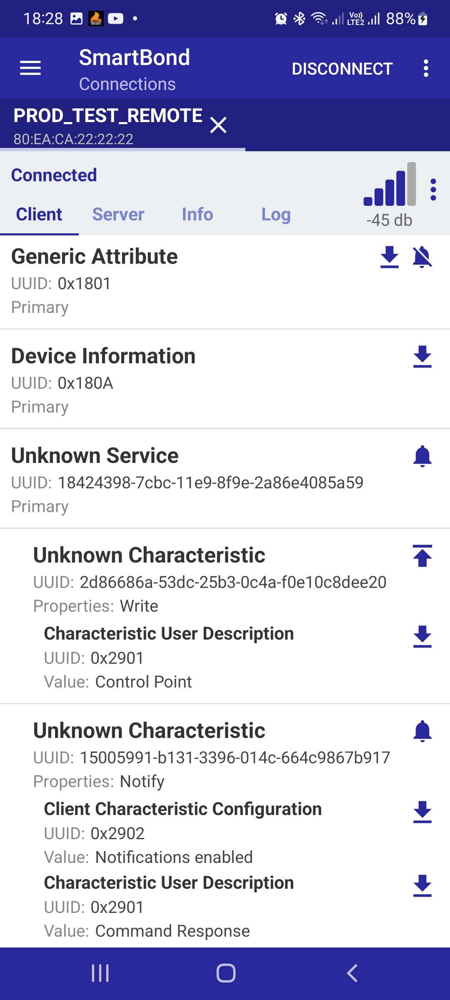
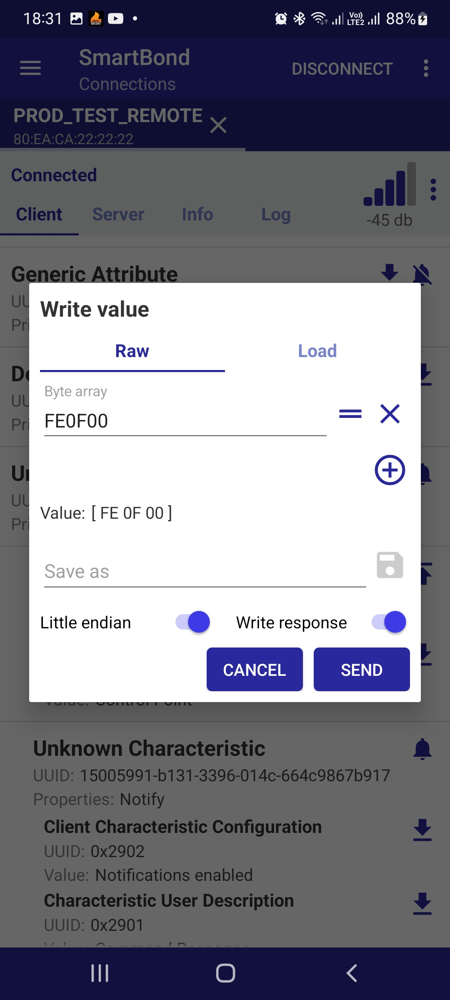
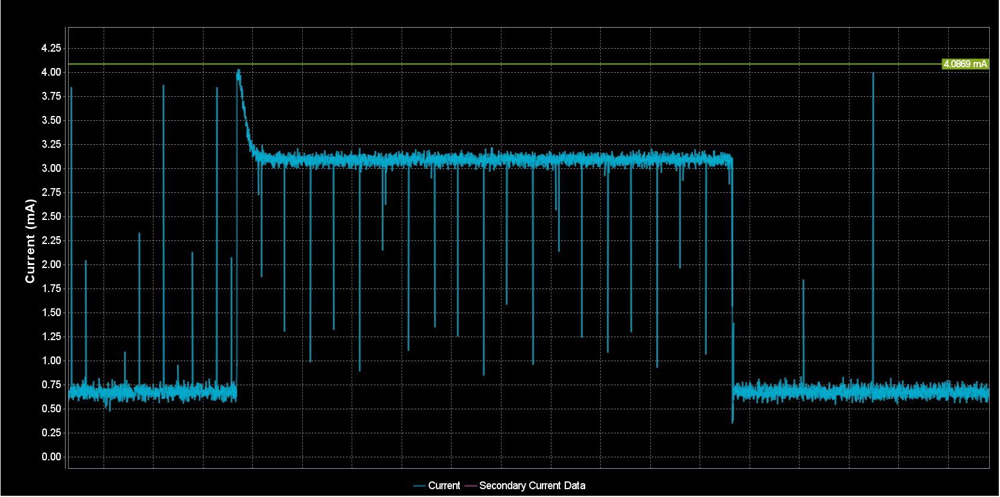
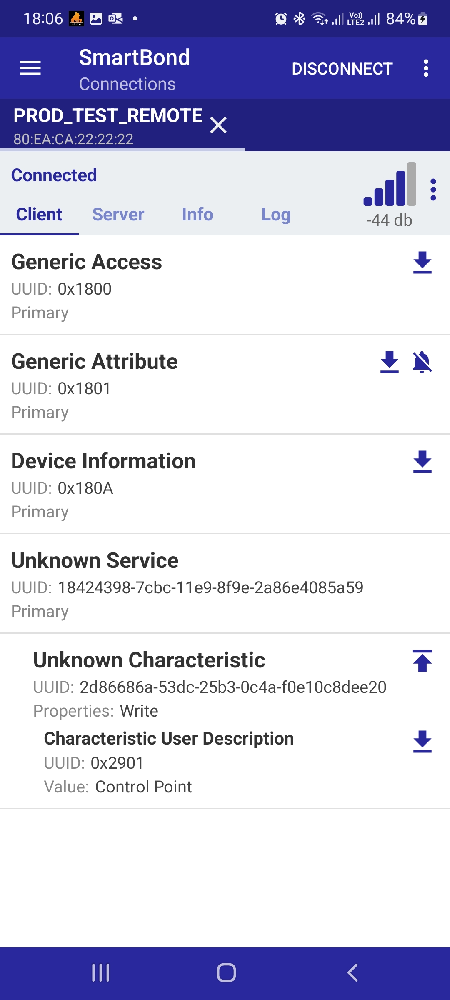

# Standalone Production test FW for DA14531-00/01 and DA14585/586

## Example Description

During radio frequency product certification (FCC, ETSI, etc) using the standard prod_test fw requires that the device under test should be connected over UART via predefined pins in order for the DUT to receive the test commands. This is not always an option for designs that have pin limitations or the predefined pins are already connected to application specific HW. 

The current SW example is a feature implementation on top of the original prod_test fw and allows the radio frequency tests to be performed without having the device connected over UART for issuing the corresponding commands. 

The project implementing this feature comes with four different targets per device:
- **\<device\>**: Implements the standard functionality of the production test, commands are issued to the device via UART.

- **\<device\>_STANDALONE**: Implements all the radio and sleep commands and enables them via button press. The user can predefine a batch of commands. When the fw runs the device will rotate through the predefined commands via pushing a button. By default the buttons are P011-SW2 for DA14531-00/01 devices and P11-SW3 for DA14585/586.

- **\<device\>_REMOTE**: Implements all the radio and sleep commands and enables them via remote access. The project implements an advertising peripheral able to be connected to a central. The peripheral implements a custom service with two characteristics, for accepting commands and their corresponding parameters and notifying the user. In case the command issued from the central is faulty a notification is triggered indicating the faulty parameter. If the command is proper, the device will disconnect and start the command execution.

- **\<device\>_BATCH_REMOTE**: Implements all the radio and sleep commands and enables them via remote access. This variant is a combination of the **STANDALONE** and the **REMOTE** targets. The user is able to set a predefined set of commands and trigger the batch remotely via accessing the DUT over a BLE connection with a central.

 Each feature is enabled via defining one of the following flags in the "Options for Target" in the "Preprocessor Symbols": 
- **STANDALONE_MODE** : all the application and profile files are removed.
- **REMOTE_MODE** : all the application and profile files are included.
- **BATCH_REMOTE_MODE** : all the application and profile files are included.

One of the features of the Standalone prod_test is that the user can choose to either start executing the commands as soon as the fw is downloaded or as soon as there is a button press. To start command execution immediately the **STANDALONE_START_IMMEDIATELY** should be defined.

## HW and SW configuration

* **Hardware configuration**
	- This example runs on DA14531-00/01 and DA14585/586 Bluetooth Smart SoC device.
  - Any of the following Development Kits can be used : 
    - DA14531-00/01 Daughter board + DA145xxDEVKT-P PRO Motherboard
    - DA14531 SmartBond TINY™ Module + DA145xxDEVKT-P PRO Motherboard
    - DA14585 Daughter board + DA145xxDEVKT-P PRO Motherboard

  - For running the example on a **DA14531 Daughter board + DA145xxDEVKT-P PRO Motherboard** the following configuration is required.         
      - Connect the DA145xx Pro Development Kit to the host computer.
      - Make sure that the jumper on J19:2-3 is populated with a jumper for activating the SW2 button.

  - For running the example on a **DA14585/586 Daughter board + DA145xxDEVKT-P PRO Motherboard** the following configuration is required.         
      - Connect the DA145xx Pro Development Kit to the host computer.
      - Make sure that the jumper on J19:4-5 is populated with a jumper for activating the SW3 button.

* **Software configuration**

This example requires:
* SmartSnippets Toolbox 5.0.14 or later.
* SDK6.0.18
* **SEGGER’s J-Link** tools should be downloaded and installed.

### STANDALONE MODE TARGET

In STANDALONE the user should predefine the tests that the device is going to perform. The definition of the tests is done in two files.
- **da1458x_config_basic.h**: Includes define flags that enable a set of tests of the same category along with their corresponding parameters (channel, payload type, payload length).Below is the list of the available definitions:
  - **STANDALONE_UNMOD_TX_TEST**: Starts the un-modulated transmission.
  - **STANDALONE_UNMOD_RX_TEST**: Starts the un-modulated reception.
  - **STANDALONE_LE_TX_TEST**: Starts the packetized transmission.
  - **STANDALONE_LE_RX_TEST**: Starts the packetized reception.
  - **STANDALONE_CONT_MOD_TX_TEST**: Starts the continuous transmission mode.
  - **STANDALONE_GO_TO_SLEEP_TEST**: Enable sleep test.
  
  For each radio related test the device will execute the same radio operation in three user defined channels **LOW_CHANNEL**, **MID_CHANNEL**, **HIGH_CHANNEL** and with the corresponding **PAYLOAD_TYPE** and **PAYLOAD_LENGTH**

- **dialog_prod.c**: Includes the array that holds the predefined tests called **standalone_tests[]**. The user may alter this table in order to describe a more refined and detailed test case. Each entry of the table should include an **.command_on** and a **.command_off** member.

### REMOTE MODE TARGET

In REMOTE the user can access the DUT via a generic BLE phone application. The device exposes the Device Information Service and a custom service with two characteristics. Via the Control Point characteristic the user is able to write the command to be executed. The write command should be done in a specific format for proper operation. Since each command accepts different parameters as input the format of the BLE command is the following.

**OP_CODE | CHANNEL | PAYLOAD_TYPE | OPERATION | DATA_LENGTH | SLEEP_MODE**

Not all parameters are mandatory per command (marked as N/A in Table 1). N/A fields are ignored when validating the command.

<table>
  <caption> <b> <i> Table 1: Commands Accepted via Control Point Characteristic</i></b></caption>
<thead>
  <tr class="header">
  <th style="text-align: center;">Command</th>
  <th style="text-align: center;">OP_CODE (2 bytes)</th>
  <th style="text-align: center;">CHANNEL (1 byte)</th>
  <th style="text-align: center;">PAYLOAD_TYPE (1 byte)</th>
  <th style="text-align: center;">OPERATION (1 byte)</th>
  <th style="text-align: center;">DATA_LENGTH (1 byte)</th>
  <th style="text-align: center;">SLEEP_MODE (1 byte)</th>
  </tr>
</thead>
<tbody>
  <tr class="odd">
  <td style="text-align: center;">Unmodulated Tx/Rx Test</td>
  <td style="text-align: center;">0xFE0E</td>
  <td style="text-align: center;">0 - 39</td>
  <td style="text-align: center;">N/A</td>
  <td style="text-align: center;"> 
  <table>
  <tr><td>TX</td><td>0x54</td></tr> 
  <tr><td>RX</td><td>0x52</td></tr> 
  <tr><td>OFF</td><td>0x4F</td></tr>
  </table>
  <td style="text-align: center;">N/A</td>
  <td style="text-align: center;">N/A</td>
  </tr>
  <tr class="even">
  <td style="text-align: center;">Continuous TX</td>
  <td style="text-align: center;">0xFE0F</td>
  <td style="text-align: center;">0 - 39</td>
  <td style="text-align: center;">0-7</td>
  <td style="text-align: center;">N/A</td>
  <td style="text-align: center;">N/A</td>
  <td style="text-align: center;">N/A</td>
  </tr>
  <tr class="even">
  <td style="text-align: center;">Continuous TX Stop</td>
  <td style="text-align: center;">0xFE10</td>
  <td colspan="5" style="text-align: center;">No parameters needed for the Stop command</td>
  </tr>
  <tr class="even">
  <td style="text-align: center;">LE TX</td>
  <td style="text-align: center;">0x201E</td>
  <td style="text-align: center;">0 - 39</td>
  <td style="text-align: center;">0-7</td>
  <td style="text-align: center;">N/A</td>
  <td style="text-align: center;">1 - 255</td>
  <td style="text-align: center;">N/A</td>
  </tr>
  <tr class="even">
  <td style="text-align: center;">LE TX Stop</td>
  <td style="text-align: center;">0x201F</td>
  <td colspan="5" style="text-align: center;">No parameters needed for the Stop command</td>
  </tr>
  <tr class="even">
  <td style="text-align: center;">LE RX</td>
  <td style="text-align: center;">0xFE0C</td>
  <td style="text-align: center;">0 - 39</td>
  <td style="text-align: center;">N/A</td>
  <td style="text-align: center;">N/A</td>
  <td style="text-align: center;">N/A</td>
  <td style="text-align: center;">N/A</td>
  </tr>
  <tr class="even">
  <td style="text-align: center;">LE RX Stop</td>
  <td style="text-align: center;">0xFE0D</td>
  <td colspan="5" style="text-align: center;">No parameters needed for the Stop command</td>
  </tr>
  <tr class="even">
  <td style="text-align: center;">Sleep</td>
  <td style="text-align: center;">0xFE01</td>
  <td style="text-align: center;">N/A</td>
  <td style="text-align: center;">N/A</td>
  <td style="text-align: center;">N/A</td>
  <td style="text-align: center;">N/A</td>
  <td style="text-align: center;">
  <table>
  <tr><td>Disable</td><td>0</td></tr> 
  <tr><td>Extended</td><td>1</td></tr> 
  <tr><td>Deep</td><td>2</td></tr>
  </table>
  </td>
  </tr>
</tbody>
</table>

As soon as the command is issued to the peripheral, the DUT will validate the command and proceed to either executing or report an error. In the case of an invalid command, wrong op_code or parameter, the DUT will reply to the central via a notification in the Response characteristic indicating the invalid parameter. Error codes are listed below:
- **0x01 - INVALID_OPCODE**
- **0x02 - INVALID_CHANNEL**
- **0x04 - INVALID_PAYLOAD_TYPE**
- **0x08 - INVALID_OPERATION**
- **0x10 - INVALID_DATA_LEN**
- **0x20 - INVALID_SLEEP_MODE**

Each Direct Test Mode command will last for a predefined amount of time, this amount of time is controller via the END_OF_TEST_TIME definition. The default setting is 5 seconds. There is no need for the user to issue any of the STOP commands listed on Table 1. Upon command completion the device will issue a sw reset from RAM in order to start advertising again and be ready for the next command.

#### REMOTE MODE EXAMPLE

When in remote mode the device will start advertising as soon as the fw is downloaded in the target device. Using the Renesas SmartBond phone application (or any Smartphone Generic BLE application available) the user should be able to scan and connect to the PROD_TEST_REMOTE device. Using the phone application the user can send the following command, via the **Control Point** characteristic, to start the continuous TX at channel 0 **0xFE0F00**. The notifications can also be enabled in the **Command Response** characteristic for getting feedback in the case of a wrong command or parameter.

As soon as the command starts executing the device will disconnect from the phone and the corresponding command will execute for **END_OF_TEST_TIME** time. When the time elapses the device will start advertising again waiting for a connection. In order to verify functionality without having an RF tester the power profiler can be used, increased current indicates RF activity.

### BATCH REMOTE MODE TARGET

In BATCH_REMOTE build the user can predefine the tests to be performed and trigger the start of the tests via BLE through a connected master. Master could be a phone with a generic BLE application. The definition of the tests is done the same way as the **STANDALONE** mode.

In this mode the device will start advertising as a peripheral and be available for a connection with a master. Upon connection the device exposes a service with a single 1 byte characteristic. The user can write any value other than 0x00 in order to trigger the start of the test. The device will cycle through the predefined tests based on the time set in END_OF_TEST_TIME. As soon as the tests are over the device will issue a sw reset and start advertising for the next test cycle.

#### COMMAND PARAMETERS APPENDIX

Each command in Direct Test Mode has specific parameters for defining the channel, payload type, payload length, etc. The range of those parameters are listed on Table 1 as well as which of those parameters are mandatory per command. Below you can find more details regarding the parameters value. 
- **Channel Selection**: Each frequency setting derives from the following equation: **(F - 2402) / 2** where F ranges from 2402 MHz to 2480 MHz.
- **Payload Type**: The **PAYLOAD_TYPE** definition holds the type of payload during the continuous transmission and packetized transmission mode. The payload parameter accepts the following parameters:
  - 0x00: Pseudo-Random bit sequence 9
  - 0x01: Pattern of alternating bits ‘11110000'
  - 0x02: Pattern of alternating bits ‘10101010’
  - 0x03: Pseudo-Random bit sequence 15
  - 0x04: Pattern of All ‘1’ bits
  - 0x05: Pattern of All ‘0’ bits
  - 0x06: Pattern of alternating bits ‘00001111'
  - 0x07: Pattern of alternating bits ‘0101’
- **Payload Length**: The **PAYLOAD_LENGTH** definition holds the amount of payload for the packetized transmission mode.

#### BATCH REMOTE MODE EXAMPLE

When in batch remote mode the device will start advertising as soon as the fw is downloaded in the target device. Using the Renesas SmartBond phone application (or any Smartphone Generic BLE application available) the user should be able to scan and connect to the PROD_TEST_REMOTE device. Using the phone application the user can send the following command **0x01** to the **Control Point** characteristic of the Custom Service to start the user defined sequence. 

As soon as the command sequence starts executing the device will disconnect from the phone and start executing the production commands. In order to verify functionality without having an RF tester the power profiler can be used, increased current indicates RF activity.

## How to run

### Initial Setup

- For the initial setup of the example please refer to [this section](https://github.com/dialog-semiconductor/BLE_SDK6_examples/blob/main/Readme.md) of the dialog support portal.

- For the DA14531 Getting started guide you can refer to this [link](https://lpccs-docs.renesas.com/UM-B-117-DA14531-Getting-Started-With-The-Pro-Development-Kit/index.html).

- For the DA14585/586 Getting started guide you can refer to this [link](https://lpccs-docs.renesas.com/da14585_getting_started/index.html).

## Known Limitations

- There are no known limitations for this example. But you can check and refer to the following application note for [known hardware limitations for DA14531 devices](https://www.dialog-semiconductor.com/da14531_HW_Limitation).
- For general support questions, please contact the [Dialog Forum](https://community.renesas.com/wireles-connectivity/f/bluetooth-low-energy).
- You can also refer to the [DA14531 Getting Started guide](https://www.dialog-semiconductor.com/da14531-getting-started).
