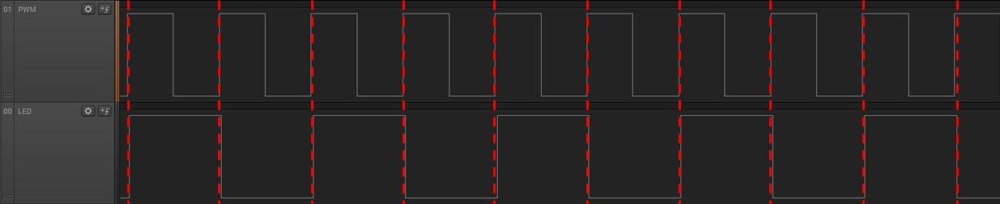

------

# DA14531 Timer1 Software Example

------

## Example Δescription

This software example demonstrates using the ***TIMER1*** hardware block. In this demonstration, ***TIMER1*** is configured to ***Counting Mode*** and ***Capturing Mode***.

## Introduction

The DA14531 product family incorporates three identical HW timer blocks: 

1. **Timer 0** is a 16-bit general purpose software programmable timer, which has the ability to generate Pulse Width Modulated (PWM) signals, namely PWM0 and PWM1.


2. **Timer 1** is an 11-bit timer being able to count up or down. It supports Counting and Input Capturing mode and it can be kept active in sleep as the clock source is selectable between **System Clock (sys_clk)** and **Low Power Clock (lp_clk)**.


3. **Timer 2** is basically a PWM generator. It supports six (6) Pulse Width Modulated (PWM) outputs.


</center>- Refer to the following application note for [DA14531 known hardware limitations](https://www.dialog-semiconductor.com/da14531_HW_Limitation  "known hardware limitations"). 
- Dialog Software [Forum link](https://www.dialog-semiconductor.com/forum).

For getting more information about the HW Timers on DA14531, please refer to the [datasheet](https://www.dialog-semiconductor.com/da14531_datasheet).
 
***Useful Note*** :    

    Timer0 and Timer2 examples are provided within the SDK. The projects are located under the following SDK paths:

    - Timer0 example: <sdk_root_directory>\projects\target_apps\peripheral_examples\timer0.
    - Timer2 example: <sdk_root_directory>\projects\target_apps\peripheral_examples\timer2.


## Timer 1

Accoridng to the datasheet, Timer1 is powerd by the **PD_TIM power domain** which can be kept powered even if the system enters sleep mode. It can operate either in **count up** or **count down** mode, generate an interrupt when the timer reaches the **max/min value** or the **threshold**. As described in the **Example description**, two (2) modes are demonstrated in this software example:

1. **Counting Mode**: Timer1 generates an interrupt upon a configurable amount of edges, on a
specific GPIO, has been detected.

2. **Capturing Mode**: Timer1 captures a snapshot of either its own counter (11 bits) or the RTC port (22bits) after an edge on a GPIO has been detected.

## Software Configuration

- This example requires:
  - SDK6.0.12 or later
  - **SEGGER’s J-Link** tools should be downloaded and installed.

## Hardware Configuration

- This example runs on the DA14531 Bluetooth Smart SoC device.
- The ***DA145xx Pro Development Kit*** is needed for this example.
- Connect the ***DA145xx Pro Development Kit***  to the host computer via the USB connector. 
- Use a Logic Analyzer to verify the example (optional)
- In case of **Counting Mode**, jumpers should be placed on default setup.
- In case of **Capturing Mode**, jumpers should be placed on default setup, plus extra wiring from J2.27 to J2.21.  


## How to run the example

### Initial Setup

For the initial setup of the project that involves linking the SDK to this SW example, please follow the Readme [here](__Github sdk6 readme link__).

- For the DA14531 Getting started guide you can refer to this [link](https://www.dialog-semiconductor.com/da14531-getting-started).

### Compile & Run

- Νavigate to the `project_environment` folder and open the `Keil` project.
- Compile and launch the example. You should download the firmware either into System-RAM or SPI Flash through the SPI Flash programmer of the SmartSnippets Toolbox. When booting from SPI Flash, jumpers should be placed on the standard SPI flash setup.

### Macro Definitions

In the table below, the user macro definitions are illustrated:

<table>
<thead>
  <tr class="header">
  <th style="text-align: left;">Macro</th>
  <th style="text-align: left;">Description</th>
  </tr>
</thead>
<tbody>
  <tr class="odd">
  <td style="text-align: left;">COUNTING_MODE</td>
  <td style="text-align: left;">Counting Mode of Timer1. Toggling <i><b>LED GPIO (Default Configuration)</b></i></td>
  </tr>
  <tr class="even">
  <td style="text-align: left;">CAPTURING_MODE</td>
  <td style="text-align: left;">Capturing Mode of Timer1. Supply PWM input source to <i><b>CAPTURE GPIO</b></i></td>
  </tr>
  <tr class="even">
  <td style="text-align: left;">TIMER0_SOURCE</td>
  <td style="text-align: left;">In case of Capturing Mode, if TIMER0_SOURCE is defined, PWM from SW Timer0 should be applied on CAPTURE GPIO.	Otherwise, PWM from an external source should be applied on CAPTURE GPIO. </td>
  </tr>
  <tr class="odd">
  <td style="text-align: left;">TIMER_ON</td>
  <td style="text-align: left;">Congigure TIMER0_ON_REG register</td>
  </tr>
  <tr class="even">
  <td style="text-align: left;">PWM_HIGH</td>
  <td style="text-align: left;">Congigure TIMER0_RELOAD_M_REG register</td>
  </tr>
  <tr class="even">
  <td style="text-align: left;">PWM_LOW</td>
  <td style="text-align: left;">Congigure TIMER0_RELOAD_N_REG register   </td>
  </tr>
    <tr class="even">
  <td style="text-align: left;">COUNTER_RELOAD_VALUE</td>
  <td style="text-align: left;">Define Timer0 reload value</td>
  </tr>
</tbody>
</table>

### GPIOs Definitions
In this section, GPIOs definitions are demonstrated as defined in `user_periph_setup.h` header file.

<table>
<thead>
  <tr class="header">
  <th style="text-align: left;">Name</th>
  <th style="text-align: left;">DA14531</th>
  <th style="text-align: left;">DA145xx DK</th>
  <th style="text-align: left;">Description</th>
  </tr>
</thead>
<tbody>
  <tr class="odd">
  <td style="text-align: left;">LED</td>
  <td style="text-align: left;">P0_9</td>
  <td style="text-align: left;">J2.29</td>
  <td style="text-align: left;">Toggling LED in Counting Mode configuration</td>
  </tr>
  <tr class="even">
  <td style="text-align: left;">CAPTURE</td>
  <td style="text-align: left;">P0_1</td>
  <td style="text-align: left;">J2.21</td>
  <td style="text-align: left;">Supply a PWM in Capturing Mode configuration</td>
  </tr>
  <tr class="even">
  <td style="text-align: left;">PWM0</td>
  <td style="text-align: left;">P0_7</td>
  <td style="text-align: left;">J2.27</td>
  <td style="text-align: left;">PWM0 output from Timer0</td>
  </tr>
  <tr class="odd">
  <td style="text-align: left;">PWM1</td>
  <td style="text-align: left;">P0_8</td>
  <td style="text-align: left;">J2.28</td>
  <td style="text-align: left;">PWM1 output from Timer0</td>
  </tr>
</tbody>
</table>

### Counting Mode

1. Use the following macro configuration in `user_timer1.h` in order to run the example in Counting mode:

```c
#define   COUNTING_MODE
#undef    CAPTURING_MODE
```

2. The `timer1_general_user_callback_function()` callback function is executed upon Timer1 interrupt. The on board LED is toggling.

### Capturing Mode with Timer0 PWM Input Source

1. Use the following macro configuration in `user_timer1.h` for Capturing a PWM input source from Timer1 applied on **CAPTURE GPIO**.

```c
#undef        COUNTING_MODE
#define       CAPTURING_MODE
#define       TIMER0_SOURCE
```

2. Timer0 default PWM configurations are shown below. Configuration can be changed according to application requirements.

```c
#define     TIMER_ON        1000
#define     PWM_HIGH        500
#define     PWM_LOW         500
```

3. Define the Timer0 reload value. Default value is 200.

```c
#define TIMER0_EXPIRATION_COUNTER_RELOAD_VALUE     200
```

4. An interrupt is generated on every rising edge of the Timer0 PWM signal and the `timer1_event1_user_callback_function()` callback function is used for handling timer's interrupt The on board LED is toggling following the **positive edge** of the input pulse.




### Capturing Mode with External PWM Input Source

1. **An external PWM source** can be used to generate a PWM pulse, applied on **CAPTURE GPIO**, instead of using Timer0. Timer1 captures the input PWM pulse following the rising edge of the pulse.

2. Following macro configuration in `user_timer1.h` should be used:

```c
#undef        COUNTING_MODE
#define       CAPTURING_MODE
#undef        TIMER0_SOURCE
```

## Known Limitations

- Refer to the following application note for [DA14531 known hardware limitations](https://www.dialog-semiconductor.com/da14531_HW_Limitation  "known hardware limitations"). 
- Dialog Software [Forum link](https://www.dialog-semiconductor.com/forum).

