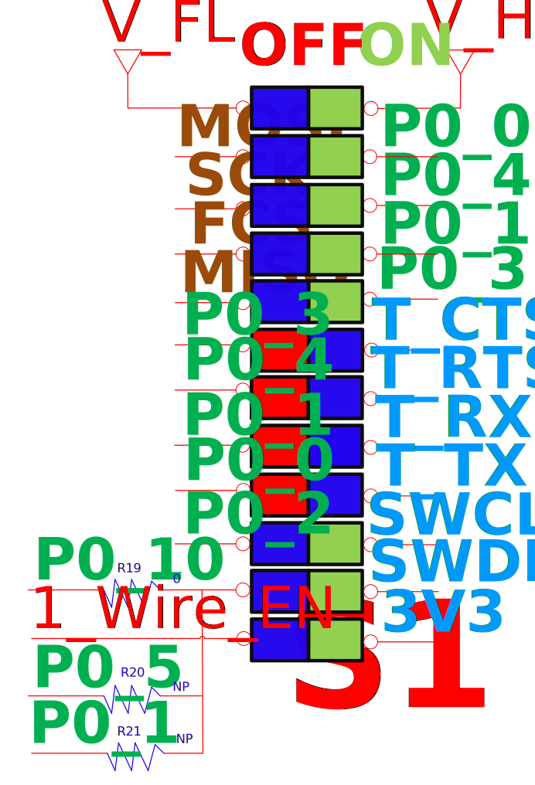
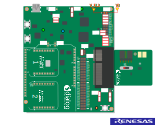

# DA14531 USB Preloaded Firmware


## Example description

The main purpose of this software example is to provide the source files containing the firmware for the preloaded binary  in the DA14531 USB kit.
The [UM-B-121 DA14531 Quick Started Guide with the USB Development Kit](https://www.dialog-semiconductor.com/da14531-usb-getting-started) shows how to run the 
demo.

## Hardware & Software Configuration

This firmware example runs on DA14531 Bluetooth Smart SoC devices. 

  - Connect the ***DA14531 USB Kit***  to the host computer via the USB connector. 
 
  - Please find below the appropriate hardware configurations.

### Hardware Configuration

The DIP switch should have the following assignment as illustrated below, this allows the system to boot from external flash or 1-wire UART and communicate through JTAG for debugging



The Example can also run on ***DA145xx Pro Development Kit*** with default jumper configuration, as demonstrated below:

- Jumpers for the flash connection required
- JTAG connection required
- Reset jumper required
- Jumper J10:1-J1:15 and J10:2 – J1:17 for shorting UTX and URX through 1K resistor for single wire functionality.
- Jumper J1:19 – J1:20 for connecting the 1 wire output with P05 of the DA14531. 
 


Refer to the DA14531 getting started guide of [DA14531 Development Kit](http://lpccs-docs.dialog-semiconductor.com/UM-B-117-DA14531-Getting-Started-With-The-Pro-Development-Kit/index.html).


### Software configuration

  - SDK6.0.14 or later

  - ***SEGGER’s J-Link*** tools should be downloaded and installed.

  - A smartphone with a BLE scanning app (for example ***BLE scanner*** on Android or ***Lightblue*** on IOS).

  - A BLE Sniffing tool is also useful; though not mandatory .

## How to run the example

### Initial Setup

- For the initial setup, please refer [here] https://github.com/dialog-semiconductor/BLE_SDK6_examples


### Compile & Run

- This example needs changes in the SDK to work. To apply the patch file, execute the following command inside your sdk directory:
```
git apply path/to/patch/SDK6patch.diff
```
- Navigate to ``project_environment`` folder and open the ***Keil*** project.
- Compile and then launch the demonstration example. You can download the firmware either into System-RAM or SPI Flash. To download the firmware into SPI Flash, the  SPI Flash programmer from SmartSnippets Toolbox should be used. 
For programming the DA14531 using the compiled hex file and boot from flash, please refer to  [Chapter 13 SPI Flash Programmer in the SmartSnippets Toolbox User Manual](http://lpccs-docs.dialog-semiconductor.com/Software_Example_Setup/index.html).

## Known Limitations

- Refer to the following application note for [DA14531 known hardware limitations](https://www.dialog-semiconductor.com/da14531_HW_Limitation  "known hardware limitations"). 

- If you have any question, please contact us in our [public Bluetooth forums](https://www.dialog-semiconductor.com/forum) 