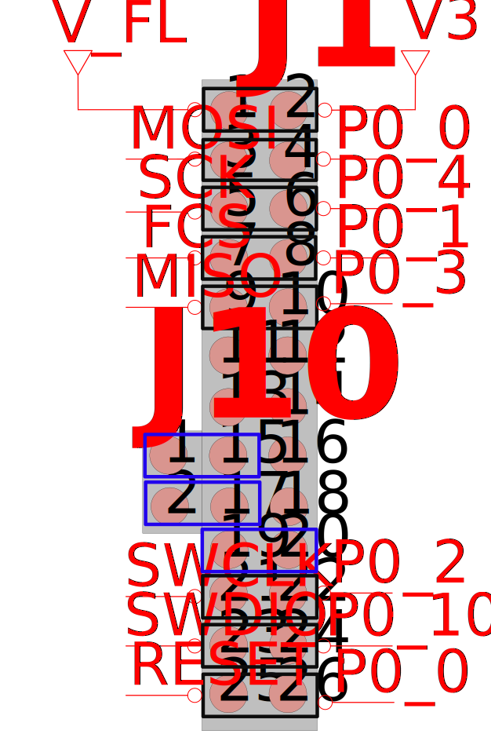

# DA1453x USB Preloaded Firmware

## Example description

The main purpose of this software example is to provide the source files containing the firmware for the preloaded binary in the DA1453x USB kit.
- Devices naming:
    - DA1453x is referring to DA14531-00, DA14531-01, DA14530 and DA14535.
    - The DA14531-00 is the main DA14531 device. The -00 is just a new naming to introduce the variant DA14531-01. The DA14531-01 is a ROM variant of the main DA14531-00.
    - The DA14535 is a DA14531 upgrade.

The [UM-B-121 DA14531 getting Started with the USB Development Kit](https://lpccs-docs.renesas.com/UM-B-121-USB-Getting-Started-Guide/index.html) and The [UM-B-183 DA14535 getting Started with the USB Development Kit](https://lpccs-docs.renesas.com/UM-B-183-DA14535-USB-Getting-Started/index.html) show how to run the demo.

## Hardware & Software Configuration

This firmware example runs on DA1453x Bluetooth Smart SoC devices. 

  - Connect the ***DA1453x USB Kit***  to the host computer via the USB connector. 
 
  - Please find below the appropriate hardware configurations.

### Hardware Configuration

The DIP switch should have the following assignment as illustrated below, this allows the system to boot from external flash or 1-wire UART and communicate through JTAG for debugging.

The Example can also run on ***DA145xx Pro Development Kit*** with default jumper configuration, as demonstrated below:

- Jumpers for the flash connection required
- JTAG connection required
- Reset jumper required
- Jumper J10:1-J1:15 and J10:2 – J1:17 for shorting UTX and URX through 1K resistor for single wire functionality.
- Jumper J1:19 – J1:20 for connecting the 1 wire output with P05 of the DA14531. 
 

- This example works also on the DA1453x DEVKT-P with with any DA1453x Daughterboard
	
	

You can also refer to the following documentation:
- For the DA14531 getting started guide you can refer to [UM-B-117](https://lpccs-docs.renesas.com/UM-B-117-DA14531-Getting-Started-With-The-Pro-Development-Kit/index.html)

- For the DA14535 getting started guide you can refer to this [UM-B-165](https://lpccs-docs.renesas.com/DA14535/UM-B-165-DA14531-Getting-Started-With-The-Pro-Development-Kit/index.html#device-family-getting-started-with-the-pro-development-kits)

### Software configuration

 - [SDK6 latest version](https://www.renesas.com/sdk6_latest)

  - ***SEGGER’s J-Link*** tools should be downloaded and installed.

  - A smartphone with a BLE scanning app (for example ***BLE scanner*** on Android or ***Lightblue*** on IOS).

  - A BLE Sniffing tool is also useful; though not mandatory .

## How to run the example

### Initial Setup

- For the initial setup, please refer [here] https://github.com/dialog-semiconductor/BLE_SDK6_examples

### Compile & Run

- Apply the ``SDK6patch.diff`` patch 
- Navigate to ``project_environment`` folder and open the ***Keil*** project.
- Compile and then launch the demonstration example. You can download the firmware either into System-RAM or SPI Flash. To download the firmware into SPI Flash, the SPI Flash programmer from SmartSnippets Toolbox should be used. 
For programming the DA14531 using the compiled hex file and boot from flash, please refer to  section 3.1 of the [UM-B-083 SmartSnippets Toolbox User Manual](https://lpccs-docs.renesas.com/UM-B-083/index.html)

## Further reading

- [Wireless Connectivity Forum](https://lpccs-docs.renesas.com/lpc_docs_index/DA145xx.html)

## Known Limitations

- There are no known limitations for this example. But you can check and refer to the following application note for
[SDK6 known limitations](https://lpccs-docs.renesas.com/sdk6_kll/index.html)

## Feedback and support ?

If you have any comments or suggestions about this document, you can contact us through:

- [Wireless Connectivity Forum](https://community.renesas.com/wireles-connectivity)

- [Contact Technical Support](https://www.renesas.com/eu/en/support?nid=1564826&issue_type=technical)

- [Contact a Sales Representative](https://www.renesas.com/eu/en/buy-sample/locations)

