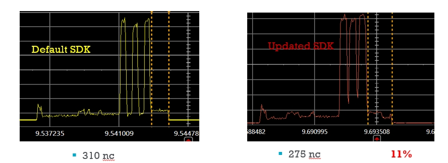
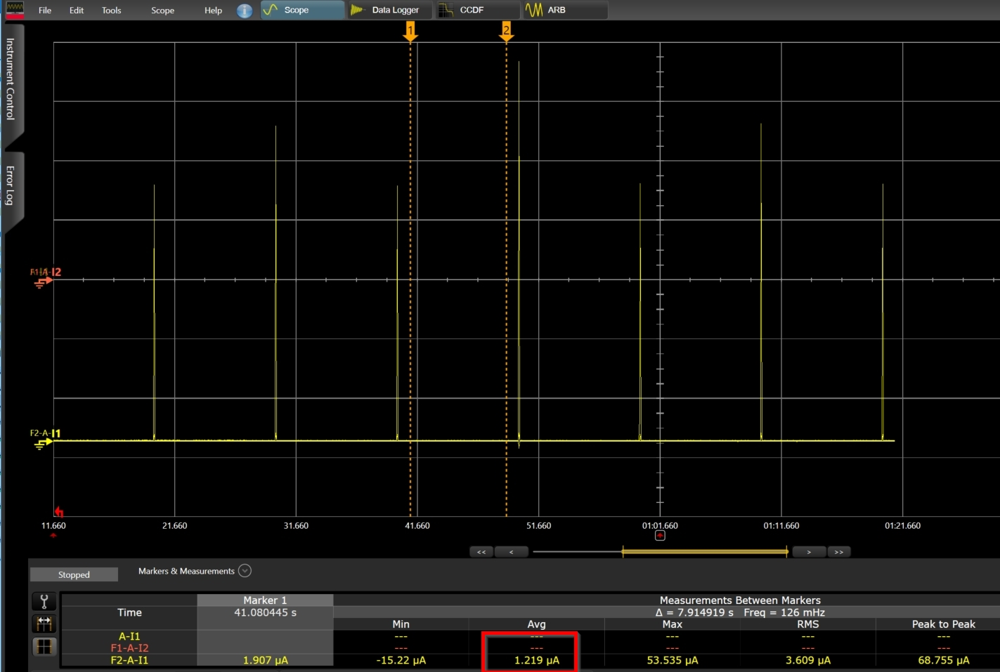

# Optimized Software for ibeacon

Optimized Software implementation for ibeacon on the DA14531

## Example description

The example is an update of the ibeacon SW, below the main modifications, basically in this example we demonstrate how to:

- Alternate Static random address: change the device address in every advertising event
- Alternate Tx output power level: change the Tx output power level in every advertising event
- Alternate User advertising data: change the Beacon advertising payload in every advertising event 

A new ibeacon structure has been created to allow the alternating and the advertising interval is set to 10 s.

```` C
/* Set the advertising rate */
#define ADV_INTERVAL_ms							10000
````

```` C
ibeacon_adv_payload_t adv_payload;
ibeacon_adv_payload_t_new adv_payload_new;
````


```` C
if(change_bd_addr_flag % 2)

{
	user_app_adv_start();

	/* Alternate User advertising data*/
	memcpy(store_adv_data, &adv_payload, sizeof(ibeacon_adv_payload_t));
	store_adv_data_len = sizeof(ibeacon_adv_payload_t);

	/* Alternate Tx output power, Set output power to maximum value (0dBm) */
	rf_pa_pwr_set(RF_TX_PWR_LVL_0d0);

	/* Alternate Static random address */
	llm_le_env.rand_add.addr[0] = 0x11;
	llm_le_env.rand_add.addr[1] = 0x12;
	llm_le_env.rand_add.addr[2] = 0x13;
	llm_le_env.rand_add.addr[3] = 0x14;
	llm_le_env.rand_add.addr[4] = 0x15;
	llm_le_env.rand_add.addr[5] = 0x16;

}
else 

{
	user_app_adv_start_new();

	/* Alternate User advertising data*/
	memcpy(store_adv_data, &adv_payload_new, sizeof(ibeacon_adv_payload_t_new));
	store_adv_data_len = sizeof(ibeacon_adv_payload_t_new);

	/* Alternate Tx output power, Set output power to maximum value (+2.5dBm) */
	rf_pa_pwr_set(RF_TX_PWR_LVL_PLUS_2d5);

	/* Alternate Static random address */
	llm_le_env.rand_add.addr[0] = 0x01;
	llm_le_env.rand_add.addr[1] = 0x02;
	llm_le_env.rand_add.addr[2] = 0x03;
	llm_le_env.rand_add.addr[3] = 0x04;
	llm_le_env.rand_add.addr[4] = 0x05;
	llm_le_env.rand_add.addr[5] = 0x06;
}	 

````


In this example we are showing also how to tune the DA14531 for a minimum current consumption.
When the changes are applied to the SDK, the current consumption will be decreased by 18%. 

**Below the list of changes for power improvement:**

- Optimize  the time between Tx pulses

````
rwble.c :

__BLEIRQ void rwble_isr(void)
{
.....
   /* Optimize  the time between Tx pulses */
	ble_advtim_set (500);
}

````


- Lower the clock speed on the AMBA when sleep preparation 

````
arch_system.c :

__WEAK bool app_use_lower_clocks_check(void)
{
	 return true;
}
````


- Remove RCX read and calibration

````
arch_main.c :

#if defined (__DA14531__)
       // rcx20_read_freq(false);
#endif

````

- Reduce RF calibration routine 

````
arch_system.c :

void conditionally_run_radio_cals(void)
{
#if defined (__DA14531__)
    // 531 case
    uint32_t current_time = lld_evt_time_get();

    if (current_time < last_temp_time)
    {
        last_temp_time = 0;
    }

    if ((current_time - last_temp_time) >= 500000)
    {
 

````
- Reduce XTAL32M wait time 

````
otp_cs.c :

#define XTAL32M_WAIT_TRIM_TIME_USEC      (500)  // 500 usec
 
````

- Optimize xtal start-up time

````
arch.h :

#if defined (__DA14531__)
#define HW_STARTUP_TIME_IN_XTAL32K_CYCLES    (11)   // 11 LP clocks for startup state machine handling
#define HW_STARTUP_TIME_IN_RCX_CYCLES        (7)    // 7 LP clocks for startup state machine handling
#define RCX_BLE_PWR_UP_TO_SLP_IRQ_USEC       (60)
#define XTAL32K_BLE_PWR_UP_TO_SLP_IRQ_USEC   (45)
#endif
 
````

The results are given in the below screenshots:

- Average power consumption  with no software optimization : **2,77 uA**


- Average power consumption  with software optimization : **2,27 uA**


- Average power consumption during sleep : **1,2 uA**



**Estimate battery life**

Battery life can be calculated when you know the average current consumption of the device and the energy capacity of your battery.
Battery Lifetime Estimator tool can be used and it can be loaded (from the Smartsnippets toolbox) by selecting the “Power Monitor” under Layout in the Toolbar or the “Battery Lifetime Estimator” under Tools.


Because the example needs changes into the SDK we are providing within the source directory all the modified files. 
	
## HW and SW configuration


* **Hardware configuration**

	- This example runs on the DA14531 Bluetooth Smart SoC device.
	- A DA14531 [USB](https://www.dialog-semiconductor.com/products/da14531-development-kit-usb) or [PRO](https://www.dialog-semiconductor.com/products/da14531-development-kit-pro) Development kit is needed for this example.
	
* **Software configuration**

	- This example requires:
        * Smartsnippets Studio 2.0.14 (or later)
        * SDK6.0.14 (or later)
		* SEGGER’s J-Link tools should be downloaded and installed.

## How to run the example

For initial setup of the example please refer to [this section of the dialog support portal](http://lpccs-docs.dialog-semiconductor.com/Software_Example_Setup/index.html).


### Initial Setup

1.  Build and download the example using the Keil IDE. 
2.  Run the example using the Keil debugger.
3.  Use a Smart Device running an App such as Locate to view the beacons transmitted by the DA14531.

## Known Limitations

- There are no known limitations for this example. But you can check and refer to the following 
  application note for known hardware limitations for DA14531 devices:
  [DA14531 hardware limitations](https://www.dialog-semiconductor.com/sites/default/files/da14531_errata_1v0.pdf)
- Dialog Software [Forum Link](https://support.dialog-semiconductor.com/forums/dialog-smartbond-bluetooth-low-energy-%E2%80%93-software "Forum Link").
- You can also refer to the troubleshooting section in the [Getting Started with the DA14531 PRO Development Kit](http://lpccs-docs.dialog-semiconductor.com/UM-B-117-DA14531-Getting-Started-With-The-Pro-Development-Kit/index.html).


## License


**************************************************************************************

 Copyright (c) 2020 Dialog Semiconductor. All rights reserved.

 This software ("Software") is owned by Dialog Semiconductor. By using this Software
 you agree that Dialog Semiconductor retains all intellectual property and proprietary
 rights in and to this Software and any use, reproduction, disclosure or distribution
 of the Software without express written permission or a license agreement from Dialog
 Semiconductor is strictly prohibited. This Software is solely for use on or in
 conjunction with Dialog Semiconductor products.

 EXCEPT AS OTHERWISE PROVIDED IN A LICENSE AGREEMENT BETWEEN THE PARTIES OR AS
 REQUIRED BY LAW, THE SOFTWARE IS PROVIDED "AS IS", WITHOUT WARRANTY OF ANY KIND,
 EXPRESS OR IMPLIED, INCLUDING BUT NOT LIMITED TO THE WARRANTIES OF MERCHANTABILITY,
 FITNESS FOR A PARTICULAR PURPOSE AND NON-INFRINGEMENT. EXCEPT AS OTHERWISE PROVIDED
 IN A LICENSE AGREEMENT BETWEEN THE PARTIES OR BY LAW, IN NO EVENT SHALL DIALOG
 SEMICONDUCTOR BE LIABLE FOR ANY DIRECT, SPECIAL, INDIRECT, INCIDENTAL, OR
 CONSEQUENTIAL DAMAGES, OR ANY DAMAGES WHATSOEVER RESULTING FROM LOSS OF USE, DATA OR
 PROFITS, WHETHER IN AN ACTION OF CONTRACT, NEGLIGENCE OR OTHER TORTIOUS ACTION,
 ARISING OUT OF OR IN CONNECTION WITH THE USE OR PERFORMANCE OF THE SOFTWARE.

**************************************************************************************
