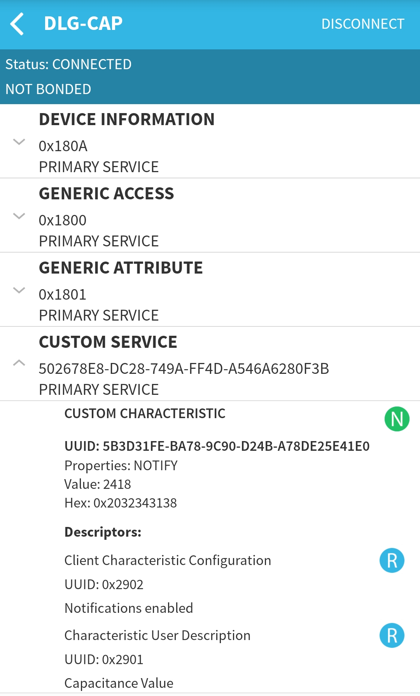

# Capacitance sensor demo

---

## Description
This example shows how to connect the FDC2x1x series capacitance to digital converters from TI. The development board used for this example is the [Moisture click from MikroElektronika](https://www.mikroe.com/moisture-click).
The Dialog BLE SoC can configure the FDC2112 on the click board, and read out the capacitance value. This value is visualized by a simple smartphone app written in [Apache Cordova](https://cordova.apache.org).

### The DA1458x side

Example drivers for the capacitance sensor are provided in *fdc2x1x.c*. *init_fdc2x1x()* initializes the I2C hardware and sets up the sensor. *read_fdc2x1x(uint8_t channel)* starts a measurement and returns the measured value.
The measured value is sent via a BLE notification. This process is described in the [MCP9808 temperature sensors to BLE example](https://www.dialog-semiconductor.com/sites/default/files/mcp9808_to_ble.zip). 

### The smartphone app

The provided example app has been made using the cordova framework, allowing the app to be built for Android and IOS. HTML and CSS are used to define the layout of the application, behavior is programmed in JavaScript. 
Tapping the start scan button calls the *startScan()* function. This function will start the scanning and connect to DLG-CAP when it is found. *connectCallback* will trigger when the connection is made successfully, and subscribe to the notification.
Each time a notification is received, *notification_callback* is called and the circle will be updated. 

## HW and SW configuration

### Hardware configuration

- This example runs on The DA14585/DA14586 Bluetooth Smart SoC devices.
- The Basic or pro Development kit is needed for this example.
- Connect the SCL pin of the Moisture click to pin 1-0 of the development board.
- Connect the SDA pin of the Moisture click to pin 1-2 of the development board.
  - These pins are defined in the fdc2x1x.h file
  
- Connect the USB Development kit to the host computer.

### Software configuration

- This example requires:
    - SDK6.0.10
	- A smartphone with a BLE scanning app (for example BLE scanner on Android or Lightblue on IOS)
	- **SEGGER’s J-Link** tools should be downloaded and installed.

## How to run the example

For initial setup of the example please refer to [this section of the dialog support portal](https://support.dialog-semiconductor.com/resource/da1458x-example-setup).

### Compile and run

- Open the project in Keil µVision 5
  - Optionally, change the parameters in fdc2x1x.h
- Compile and run the project
- Open the BLE scanner app and look for DLG-CAP
- Connect to the device
- Subscribe to the notification

If everything went well, you should be able to receive a proprietary capacitance indication as the value of the custom characteristic. As shown below:

The accompanying application can be installed on android using the .apk file. Or can be built and installed with Cordova, for which [setup instructions can be found here](https://cordova.apache.org/docs/en/latest/guide/platforms/android/#installing-the-requirements).
Before the app can be built, the command *cordova prepare* must be ran. This will set up the build targets and download the needed plugins.
If Cordova is set up correctly the app can be installed by connecting an Android device with USB debugging enabled to the pc, opening a command prompt in the main app folder(the one with config.xml in it) and typing *cordova run android*.
Instructions to [do the same for IOS can be found here](https://cordova.apache.org/docs/en/latest/guide/platforms/ios/index.html).

## Known Limitations

- There are No known limitations for this example. But you can check and refer to the following application note for
[known hardware limitations](https://support.dialog-semiconductor.com/system/files/resources/DA1458x-KnownLimitations_2018_02_06.pdf "known hardware limitations").
- Dialog Software [Forum link](https://support.dialog-semiconductor.com/forums).
- you can also Refer to the Troubleshooting section in *DA1585x Getting Started with the Development Kit UM-B-049*.

